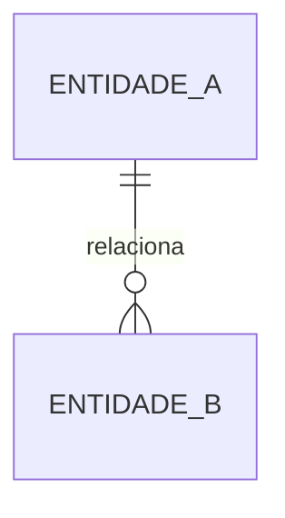
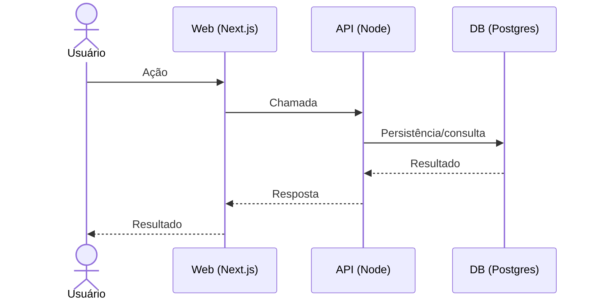
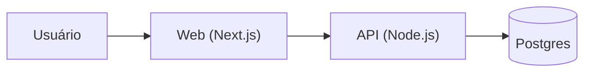

# DOC-DEV-001 — Documento de Especificação Executável (TS + Node + Next.js | OpenAPI/Swagger)

**Status:** Norma Canônica do Projeto | **Versão atual:** 1.4.0 | **Última revisão:** 2026-03-04

> **Regra de uso:** Este documento é a **norma canônica e viva** do projeto. Toda nova spec de módulo (`MOD-XXX`) deve ser gerada via **skill `scaffold-module`**, que lê as regras fixadas aqui e estrutura a pasta `docs/04_modules/mod-xxx-nome/` com todos os artefatos pré-preenchidos. Alterações neste documento **DEVEM** ser registradas no CHANGELOG abaixo e acompanhar incremento de versão semântica (`MAJOR.MINOR.PATCH`). O CI/CD validará conformidade dos artefatos gerados via **Gate EX-CI-007**.

---

## CHANGELOG

| Versão | Data       | Responsável | Descrição |
|--------|------------|-------------|-----------|
| 1.4.0  | 2026-03-04 | arquitetura | Promovido a norma canônica em `01_normativos`. CHANGELOG embutido. Skill `scaffold-module` referenciada na regra de uso. |
| 1.3.0  | 2026-02-28 | arquitetura | Versão inicial como template. Seções de OpenAPI, testes automáticos e arquitetura C4. |

---

## 0. Como usar este documento

### 0.0 Contratos Obrigatórios do Projeto

Antes de iniciar as especificações, atente-se de que as seguintes regras são inegociáveis no repositório (ver `DOC-GNP-00`, `DOC-ESC-001` e `DOC-GPA-001` para automação):

- **Versionamento de APIs:** O prefixo da URL obrigatório é `/api/v{X}/recurso`
- **Problem Details (RFC 9457):** Formato base das falhas deve conter `extensions.correlationId`. Em erros de banco/input (422), usar arranjo de validações via `extensions.invalid_fields[]`.
- **Rastreabilidade e Resiliência:** O header obrigatório é `X-Correlation-ID` em todas as rotas (In/Outbound). Modificações que causem efeitos colaterais `MUST` prever Idempotência.
- **OpenAPI/Swagger (Contrato de API):** Toda rota exposta sob `/api/v{X}/...` **MUST** estar documentada no OpenAPI (Swagger) **versionado** (ex.: `apps/api/openapi/v1.yaml`).  
  - PR que altera rotas/DTOs/responses **MUST** atualizar o OpenAPI correspondente.  
  - O CI **MUST** aplicar lint (Spectral) e validação de contrato.  
  - O OpenAPI é a **fonte de verdade do contrato HTTP** (independente de spec-first ou code-first).

### 0.1 Linguagem normativa

- **MUST / DEVE:** obrigatório.
- **SHOULD / DEVERIA:** recomendado; se não seguir, registrar exceção via ADR.
- **MAY / PODE:** opcional.

### 0.2 Governança e Regras de Transição (DoR e DoD)

> 🚨 **REGRA DE OURO (Automação Obrigatória):** Toda e qualquer especificação, requisito ou contrato de dados (`BR-XXX`, `FR-XXX`, `DATA-XXX`, etc.) dentro de `04_modules/` **DEVE obrigatoriamente** ser gerado e modificado por meio de ferramentas automatizadas (Skills ou CI/CD pipeline). Edições manuais arbitrárias são **PROIBIDAS** com o objetivo de garantir a Rastreabilidade de Versão, Autoria e Conformidade Normativa.

Para manter o "Golden Path", itens só ganham status (READY / DONE) se cumprirem as regras:

#### Definition of Ready (DoR) - Para Iniciar o Desenvolvimento

O item sai de `REFINING` e vai para `READY` **SE E SOMENTE SE**:

- [ ] Possui um `owner` claro.
- [ ] O problema ou funcionalidade tem escopo fechado e não ambíguo (BR/FR mínimos).
- [ ] Cenários complexos possuem Critérios de Aceite em formato Gherkin.
- [ ] O impacto em outras áreas / módulos está descrito.
- [ ] As dependências externas (Int/Mock) estão documentadas.

#### Definition of Done (DoD) - Para Finalizar e Fazer Merge

O Pull Request de um item é aprovado **SE E SOMENTE SE**:

- [ ] Pipeline CI (Lint, Testes Unitários e Integração) está verde.
- [ ] Evidências documentais estão preenchidas (link PR, link documentação, evidências de testes manuais em QA).
- [ ] O módulo possui o "Nível" correto carimbado.
- [ ] ADR aberta se houve fuga dos padrões definidos no `DOC-GNP-00` ou `DOC-ESC-001`.

### 0.2 Estados dos itens

Todo item com ID (MOD/BR/FR/DATA/INT/SEC/UX/NFR/ADR/PENDENTE) deve ter:

- `estado_item:`
  - **DRAFT:** Rascunho inicial. A ideia existe, mas carece de regras/detalhes.
  - **REFINING:** Em refinamento. O time de negócios/técnico está ativamente tirando dúvidas e mapeando bordas.
  - **READY:** Pronto para desenvolvimento (Corresponde a "Ready for Dev"). Sem impedimentos.
- `owner:` <time/pessoa>
- `data_ultima_revisao:` YYYY-MM-DD
- `rastreia_para:` (lista de IDs relacionados)
- `referencias_exemplos:` (EX-... quando aplicável)
- `evidencias:` (links internos: PRs, testes, diagramas, decisões)

### 0.3 Padrão de IDs (-\d{3})

- **MOD-XXX** Módulos/recursos do sistema
- **BR-XXX** Regras de negócio
- **FR-XXX** Requisitos funcionais
- **DATA-XXX** Dados/entidades/contratos de persistência
- **INT-XXX** Integrações/contratos externos
- **SEC-XXX** Segurança/compliance
- **UX-XXX** UX/jornadas/mensagens
- **NFR-XXX** Não-funcionais
- **ADR-XXX** Decisões arquiteturais
- **FIX-XXX** Correções de bugs/hotfixes (usado principalmente no Pull Request)
- **PENDENTE-XXX** Pendências (sem perguntas — sempre com impacto e opções)

---

# 1. Introdução

## 1.1 Objetivo do sistema (1–3 frases)
>
> (Descreva o que o sistema faz em linguagem de negócio.)

- Objetivo: ...

- **estado_item:** DRAFT | REFINING | READY
- **owner:** ...
- **data_ultima_revisao:** ...

## 1.2 Problema que resolve
>
> (Dor atual, por que existe, e o que muda depois.)

- Problema: ...
- Impacto hoje: ...
- Resultado esperado: ...

- **estado_item:** DRAFT | REFINING | READY
- **owner:** ...
- **data_ultima_revisao:** ...

## 1.3 Público-alvo (personas e perfis)
>
> (Perfis afetam permissões, fluxos críticos e a **UX** — *User Experience / Experiência do Usuário*.)

- Persona/Perfil 1: ...
- Persona/Perfil 2: ...

**PENDENTE-001 (se necessário):** Perfis não definidos | **Impacto:** permissões/UX | **Opção A:** ... | **Opção B:** ... | **Recomendação:** ...

## 1.4 Escopo

### Inclui

- ...
- ...

### Não inclui (Fora de escopo)

- ...
- ...

### Fora de escopo por agora (Roadmap Futuro)

- (Item que será feito depois) | Gatilho para reavaliação: (Data ou Condição)

- **estado_item:** DRAFT | REFINING | READY

## 1.5 Métricas de sucesso (OKRs)
>
> **OKRs** (*Objectives and Key Results*): São os indicadores matemáticos que provam que o sistema deu certo.

- **OKR-1:** [Métrica] + [Baseline] + [Alvo] + [Data]
- **OKR-2:** ...

- **estado_item:** DRAFT (não definidos) | REFINING (discutindo metas) | READY (metas aprovadas)

## 1.6 Premissas e restrições

- **Premissas:** ...
- **Restrições:** (legais, técnicas, prazo, custos, stack obrigatória, etc.) ...

- **estado_item:** DRAFT | REFINING | READY

---

# 2. Recursos do Sistema (visão por módulos)

> Para cada módulo, descreva **o que entrega** e **do que depende**.  
> **Obrigatório:** declarar o **Nível de Arquitetura (0/1/2)** e justificar com gatilhos.

---

## MOD-XXX — <Nome do módulo>

- Resumo: ...
- Doc canônico (módulo): `docs/04_modules/<mod-xxx>/mod.md`
- Changelog do módulo: `docs/04_modules/<mod-xxx>/CHANGELOG.md`

### Itens base (canônicos) e links

- BR-XXX — ...
- FR-XXX — ...
- DATA-XXX — ...
- INT-XXX — ...
- SEC-XXX — ...
- UX-XXX — ...
- NFR-XXX — ...

### Decisões (ADR)

- ADR-XXX — ...

### Metadados do item (MOD-XXX)

- estado_item: DRAFT | REFINING | READY
- owner: ...
- data_ultima_revisao: ...
- rastreia_para: ...
- referencias_exemplos: ...
- evidencias: ...

---

## MOD-001 — Exemplo (Backoffice Admin)

- Resumo: Administração de usuários, perfis/grupos, permissões por escopo e auditoria.
- Doc canônico (módulo): `docs/04_modules/mod-001-backoffice-admin/mod.md`
- Changelog do módulo: `docs/04_modules/mod-001-backoffice-admin/CHANGELOG.md`

### Itens base (canônicos) e links

- BR-001 — Isolamento por Escopo (RBAC Hierárquico)  
  Doc: `docs/04_modules/mod-001-backoffice-admin/requirements/br/BR-001.md`  
  Alterações:  
  - BR-001-R01 (revisão): `docs/04_modules/mod-001-backoffice-admin/amendments/br/BR-001/BR-001-R01.md`

- FR-001 — Gestão de Usuários, Perfis e Auditoria  
  Doc: `docs/04_modules/mod-001-backoffice-admin/requirements/fr/FR-001.md`  
  Alterações:  
  - FR-001-M01 (melhoria): `docs/04_modules/mod-001-backoffice-admin/amendments/fr/FR-001/FR-001-M01.md`

- DATA-001 — Modelo de Dados  
  Doc: `docs/04_modules/mod-001-backoffice-admin/requirements/data/DATA-001.md`

- INT-001 — Integrações  
  Doc: `docs/04_modules/mod-001-backoffice-admin/requirements/int/INT-001.md`

- SEC-001 — Segurança, Auditoria e Compliance  
  Doc: `docs/04_modules/mod-001-backoffice-admin/requirements/sec/SEC-001.md`  
  Alterações:  
  - SEC-001-C01 (correção): `docs/04_modules/mod-001-backoffice-admin/amendments/sec/SEC-001/SEC-001-C01.md`

- UX-001 — Jornadas e Mensagens  
  Doc: `docs/04_modules/mod-001-backoffice-admin/requirements/ux/UX-001.md`

- NFR-001 — Não-Funcionais  
  Doc: `docs/04_modules/mod-001-backoffice-admin/requirements/nfr/NFR-001.md`

### Decisões (ADR)

- ADR-001 — RBAC por Escopo com Herança e Negação Explícita  
  Doc: `docs/04_modules/mod-001-backoffice-admin/adr/ADR-001__rbac_por_escopo.md`

### Metadados do item (MOD-001)

- estado_item: REFINING
- owner: arquitetura
- data_ultima_revisao: 2026-02-27
- rastreia_para: BR-001, FR-001, DATA-001, INT-001, SEC-001, UX-001, NFR-001, ADR-001
- evidencias: (adicione PR/issue)

---

# 3. Regras de Negócio (BR-xxx)

## BR-XXX — <Título>

> ⚠️ **ARQUIVO GERIDO POR AUTOMAÇÃO. NÃO EDITE DIRETAMENTE.** Use a skill pertinente para versionar alterações.
>
> | Versão | Data       | Responsável | Status/Integração |
> |--------|------------|-------------|-------------------|
> | 0.1.0  | YYYY-MM-DD | <owner>     | Baseline Inicial (scaffold-module) |

- Regra: ...
- Exemplo: ...
- Exceções: ...
- Impacto: (dados / estado / fluxo / segurança / compliance / cálculo)

### Critérios de aceite (Gherkin)

```gherkin
Funcionalidade: <nome>

Cenário: <titulo>
  Dado ...
  Quando ...
  Então ...
```

- **estado_item:** DRAFT | REFINING | READY
- **owner:** ...
- **data_ultima_revisao:** ...
- **rastreia_para:** (FR-..., DATA-..., SEC-...)
- **referencias_exemplos:** (EX-... quando aplicável)
- **evidencias:** ...

---

## BR-001 — Exemplo (Isolamento por Escopo — RBAC Hierárquico)

- Resumo: Permissões por escopo hierárquico com herança; DENY prevalece sobre ALLOW.

- Doc canônico: `docs/04_modules/mod-001-backoffice-admin/requirements/br/BR-001.md`

- Alterações:

  - BR-001-R01: `docs/04_modules/mod-001-backoffice-admin/amendments/br/BR-001/BR-001-R01.md`

- **estado_item:** READY

- **owner:** segurança

- **data_ultima_revisao:** 2026-02-27

- **rastreia_para:** FR-001, SEC-001, ADR-001, DATA-001

- **referencias_exemplos:** (EX-TRACE-00x)

- **evidencias:** ...

---

# 4. Requisitos (FR / DATA / INT / SEC / UX / NFR)

## 4.1 Requisitos Funcionais (FR-xxx)

### FR-XXX — <Título>

> ⚠️ **ARQUIVO GERIDO POR AUTOMAÇÃO. NÃO EDITE DIRETAMENTE.** Use a skill pertinente para versionar alterações.
>
> | Versão | Data       | Responsável | Status/Integração |
> |--------|------------|-------------|-------------------|
> | 0.1.0  | YYYY-MM-DD | <owner>     | Baseline Inicial (scaffold-module) |

- **Descrição:** ...
- **Prioridade:** Must | Should | Could
- **Perfis impactados:** Persona/Perfil 1, ...
- **Done funcional:** (Obrigatório) ...
- **Efeito colateral?** [ ] Sim [ ] Não *(Se Sim, o endpoint/handler DEVE implementar uma chave de Idempotência).*
- **Dependências (IDs):** BR | DATA | INT | SEC | NFR | UX
- **Gatilhos ADR-XXX (Opcional):**

  - *Se Thread=true:* DEVE existir endpoint de `/timeline` retornando os eventos e listagem com `last_event_at`. A paginação da timeline DEVE usar Cursor Pagination (Ex: `?limit=50&cursor=...`).
  - *Se Notificações:* DEVE existir endpoint para consumir Inbox e marcar como lida (`POST /notifications/:id/read`). O consumo (`GET /notifications?unread=true`) DEVE suportar Cursor Pagination.

### Critérios de aceite (Gherkin)

```gherkin
Funcionalidade: <nome>

Cenário: <titulo>
  Dado ...
  Quando ...
  Então ...
```

- **estado_item:** DRAFT | REFINING | READY
- **owner:** ...
- **data_ultima_revisao:** ...
- **rastreia_para:** ...
- **referencias_exemplos:** (EX-... ex.: EX-API-00x, EX-PAGE-00x, EX-IDEMP-00x)
- **evidencias:** ...

---

### FR-001 — Exemplo (Gestão de Usuários, Perfis e Auditoria)

- Resumo: CRUD admin, atribuição por escopo e visualização de auditoria, respeitando BR-001.

- Doc canônico: `docs/04_modules/mod-001-backoffice-admin/requirements/fr/FR-001.md`

- Alterações:

  - FR-001-M01: `docs/04_modules/mod-001-backoffice-admin/amendments/fr/FR-001/FR-001-M01.md`

- **estado_item:** REFINING

- **owner:** produto

- **data_ultima_revisao:** 2026-02-27

- **rastreia_para:** BR-001, DATA-001, SEC-001, UX-001, NFR-001

- **referencias_exemplos:** (EX-TRACE-00x)

- **evidencias:** ...

---

## 4.2 Dados e Entidades (DATA-xxx)

> **Objetivo:** permitir gerar **modelo**, **migração**, **queries** e **contratos** sem inferência arriscada.

### DATA-XXX — <Entidade/Tabela>

> ⚠️ **ARQUIVO GERIDO POR AUTOMAÇÃO. NÃO EDITE DIRETAMENTE.** Use a skill pertinente para versionar alterações.
>
> | Versão | Data       | Responsável | Status/Integração |
> |--------|------------|-------------|-------------------|
> | 0.1.0  | YYYY-MM-DD | <owner>     | Baseline Inicial (scaffold-module) |

- **Objetivo:** ...

- **Tipo de Tabela/Armazenamento:** Relacional (SQL) | Documento (NoSQL) | Chave-Valor | Série Temporal

- **Campos Obrigatórios Padrão (Timestamps e Soft-Delete):**

  - `id`: tipo_negocio=UUID | tipo_db=uuid | nulidade=NOT NULL
  - `codigo`: tipo_negocio=String | tipo_db=varchar | nulidade=NOT NULL | unique=true (identificador amigável)
  - `status`: tipo_negocio=String(enum) | tipo_db=text | nulidade=NOT NULL
  - `tenant_id`: tipo_negocio=UUID | nulidade=NOT NULL (Obrigatório em modelagens B2B; Row-Level Security)
  - `created_at`: tipo_negocio=DateTime | tipo_db=timestamptz UTC | nulidade=NOT NULL | default=now()
  - `updated_at`: tipo_negocio=DateTime | tipo_db=timestamptz UTC | nulidade=NOT NULL | default=now()
  - `deleted_at`: tipo_negocio=DateTime | tipo_db=timestamptz | nulidade=NULL (Soft-Delete)
  - `<campo_negocio>`: ...

- **Relacionamentos e Constraints (MUST):**

  - Toda FK deve ter `ON DELETE RESTRICT` e NUNCA `CASCADE`.
  - Situações mutuamente exclusivas devem ter `UNIQUE INDEX` ou `CHECK`.

- **Eventos do domínio:** criado | atualizado | inativado | excluído (lógico/físico) | ...

- **Auditoria / Event Sourcing:** (Opcional). Deve usar `domain_events`. Proibida criação 1-pra-1 de tabelas de log.

- **estado_item:** DRAFT | REFINING | READY

- **owner:** ...

- **data_ultima_revisao:** ...

- **rastreia_para:** (FR-..., BR-...)

- **referencias_exemplos:** (EX-DB-00x, EX-JSONB-00x, EX-NAME-00x)

- **evidencias:** ...

### Diagrama ERD (Mermaid) — Entidades núcleo



---

### DATA-002 — <Tabela de Configuração/Documento>

> **Objetivo:** representar dados flexíveis (JSONB) ou coleções NoSQL.

- **Campos (mínimo recomendado):**

  - `id`: UUID/string | NOT NULL
  - `documento`: jsonb/document | NOT NULL
  - `schema_version`: int4 | NOT NULL | default=1
  - `created_at`: timestamptz | NOT NULL | default=now()
  - `<index_key>`: ... (campos extraídos do JSON para indexação)

- **Estratégia de Índices:** ...

- **Retenção (TTL):** ...

- **Auditoria/rastreabilidade:** ...

- **estado_item:** DRAFT | REFINING | READY

- **owner:** ...

- **data_ultima_revisao:** ...

- **rastreia_para:** ...

- **referencias_exemplos:** ...

- **evidencias:** ...

---

### DATA-003 — Tabela de Eventos de Domínio e Auditoria (Domain Events)

> Habilita linha do tempo (Thread), auditoria, Outbox e automação de notificações.

- **Princípios (MUST):**

  - **Não use "permissão no evento" como fonte de verdade.**

    - Emit = permissão do comando
    - View = ACL + tenant da entity originária
  - `visibility_level`/`sensitivity_level` são **guard-rails** (mascarar/bloquear cedo), não a regra principal.

- **Campos mínimos recomendados:**

  - `id` (uuid)
  - `tenant_id` (uuid/string) *(se multi-tenant)*
  - `entity_type` (text)
  - `entity_id` (uuid/text)
  - `event_type` (text)
  - `payload` (jsonb)
  - `created_at` (timestamptz)
  - `created_by` (uuid/text)
  - `correlation_id` (uuid/text)
  - `causation_id` (uuid/text)
  - *(Opcional)* `visibility_level`
  - *(Opcional)* `sensitivity_level`
  - *(Opcional)* `dedupe_key` + UNIQUE `(tenant_id, dedupe_key)`

- **Índices padrão exigidos:**

  - `(tenant_id, entity_type, entity_id, created_at desc)`
  - `(tenant_id, event_type, created_at desc)`

---

#### Catálogo de Eventos da Feature (padrão obrigatório) (MUST)

> Princípios (MUST):

- **Não use "permissão no evento" como fonte de verdade.**

  - Emit = permissão do comando
  - View = ACL + tenant da entity originária
- `visibility_level`/`sensitivity_level` são **guard-rails** (mascarar/bloquear cedo), não a regra principal.

##### Formato padrão para cada evento

- `[EVENT_TYPE]`

  - **Descrição:** (o que significa)
  - **Origem (comando):** `<modulo:acao>` + referência (FR/BR se aplicável)
  - **UI Actions (DOC-ARC-003):** Lista de ações `DOC-UX-010` atreladas na tela (ex: `["create", "import"]`).
  - **Operation IDs (DOC-ARC-003):** Lista de `operationId` da OpenAPI referenciados.
  - **Entity originária:** `<entity_type>` / `<entity_id>`
  - **Emit (perm do comando):** `<permission_id>` *(documentação)*
  - **View (regra):** `canRead(entity) && tenantMatch` *(sempre)* + observações
  - **Notify:** (Sim/Não) → regra de destinatários (ref.: SEC-EventMatrix)
  - **Integração/Outbox:** (Sim/Não) → `dedupe_key`? TTL? retries?
  - **Sensibilidade:** `sensitivity_level=0|1|2` e campos mascaráveis (se houver)
  - **Payload policy (MUST):** snapshot mínimo + sem PII desnecessária; para export/import, apenas metadados.

---

##### Exemplo preenchido (eventos comuns)

- `x.entity.created`

  - Origem (comando): `x:create`
  - *Nota Arquitetural (Performance)*: Proibido iterar em memória (N+1). O `canRead` de listagens **MUST** ser executado por JOIN ou subquery eficiente no banco de dados contra a tabela `tenant_users` ou mapeamento de Roles.
  - Notify: Sim → owner/creator + watchers + admin

- `x.entity.deleted` *(ou `x.entity.deactivated`)*

  - Origem (comando): `x:delete`
  - *Nota Arquitetural (Performance)*: Proibido iterar em memória (N+1). O `canRead` de listagens **MUST** ser executado por JOIN ou subquery eficiente no banco de dados contra a tabela `tenant_users` ou mapeamento de Roles. (hard delete → auditor/admin)
  - Notify: Sim → owner + watchers + admin
  - Sensibilidade: 1–2 (metadados apenas)

- `x.entity.approved`

  - Origem (comando): `x:approve`
  - *Nota Arquitetural (Performance)*: Proibido iterar em memória (N+1). O `canRead` de listagens **MUST** ser executado por JOIN ou subquery eficiente no banco de dados contra a tabela `tenant_users` ou mapeamento de Roles.
  - Notify: Sim → requester + owner + watchers (+ próximo papel do fluxo)

- `x.entity.rejected`

  - Origem (comando): `x:reject`
  - *Nota Arquitetural (Performance)*: Proibido iterar em memória (N+1). O `canRead` de listagens **MUST** ser executado por JOIN ou subquery eficiente no banco de dados contra a tabela `tenant_users` ou mapeamento de Roles.
  - Notify: Sim → requester + owner + watchers
  - Payload: preferir `reason_code` + `reason_detail` (detail mascarável)

- `x.data.exported`

  - Origem (comando): `x:export` (+ `x:export_pii` se aplicável)
  - View: auditor/admin (+ ator)
  - Notify: Opcional → security/compliance + admin
  - Payload: somente escopo/filtros/contagem/destino (NUNCA dataset)

- **Template por módulo/feature (usar no repo):** `docs/templates/DATA.event-catalog.template.md`

- **estado_item:** DRAFT | REFINING | READY

- **owner:** ...

- **data_ultima_revisao:** ...

- **rastreia_para:** (FR-..., BR-..., SEC-...)

- **referencias_exemplos:** (EX-TRACE-00x)

- **evidencias:** ...

---

### DATA-004 — Tabela de Notificações (Inbox por usuário)

> **Diferença:** O *Domain Event* é "o que aconteceu", a *Notification* é "quem precisa saber".

- **Campos Mínimos Obrigatórios:**

  - `tenant_id`
  - `recipient_user_id`
  - `type`
  - `title`, `body`
  - `entity_type`, `entity_id`
  - `data` (JSON/JSONB)
  - `source_event_id` (UUID) - referência para `domain_events`
  - `created_at`
  - `read_at`
  - *(Opcional)* `archived_at`
- **Índices Padrão Exigidos:**

  - UNIQUE `(tenant_id, recipient_user_id, source_event_id)`
  - `(tenant_id, recipient_user_id, read_at, created_at desc)`
  - `(tenant_id, entity_type, entity_id, created_at desc)`

---

### DATA-005 — Tabela de Outbox (Garantia de Entrega / Message Relay)

> **Objetivo:** publicação confiável a partir do relacional (Outbox Pattern).

- **Campos Mínimos Obrigatórios:**

  - `event_type`
  - `payload` (JSONB)
  - `processed_at`
  - `attempts`
  - `last_error`
  - `created_at`
- **Índices Exigidos:**

  - índice parcial/filtrado para pendentes (`WHERE processed_at IS NULL`)

---

### DATA-006 — Tabela Entity Watchers (Assinantes / Observadores)

> **Objetivo:** resolver destinatários de notificações além da regra hierárquica.

- **Campos Mínimos Obrigatórios:**

  - `tenant_id`
  - `entity_type`
  - `entity_id`
  - `user_id`
  - `role` (ex: OWNER, APPROVER, WATCHER)
- **Unique:** `(tenant_id, entity_type, entity_id, user_id)`

---

### DATA-010 — Padrão Arquitetural de Entidades Core (Base + Conteúdo)

> **Objetivo:** Otimizar e padronizar o versionamento, diminuir o lock de tabelas gigantes e suportar customizações por Single-Tenant/Multi-Tenant de forma transparente.

#### Constraints de Modelagem (SHOULD DO)

- **Tabela Relacional 1:1:** Toda entidade relacional core SHOULD possuir uma tabela auxiliar de conteúdo/extensão ligada por `id`. Use Base + Content 1:1 apenas quando a entidade exigir customização por tenant ou metadados elásticos.
  - Exemplo: `purchase_orders` (Base) + `content_purchase_orders` (Conteúdo).
- **Transação Única (Aggregate):** Inserções (CREATE), Atualizações (UPDATE) e Exclusões Lógicas (Soft-Delete) MUST operar as tabelas Base e Conteúdo na MESMA transação do banco.
- **Timestamps:** Ambas as tabelas MUST registrar `created_at` e `updated_at` (timestamptz UTC). Não usar nomes regionalizados como `data_criacao`.
- **Soft-Delete Exclusivo:** Uso estrito de exclusão lógica (`deleted_at`). Hard-deletes sofrem purging via cron sob Política de Retenção.

#### Constraints Restritivas (MUST NOT DO)

- **RESTRICT sobre CASCADE:** Toda FK MUST ter `ON DELETE RESTRICT` e NUNCA `CASCADE`.
- **Colunas Mutáveis Fortes:** Proibido o uso de `DELETE` estrito em dados faturáveis sem acionar Soft-Delete (`deleted_at`).

---

### DATA-011 — Tabelas Documentos e Paramétricas (JSONB)

> **Objetivo:** Representar dados flexíveis ou metadados elásticos agregados.

#### Constraints JSONB (MUST DO)

- **Versionamento de Layout:** MUST possuir coluna `schema_version` (Integer, default=1) para controle das evoluções do JSON.
- **Índices Secundários:** O jsonb MUST ter campos chave extraídos para colunas reais e indexadas quando entrarem no *hot-path* das consultas (ex: `tenant_id`, `entity_id`).

#### Constraints Restritivas JSONB (MUST NOT DO)

- **Sem Buscas Analíticas Array:** Proibido usar Arrays JSONB para realizar `queries` analíticas contínuas (ex: `contains()`); estes dados deveriam pertencer a tabelas Relacionais ou usar GIN indexes adequadamente planejados.

---

### DATA-012 — Framework Interno de Mensageria (Notificações, Outbox, Watchers)

> **Objetivo:** Desacoplar mensageria da thread principal preservando a idempotência.

#### Componentes (MUST DO)

1. **Inbox (Notificações):** Usa a tabela `notifications`. Diferença central: O *Domain Event* é "o que aconteceu", a *Notification* é "quem precisa saber".

- MUST implementar `(tenant_id, recipient_user_id, source_event_id)` com Uniqueness verdadeira (impedido notificação duplicada do mesmo evento base).

1. **Outbox Pattern:** Publicação confiável a partir do relacional.

- MUST conter coluna vazia `processed_at`. A API **apenas grava** o evento no banco e (opcionalmente) agenda um job leve na fila.

1. **Entity Watchers:**

- MUST existir para suportar observadores explícitos que fogem da regra hierárquica óbvia (role = OWNER, APPROVER, WATCHER).
- Controle de Unicidade: `(tenant_id, entity_type, entity_id, user_id)`.

1. **Worker Isolado (BullMQ + Redis):**

- O Worker **NÃO RODA DENTRO DA API**. Um Worker completamente separado faz o `claim` do outbox, publica/processa a mensagem de fato e marca o registro como `processed_at` no banco, garantindo o "At-least-once".

---

### DATA-013 — Uso Restrito do Redis e Cache

> **Objetivo:** Prevenir uso indevido de Redis como banco primário ou *caching* prematuro que adicione complexidade desnecessária pelos Agentes de Código.

- **MUST DO (Fila e Lock):** Redis deve ser utilizado **PRIORITARIAMENTE** como broker para filas do Worker (ex. BullMQ) e mecanismos efêmeros ágeis (Rate Limiting, Idempotency/Distributed Locks com TTL).
- **MUST NOT DO (Banco e Pub/Sub):** É **TOTALMENTE PROIBIDO** o uso do Redis como banco de dados primário ou para Pub/Sub autônomo. O estado reside no banco relacional (Postgres) usando *Outbox Pattern*.
- **MUST NOT DO (Cache Prematuro):** Agentes **NÃO DEVEM** criar camadas de Cache de dados (ex. cache de leitura/busca) espontaneamente. A otimização padrão se faz via índices de Banco, e qualquer cache em memória exige ADR (`ADR-XXX`).

---

## 4.3 Integrações e Contratos (INT-xxx)

> **Sempre descrever falhas/retries/idempotência** (padrão "comportamento de falha").

### INT-XXX — <Integração>

> ⚠️ **ARQUIVO GERIDO POR AUTOMAÇÃO. NÃO EDITE DIRETAMENTE.** Use a skill pertinente para versionar alterações.
>
> | Versão | Data       | Responsável | Status/Integração |
> |--------|------------|-------------|-------------------|
> | 0.1.0  | YYYY-MM-DD | <owner>     | Baseline Inicial (scaffold-module) |

- **Sistema externo:** ...

- **Modo:** API | Webhook | Fila | Arquivo

- **Auth:** ...

- **Contrato:** request/response exemplo

- **Timeout da requisição:** (Ex: 5000ms)

- **Retry (Tentativas):** (Ex: 3)

- **Backoff e Jitter:** (Ex: Exponencial, 500ms inicial)

- **Dead Letter Queue (DLQ):** [ ] Sim [ ] Não

- **Idempotência:** (chave/regra) ...

- **Fallback:** (fila/cache/modo degradado) ...

- **Observabilidade:** (correlation_id, logs mínimos, métricas) ...

- **estado_item:** DRAFT | REFINING | READY

- **owner:** ...

- **data_ultima_revisao:** ...

- **rastreia_para:** (FR-..., BR-..., SEC-..., NFR-...)

- **referencias_exemplos:** (EX-RES-00x, EX-IDEMP-00x, EX-OBS-00x)

- **evidencias:** ...

---

## 4.4 Segurança e Compliance (SEC-xxx)

### SEC-XXX — <Título>

> ⚠️ **ARQUIVO GERIDO POR AUTOMAÇÃO. NÃO EDITE DIRETAMENTE.** Use a skill pertinente para versionar alterações.
>
> | Versão | Data       | Responsável | Status/Integração |
> |--------|------------|-------------|-------------------|
> | 0.1.0  | YYYY-MM-DD | <owner>     | Baseline Inicial (scaffold-module) |

- **Autenticação:** ...
- **Autorização:** RBAC | ABAC | híbrido
- **Classificação dos Dados:** `Público` | `Interno` | `Confidencial` | `Restrito (PII/Financeiro/PHI)`
- **Política de Retenção:** (Ex: Manter por 5 anos; expurgar após 90 dias inativos)
- **Mascaramento:** (campos que devem transitar/ofuscar)
- **LGPD:** minimização | anonimização (se aplicável)

  - *Retenção ADR-XXX:* política de exclusão por tempo (Ex: purgar `domain_events` após N anos; excluir notificações lidas após 90 dias)
  - *Mascaramento Formal ADR-XXX:* se `sensitivity_level >= 1`, exige permissão explícita; senão, mascarar payload antes de retornar
- **Auditoria:** eventos auditáveis | trilha de mudanças | quem pode ver
- **Autorização de Linha (IAM-ADR-XXX):** toda leitura em `domain_events` e `notifications` DEVE filtrar por `tenant_id` e respeitar ACL do registro originário
- **Autorização de Eventos (Emit/View/Notify):**

  - **MUST:** Não use "permissão no evento" como fonte de verdade. Use a permissão no **comando** (Emit) e a permissão na **entity/ACL** (View).
  - **MUST:** `visibility_level`/`sensitivity_level` são apenas **guard-rails/otimizadores** (mascarar/filtrar), mantendo a regra forte de **ACL/tenant**.
  - **MUST:** Definir a *Matriz de Autorização de Eventos* (SEC-EventMatrix) e referenciá-la no catálogo DATA-003.
- **Proteções:** rate limit | validação | logs seguros | secrets | WAF (se aplicável)

---

### SEC-EventMatrix — Matriz de Autorização de Eventos (Emit / View / Notify) (MUST)

#### Princípios (MUST)

- **Não use "permissão no evento" como fonte de verdade.**

  - **Emit** é controlado pela permissão do **comando** que gera o evento.
  - **View** é controlado pela permissão de leitura da **entity originária** (ACL) + `tenant_id`.
- `visibility_level`/`sensitivity_level` **não substituem** ACL/RBAC/ABAC: servem apenas como **guard-rail/otimizador**
  (ex.: mascarar payload e bloquear early-return), mantendo o enforcement forte em ACL + tenant.
- **Autorização de Linha (MUST):** toda leitura em `domain_events` e `notifications` MUST filtrar por `tenant_id`
  e respeitar a ACL do registro originário (entity originária).

#### Glossário (recomendado)

- **Emit**: quem pode disparar o evento (derivado do comando).
- **View**: quem pode ler/visualizar eventos (timeline/auditoria).
- **Notify**: quem recebe notificações (inbox/real-time), resolvido por regra (watchers + papéis + hierarquia).
- **Owner/Requester/Approver**: papéis típicos definidos por domínio; watchers podem complementar.

---

#### Matriz-guia (eventos comuns)

> Convenção sugerida: `event_type = {modulo}.{entidade}.{acao}` (ex.: `orders.order.approved`)
> Convenção sugerida: `permission_id = {modulo}:{acao}` (ex.: `orders:approve`)

| Ação     | event_type (ex.)                        | Emit (perm do comando)                     | View (regra)                                   | Notify (destinatários padrão)                                 | Sensibilidade | Regras de payload                                            |
| -------- | --------------------------------------- | ------------------------------------------ | ---------------------------------------------- | ------------------------------------------------------------- | ------------- | ------------------------------------------------------------ |
| Incluir  | `x.entity.created`                      | `x:create`                                 | `canRead(entity)` + tenant                     | creator/owner + watchers do container + admin do módulo       | 0–1           | snapshot mínimo (ids/status)                                 |
| Excluir  | `x.entity.deleted` *(ou `deactivated`)* | `x:delete`                                 | `canRead(entity)`; hard delete → auditor/admin | owner + watchers + admin                                      | 1–2           | metadados (id/motivo/quem/quando), sem dump de PII           |
| Aprovar  | `x.entity.approved`                     | `x:approve`                                | `canRead(entity)` + tenant                     | requester/creator + owner + watchers + próximo papel do fluxo | 1             | comentários podem exigir máscara                             |
| Reprovar | `x.entity.rejected`                     | `x:reject`                                 | `canRead(entity)` + tenant                     | requester/creator + owner + watchers                          | 1–2           | preferir `reason_code` + `reason_detail` (detail mascarável) |
| Importar Massivo | `x.data.imported` (consolidado)         | `x:import`                                 | `canRead(entity)` + tenant                     | requester/owner + admin                                       | 1–2           | *Nota (Performance): NUNCA envie `x.entity.created` milhares de vezes em imports com 100k+ registros. Emita apenas UM sumário consolidador.* |
| Exportar | `x.data.exported`                       | `x:export` (+ `x:export_pii` se aplicável) | auditor/admin (+ ator)                         | security/compliance + admin (opcional)                        | 2             | NUNCA armazenar dataset; apenas metadados                    |
| Importar | `x.data.imported`                       | `x:import` (+ `x:write_bulk`)              | auditor/admin (+ ator)                         | admin + owner do domínio (opcional)                           | 2             | sumário (contagem/hash/id), erros sem PII                    |

---

### Critérios de aceite (quando aplicável)

```gherkin
Funcionalidade: <nome>

Cenário: <titulo>
  Dado ...
  Quando ...
  Então ...
```

- **estado_item:** DRAFT | REFINING | READY
- **owner:** ...
- **data_ultima_revisao:** ...
- **rastreia_para:** (FR-..., INT-..., DATA-...)
- **referencias_exemplos:** (EX-AUTH-00x, EX-PII-00x, EX-CI-00x)
- **evidencias:** ...

---

## 4.5 UX e Jornadas (UX-xxx)

### UX-XXX — <Jornada/Tela/Fluxo>

- **Happy path:** ...

- **Alternativas/erros:** ...

- **Estados Vazios (Empty States):** ...

- **Estado de Carregamento (Loading):** Skeleton | Spinner Bloqueante | Progress Bar

- **Tratamento de Erros e Mensagens (MUST UX):**

  - **400/422:** erros inline
  - **401:** redirecionar login
  - **403:** empty state acesso negado
  - **404:** tela ilustrada + voltar
  - **409:** modal de conflito
  - **5xx:** toast "tente novamente", sem detalhes técnicos

- **Acessibilidade:** teclado, foco, ARIA, contraste

- **Pontos de auditoria/log:** ...

- **estado_item:** DRAFT | REFINING | READY

- **owner:** ...

- **data_ultima_revisao:** ...

- **rastreia_para:** (FR-..., BR-..., SEC-...)

- **referencias_exemplos:** (EX-API-00x, EX-OBS-00x)

- **evidencias:** ...

### Diagrama Sequence (Mermaid) — Jornada crítica



---

### UX-010 — Catálogo de Ações Padrão (UI Events) + Server-Driven UI

#### Como usar no Enriquecimento (MUST)

Em cada **UX-XXX — <Jornada/Tela/Fluxo>**, incluir:

- **Ações disponíveis (selecionadas do catálogo):** `[view, filter, search, sort, paginate, create, update, delete, export]`
- **Ações em massa (se houver):** `[bulk_select, bulk_update, bulk_create, export_selected]`
- **Visões alternativas (se houver):** `[view_kanban, view_gantt]`
- **Ações opcionais por domínio:** `[...]` (ex.: approve, archive, attachments, etc.)

> **Regra:** se uma ação está selecionada na tela, ela DEVE apontar para: (1) endpoint(s) esperado(s), (2) eventos de domínio (se houver escrita), (3) auditoria/telemetria mínima.

#### UX-010.1 — Padrões Server-Driven UI (Melhores Práticas Extraídas)

**Objetivo:** Abstrair lógica do frontend, enviando o máximo de regras de interface via contrato/manifesto, garantindo consistência, segurança e resiliência.

**1. Motor Declarativo de Habilitação de Ações (`action_enablement`)**

- As regras de negócio para exibir/habilitar botões residem no manifesto ou payload da API.
- Usar combinação de operadores lógicos cruzados com o estado do dado local.
  - *Exemplo:* Ativação permitida SOMENTE SE `status != ACTIVE` E `deleted_at is_null`.
  - *Exemplo:* Restaurar SOMENTE SE `deleted_at is_not_null`.

**2. Controle Assíncrono Declarativo de Jobs (`jobs_ui`)**

- A interface não envia requisições infinitas e não bloqueia o usuário.
- O contrato de UI especifica como monitorar (*polling* configurado):
  - `poll_operation_id` (onde perguntar o status)
  - `poll_interval_ms` (intervalo de polling)
  - `terminal_states` (quando parar: ex. `COMPLETED`, `FAILED`)
  - Ação pós-término (`completion_operation_id`) para baixar arquivo final ou resumo de importação.

**3. Mascaramento Dinâmico Baseado em Sensibilidade (`masking` e LGPD)**

- Integrado intimamente à segurança (DATA-003 / SEC-EventMatrix).
- A UI não transita dados sensíveis proibidos; o backend dita a exibição e o front obedece as regras de mascaramento nativamente com base no *Sensitivity Level*.
  - Impede exibir ou trafegar dados se estiver acima do limite de sensibilidade do usuário atual.
  - Campos do Nível 2 (ex: e-mail, telefone, CPF) exigem máscara visual por padrão.

**4. Mapeamento Inteligente de Erros (RFC 9457 HTTP Problem Details)**

- A interface traduz erros HTTP genéricos em comportamentos de design consistentes.
- Transformação declarativa baseada em HTTP Status:
  - `401`: Toast Warning (Sessão Expirada).
  - `403`: Toast Warning (Acesso Negado/Sem Permissão).
  - `404`: Toast Info (Não Encontrado) ou Empty State ilustrado.
  - `409`: Toast Warning ou Modal de Conflito de Integridade.
  - `422`: Conversão automática em validação inline de formulário (`extesions.invalid_fields`), destacando o campo na tela sem intervenção do dev frontend.
  - `500`: Toast Error Genérico ("Tente Novamente"), ocultando stacktraces e ids internos.

#### Convenções (MUST)

- **action_key:** `snake_case` (ex.: `bulk_update`, `view_gantt`)
- **Tipos (kind):**

  - `command` (escrita/mudança de estado)
  - `query` (consulta/listagem)
  - `view` (troca de modo/visualização)
  - `output` (gera arquivo/relatório)
  - `workflow` (transições aprovadas por regra/processo)
  - `integration` (ações que disparam/reprocessam jobs/integrações)
- **Escopo (scope):** `single | collection | bulk | job`
- **Assíncrono:** para lotes/import/export/print pesado → **MUST** usar `job` (HTTP 202 + `jobId`)
- **Idempotência:** ações de escrita com risco de reenvio (create/import/bulk) → **MUST** suportar `Idempotency-Key`

#### Telemetria (UI Action Events) — Esquema recomendado

Para cada ação selecionada, emitir (no mínimo):

- `ux.action.requested`
- `ux.action.succeeded`
- `ux.action.failed`

**Payload mínimo recomendado:**

- `correlation_id`
- `tenant_id`
- `user_id`
- `screen_id` (UX-XXX)
- `action_key`
- `entity_type` (se aplicável)
- `entity_id` ou `entity_ids` (se aplicável)
- `filters/sort/pagination` (quando query)
- `job_id` (quando async)
- `error_code` / `http_status` (quando failed)

> **Observação:** Telemetria ≠ Evento de Domínio. Eventos de Domínio entram na `domain_events` (quando há mudança de estado).

#### Eventos de Domínio (quando houver escrita)

Quando `kind=command|workflow|integration` e houver **mudança de estado**, registrar evento de domínio seguindo:

- DATA-003 (Domain Events) + Catálogo obrigatório (Emit/View/Notify) + SEC-EventMatrix.

- **estado_item:** READY

- **owner:** design

- **data_ultima_revisao:** 2026-02-27

- **rastreia_para:** (FR-..., DATA-..., SEC-...)

- **referencias_exemplos:** (EX-OBS-00x)

- **evidencias:** ...

---

## 4.6 Requisitos Não Funcionais (NFR-xxx)

### NFR-XXX — <Título>

- **Performance:** p95/p99, paginação, limites

- **Observabilidade:** correlation_id, logs, métricas, traces

- **Disponibilidade:** SLO, fallback, modo degradado

- **Segurança:** rate limits, WAF, secrets, sanitização

- **Escalabilidade:** ...

- **estado_item:** DRAFT | REFINING | READY

- **owner:** ...

- **data_ultima_revisao:** ...

- **rastreia_para:** (FR-..., SEC-..., DATA-...)

- **referencias_exemplos:** (EX-OBS-00x, EX-CI-00x)

- **evidencias:** ...

---

# 5. Arquitetura e Implementação (padrões, diagramas e contratos)

## 5.1 Diagramas C4 (Mermaid)

> Obrigatório ter ao menos: Context + Container. Component é recomendado para módulos críticos.



## 5.2 Escala de Arquitetura por módulo

> Para cada módulo crítico, declarar: Nível 0/1/2, estrutura de pastas e decisões (ADR se necessário).

- MOD-XXX: Nível ...
- MOD-002: Nível ...
- ...

## 5.3 Contratos de API (padrões mínimos)

- Erros em **Problem Details** (RFC 9457)
- Paginação / filtros / ordenação padronizados
- Idempotência em escritas quando aplicável
- Versionamento (se exposto publicamente)

---

### 5.3.1 OpenAPI/Swagger — Padrão e Geração do Contrato

> Objetivo: tornar o OpenAPI o "contrato vivo" da API (documentação, Swagger UI, testes de contrato e gates de CI).

#### A) Organização do OpenAPI (MUST)

- **Arquivo canônico por versão:** `apps/api/openapi/v{X}.yaml` (ex.: `apps/api/openapi/v1.yaml`).
- **Paths versionados:** toda operação exposta deve iniciar com `/api/v{X}/...`.
- **OpenAPI recomendado:** `openapi: 3.1.0` (preferível); se houver restrição de tooling, 3.0.x é aceitável.
- **Reuso obrigatório:** usar `components` + `$ref` para evitar duplicação (schemas, responses, parameters, securitySchemes).

#### B) Convenções por operação (MUST)

Para cada `paths.{path}.{method}`:

1. **operationId único e estável** (padrão sugerido: `{modulo}_{acao}` — ex.: `payments_create`, `users_list`).
2. **tags por módulo** (ex.: `Payments`, `Users`) para facilitar navegação e ownership.
3. **Resumo e descrição:** `summary` obrigatório; `description` quando houver nuance/regra de negócio.
4. **Headers padronizados:**

   - `X-Correlation-ID`: obrigatório em request e response.
   - `Idempotency-Key`: obrigatório em operações de escrita com efeito colateral quando aplicável.
5. **Erros padronizados:** respostas `4xx/5xx` devem usar `application/problem+json` (RFC 9457) e conter `extensions.correlationId`.

   - Para 422: `extensions.invalid_fields[]` (campos inválidos).
6. **Paginação e filtros:** endpoints de listagem devem padronizar query params + envelope de resposta `{ data, meta }` (cursor quando aplicável).
7. **Segurança:** declarar `security` por operação (ou global) e `components.securitySchemes` (JWT/OAuth/etc).

#### C) Componentes reutilizáveis (SHOULD)

- `components.schemas.ProblemDetails` (RFC 9457) + `components.responses.*` (401/403/404/409/422/500).
- `components.parameters.XCorrelationId`, `components.parameters.IdempotencyKey`.
- Schemas de paginação e metadados (ex.: `PaginationMeta`, `ListEnvelope<T>` — no limite do que o OpenAPI permitir).

#### D) Exemplos e qualidade do contrato (SHOULD, recomendado forte)

- Incluir `examples` para requests e responses críticas (principalmente erros 404/409/422 e retornos 200/201).
- Sempre declarar `required` nos campos realmente obrigatórios e evitar "any"/schemas frouxos.
- Evitar breaking changes silenciosas: remoção/renome de campos exige versão nova.

#### E) Geração / Padronização do OpenAPI (MUST)

A estratégia pode ser:

- **Spec-first:** o YAML é atualizado primeiro e a implementação segue o contrato; OU
- **Code-first:** o OpenAPI é gerado a partir de código/DTOs/anotações.

Independente da estratégia:

- O artefato final **MUST** ser o YAML/JSON versionado no repositório (`openapi/v{X}.yaml`).
- Mudanças em rotas/DTOs/responses **MUST** refletir no OpenAPI na mesma PR.
- O CI **MUST** aplicar lint e validação de contrato (gates).

#### F) Tooling recomendado (criar/usar no repo)

- `openapi:lint` → roda Spectral no `openapi/v{X}.yaml`
- `openapi:validate` → valida OpenAPI (parser)
- `openapi:serve` → sobe Swagger UI local apontando para o YAML versionado
- `openapi:contract-test` → valida responses reais/fixtures contra schema OpenAPI

#### G) Definition of Done (DoD) por endpoint (MUST)

Um endpoint só é "Done" se:

- Está implementado e testado
- Está documentado no OpenAPI da versão correta
- Declara headers obrigatórios (correlation/idempotency quando aplicável)
- Declara responses de erro em Problem Details
- Passa lint e gates de contrato no CI

---

### 5.3.2 OpenAPI — `x-permissions` (timeline/notifications)

- Documentar endpoints de timeline/notifications com a vendor extension `x-permissions`:

  - `apps/api/openapi/snippets/timeline-notifications.x-permissions.yaml`
- Lembrete (MUST): `x-permissions` é documentação; enforcement real é comando (emit) + ACL/tenant (view).

---

## 5.4 Contratos de Frontend (Next.js)

> **Objetivo:** Estabelecer a forma de comunicação entre a UI (Next.js) e a API (Node.js) para limitar alucinação de agentes clientes.

- A comunicação padrão entre o Frontend e a API **DEVE** ocorrer preferencialmente no modelo **Server Components -> API**.
- O Frontend (gerado pelo `AGN-COD-WEB`) **DEVE** respeitar o contrato de erro da API (RFC 9457). Em caso de `422 Unprocessable Entity`, o cliente **MUST** abstrair e mapear a resposta `extensions.invalid_fields[]` diretamente para os estados de validação dos formulários na UI, sem inventar mensagens ou tipagens.

---

## 5.5 Estratégia de Testes Automáticos

> **Objetivo:** Garantir a saúde do CI/CD com testes rápidos, confiáveis e que valham o custo de manutenção. Agentes geradores (como `AGN-COD-CORE` e `AGN-COD-API`) **MUST** seguir os limites arquiteturais abaixo para testes:

- **Testes Unitários (Core/Domain):**
  - **MUST NOT** ter dependências reais de I/O (Banco de Dados, Filas, Rede).
  - Mock de repositório apenas se estritamente necessário; priorize sempre testar a entidade/aggregate pura em memória.
- **Testes de Integração (API/Casos de Uso):**
  - **MUST** utilizar banco de dados real efêmero (ex: Testcontainers) ou SQLite em memória transacional.
  - É completamente **PROIBIDO** mockar os Casos de Uso (UseCases/Services) ou Repositórios ao testar o fluxo da API (Controllers/Routes). O teste deve bater na rota e validar a escrita real no DB temporário.

---

# 6. Anexos

## 6.1 Glossário

> Padronize termos do domínio; evite sinônimos soltos.

- Termo: definição
- ...

## 6.2 ADRs (Decisões Arquiteturais)

> Registre decisões relevantes e exceções ao padrão.

### ADR-XXX — Exemplo (RBAC por Escopo)

- **Contexto:** ...
- **Decisão:** ...
- **Alternativas:** ...
- **Consequências:** ...
- **Status:** ...
- **Data:** ...

---

### ADR-002 — Padrão State-stored com Domain Events e Inbox/Outbox para Entidades Core

- **Contexto:** Entidades centrais (Pedidos, Contratos, Faturas) sofrem evolução constante de estado e precisam de rastreabilidade, auditoria e "conversação" de notificações. Agrupar tudo numa única tabela ou espalhar *logs* em vários locais degrada a performance, dificulta I.A. (RAG) e fere princípios de isolamento (Event-Driven).
- **Decisão:** Adoção rigorosa da arquitetura de **Separação de Preocupações de Estado**:
  1. **Entidade Core:** Tabela (`entidade`) foca exclusivamente na "fotografia do momento" (estado atual e amarrações FK essenciais).
  2. **Audit & Timeline Genérica:** Tabela base `domain_events` grava a fita imutável (*Thread*) do que ocorreu. Campos obrigatórios: `tenant_id`, `entity_type`, `entity_id`, `event_type`, `payload` (JSONB) e metadados de rastreio (`correlation_id`).
  3. **Inbox e Mensageria:** Disparos sob responsabilidade de notificações direcionadas aos usuários em uma tabela separada (`notifications`).
  4. **Segurança Transacional:** A persistência da alteração do Estado + Criação do Domain Event + Criação do Outbox Event (quando aplicável) deve ocorrer na **mesma Transação do banco de dados** (*Outbox Pattern*).
  5. **Regra de Exclusão (Quando NÃO usar):** Tabelas Sistêmicas paramétricas genéricas (Cargos, Países, Feriados) seguem CRUD Simples normal, não necessitando Domain Event.
- **Alternativas:** (A) Usar Event Sourcing extremo (Rebuild de estado); (B) Tabelas monolíticas com colunas de log/histórico.
- **Consequências:**
  - *Positivas:* Extrema clareza técnica e viabiliza interfaces UX tipo "conversação" (Thread + IA), além da garantia de envio usando Outbox;
  - *Negativas:* Discreto aumento do custo de escrita. Particionamento nativo SHOULD ser adotado APENAS quando volume > N milhões/mês ou retenção > X anos. Casos normais resolvem com índices compostos + AutoVacuum Tuning.
- **Status:** ACEITA
- **Data:** 2026-02-26

## 6.3 Pendências (sem perguntas)

> Registre decisões relevantes e exceções ao padrão.

### ADR-XXX — <Título>

- **Contexto:** ...

- **Decisão:** ...

- **Alternativas:** ...

- **Consequências:** ...

- **estado_item:** DRAFT | REFINING | READY

- **owner:** ...

- **data_ultima_revisao:** ...

- **rastreia_para:** ...

- **referencias_exemplos:** ...

- **evidencias:** ...

## 6.3 Pendências (sem perguntas)

> Pendência sempre com impacto e opções.

- **PENDENTE-XXX:** ... | **Impacto:** ... | **Opção A:** ... | **Opção B:** ... | **Recomendação:** ...

---

# 7. Entrada do usuário (Template de Prompt)

Cole ou preencha a estrutura abaixo ao acionar as automações (Skills) de criação.

## 7.1 Criação ou Alteração de Módulo (Fluxo Puxado via US)

A arquitetura agora exige um **Gate de Aprovação** antes da geração de código ou documentos.
Você **não deve** mais passar prompts longos diretamente para as skills `scaffold-module` ou `create-amendment`. O fluxo correto é:

1. Duplique o `docs/04_modules/user-stories/TEMPLATE-USER-STORY.md`.
2. Renomeie para a sua necessidade (ex: `US-MOD-105-novo-relatorio.md`).
3. Preencha o negócio e mova o status durante as conversas (em desenvolvimento -> em revisao -> para aprovação).
4. Apenas quando o arquivo estiver escrito como **`Status: aprovada`**, chame o Agente:

> "@Agente, execute o `scaffold-module` (ou `create-amendment`) consumindo a User Story `US-MOD-105`."

As automações cruzarão o "Quê" (User Story) com o "Como" (DOC-DEV-001) automaticamente.

## 7.2 Para Iniciar um Sistema Inteiro

- **Nome do sistema:**
- **Objetivo (1 frase):**
- **Usuários/perfis:**
- **Principais módulos:**
- **Dados principais:**
- **Regras críticas do negócio:**
- **Integrações:**
- **Restrições:**
- **Fora de escopo:**

```

---

## Metadados

- id: DOC-DEV-001
- title: Documento de Especificação Executável (TS + Node + Next.js | OpenAPI/Swagger)
- version: 1.4.0
- status: Norma Canônica
- last_updated: 2026-03-04
- owner: arquitetura
- scope: full-stack
- format: normativo
- local_canonico: docs/01_normativos/DOC-DEV-001_especificacao_executavel.md
- scaffold_skill: .agents/skills/scaffold-module/SKILL.md
