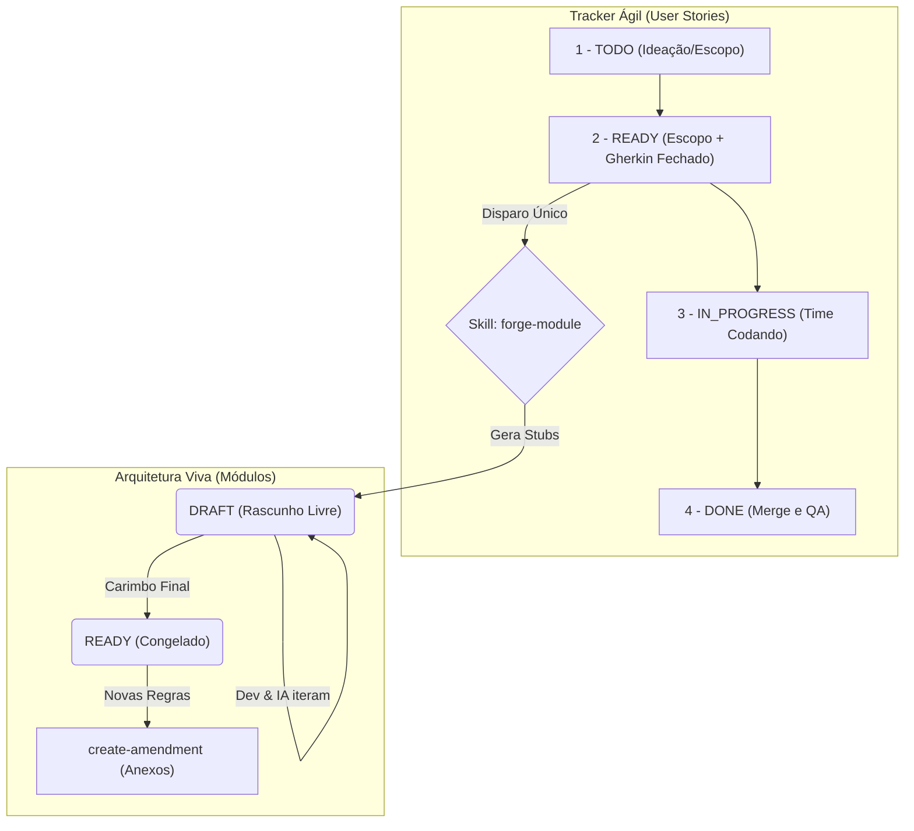
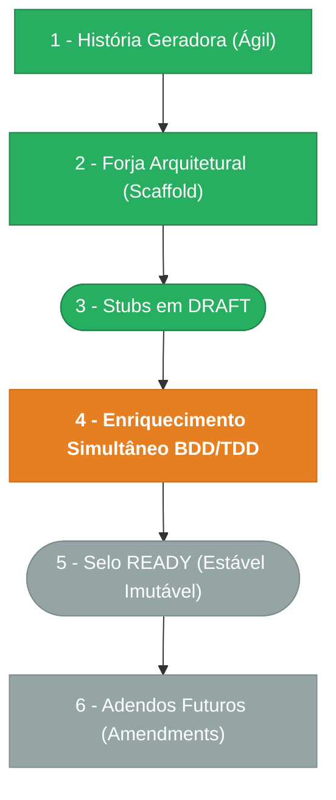

# DOC-DEV-002 — Fluxo de Agentes e Governança de Automação (XP-Driven)

**Status:** Norma Canônica Auxiliar | **Versão atual:** 2.0.0 | **Última revisão:** 2026-03-09

> **Regra de uso:** Este documento serve como o Guia Definitivo Operacional para Engenheiros, PMs e **Agentes de Inteligência Artificial**. Seguindo os princípios do **Extreme Programming (XP)**, ele detalha como o rastreio ágil (Histórias) se separa da estabilidade técnica (Módulos/Arquitetura), garantindo extrema velocidade na geração de código minimizando a burocracia de comandos intermediários, sem perder rastreabilidade.

---

## 1. O Pipeline XP (Extreme Programming)

A arquitetura do EasyCodeFramework abraça a velocidade. Nós desmembramos o status gerencial do time (`status_agil`) da imutabilidade do documento de especificação técnica (`estado_item`).

### Diagrama: O Ciclo de Vida Ágil vs. Técnico



### 1.1 A Bifurcação (Por que o fluxo se divide no passo 2?)

O segredo deste modelo XP é que **a História Ágil e a Especificação Técnica andam em paralelo, mas com ciclos de vida separados**.
Quando o ticket atinge o passo **2 (READY)**, ocorre uma bifurcação:

1. **O Caminho do Código (Ágil):** O desenvolvedor vai puxar o ticket e começar a programar. O status gerencial (a História) vai para **3 (IN_PROGRESS)**.
2. **O Caminho da Arquitetura (Técnico):** Antes ou simultaneamente ao início do código, usamos a automação `forge-module` uma única vez (Disparo Único). Ela gera a fundação física do módulo com status **DRAFT** para que a equipe possa iterar na documentação enquanto programa.

### 1.2 A Camada de Negócio (O Ritmo)
As User Stories (Arquivos em `/user-stories/`) ditam o ritmo do time. O campo `status_agil` é editado livremente pelo Desenvolvedor/Agente no Markdown conforme a prioridade (Kanban):

- **1. `TODO`**: A ideia está sendo rascunhada.
- **2. `READY`**: O escopo (Business Rules e Gherkin) está claro. A US está pronta para gerar a base de código e dar início ao ciclo de desenvolvimento.
- **3. `IN_PROGRESS`**: As automações (Scaffold/CI) começam e o código está sendo escrito/enriquecido hoje. Equivale à etapa onde os stubs técnicos estão em `DRAFT`.
- **4. `DONE`**: Testado, Merge aprovado.

### 1.3 A Camada de Arquitetura Técnica (A Imutabilidade)
Os documentos gerados dentro de `04_modules/mod-xxx/requirements` recebem o campo `estado_item`. Eles existem em dois mundos:
- **`estado_item: DRAFT`**: Enquanto a feature estiver em `IN_PROGRESS`, os agentes técnicos e desenvolvedores *editam livremente* estes arquivos para alinhar a especificação à realidade do código.
- **`estado_item: READY`**: Quando a feature vai para `DONE`, os documentos técnicos são selados para `READY`. A partir deste momento, eles viram **Lei**. Qualquer evolução arquitetural no futuro deverá ser tratada via uma nova História Ágil (Anexo/Amendment), preservando a história original sem sobrescrevê-la.

---

## 2. Abandono do Burocrático

Nesta reestruturação XP:
1. **O status `REFINING` morre.** O "enquadramento técnico" de uma história não requer travas algorítmicas, ele faz parte do ciclo natural de `TODO` até virar `READY` na concepção humana.
2. **O script `transition-spec-status` é abolido.** Apenas editar o Git versionando os arquivos de requisitos para `READY` marca a estabilidade.

---

## 3. Glossário de Comandos (Skills Prompt Sheet)

Com o pipeline enxuto, o catálogo de *Intenções* vs. *Skills* se reduz drasticamente:

| O que você quer fazer (Sua intenção)                                                      | O que pedir ao Agente no Chat                                                                             | O que o Agente vai rodar (Skill) |
| ---------------------------------------------------------------------------------------------- | ----------------------------------------------------------------------------------------------------------- | ---------------------------------- |
| Criar uma nova Arquitetura do Zero a partir de uma Ideia. | *"A partir da User Story X (Em READY), efetue a fundição completa do módulo."*                               | `forge-module`                |
| Alterar detalhes de uma documentação Pós-Scaffold (*Sem quebrar Rastreabilidade*)         | *"Crie uma emenda (amendment) de melhoria para a regra BR-001..."*                                        | `create-amendment`               |
| Modificar specs antigas via automação garantindo controle de versão e ADR.                | *"Atualize as especificações da feature de Uploads"*                                                    | O Agente cria o Documento Anexo por Si Só. |
| Atualizar o sumário e o índice da raiz do arquivo após gerar novos documentos.            | *"Atualize os índices da pasta de usuários."*                                                           | `update-markdown-file-index`     |

---

## 4. Deep Dive nas Skills Atuais (Orquestração Autônoma)

Como o XP confia na inteligência (e no Git), as ferramentas da camada técnica se tornam mais poderosas.

### 4.1. `forge-module` (A Forja XP)

- **Fluxo Mestre:** O Arquiteto. Unifica a concepção da US e a geração do Boilerplate em um tiro.
- **Entrada:** Um prompt humano descrevendo a ideia ou o path de uma US embrionária.
- **Comportamento:**
  1. Extrai o escopo e garante o BDD/Gherkin no arquivo da User Story, atestando-a como `READY`.
  2. Imediatamente faz `mkdir` na árvore padrão (`requirements/br`, `requirements/fr`, `adr/`, etc).
  3. Preenche todos os "Stubs" arquiteturais gerando os MDs pré-preenchidos já atrelados de volta à História Pai, nascendo todos com `estado_item: DRAFT` (liberados para edição livre e código).
- **Saída:** Um módulo inteiro "Ready for Code" entregue com um único prompt.

### 4.2. `create-amendment`

- **Fluxo Mestre:** Mantém o versionamento longo e o histórico de um ID (Ex: O ID BR-001 nunca muda para BR-001B).
- **Entrada:** ID alvo (em `estado_item: READY`), tipo da emenda (C/Correção, M/Melhoria, R/Revisão), diretório base e Prompt Descritivo.
- **Comportamento:** Calcula o próximo sequencial da Emenda, cria o sufixo (ex: `BR-001-M01.md`) num subdiretório `amendments/`, e injeta automaticamente a justificativa/alteração sem tocar no arquivo mestre gerado anteriormente.
- **Saída:** O histórico das mudanças é apensado de forma imutável.

### 4.3. Agentes Autônomos vs Especificação

A skill burocrática `update-specification` deixa de atuar no paradigma XP.
Em vez disso, a Autonomia do Agente governa o disco:
- Se o Agente precisa editar um requisito e vê que ele está em `estado_item: DRAFT`, ele **reescreve livremente** o arquivo usando `replace_file_content` (Edição Ágil).
- Se o Agente percebe que o requisito está em `estado_item: READY` (Selado), o Agente **reconhece a restrição normativa** e aciona inteligentemente o comando de `create-amendment` por conta própria.

### 4.4. `update-markdown-file-index`

- **Fluxo Mestre:** O Organizador.
- **Comportamento:** Lê os Títulos (H1, H2) de todos sub-docs, coleta os File Paths reais e sobrescreve um bloco com comentário HTML (magic comments `<!-- start index --> ... <!-- end index -->`) injetando os Bullet Points atualizados com os Hyperlinks absolutos relativos.

---

## 5. Padrão Canônico: Diagrama Mermaid no CHANGELOG

> O diagrama de vida dos módulos foi drasticamente encurtado para refletir apenas os estados de estabilidade arquitetural, acompanhando o fluxo XP.

### 5.1 Estrutura do CHANGELOG

Todo `CHANGELOG.md` de módulo deve refletir O RITMO TÉCNICO do Desenvolvimento:
1. Cabeçalho Automático
2. Título `# CHANGELOG - MOD-{ID}`
3. Pipeline e Versões

### 5.2 Lógica de Decisão do Estágio XP

- **Fase de Código (`DRAFT`)**: Os requirements do módulo estão em `DRAFT`. A equipe está programando. Etapa Laranja é a **Inception Técnica**.
- **Fase Estável (`READY`)**: O módulo está maduro. Todo o desenvolvimento base foi feito. Etapa Laranja/Verde é o **Selo de Ouro**.

### 5.3 Template Mermaid Canônico XP

````markdown
## Ciclo de Estabilidade do Módulo

> 🟢 Verde = Concluído | 🟠 Laranja = Em Andamento | 🔵 Azul = Estável Ancestral | ⬜ Cinza = Previsto


````
*(Neste exemplo, o módulo está na **Etapa 4**, desenvolvimento DRAFT em ritmo acelerado na IDE).*
