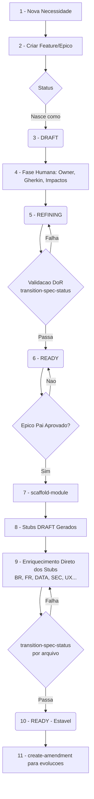
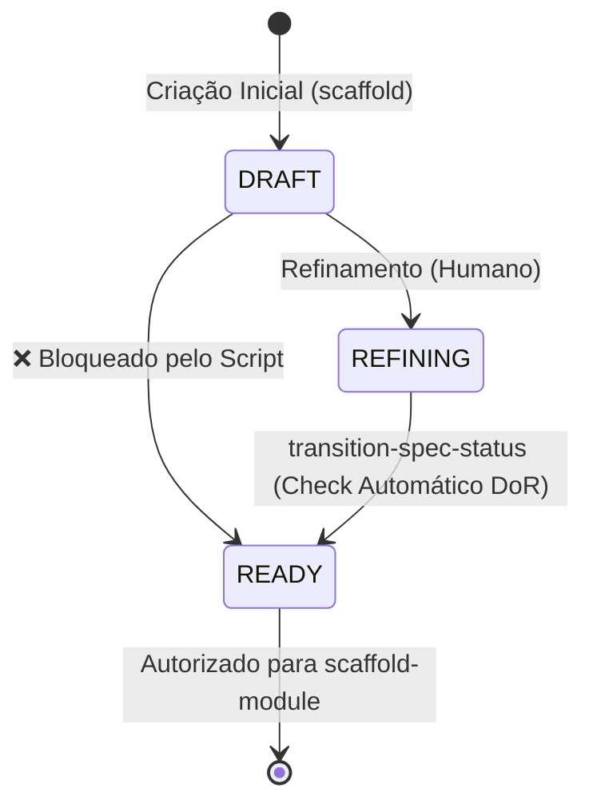
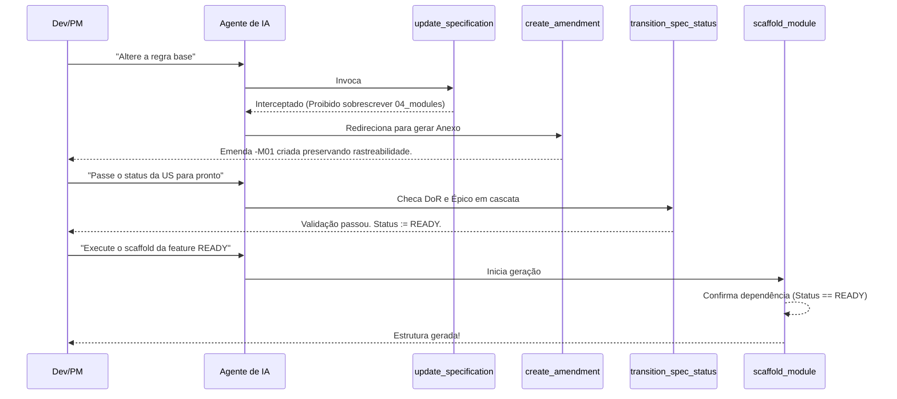
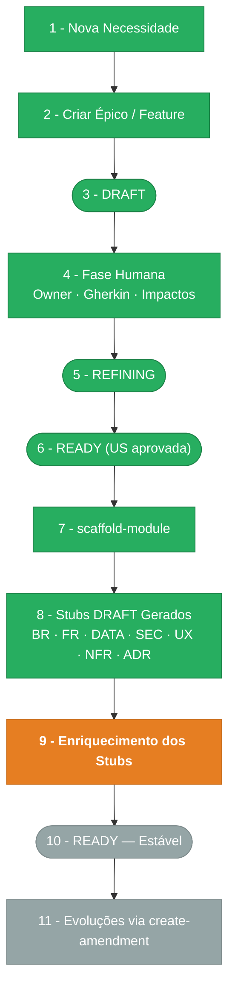

# DOC-DEV-002 — Fluxo de Agentes e Governança de Automação

**Status:** Norma Canônica Auxiliar | **Versão atual:** 1.0.0 | **Última revisão:** 2026-03-08

> **Regra de uso:** Este documento serve como o Guia Definitivo Operacional para Engenheiros, PMs e **Agentes de Inteligência Artificial**. Ele detalha como o fluxo de requisitos funciona na prática, o ciclo de aprovação de Módulos (Épicos e Features), e como orquestrar as skills (scripts) para gerar código sem quebrar a rastreabilidade estipulada no `DOC-DEV-001`.

---

## 1. O Processo Ponta a Ponta (End-to-End)

A geração de um módulo no EasyCodeFramework não é um evento isolado de "escrever código". É um pipeline governado que garante que apenas requisitos revisados se transformem em rotas, tabelas e interfaces.

### Diagrama: O Ciclo de Vida da User Story



### 1.1 Ideação e Rascunho Inicial

- Um desenvolvedor ou PM descreve a necessidade.
- Se for uma feature nova, cria-se a documentação base na pasta `docs/04_modules/user-stories/features/`.
- O documento nasce obrigatoriamente com o `estado_item: DRAFT`.

### 1.2 Refinamento e Negociação (O Fator Humano)

- **Não se pula de DRAFT para READY.** O papel do ser humano aqui é atestar impactos:
  - Definir um Owner.
  - Fechar o escopo (sem ambiguidades).
  - Escrever os cenários Gherkin (BDD).
  - Listar dependências externas e integrações.
- Quando a equipe começa esse processo, o status avança para `estado_item: REFINING`.

### 1.3 Aprovação (Ready for Dev)

- Com o DoR (Definition of Ready) cumprido, o status avança para `estado_item: READY`.
- **Aprovação em Cascata:** Uma Sub-história (Ex: `US-MOD-000-F01`) **NUNCA** pode estar em `READY` se o seu Épico Pai (Ex: `US-MOD-000`) ainda estiver em `DRAFT` ou `REFINING`.

### 1.4 Geração de Código Subsequente (Scaffolding)

- Com a US em `READY`, os Agentes estão autorizados a executar a automação de `scaffold-module`.
- O Agente criará a pasta do módulo (ex: `mod-000-foundation`), os índices, o README, e todas as subpastas `requirements/` (BR, FR, DATA, SEC) carimbadas com a flag de automação.
- Os arquivos nascem em `DRAFT` e passam por **duas fases obrigatórias**:
  1. **Enriquecimento (DRAFT → READY):** O agente edita os stubs diretamente para preencher o conteúdo técnico a partir das User Stories aprovadas. Essa é a única fase em que edição direta é permitida e esperada.
  2. **Estabilidade (READY em diante):** Após promovido por `transition-spec-status`, toda evolução ocorre **exclusivamente** via `create-amendment`. Edições diretas estão proibidas a partir deste ponto.

---

## 2. Fluxos de Transição de Status (The Golden Path)

O avanço do `estado_item` é rigidamente validado via regra sistêmica, evitando promoções prematuras que quebrem a governança na ponta da geração.

### O Caminho: `DRAFT` ➔ `REFINING` ➔ `READY`



| Transição           | Validador       | O que é checado (DoR Estático)                                                                                                                                                                  |
| ----------------------- | ----------------- | --------------------------------------------------------------------------------------------------------------------------------------------------------------------------------------------------- |
| **DRAFT ➔ REFINING** | Humano / Agente | Início da discussão descritiva e desenho de impacto.                                                                                                                                            |
| **DRAFT ➔ READY**    | Script Node.js  | ❌**BLOQUEADO.** A transição direta é expressamente proibida pela regra de governança para garantir que a fase de testes e leitura de dependências humanas (`REFINING`) ocorra.              |
| **REFINING ➔ READY** | Script Node.js  | 1. O arquivo possui a chave`owner` preenchida (sem "...").<br>2. O arquivo possui blocos de cenário em `Gherkin`.<br>3. **Cascata:** O arquivo do Épico pai também está marcado como `READY`. |

---

## 3. Glossário de Comandos (Skills Prompt Sheet)

Este é o catálogo de *Intenções* vs. *Skills*. Use estas frases (ou similares) no chat com os Agentes para invocar as ferramentas criadas para preservar a arquitetura, sem precisar executar comandos tediosos de terminal.


| O que você quer fazer (Sua intenção)                                                      | O que pedir ao Agente no Chat                                                                             | O que o Agente vai rodar (Skill) |
| ---------------------------------------------------------------------------------------------- | ----------------------------------------------------------------------------------------------------------- | ---------------------------------- |
| Alterar detalhes de uma documentação Pós-Scaffold (*Sem quebrar Rastreabilidade*)         | *"Crie uma emenda (amendment) de melhoria para a regra BR-001..."*                                        | `create-amendment`               |
| Validar o DoR e Promover um documento para a próxima fase.                                  | *"Atualize o status da US-MOD-000-F01 para READY."* **ou** *"Pode passar o doc do Épico para REFINING?"* | `transition-spec-status`         |
| Gerar a estrutura final de pastas e arquivos de requisitos a partir de uma História pronta. | *"Efetue o scaffold module da US-MOD-000-F01."*                                                           | `scaffold-module`                |
| Modificar specs antigas via automação garantindo controle de versão e ADR.                | *"Atualize as especificações da feature de Uploads"*                                                    | `update-specification`           |
| Atualizar o sumário e o índice da raiz do arquivo após gerar novos documentos.            | *"Atualize os índices da pasta de usuários."*                                                           | `update-markdown-file-index`     |

---

## 4. Deep Dive nos Scripts e Skills Atuais

Para garantir que o time entenda as "chaves de fenda" por trás da automação, abaixo detalhamos o fluxo interno de cada skill orquestrada:

### Diagrama de Orquestração das Skills



### 4.1. `transition-spec-status`

- **Fluxo Mestre:** É a barreira do Golden Path.
- **Entrada:** Um caminho de Markdown (ex: `/docs/04_modules/.../US-XYZ.md`) e um status alvo (`REFINING` ou `READY`).
- **Comportamento:**
  - Extrai o status atual via Regex. Impede pulos de DRAFT para READY.
  - Checa se Owner `!== '...'`.
  - Checa se o texto contém blocos de código com a tag ````gherkin`.
  - Deduz o `nome do Épico` a partir do Regex do Título da Fila, tenta ler o Markdown pai nos `/epics` e checa se o pai é `>= READY`.
- **Saída:** Substitui a string `estado_item` no próprio arquivo para a variante alvo. Caso contrário, reporta os "Missing" no console (abortando o Agente de seguir em frente).

### 4.2. `create-amendment`

- **Fluxo Mestre:** Mantém o versionamento longo e o histórico de um ID (Ex: O ID BR-001 nunca muda para BR-001B).
- **Entrada:** ID alvo, tipo da emenda (C/Correção, M/Melhoria, R/Revisão), diretório base e Prompt Descritivo.
- **Comportamento:** Calcula o próximo sequencial da Emenda, cria o sufixo (ex: `BR-001-M01.md`) num subdiretório `amendments/`, e injeta automaticamente a justificativa/alteração sem tocar no arquivo mestre gerado anteriormente.
- **Saída:** O histórico das mudanças é apensado de forma imutável.

### 4.3. `update-specification` (Gerenciador Pai)

- **Fluxo Mestre:** Skill guardiã que proíbe Agentes de "reescrever um arquivo inteiro dando override".
- **Entrada:** Arquivos alvos de edição arbitrária apontados pelo Agente/Dev.
- **Comportamento:** Ela avalia. Se for em `04_modules` ela intercepta, bloqueia o file-system overwrite, e redireciona (delega) ativamente a tarefa para executar a skill `create-amendment`.
- **Saída:** Integridade arquitetural protegida contra deleções acidentais ou perda de baseline pelos LLMs.

### 4.4. `scaffold-module`

- **Fluxo Mestre:** The Builder. Lê US e gera o Boilerplate.
- **Entrada:** ID/Path da US que está pronta.
- **Comportamento:**
  1. Verifica se a US alvo tem o status `READY`. Se tiver `DRAFT/REFINING`, ele paralisa a operação imediatamente.
  2. Executa `mkdir` na árvore padrão (`requirements/br`, `requirements/fr`, `adr/`, etc).
  3. Preenche os arquivos com as meta-tags protetoras (`> ⚠️ ARQUIVO GERIDO POR AUTOMAÇÃO` e `estado_item: DRAFT`).
  4. Amarra os headers de `rastreia_para` usando os caminhos relativos de volta para o Épico.
- **Saída:** Nova base consolidada para os devs iniciarem a arquitetura de banco de dados e APIs limpas.

### 4.5. `update-markdown-file-index`

- **Fluxo Mestre:** O Organizador.
- **Entrada:** Diretório que sofreu mutação e Arquivo Índice a ser atualizado.
- **Comportamento:** Lê os Títulos (H1, H2) de todos sub-docs, coleta os File Paths reais e sobrescreve um bloco com comentário HTML (magic comments `<!-- start index --> ... <!-- end index -->`) injetando os Bullet Points atualizados com os Hyperlinks absolutos relativos.
- **Saída:** Índices do repositório sempre consistentes e navegáveis sem trabalho manual tedioso.

---

## 5. Padrão Canônico: Diagrama Mermaid de Pipeline no CHANGELOG

> **Esta seção é a Single Source of Truth (SSoT) para a sintaxe e regras de coloração do diagrama Mermaid** inserido nos `CHANGELOG.md` de cada módulo. As skills `scaffold-module` e `create-amendment` devem referenciar este normativo e **nunca** duplicar estas regras.

### 5.1 Estrutura do CHANGELOG (Seções Obrigatórias)

Todo `CHANGELOG.md` de módulo deve conter, nesta ordem:

1. **Cabeçalho de automação** (tabela de versões do arquivo)
2. **Título** `# CHANGELOG - MOD-{ID} {Nome}`
3. **Seção de Estágio Atual** — texto descritivo do estágio em que o módulo se encontra
4. **Seção Pipeline de Ciclo de Vida** — diagrama Mermaid colorido
5. **Histórico de Versões** — tabela de bumps semânticos

### 5.2 Tabela de Cores por Estado

| Estado | Cor de Fundo | Stroke | Uso |
|--------|-------------|--------|-----|
| ✅ Concluído | `#27AE60` | `#1E8449` | Etapas já finalizadas |
| 🟠 Etapa Atual (em andamento) | `#E67E22` | `#CA6F1E` | Etapa 9 — enquanto há `requirements` em `DRAFT` |
| 🔵 Estável (READY) | `#1A5276` | `#154360` | Etapa 10 — quando **todos** os requirements estão `READY` |
| ⬜ Pendente | `#95A5A6` | `#7F8C8D` | Etapas futuras ainda não alcançadas |

### 5.3 Lógica de Decisão de Estágio

Para determinar qual etapa colorir, verifique o `estado_item` de **todos** os arquivos em `requirements/` do módulo:

- Se **algum** ainda estiver `DRAFT` → **Etapa 9 é a atual**: E1–E8 verde, **E9 laranja**, E10–E11 cinza.
- Se **todos** estiverem `READY` → **Etapa 10 é a atual**: E1–E9 verde, **E10 azul escuro**, E11 cinza.

Atualize também o texto da seção `## Estágio Atual` com o número, nome e emoji correspondente:

- `## Estágio Atual: **8 — Stubs DRAFT Gerados** 🔴 (Em andamento)` ← logo após scaffold
- `## Estágio Atual: **9 — Enriquecimento dos Stubs** 🟠 (Em andamento)` ← durante enriquecimento
- `## Estágio Atual: **10 — READY (Estável)** ✅` ← todos os requirements em READY

### 5.4 Template Mermaid Canônico

````markdown
## Pipeline de Ciclo de Vida

> 🟢 Verde = Concluído | 🟠 Laranja = Etapa Atual | 🔵 Azul = Estável | ⬜ Cinza = Pendente


````

> **Nota:** Aplique a lógica da seção 5.3 para ajustar os `style` das etapas E9 e E10 conforme o estado real do módulo.
