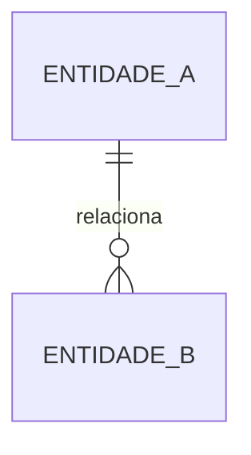
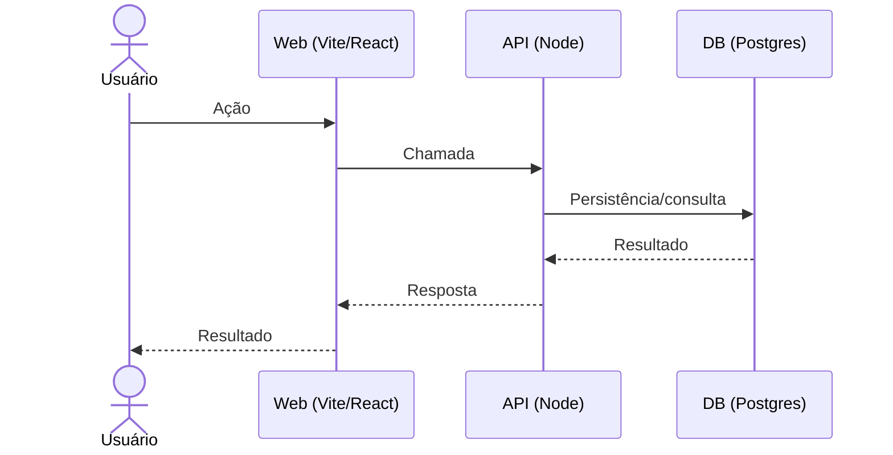
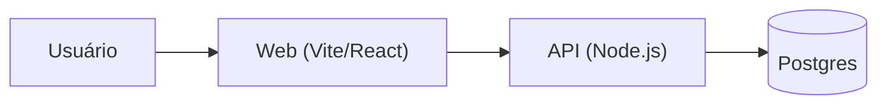

# MOD-XXX — <Nome do Módulo> (Especificação Executável)

- **id:** MOD-XXX
- **version:** 0.1.0
- **status:** DRAFT
- **data_ultima_revisao:** YYYY-MM-DD
- **owner:** <equipe>
- **scope:** <escopo do módulo>

> **Base normativa:** Este template segue as regras do [DOC-DEV-001](../../01_normativos/DOC-DEV-001_especificacao_executavel.md) (§0). Toda alteração DEVE ser registrada no CHANGELOG abaixo e seguir SemVer (`MAJOR.MINOR.PATCH`).

---

## CHANGELOG

| Versão | Data | Responsável | Descrição |
|--------|------|-------------|-----------|
| 0.1.0 | YYYY-MM-DD | <owner> | Baseline inicial (forge-module) |

---

# 1. Introdução

## 1.1 Objetivo do sistema (1–3 frases)

> (Descreva o que o sistema faz em linguagem de negócio.)

- Objetivo: ...
- **estado_item:** DRAFT
- **owner:** ...

## 1.2 Problema que resolve

> (Dor atual, por que existe, e o que muda depois.)

- Problema: ...
- Impacto hoje: ...
- Resultado esperado: ...
- **estado_item:** DRAFT
- **owner:** ...

## 1.3 Público-alvo (personas e perfis)

> (Perfis afetam permissões, fluxos críticos e a UX.)

- Persona/Perfil 1: ...
- Persona/Perfil 2: ...

## 1.4 Escopo

### Inclui

- ...

### Não inclui (Fora de escopo)

- ...

### Fora de escopo por agora (Roadmap Futuro)

- (Item que será feito depois) | Gatilho para reavaliação: (Data ou Condição)

## 1.5 Métricas de sucesso (OKRs)

- **OKR-1:** [Métrica] + [Baseline] + [Alvo] + [Data]
- **OKR-2:** ...
- **estado_item:** DRAFT

## 1.6 Premissas e restrições

- **Premissas:** ...
- **Restrições:** (legais, técnicas, prazo, custos, stack obrigatória, etc.) ...
- **estado_item:** DRAFT

---

# 2. Recursos do Sistema (visão por módulos)

> Declarar o **Nível de Arquitetura (0/1/2)** conforme DOC-ESC-001.

## MOD-XXX — <Nome do módulo>

- Resumo: ...
- Nível de Arquitetura: 0 | 1 | 2
- Doc canônico (módulo): `docs/04_modules/<mod-xxx>/mod.md`

### Itens base (canônicos) e links

- BR-XXX — ...
- FR-XXX — ...
- DATA-XXX — ...
- INT-XXX — ...
- SEC-XXX — ...
- UX-XXX — ...
- NFR-XXX — ...

### Decisões (ADR)

- ADR-XXX — ...

### Metadados do item (MOD-XXX)

- estado_item: DRAFT
- owner: ...
- data_ultima_revisao: ...
- rastreia_para: ...

---

# 3. Regras de Negócio (BR-xxx)

## BR-XXX — <Título>

> ⚠️ **ARQUIVO GERIDO POR AUTOMAÇÃO.** Use a skill pertinente para versionar alterações.

- Regra: ...
- Exemplo: ...
- Exceções: ...
- Impacto: (dados / estado / fluxo / segurança / compliance / cálculo)

### Critérios de aceite (Gherkin)

```gherkin
Funcionalidade: <nome>

Cenário: <titulo>
  Dado ...
  Quando ...
  Então ...
```

- **estado_item:** DRAFT
- **owner:** ...
- **rastreia_para:** (FR-..., DATA-..., SEC-...)

---

# 4. Requisitos (FR / DATA / INT / SEC / UX / NFR)

## 4.1 Requisitos Funcionais (FR-xxx)

### FR-XXX — <Título>

> ⚠️ **ARQUIVO GERIDO POR AUTOMAÇÃO.** Use a skill pertinente para versionar alterações.

- **Descrição:** ...
- **Prioridade:** Must | Should | Could
- **Perfis impactados:** ...
- **Done funcional:** ...
- **Efeito colateral?** [ ] Sim [ ] Não
- **Dependências (IDs):** BR | DATA | INT | SEC | NFR | UX

### Critérios de aceite (Gherkin)

```gherkin
Funcionalidade: <nome>

Cenário: <titulo>
  Dado ...
  Quando ...
  Então ...
```

- **estado_item:** DRAFT
- **owner:** ...
- **rastreia_para:** ...

---

## 4.2 Dados e Entidades (DATA-xxx)

### DATA-XXX — <Entidade/Tabela>

> ⚠️ **ARQUIVO GERIDO POR AUTOMAÇÃO.** Use a skill pertinente para versionar alterações.

- **Objetivo:** ...
- **Tipo de Tabela:** Relacional (SQL) | Documento (NoSQL)
- **Campos Obrigatórios Padrão:**
  - `id`: UUID | NOT NULL
  - `codigo`: varchar | NOT NULL | unique
  - `status`: text | NOT NULL
  - `tenant_id`: UUID | NOT NULL
  - `created_at`: timestamptz | NOT NULL | default=now()
  - `updated_at`: timestamptz | NOT NULL | default=now()
  - `deleted_at`: timestamptz | NULL (Soft-Delete)
  - `<campo_negocio>`: ...
- **Relacionamentos e Constraints:** FK com `ON DELETE RESTRICT` (NUNCA CASCADE)
- **Eventos do domínio:** criado | atualizado | inativado | excluído

### Diagrama ERD (Mermaid)



- **estado_item:** DRAFT
- **owner:** ...
- **rastreia_para:** (FR-..., BR-...)

---

## 4.3 Integrações e Contratos (INT-xxx)

### INT-XXX — <Integração>

- **Sistema externo:** ...
- **Modo:** API | Webhook | Fila | Arquivo
- **Auth:** ...
- **Contrato:** request/response exemplo
- **Timeout:** ...
- **Retry:** ...
- **Fallback:** ...
- **estado_item:** DRAFT
- **owner:** ...
- **rastreia_para:** (FR-..., BR-..., SEC-...)

---

## 4.4 Segurança e Compliance (SEC-xxx)

### SEC-XXX — <Título>

- **Autenticação:** ...
- **Autorização:** RBAC | ABAC | híbrido
- **Classificação dos Dados:** Público | Interno | Confidencial | Restrito
- **LGPD:** minimização | anonimização (se aplicável)
- **Auditoria:** eventos auditáveis | trilha de mudanças
- **estado_item:** DRAFT
- **owner:** ...
- **rastreia_para:** (FR-..., INT-..., DATA-...)

---

## 4.5 UX e Jornadas (UX-xxx)

### UX-XXX — <Jornada/Tela/Fluxo>

- **Happy path:** ...
- **Alternativas/erros:** ...
- **Estados Vazios:** ...
- **Tratamento de Erros (MUST UX):**
  - 400/422: erros inline
  - 401: redirecionar login
  - 403: empty state acesso negado
  - 404: tela ilustrada + voltar
  - 409: modal de conflito
  - 5xx: toast "tente novamente"
- **Acessibilidade:** teclado, foco, ARIA, contraste
- **estado_item:** DRAFT
- **owner:** ...
- **rastreia_para:** (FR-..., BR-..., SEC-...)

### Diagrama Sequence (Mermaid)



---

## 4.6 Requisitos Não Funcionais (NFR-xxx)

### NFR-XXX — <Título>

- **Performance:** p95/p99, paginação, limites
- **Observabilidade:** correlation_id, logs, métricas
- **Disponibilidade:** SLO, fallback
- **estado_item:** DRAFT
- **owner:** ...
- **rastreia_para:** (FR-..., SEC-..., DATA-...)

---

# 5. Arquitetura e Implementação

## 5.1 Diagramas C4 (Mermaid)



## 5.2 Escala de Arquitetura por módulo

- MOD-XXX: Nível ...

## 5.3 Contratos de API

> Ver [DOC-ARC-001](../../01_normativos/DOC-ARC-001__Padroes_OpenAPI.md) para padrões OpenAPI.

## 5.4 Contratos de Frontend

> Ver DOC-DEV-001 §5.4 para padrões de comunicação Frontend ↔ API.

## 5.5 Estratégia de Testes

> Ver [DOC-ARC-002](../../01_normativos/DOC-ARC-002__Estrategia_Testes.md) para padrões de testes.

---

# 6. Anexos

## 6.1 Glossário

> Padronize termos do domínio; evite sinônimos soltos.

| Termo | Definição |
|-------|-----------|
| ... | ... |
