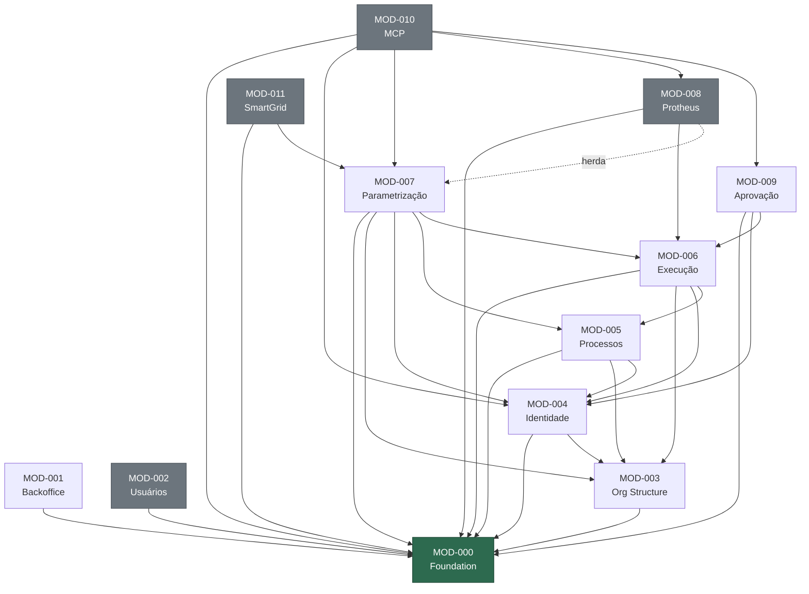

# Grafo de Dependências Cross-Módulo

- **id:** DOC-DEP-001
- **version:** 1.0.0
- **data_ultima_revisao:** 2026-03-24
- **owner:** arquitetura
- **gerado_por:** auditoria manual + linter Pass E (cycle detection)

> **Propósito:** Fonte de verdade para dependências entre módulos. Consumido por skills (`forge-module`, `enrich`, `promote-module`, `delete-module`) e pelo linter (`lint-docs.js` Pass E) para detectar ciclos e bloqueios.

---

## 1. Grafo de Adjacência

> Cada linha declara `MOD-XXX → [dependências]`. O linter extrai este bloco para validação.

<!-- BEGIN:DEPENDENCY_GRAPH -->
```yaml
dependencies:
  MOD-000: []
  MOD-001: [MOD-000]
  MOD-002: [MOD-000]
  MOD-003: [MOD-000]
  MOD-004: [MOD-000, MOD-003]
  MOD-005: [MOD-000, MOD-003, MOD-004]
  MOD-006: [MOD-000, MOD-003, MOD-004, MOD-005]
  MOD-007: [MOD-000, MOD-003, MOD-004, MOD-005, MOD-006]
  MOD-008: [MOD-000, MOD-006, MOD-007]
  MOD-009: [MOD-000, MOD-004, MOD-006]
  MOD-010: [MOD-000, MOD-004, MOD-007, MOD-008, MOD-009]
  MOD-011: [MOD-000, MOD-007]
```
<!-- END:DEPENDENCY_GRAPH -->

---

## 2. Tipos de Dependência

| De | Para | Tipo | Detalhe |
|----|------|------|---------|
| MOD-001 | MOD-000 | **consome** | Auth endpoints (login, logout, /auth/me) |
| MOD-002 | MOD-000 | **consome** | Users API (F05), Roles API (F06) |
| MOD-003 | MOD-000 | **consome** | Foundation core (auth, RBAC, events) |
| MOD-004 | MOD-000 | **consome** | Auth, RBAC scopes, domain events |
| MOD-004 | MOD-003 | **consome** | org_units para user_org_scopes |
| MOD-005 | MOD-000 | **consome** | Foundation core |
| MOD-005 | MOD-003 | **consome** | org_unit_id em blueprints |
| MOD-005 | MOD-004 | **consome** | org_scopes para filtering de processos |
| MOD-006 | MOD-000 | **consome** | Auth, RBAC, domain events, audit trail |
| MOD-006 | MOD-003 | **consome** | org_unit_id nos casos |
| MOD-006 | MOD-004 | **consome** | Delegações de acesso para atribuições |
| MOD-006 | MOD-005 | **consome** | Blueprints publicados (ciclos, estágios, gates, transições) |
| MOD-007 | MOD-000 | **consome** | Foundation core |
| MOD-007 | MOD-003 | **consome** | org_unit_id em parâmetros |
| MOD-007 | MOD-004 | **consome** | Scopes contextuais |
| MOD-007 | MOD-005 | **consome** | Ciclos referenciados |
| MOD-007 | MOD-006 | **consome** | Motor avaliado durante transições de caso |
| MOD-008 | MOD-000 | **consome** | Foundation core |
| MOD-008 | MOD-006 | **consome** | Transições inbound (trigger de integração) |
| MOD-008 | MOD-007 | **herda** | behavior_routines com routine_type='INTEGRATION' |
| MOD-009 | MOD-000 | **consome** | Foundation core |
| MOD-009 | MOD-004 | **consome** | Scopes para auto-approval |
| MOD-009 | MOD-006 | **consome** | Gates dentro de processos |
| MOD-010 | MOD-000 | **consome** | Foundation core |
| MOD-010 | MOD-004 | **consome** | Scopes para agentes MCP |
| MOD-010 | MOD-007 | **consome** | Motor de parametrização |
| MOD-010 | MOD-008 | **consome** | Integrações externas via MCP |
| MOD-010 | MOD-009 | **consome** | Policy CONTROLLED para movimentos |
| MOD-011 | MOD-000 | **consome** | Foundation core |
| MOD-011 | MOD-007 | **consome** | routine-engine/evaluate |

---

## 3. Bloqueios Conhecidos

| Bloqueio | Módulo Bloqueado | Módulo Bloqueador | Razão | Status |
|----------|------------------|-------------------|-------|--------|
| BLK-001 | MOD-002 | MOD-000 | Amendment F05: `users_invite_resend` precisa existir em MOD-000 | PENDENTE |
| BLK-002 | MOD-006 | MOD-005 | Blueprints + `cycle_version_id` freeze devem estar implementados | PENDENTE |
| BLK-003 | MOD-005 | MOD-004 | `org_scopes` para filtering precisam existir | PENDENTE |
| BLK-004 | MOD-008 | MOD-005 | Processos para rotinas de integração | PENDENTE |

---

## 4. Visualização (Mermaid)



---

## 5. Ordem de Implementação Sugerida (Topológica)

| Camada | Módulos | Pré-requisitos |
|--------|---------|----------------|
| 0 | MOD-000 | Nenhum |
| 1 | MOD-001, MOD-002, MOD-003 | MOD-000 |
| 2 | MOD-004 | MOD-000, MOD-003 |
| 3 | MOD-005 | MOD-000, MOD-003, MOD-004 |
| 4 | MOD-006 | MOD-000..MOD-005 |
| 5 | MOD-007, MOD-009 | MOD-006 |
| 6 | MOD-008, MOD-010, MOD-011 | MOD-007/MOD-009 |

---

## CHANGELOG

| Versão | Data | Descrição |
|--------|------|-----------|
| 1.0.0 | 2026-03-20 | Criação: grafo completo, tipos, bloqueios, Mermaid, ordem topológica |
