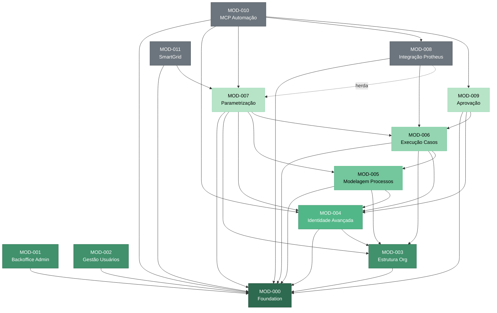
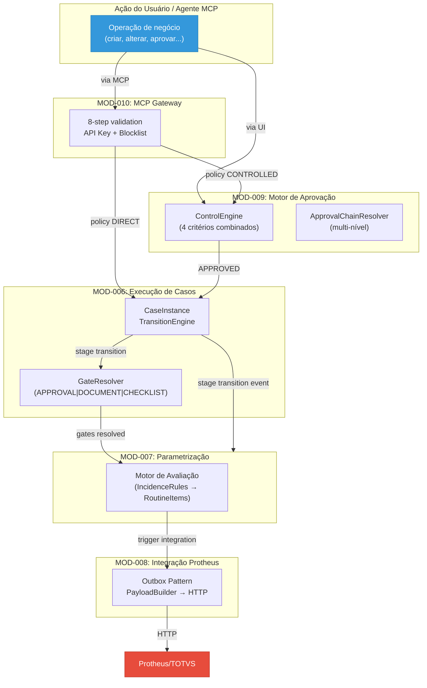

# ECF — Diagrama de Integração Global entre Módulos

## Grafo Completo de Dependências

```mermaid
graph TD
    MOD000["MOD-000<br/>Foundation"]
    MOD001["MOD-001<br/>Backoffice Admin"]
    MOD002["MOD-002<br/>Gestão Usuários"]
    MOD003["MOD-003<br/>Estrutura Org"]
    MOD004["MOD-004<br/>Identidade Avançada"]
    MOD005["MOD-005<br/>Modelagem Processos"]
    MOD006["MOD-006<br/>Execução Casos"]
    MOD007["MOD-007<br/>Parametrização"]
    MOD008["MOD-008<br/>Integração Protheus"]
    MOD009["MOD-009<br/>Aprovação"]
    MOD010["MOD-010<br/>MCP Automação"]
    MOD011["MOD-011<br/>SmartGrid"]

    MOD001 --> MOD000
    MOD002 --> MOD000
    MOD003 --> MOD000

    MOD004 --> MOD000
    MOD004 --> MOD003

    MOD005 --> MOD000
    MOD005 --> MOD003
    MOD005 --> MOD004

    MOD006 --> MOD000
    MOD006 --> MOD003
    MOD006 --> MOD004
    MOD006 --> MOD005

    MOD007 --> MOD000
    MOD007 --> MOD003
    MOD007 --> MOD004
    MOD007 --> MOD005
    MOD007 --> MOD006

    MOD008 --> MOD000
    MOD008 --> MOD006
    MOD008 -.->|"herda"| MOD007

    MOD009 --> MOD000
    MOD009 --> MOD004
    MOD009 --> MOD006

    MOD010 --> MOD000
    MOD010 --> MOD004
    MOD010 --> MOD007
    MOD010 --> MOD008
    MOD010 --> MOD009

    MOD011 --> MOD000
    MOD011 --> MOD007

    classDef foundation fill:#2d6a4f,stroke:#1b4332,color:#fff
    classDef layer1 fill:#40916c,stroke:#2d6a4f,color:#fff
    classDef layer2 fill:#52b788,stroke:#40916c,color:#fff
    classDef layer3 fill:#74c69d,stroke:#52b788,color:#000
    classDef layer4 fill:#95d5b2,stroke:#74c69d,color:#000
    classDef layer5 fill:#b7e4c7,stroke:#95d5b2,color:#000
    classDef leaf fill:#6c757d,stroke:#495057,color:#fff

    class MOD000 foundation
    class MOD001,MOD002,MOD003 layer1
    class MOD004 layer2
    class MOD005 layer3
    class MOD006 layer4
    class MOD007,MOD009 layer5
    class MOD008,MOD010,MOD011 leaf
```

## Camadas Topológicas (Ordem de Build)

```mermaid
graph LR
    subgraph L0 ["Layer 0"]
        L0A["MOD-000<br/>Foundation"]
    end
    subgraph L1 ["Layer 1"]
        L1A["MOD-001"]
        L1B["MOD-002"]
        L1C["MOD-003"]
    end
    subgraph L2 ["Layer 2"]
        L2A["MOD-004"]
    end
    subgraph L3 ["Layer 3"]
        L3A["MOD-005"]
    end
    subgraph L4 ["Layer 4"]
        L4A["MOD-006"]
    end
    subgraph L5 ["Layer 5"]
        L5A["MOD-007"]
        L5B["MOD-009"]
    end
    subgraph L6 ["Layer 6"]
        L6A["MOD-008"]
        L6B["MOD-010"]
        L6C["MOD-011"]
    end

    L0 --> L1 --> L2 --> L3 --> L4 --> L5 --> L6

    classDef foundation fill:#2d6a4f,stroke:#1b4332,color:#fff
    classDef l1 fill:#40916c,stroke:#2d6a4f,color:#fff
    classDef l2 fill:#52b788,stroke:#40916c,color:#fff
    classDef l3 fill:#74c69d,stroke:#52b788,color:#000
    classDef l4 fill:#95d5b2,stroke:#74c69d,color:#000
    classDef l5 fill:#b7e4c7,stroke:#95d5b2,color:#000
    classDef l6 fill:#6c757d,stroke:#495057,color:#fff

    class L0A foundation
    class L1A,L1B,L1C l1
    class L2A l2
    class L3A l3
    class L4A l4
    class L5A,L5B l5
    class L6A,L6B,L6C l6
```

## Fluxo de Integração Runtime

```mermaid
flowchart TD
    subgraph USER_ACTION ["Ação do Usuário / Agente MCP"]
        UA["Operação de negócio<br/>(criar, alterar, aprovar...)"]
    end

    subgraph MOD010_GW ["MOD-010: MCP Gateway"]
        GW["8-step validation<br/>API Key + Blocklist"]
    end

    subgraph MOD009_ENGINE ["MOD-009: Motor de Aprovação"]
        ENGINE["ControlEngine<br/>(4 critérios combinados)"]
        CHAIN["ApprovalChainResolver<br/>(multi-nível)"]
    end

    subgraph MOD006_EXEC ["MOD-006: Execução de Casos"]
        CASE["CaseInstance<br/>TransitionEngine"]
        GATES["GateResolver<br/>(APPROVAL|DOCUMENT|CHECKLIST)"]
    end

    subgraph MOD007_PARAM ["MOD-007: Parametrização"]
        MOTOR["Motor de Avaliação<br/>(IncidenceRules → RoutineItems)"]
    end

    subgraph MOD008_INT ["MOD-008: Integração Protheus"]
        OUTBOX["Outbox Pattern<br/>PayloadBuilder → HTTP"]
    end

    UA -->|"via MCP"| GW
    UA -->|"via UI"| ENGINE
    GW -->|"policy CONTROLLED"| ENGINE
    GW -->|"policy DIRECT"| CASE

    ENGINE -->|"APPROVED"| CASE
    CASE -->|"stage transition"| GATES
    GATES -->|"gates resolved"| MOTOR
    MOTOR -->|"trigger integration"| OUTBOX
    OUTBOX -->|"HTTP"| EXT["Protheus/TOTVS"]

    CASE -->|"stage transition event"| MOD007_PARAM

    style UA fill:#3498DB,color:#fff,stroke:#2980B9
    style EXT fill:#E74C3C,color:#fff,stroke:#C0392B
```
