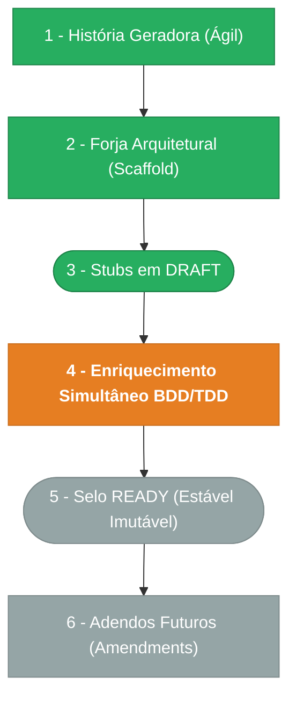

> ⚠️ **ARQUIVO GERIDO POR AUTOMAÇÃO.**
> - **Status DRAFT:** Enriqueça o conteúdo deste arquivo diretamente.
> - **Status READY:** NÃO EDITE DIRETAMENTE. Use a skill `create-amendment`.

# CHANGELOG - MOD-000

## Ciclo de Estabilidade do Módulo

> 🟢 Verde = Concluído | 🟠 Laranja = Em Andamento | 🔵 Azul = Estável Ancestral | ⬜ Cinza = Previsto

*O módulo está na **Etapa 4** — desenvolvimento DRAFT em ritmo acelerado.*

---

## Histórico de Versões

| Versão | Data | Responsável | Descrição |
|--------|------|-------------|-----------|
| 0.10.0 | 2026-03-19 | manage-pendentes | Amendment DOC-FND-000-M02: 7º scope process:case:reopen registrado no catálogo canônico §2.2. Ref: PEN-006 PENDENTE-001. Total: 7 scopes process:case:*. |
| 0.9.0 | 2026-03-19 | manage-pendentes | Amendment DOC-FND-000-M01: 6 scopes process:case:* registrados no catálogo canônico §2.2 (MOD-006). Ref: PEN-006 PENDENTE-004. |
| 0.8.2 | 2026-03-18 | usuário | DATA-000 §7: nota chave amigável tenant_users — concatenação userId+tenantCode em runtime (PENDENTE-003 opção A). |
| 0.8.1 | 2026-03-18 | usuário | Amendment DOC-PADRAO-005-C01: limites de anexos configuráveis por entity_type no catálogo §10 (PENDENTE-004 opção C). Nova constraint CON-005, Gate STR-6. |
| 0.8.0 | 2026-03-18 | AGN-DEV-06 | SEC-000 enriquecido: refresh token rotation (PENDENTE-002), SSO identity linking (ADR-004). Evento auth.token_reuse_detected adicionado em DATA-003/SEC-002. Total: 36 events. |
| 0.7.0 | 2026-03-18 | AGN-DEV-09 | ADR-004 criado (Identity Linking SSO via senha nativa). FR-016 atualizado com fluxo completo (PENDENTE-001 opção B). Evento auth.sso_linked adicionado. |
| 0.6.0 | 2026-03-18 | usuário | Fix AVS-1→7 validate-all: scopes 3-seg em Gherkin BR-000, event names FR-009/FR-014 alinhados com DATA-003, 3 eventos scope.* adicionados (FR-010→DATA-003/SEC-002), contagens corrigidas (34 events), data_ultima_revisao sincronizada. |
| 0.5.0 | 2026-03-18 | usuário | Fix BLQ-1/2/3 validate-all: SEC-000 L64 audit:sensitive→3-seg, BR-014 401→400 (consistência FR-005), DATA-003 origin_command esclarecido como não-scope. |
| 0.4.0 | 2026-03-18 | usuário | Correção scopes 2-seg → 3-seg em SEC-000, SEC-002, DATA-000 (PENDENTE-006). Alinhamento com DOC-FND-000 v1.2.0 §2.1. |
| 0.3.0 | 2026-03-18 | usuário | FR-006: adição endpoint `users_invite_resend` (POST /api/v1/users/:id/invite/resend) — resolve PENDENTE-001 do PEN-002 (MOD-002). |
| 0.2.1 | 2026-03-17 | AGN-DEV-01 | Re-validação MOD/Escala — CHANGELOG sincronizado com mod.md, consistência de índice verificada. |
| 0.2.0 | 2026-03-17 | AGN-DEV-01 | Enriquecimento MOD/Escala — fix contagem eventos, atualização metadata, PEN-000 indexado. |
| 0.1.0 | 2026-03-15 | arquitetura | Baseline Inicial — scaffold gerado via `forge-module` a partir de US-MOD-000 (READY). Stubs obrigatórios criados: DATA-003, SEC-002. Todos os itens nascem em `estado_item: DRAFT`. |
