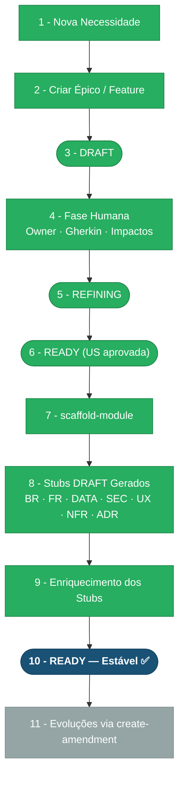

> ⚠️ **ARQUIVO GERIDO POR AUTOMAÇÃO. NÃO EDITE DIRETAMENTE.** Use a skill pertinente para versionar alterações.
>
> | Versão | Data       | Responsável | Status/Integração |
> |--------|------------|-------------|-------------------|
> | 0.2.0  | 2026-03-08 | arquitetura | Enriquecimento pós-aprovação do épico US-MOD-000 (scaffold-module) |
> | 0.1.0  | 2026-03-08 | arquitetura | Baseline Inicial (scaffold-module) |

# CHANGELOG - MOD-000 Foundation

## Estágio Atual: **10 — READY (Estável)** ✅

Todos os stubs de requirements foram enriquecidos e promovidos para `READY`. O módulo está estabilizado. Toda evolução futura deve ocorrer **exclusivamente via `create-amendment`**.

## Pipeline de Ciclo de Vida

> 🟢 Verde = Concluído | ⬜ Cinza = Pendente

## Histórico de Versões

| Versão | Data       | Responsável | Descrição                                                          |
|--------|------------|-------------|--------------------------------------------------------------------|
| 0.2.0  | 2026-03-08 | arquitetura | Enriquecimento dos stubs (BR, FR, DATA, INT, SEC, UX, NFR, ADR) → todos promovidos para READY |
| 0.1.0  | 2026-03-08 | arquitetura | Baseline Inicial (scaffold-module) a partir de US-MOD-000         |
