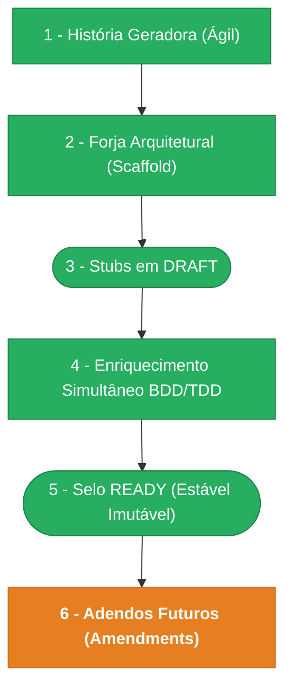

> ⚠️ **ARQUIVO GERIDO POR AUTOMAÇÃO.**
>
> - **Status DRAFT:** Enriqueça o conteúdo deste arquivo diretamente.
> - **Status READY:** NÃO EDITE DIRETAMENTE. Use a skill `create-amendment`.

# CHANGELOG - MOD-000

## Ciclo de Estabilidade do Módulo

> 🟢 Verde = Concluído | 🟠 Laranja = Em Andamento | 🔵 Azul = Estável Ancestral | ⬜ Cinza = Previsto

*O módulo está na **Etapa 5** — Selo READY (Estável Imutável). Alterações futuras via `create-amendment`.*

---

## Histórico de Versões

| Versão | Data | Responsável | Descrição |
|--------|------|-------------|-----------|
| 1.17.3 | 2026-03-30 | codegen | Codegen FR-000-C08: 1 agente (AGN-COD-APP), 2 arquivos modificados + 1 atualizado. RefreshTokenUseCase re-busca scopes/tenantId do banco, DI wiring atualizado, 11 testes passando. |
| 1.17.2 | 2026-03-30 | merge-amendment | Merge FR-000-C08: re-resolução de scopes e tenantId no FR-003 Done Funcional + 4 cenários Gherkin. Base FR-000 bumped para v0.10.1. Ref: spec-refresh-token-scopes-fix. |
| 1.17.1 | 2026-03-30 | create-amendment | Amendment FR-000-C08: RefreshTokenUseCase gera JWT sem scopes/tenantId — refresh token não contém esses campos e use case copiava do payload vazio. Fix: re-buscar scopes (via RoleRepo + cache 300s) e tenantId (via TenantUserRepo) do banco a cada refresh. Resolve 403 "Permissão insuficiente" após ~15min. Ref: spec-refresh-token-scopes-fix. |
| 1.17.0 | 2026-03-30 | merge-amendment | Merge batch: FR-000-M03 (novo FR-023 Smart Session Keep-Alive + anotação consumo automático FR-003, FR-000 v0.10.0), UX-000-M03 (nova jornada UX-010 Sessão Mantida por Atividade, UX-000 v0.6.0). Ambos selados MERGED. Ref: spec-smart-session-keepalive. |
| 1.16.0 | 2026-03-30 | create-amendment | Amendment UX-000-M03: nova jornada UX-010 (Sessão Mantida por Atividade). Documenta experiência keep-alive transparente, cenários de retorno pós-inatividade e relação com UX-000-C01. Ref: spec-smart-session-keepalive, FR-000-M03. |
| 1.15.0 | 2026-03-30 | create-amendment | Amendment FR-000-M03: novo FR-020 (Smart Session Keep-Alive) — refresh proativo por atividade, interceptor 401 com retry/mutex, idle timeout 30min configurável. 2 novos hooks (useActivityTracker, useSessionKeepAlive) + modificação dos 2 HTTP clients. Zero alterações backend. Ref: spec-smart-session-keepalive. |
| 1.14.0 | 2026-03-30 | merge-amendment | Merge batch: FR-000-M02 (2 novos endpoints Users API — reset-password + cancel-invite, FR-000 v0.9.8), INT-000-M03 (OpenAPI paths/schemas para os 2 endpoints, INT-000 v0.5.0), DATA-003-M01 (2 domain events user.password_reset + user.invite_cancelled, DATA-003 v0.9.0). Todos selados MERGED. |
| 1.13.0 | 2026-03-30 | cascade-amendment | Cascade de FR-000-M02: 2 amendments derivados criados — INT-000-M03 (OpenAPI paths/schemas para 2 novos endpoints), DATA-003-M01 (2 domain events: user.password_reset, user.invite_cancelled). SEC-000 confirmado INFORMACIONAL (scopes já existem). |
| 1.12.0 | 2026-03-30 | create-amendment | FR-000-M02: 2 novos endpoints Users API — POST /users/:id/reset-password + DELETE /users/:id/invite. Ref: spec-mod002-next-steps.md, UX-001-C03. |
| 1.11.1 | 2026-03-29 | merge-amendment | Merge UX-000-M02: nova jornada UX-009 (Dashboard Executivo) em UX-000. MetricCards, DonutChart, ActivityList. Base UX-000 bumped para v0.5.0. Ref: 02-dashboard-spec, PEN-02-Dashboard. |
| 1.11.0 | 2026-03-29 | create-amendment | Amendment UX-000-M02: Dashboard executivo com MetricCards (4), DonutChart (status), ActivityList (recentes). Substitui WelcomeWidget+ModuleShortcuts. Ref: 02-dashboard-spec, Penpot 02-Dashboard. |
| 1.10.1 | 2026-03-29 | merge-amendment | Merge UX-000-M01: design visual 06-UserForm aplicado em UX-004. Base UX-000 bumped para v0.4.0. Jornada passo 3/4 reescrita com FormCard, tokens visuais e tipografia. |
| 1.10.0 | 2026-03-29 | create-amendment | Amendment UX-000-M01: design visual definitivo 06-UserForm aplicado em UX-004. FormCard 680px, campos Nome/Email/Perfil/Empresa, modo edição com toggle status + resetar senha. Ref: 06-user-form-spec, PEN-06-UserForm. |
| 1.9.1 | 2026-03-28 | merge-amendment | Merge UX-000-C02: referência visual spec v3 + Penpot PEN-01 adicionada em UX-001 (layout, cores, componentes SSO/PasswordStrength, branding gradiente). Base UX-000 bumped para v0.3.2. |
| 1.9.0 | 2026-03-28 | create-amendment | Amendment UX-000-C02: LoginPage.tsx diverge da spec v3 / Penpot validado (PEN-01). Delta completo: gradiente branding 604px, SSO Microsoft + divider "OU CONTINUE COM", "Primeiro acesso?", PasswordStrength bars, labels UPPER, cores #2E86C1/#F58C32, fundo #F5F5F3, card border, opacidades branding. Ref: 01-login-spec-v3, PEN-01. |
| 1.8.2 | 2026-03-25 | merge-amendment | Merge FR-000-C07: 5 use cases pós-auth propagam request.session.tenantId em domain events (change-password, logout, update-profile, create-role, update-role). Base FR-000 bumped para v0.9.7. Ref: spec-fix-domain-events-tenant-id v2.0. |
| 1.8.1 | 2026-03-25 | merge-amendment | Merge batch MOD-000: DATA-000-C02 (SYSTEM_TENANT_ID §8), FR-000-C02 (/auth/me shape), FR-000-C03 (entry point rewrite), FR-000-C05 (JWT tenant/scopes), FR-000-C06 (forceLogout redirect loop), UX-000-C01 (tabela erros 401). Todos MERGED. |
| 1.8.0 | 2026-03-25 | create-amendment | Amendment UX-000-C01: tabela de erros UX-000 detalhada para 401 (limpeza tokens + full reload). Nova jornada "Sessão Expirada por Timeout" em UX-001. Ref: spec-fix-session-timeout-redirect-loop. |
| 1.7.10 | 2026-03-25 | create-amendment | Amendment FR-000-C06: sessão expirada causa redirect loop no frontend — AppShell não limpa localStorage antes de navegar para /login. Solução: nova utility `forceLogout` (limpa tokens + cache + full reload), toast com id fixo, retry desabilitado em 401. Ref: spec-fix-session-timeout-redirect-loop. |
| 1.7.8 | 2026-03-25 | merge-amendment | Merge INT-000-M02: nova seção INT-007 Cache RBAC — Convenções Redis (ioredis singleton, key `mod-000:rbac:user:{uuid}`, TTL 300s, db0, health check). INT-000 bumped para v0.4.0. Derivado de DOC-PADRAO-002-M01. |
| 1.7.7 | 2026-03-25 | create-amendment | Amendment FR-000-C05: LoginUseCase resolve tenant/scopes antes de gerar JWT. Novas deps: TenantUserRepository + RoleRepository. JWT agora contém `tid` e `scopes`. Ref: spec-fix-auth-flow-session-expired Fase 2. |
| 1.7.6 | 2026-03-25 | merge-amendment | Merge INT-000-C01: nova INT-005 Auth Refresh API — schema `RefreshResponse` sem `user`. OpenAPI v1.yaml atualizado. Base INT-000 bumped para v0.3.1. Derivado de FR-000-C04. |
| 1.7.5 | 2026-03-25 | merge-amendment | Merge FR-000-C04: FR-001 anotação snake_case, FR-003 contrato refresh explicitado sem `user` (schema `refreshResponse` separado). Base FR-000 bumped para v0.9.2. |
| 1.7.4 | 2026-03-25 | cascade-amendment | Cascade de FR-000-C04: 1 amendment derivado criado — INT-000-C01 (OpenAPI v1.yaml: trocar LoginResponse por RefreshResponse no endpoint /auth/refresh). |
| 1.7.3 | 2026-03-25 | create-amendment | Amendment FR-000-C04: mapeamento camelCase→snake_case nas rotas de auth (FR-001 login, FR-003 refresh, FR-004 /me). DEF-001: `reply.send(result)` enviava camelCase, serializerCompiler rejeitava. DEF-002: rota /refresh referenciava `result.user` inexistente no RefreshTokenOutput — criação de `refreshResponse` separado. Ref: spec-fix-auth-route-response-mapping. |
| 1.7.2 | 2026-03-25 | create-amendment | Amendment DATA-000-C02: tenant_id vazio (`''`) em domain_events causa crash no INSERT durante login e todos os 13 use-cases MOD-000. Correção: SYSTEM_TENANT_ID fallback + null coercion em campos opcionais. Ref: spec-fix-domain-events-tenant-id. |
| 1.7.1 | 2026-03-25 | create-amendment | Amendment FR-000-C02: rota GET /auth/me ausente no entrypoint index.ts + divergência de shape backend/frontend (full_name→name, active_tenant_id→tenant:{id,name}). Dashboard, sidebar e header completamente quebrados. |
| 1.7.0 | 2026-03-25 | merge-amendment | Merge FR-000-C01 + DOC-FND-000-M01..M04: seed-admin.ts corrigido (25→63 scopes, alinhado com DOC-FND-000 §2.2). Selos retroativos: M01 (6 scopes case:*), M02 (reopen), M03 (7 approval:*), M04 (6 mcp:*). Sidebar e RBAC agora funcionais para todos os módulos. |
| 1.6.0 | 2026-03-25 | cascade-amendment | Cascade de FR-000-M01: 3 amendments derivados criados — DATA-000-M01 (coluna invite_token_created_at), INT-000-M01 (schemas OpenAPI Users API), SEC-000-M01 (regra anti-escalação role_id). Desbloqueia codegen MOD-002. |
| 1.5.0 | 2026-03-25 | arquitetura | Migração: 8 normative amendments movidos de amendments/normativos/ para docs/01_normativos/amendments/{DOC-ID}/. Normativos são transversais e não pertencem a módulos. |
| 1.4.3 | 2026-03-25 | merge-amendment | Merge DOC-UX-011-M01: nova §8 (Coming Soon Pattern) + CA-09 no DOC-UX-011 v1.3.0. |
| 1.4.2 | 2026-03-25 | merge-amendment | Merge DOC-PADRAO-001-C01: §4.4 Seed Inicial agora referencia catálogo canônico (DOC-FND-000 §2.2). Base DOC-PADRAO-001 bumped para v1.1.1. |
| 1.4.1 | 2026-03-25 | create-amendment | Amendment FR-000-C01: correção scopes do seed — `tenants:tenant:*` → `tenants:branch:*`, adicionados `system:audit:read/sensitive`, `users:user:import/export/comment`, `storage:file:upload/read`. Alinhamento com catálogo canônico DOC-FND-000 §2.2. Sem correção, sidebar não mostra Filiais nem Auditoria. |
| 1.4.0 | 2026-03-25 | create-amendment | 5 amendments M02 (lições deploy): DOC-UX-011-M02 (rota index, CA-07/CA-08), DOC-UX-012-M02 (auth context §5.3, CA-06), DOC-PADRAO-001-M01 (Docker multi-stage §4.2-4.4), DOC-GNP-00-M01 (artefatos obrigatórios §2.1), DOC-PADRAO-004-M01 (hostnames Docker §3.12). Todos status_implementacao: MERGED. |
| 1.3.0 | 2026-03-25 | create-amendment | Amendment DOC-UX-011-M01: novo pattern "Coming Soon" para rotas de módulos pendentes — componente ComingSoonPage shared + CA-09 (toda rota do sidebar DEVE ter route file). |
| 1.2.1 | 2026-03-25 | create-amendment | Amendment DOC-PADRAO-001-C01: §4.4 Seed Inicial deve referenciar catálogo canônico de scopes (DOC-FND-000 §2.2) — vinculação explícita para evitar seed desatualizado em deploys. |
| 1.2.0 | 2026-03-24 | create-amendment | Amendment FR-000-M01: DTO gaps Users API (F05) — adiciona role_id/role_name em UserListItem, invite_token_expired em UserDetail, mode/role_id em CreateUserRequest. Motivação: MOD-002 (Gestão de Usuários frontend) usa defaults hardcoded como workaround. |
| 1.1.0 | 2026-03-24 | validate-all | Validação Fase 3 aprovada — pronto para merge. QA: PASS. Manifests: 5/5. OpenAPI: PASS. Drizzle: PASS. Endpoints: PASS. 0 bloqueadores, 2 avisos (operationId MFA/sessions). |
| 1.0.0 | 2026-03-23 | promote-module | Promoção DRAFT→READY: manifesto v1.0.0, 9 requisitos (BR/FR/DATA/DATA-003/SEC/SEC-002/INT/UX/NFR), 4 ADRs selados. Épico + 17 features já READY. Ciclo de estabilidade avança para Etapa 5. |
| 0.10.0 | 2026-03-19 | manage-pendentes | Amendment DOC-FND-000-M02: 7º scope process:case:reopen registrado no catálogo canônico §2.2. Ref: PEN-006 PENDENTE-001. Total: 7 scopes process:case:*. |
| 0.9.0 | 2026-03-19 | manage-pendentes | Amendment DOC-FND-000-M01: 6 scopes process:case:* registrados no catálogo canônico §2.2 (MOD-006). Ref: PEN-006 PENDENTE-004. |
| 0.8.2 | 2026-03-18 | usuário | DATA-000 §7: nota chave amigável tenant_users — concatenação userId+tenantCode em runtime (PENDENTE-003 opção A). |
| 0.8.1 | 2026-03-18 | usuário | Amendment DOC-PADRAO-005-C01: limites de anexos configuráveis por entity_type no catálogo §10 (PENDENTE-004 opção C). Nova constraint CON-005, Gate STR-6. |
| 0.8.0 | 2026-03-18 | AGN-DEV-06 | SEC-000 enriquecido: refresh token rotation (PENDENTE-002), SSO identity linking (ADR-004). Evento auth.token_reuse_detected adicionado em DATA-003/SEC-002. Total: 36 events. |
| 0.7.0 | 2026-03-18 | AGN-DEV-09 | ADR-004 criado (Identity Linking SSO via senha nativa). FR-016 atualizado com fluxo completo (PENDENTE-001 opção B). Evento auth.sso_linked adicionado. |
| 0.6.0 | 2026-03-18 | usuário | Fix AVS-1→7 validate-all: scopes 3-seg em Gherkin BR-000, event names FR-009/FR-014 alinhados com DATA-003, 3 eventos scope.* adicionados (FR-010→DATA-003/SEC-002), contagens corrigidas (34 events), data_ultima_revisao sincronizada. |
| 0.5.0 | 2026-03-18 | usuário | Fix BLQ-1/2/3 validate-all: SEC-000 L64 audit:sensitive→3-seg, BR-014 401→400 (consistência FR-005), DATA-003 origin_command esclarecido como não-scope. |
| 0.4.0 | 2026-03-18 | usuário | Correção scopes 2-seg → 3-seg em SEC-000, SEC-002, DATA-000 (PENDENTE-006). Alinhamento com DOC-FND-000 v1.2.0 §2.1. |
| 0.3.0 | 2026-03-18 | usuário | FR-006: adição endpoint `users_invite_resend` (POST /api/v1/users/:id/invite/resend) — resolve PENDENTE-001 do PEN-002 (MOD-002). |
| 0.2.1 | 2026-03-17 | AGN-DEV-01 | Re-validação MOD/Escala — CHANGELOG sincronizado com mod.md, consistência de índice verificada. |
| 0.2.0 | 2026-03-17 | AGN-DEV-01 | Enriquecimento MOD/Escala — fix contagem eventos, atualização metadata, PEN-000 indexado. |
| 0.1.0 | 2026-03-15 | arquitetura | Baseline Inicial — scaffold gerado via `forge-module` a partir de US-MOD-000 (READY). Stubs obrigatórios criados: DATA-003, SEC-002. Todos os itens nascem em `estado_item: DRAFT`. |
