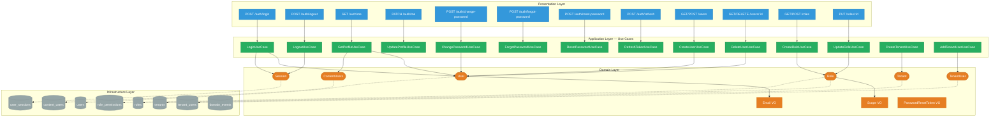

# MOD-000 — Arquitetura de Camadas

```mermaid
graph TD
    subgraph PRESENTATION ["Presentation Layer"]
        R1["POST /auth/login"]
        R2["POST /auth/logout"]
        R3["GET /auth/me"]
        R4["PATCH /auth/me"]
        R5["POST /auth/change-password"]
        R6["POST /auth/forgot-password"]
        R7["POST /auth/reset-password"]
        R8["POST /auth/refresh"]
        R9["GET/POST /users"]
        R10["GET/DELETE /users/:id"]
        R11["GET/POST /roles"]
        R12["PUT /roles/:id"]
    end

    subgraph APPLICATION ["Application Layer — Use Cases"]
        UC1["LoginUseCase"]
        UC2["LogoutUseCase"]
        UC3["GetProfileUseCase"]
        UC4["UpdateProfileUseCase"]
        UC5["ChangePasswordUseCase"]
        UC6["ForgotPasswordUseCase"]
        UC7["ResetPasswordUseCase"]
        UC8["RefreshTokenUseCase"]
        UC9["CreateUserUseCase"]
        UC10["DeleteUserUseCase"]
        UC11["CreateRoleUseCase"]
        UC12["UpdateRoleUseCase"]
        UC13["CreateTenantUseCase"]
        UC14["AddTenantUserUseCase"]
    end

    subgraph DOMAIN ["Domain Layer"]
        E1(["User"])
        E2(["Role"])
        E3(["Session"])
        E4(["Tenant"])
        E5(["TenantUser"])
        E6(["ContentUsers"])
        VO1["Email VO"]
        VO2["Scope VO"]
        VO3["PasswordResetToken VO"]
    end

    subgraph INFRA ["Infrastructure Layer"]
        DB1[("users")]
        DB2[("content_users")]
        DB3[("user_sessions")]
        DB4[("tenants")]
        DB5[("roles")]
        DB6[("role_permissions")]
        DB7[("tenant_users")]
        DB8[("domain_events")]
    end

    R1 --> UC1
    R2 --> UC2
    R3 --> UC3
    R4 --> UC4
    R5 --> UC5
    R6 --> UC6
    R7 --> UC7
    R8 --> UC8
    R9 --> UC9
    R10 --> UC10
    R11 --> UC11
    R12 --> UC12

    UC1 --> E1
    UC1 --> E3
    UC2 --> E3
    UC3 --> E1
    UC3 --> E6
    UC5 --> E1
    UC9 --> E1
    UC10 --> E1
    UC11 --> E2
    UC12 --> E2
    UC13 --> E4
    UC14 --> E5

    E1 --> VO1
    E2 --> VO2

    E1 -.-> DB1
    E6 -.-> DB2
    E3 -.-> DB3
    E4 -.-> DB4
    E2 -.-> DB5
    E2 -.-> DB6
    E5 -.-> DB7

    classDef presentation fill:#3498DB,stroke:#2980B9,color:#fff
    classDef application fill:#27AE60,stroke:#1E8449,color:#fff
    classDef domain fill:#E67E22,stroke:#CA6F1E,color:#fff
    classDef infra fill:#95A5A6,stroke:#7F8C8D,color:#fff

    class R1,R2,R3,R4,R5,R6,R7,R8,R9,R10,R11,R12 presentation
    class UC1,UC2,UC3,UC4,UC5,UC6,UC7,UC8,UC9,UC10,UC11,UC12,UC13,UC14 application
    class E1,E2,E3,E4,E5,E6,VO1,VO2,VO3 domain
    class DB1,DB2,DB3,DB4,DB5,DB6,DB7,DB8 infra
```
