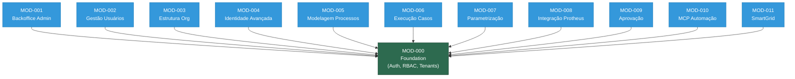

# MOD-000 — Contexto de Dependências

```mermaid
graph TD
    MOD000["MOD-000<br/>Foundation<br/>(Auth, RBAC, Tenants)"]

    MOD001["MOD-001<br/>Backoffice Admin"]
    MOD002["MOD-002<br/>Gestão Usuários"]
    MOD003["MOD-003<br/>Estrutura Org"]
    MOD004["MOD-004<br/>Identidade Avançada"]
    MOD005["MOD-005<br/>Modelagem Processos"]
    MOD006["MOD-006<br/>Execução Casos"]
    MOD007["MOD-007<br/>Parametrização"]
    MOD008["MOD-008<br/>Integração Protheus"]
    MOD009["MOD-009<br/>Aprovação"]
    MOD010["MOD-010<br/>MCP Automação"]
    MOD011["MOD-011<br/>SmartGrid"]

    MOD001 --> MOD000
    MOD002 --> MOD000
    MOD003 --> MOD000
    MOD004 --> MOD000
    MOD005 --> MOD000
    MOD006 --> MOD000
    MOD007 --> MOD000
    MOD008 --> MOD000
    MOD009 --> MOD000
    MOD010 --> MOD000
    MOD011 --> MOD000

    classDef foundation fill:#2d6a4f,stroke:#1b4332,color:#fff
    classDef dependents fill:#3498DB,stroke:#2980B9,color:#fff

    class MOD000 foundation
    class MOD001,MOD002,MOD003,MOD004,MOD005,MOD006,MOD007,MOD008,MOD009,MOD010,MOD011 dependents
```

> MOD-000 é a base de todos os 12 módulos. Fornece: Auth, RBAC (Scopes), Sessions, Tenants, Users, Domain Events, Idempotency.
