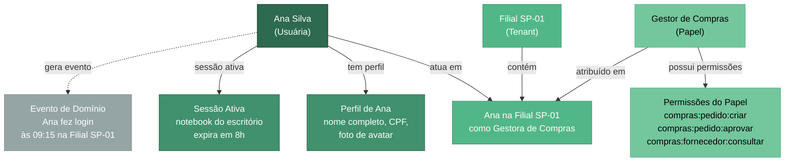
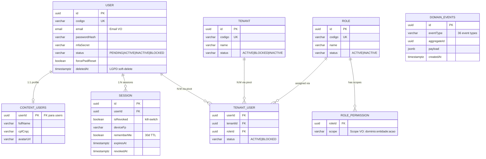

# MOD-000 — Modelo de Domínio

## Modelo RBAC & Multi-tenancy

```mermaid
graph TD
    U["Ana Silva<br/>(Usuária)"]
    CU["Perfil de Ana<br/>nome completo, CPF,<br/>foto de avatar"]
    S["Sessão Ativa<br/>notebook do escritório<br/>expira em 8h"]
    TU["Ana na Filial SP-01<br/>como Gestora de Compras"]
    T["Filial SP-01<br/>(Tenant)"]
    R["Gestor de Compras<br/>(Papel)"]
    RP["Permissões do Papel<br/>compras:pedido:criar<br/>compras:pedido:aprovar<br/>compras:fornecedor:consultar"]
    DE["Evento de Domínio<br/>Ana fez login<br/>às 09:15 na Filial SP-01"]

    U -->|"tem perfil"| CU
    U -->|"sessão ativa"| S
    U -->|"atua em"| TU
    T -->|"contém"| TU
    R -->|"atribuído em"| TU
    R -->|"possui permissões"| RP
    U -.->|"gera evento"| DE

    classDef user fill:#2d6a4f,stroke:#1b4332,color:#fff
    classDef auth fill:#40916c,stroke:#2d6a4f,color:#fff
    classDef tenant fill:#52b788,stroke:#40916c,color:#fff
    classDef role fill:#74c69d,stroke:#52b788,color:#000
    classDef events fill:#95A5A6,stroke:#7F8C8D,color:#fff

    class U user
    class CU,S auth
    class T,TU tenant
    class R,RP role
    class DE events
```

## Entidades e Relacionamentos

```mermaid
erDiagram
    USER ||--o| CONTENT_USERS : "1:1 profile"
    USER ||--o{ SESSION : "1:N sessions"
    USER ||--o{ TENANT_USER : "N:M via pivot"
    TENANT ||--o{ TENANT_USER : "N:M via pivot"
    ROLE ||--o{ TENANT_USER : "assigned via"
    ROLE ||--o{ ROLE_PERMISSION : "has scopes"

    USER {
        uuid id PK
        varchar codigo UK
        email email "Email VO"
        varchar passwordHash
        varchar mfaSecret
        varchar status "PENDING|ACTIVE|INACTIVE|BLOCKED"
        boolean forcePwdReset
        timestamptz deletedAt "LGPD soft-delete"
    }

    CONTENT_USERS {
        uuid userId PK "FK para users"
        varchar fullName
        varchar cpfCnpj
        varchar avatarUrl
    }

    SESSION {
        uuid id PK
        uuid userId FK
        boolean isRevoked "kill-switch"
        varchar deviceFp
        boolean rememberMe "30d TTL"
        timestamptz expiresAt
        timestamptz revokedAt
    }

    TENANT {
        uuid id PK
        varchar codigo UK
        varchar name
        varchar status "ACTIVE|BLOCKED|INACTIVE"
    }

    ROLE {
        uuid id PK
        varchar codigo UK
        varchar name
        varchar status "ACTIVE|INACTIVE"
    }

    ROLE_PERMISSION {
        uuid roleId FK
        varchar scope "Scope VO: dominio:entidade:acao"
    }

    TENANT_USER {
        uuid userId FK
        uuid tenantId FK
        uuid roleId FK
        varchar status "ACTIVE|BLOCKED"
    }

    DOMAIN_EVENTS {
        uuid id PK
        varchar eventType "36 event types"
        uuid aggregateId
        jsonb payload
        timestamptz createdAt
    }
```
