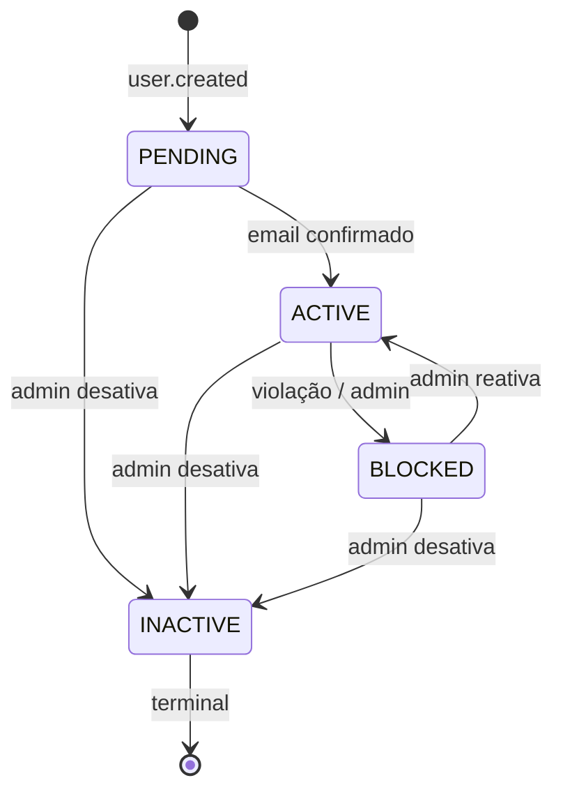
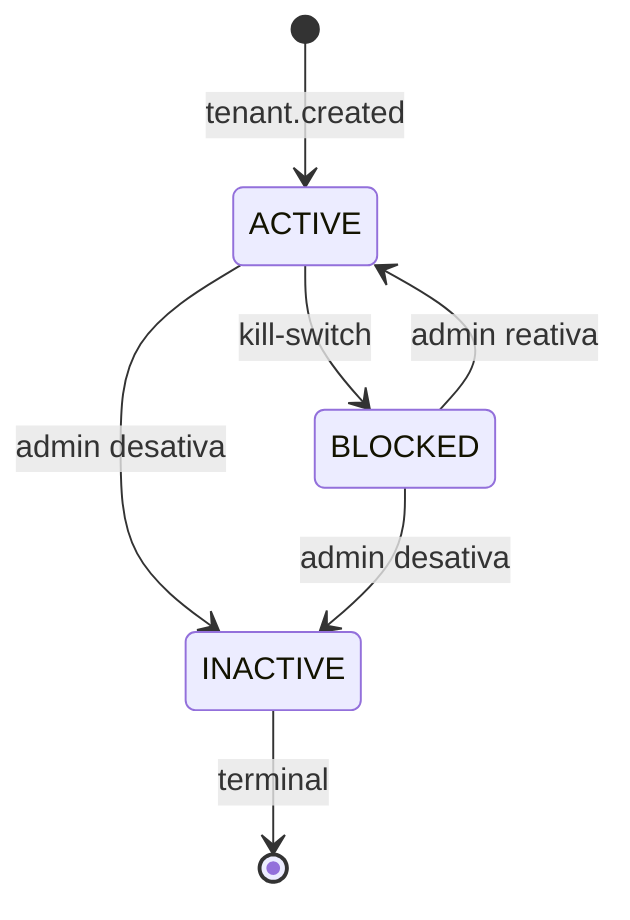
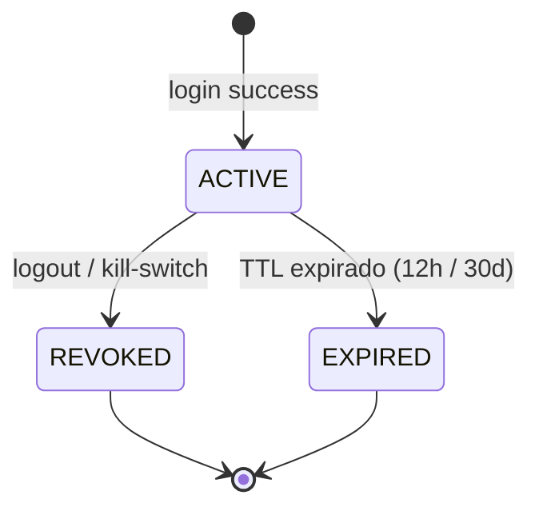

# MOD-000 — Máquinas de Estado

## User Status

```mermaid
stateDiagram-v2
    [*] --> PENDING : user.created
    PENDING --> ACTIVE : email confirmado
    PENDING --> INACTIVE : admin desativa
    ACTIVE --> BLOCKED : violação / admin
    ACTIVE --> INACTIVE : admin desativa
    BLOCKED --> ACTIVE : admin reativa
    BLOCKED --> INACTIVE : admin desativa
    INACTIVE --> [*] : terminal
```

## Tenant Status

```mermaid
stateDiagram-v2
    [*] --> ACTIVE : tenant.created
    ACTIVE --> BLOCKED : kill-switch
    ACTIVE --> INACTIVE : admin desativa
    BLOCKED --> ACTIVE : admin reativa
    BLOCKED --> INACTIVE : admin desativa
    INACTIVE --> [*] : terminal
```

## Session Lifecycle

```mermaid
stateDiagram-v2
    [*] --> ACTIVE : login success
    ACTIVE --> REVOKED : logout / kill-switch
    ACTIVE --> EXPIRED : TTL expirado (12h / 30d)
    REVOKED --> [*]
    EXPIRED --> [*]
```
