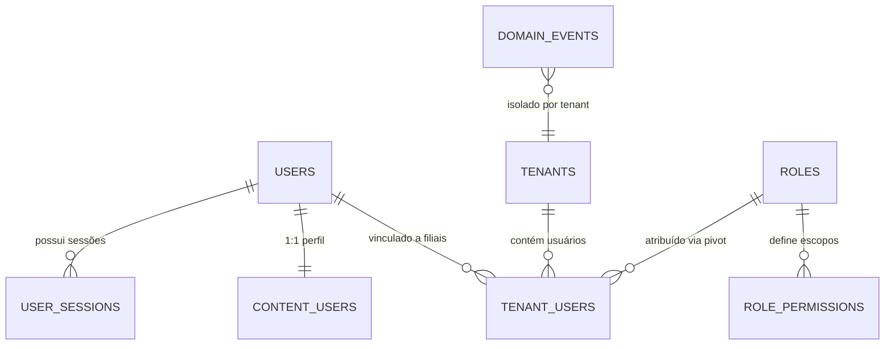

> ⚠️ **ARQUIVO GERIDO POR AUTOMAÇÃO.**
> - **Status DRAFT:** Enriqueça o conteúdo deste arquivo diretamente.
> - **Status READY:** NÃO EDITE DIRETAMENTE. Use a skill `create-amendment`.
>
> | Versão | Data       | Responsável | Status/Integração |
> |--------|------------|-------------|-------------------|
> | 0.1.0  | 2026-03-15 | arquitetura | Baseline Inicial (forge-module) |
> | 0.2.0  | 2026-03-15 | AGN-DEV-04  | Enriquecimento DATA (enrich-agent) |
> | 0.5.0  | 2026-03-18 | usuário     | Nota chave amigável tenant_users: concatenação userId+tenantCode em runtime (PENDENTE-003 opção A) |
| 0.4.0  | 2026-03-18 | usuário     | Correção CHECK regex role_permissions 2-seg → 3-seg (PENDENTE-006, DOC-FND-000 §2.1) |
| 0.3.0  | 2026-03-17 | AGN-DEV-04  | Revisão metadata (data_ultima_revisao) |

# DATA-000 — Modelo de Dados do Foundation

> Permitir gerar **modelo**, **migração**, **queries** e **contratos** sem inferência arriscada.

- **Objetivo:** Definir todas as entidades, campos, constraints e relacionamentos do módulo Foundation (auth, users, roles, tenants, sessions, domain_events).
- **Tipo de Tabela/Armazenamento:** Relacional (PostgreSQL)

---

## Campos Obrigatórios Padrão (Timestamps e Soft-Delete)

Toda entidade principal do Foundation DEVE conter:

| Campo | Tipo Negócio | Tipo DB | Nulidade | Observações |
|---|---|---|---|---|
| `id` | UUID | uuid | NOT NULL | PK, gerado automaticamente |
| `codigo` | String | varchar(100) | NOT NULL | UNIQUE, identificador amigável de negócio |
| `status` | Enum | text | NOT NULL | ACTIVE, BLOCKED, INACTIVE |
| `tenant_id` | UUID | uuid | NOT NULL | Row-Level Security (exceto `tenants` e `users` globais) |
| `created_at` | DateTime | timestamptz | NOT NULL | default=now(), UTC |
| `updated_at` | DateTime | timestamptz | NOT NULL | default=now(), UTC |
| `deleted_at` | DateTime | timestamptz | NULL | Soft-Delete (LGPD — BR-004) |

---

## Entidades

### 1. `users` — Identidade de Autenticação

| Campo | Tipo DB | Nulidade | Constraints | Observações |
|---|---|---|---|---|
| `id` | uuid | NOT NULL | PK | |
| `codigo` | varchar(100) | NOT NULL | UNIQUE | ex: `usr-00042` |
| `email` | varchar(255) | NOT NULL | UNIQUE | Login principal |
| `password_hash` | text | NOT NULL | | bcrypt hash |
| `mfa_secret` | text | NULL | | TOTP secret (RFC 6238), se MFA ativo |
| `status` | text | NOT NULL | CHECK(ACTIVE,BLOCKED,PENDING,INACTIVE) | |
| `force_pwd_reset` | boolean | NOT NULL | default=false | Forçar troca na próx. autenticação |
| `created_at` | timestamptz | NOT NULL | default=now() | |
| `updated_at` | timestamptz | NOT NULL | default=now() | |
| `deleted_at` | timestamptz | NULL | | Soft-delete (LGPD) |

**Índices:** `UNIQUE(email)`, `UNIQUE(codigo)`

### 2. `content_users` — Dados de Exibição do Usuário

| Campo | Tipo DB | Nulidade | Constraints | Observações |
|---|---|---|---|---|
| `user_id` | uuid | NOT NULL | PK, FK→users.id ON DELETE RESTRICT | |
| `full_name` | varchar(255) | NOT NULL | | |
| `cpf_cnpj` | varchar(20) | NULL | UNIQUE (quando preenchido) | |
| `avatar_url` | text | NULL | | URL da imagem de perfil |
| `created_at` | timestamptz | NOT NULL | default=now() | |
| `deleted_at` | timestamptz | NULL | | Soft-delete sincronizado com users |

### 3. `user_sessions` — Sessões Ancoradas em Banco

| Campo | Tipo DB | Nulidade | Constraints | Observações |
|---|---|---|---|---|
| `id` | uuid | NOT NULL | PK | sessionId embutido no JWT |
| `user_id` | uuid | NOT NULL | FK→users.id ON DELETE RESTRICT | |
| `is_revoked` | boolean | NOT NULL | default=false | Kill-Switch (BR-002) |
| `device_fp` | text | NULL | | Device fingerprint |
| `remember_me` | boolean | NOT NULL | default=false | TTL estendido (30d) |
| `expires_at` | timestamptz | NOT NULL | | TTL: 12h normal, 30d estendido |
| `created_at` | timestamptz | NOT NULL | default=now() | |
| `revoked_at` | timestamptz | NULL | | Quando sessão foi revogada |

**Índices:** `(user_id, is_revoked)` para query de sessões ativas

### 4. `tenants` — Filiais Multi-Tenant

| Campo | Tipo DB | Nulidade | Constraints | Observações |
|---|---|---|---|---|
| `id` | uuid | NOT NULL | PK | |
| `codigo` | varchar(100) | NOT NULL | UNIQUE | Código de negócio, uppercase (ex: SP01) |
| `name` | varchar(255) | NOT NULL | | Nome da filial |
| `status` | text | NOT NULL | CHECK(ACTIVE,BLOCKED,INACTIVE) | BLOCKED=kill-switch organizacional |
| `created_at` | timestamptz | NOT NULL | default=now() | |
| `updated_at` | timestamptz | NOT NULL | default=now() | |
| `deleted_at` | timestamptz | NULL | | Soft-delete (LGPD) |

### 5. `roles` — Papéis de Acesso

| Campo | Tipo DB | Nulidade | Constraints | Observações |
|---|---|---|---|---|
| `id` | uuid | NOT NULL | PK | |
| `codigo` | varchar(100) | NOT NULL | UNIQUE | ex: `admin`, `operador` |
| `name` | varchar(255) | NOT NULL | | Nome descritivo |
| `description` | text | NULL | | |
| `status` | text | NOT NULL | CHECK(ACTIVE,INACTIVE) | |
| `created_at` | timestamptz | NOT NULL | default=now() | |
| `updated_at` | timestamptz | NOT NULL | default=now() | |
| `deleted_at` | timestamptz | NULL | | Soft-delete |

### 6. `role_permissions` — Escopos por Role

| Campo | Tipo DB | Nulidade | Constraints | Observações |
|---|---|---|---|---|
| `id` | uuid | NOT NULL | PK | |
| `role_id` | uuid | NOT NULL | FK→roles.id ON DELETE RESTRICT | |
| `scope` | varchar(100) | NOT NULL | CHECK(regex ^[a-z][a-z0-9_]*(:[a-z][a-z0-9_]*){1,2}$) | BR-005, DOC-FND-000 §2.1 |

**Índices:** `UNIQUE(role_id, scope)` — sem duplicatas de escopo por role

### 7. `tenant_users` — Vínculo Usuário-Filial com Role

| Campo | Tipo DB | Nulidade | Constraints | Observações |
|---|---|---|---|---|
| `user_id` | uuid | NOT NULL | PK composta, FK→users.id ON DELETE RESTRICT | |
| `tenant_id` | uuid | NOT NULL | PK composta, FK→tenants.id ON DELETE RESTRICT | |
| `role_id` | uuid | NOT NULL | FK→roles.id ON DELETE RESTRICT | Um role por user/tenant |
| `status` | text | NOT NULL | CHECK(ACTIVE,BLOCKED,INACTIVE) | BLOCKED=suspensão local |
| `created_at` | timestamptz | NOT NULL | default=now() | |
| `updated_at` | timestamptz | NOT NULL | default=now() | |
| `deleted_at` | timestamptz | NULL | | Soft-delete (LGPD) |

> **Chave amigável (PENDENTE-003, Opção A):** `tenant_users` **não possui** campo `codigo` próprio. Para referência em APIs externas e importação/exportação, expor a concatenação `{userId}+{tenantCode}` como identificador amigável derivado em runtime. Sem mudança no schema — campo `codigo` poderá ser adicionado no futuro se demanda concreta surgir.

### 8. `domain_events` — Tabela Unificada de Eventos

| Campo | Tipo DB | Nulidade | Constraints | Observações |
|---|---|---|---|---|
| `id` | uuid | NOT NULL | PK | |
| `tenant_id` | uuid | NOT NULL | | Isolamento multi-tenant |
| `entity_type` | text | NOT NULL | | ex: `user`, `session`, `tenant` |
| `entity_id` | text | NOT NULL | | UUID ou composto |
| `event_type` | text | NOT NULL | | ex: `auth.login_success` |
| `payload` | jsonb | NOT NULL | | Snapshot mínimo, sem PII |
| `created_at` | timestamptz | NOT NULL | default=now() | |
| `created_by` | uuid | NULL | | actorId (NULL se anônimo) |
| `correlation_id` | text | NOT NULL | | X-Correlation-ID |
| `causation_id` | text | NULL | | Evento que causou este |
| `sensitivity_level` | smallint | NOT NULL | default=0 | 0-3 (guard-rail) |
| `dedupe_key` | text | NULL | | Para idempotência outbox |

**Índices obrigatórios:**
- `(tenant_id, entity_type, entity_id, created_at DESC)` — timeline
- `(tenant_id, event_type, created_at DESC)` — filtro por tipo
- `UNIQUE(tenant_id, dedupe_key)` WHERE dedupe_key IS NOT NULL — dedupe

---

## Relacionamentos e Constraints (MUST)

- Toda FK DEVE ter `ON DELETE RESTRICT` e NUNCA `CASCADE` (BR-004)
- Situações mutuamente exclusivas DEVEM ter `UNIQUE INDEX` ou `CHECK`
- `tenant_users` PK composta `(user_id, tenant_id)` — um role por user/tenant

### Diagrama ERD (Mermaid) — Entidades núcleo

---

- **estado_item:** DRAFT
- **owner:** arquitetura
- **data_ultima_revisao:** 2026-03-18
- **rastreia_para:** US-MOD-000, US-MOD-000-F01, US-MOD-000-F05, US-MOD-000-F06, US-MOD-000-F07, US-MOD-000-F09, FR-000, BR-000, SEC-000, DOC-FND-000, DOC-ARC-003
- **referencias_exemplos:** DOC-FND-000 §1-§3 (contratos auth/RBAC/events), DOC-ARC-003 §1-§4 (rastreabilidade)
- **evidencias:** Extraído de US-MOD-000-F01, F05, F06, F07, F09
