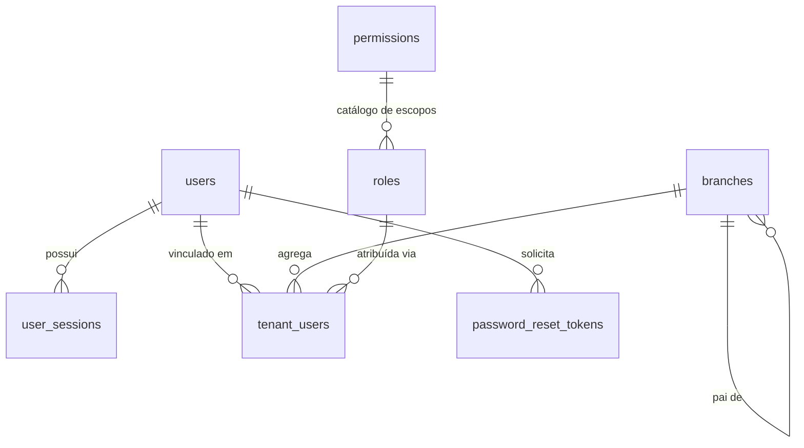

> ⚠️ **ARQUIVO GERIDO POR AUTOMAÇÃO. NÃO EDITE DIRETAMENTE.** Use a skill pertinente para versionar alterações.
>
> | Versão | Data       | Responsável | Status/Integração |
> |--------|------------|-------------|-------------------|
> | 0.2.0  | 2026-03-08 | arquitetura | Enriquecimento pós-aprovação do épico US-MOD-000 (scaffold-module) |
> | 0.1.0  | 2026-03-08 | arquitetura | Baseline Inicial (scaffold-module) |

## DATA-000 — Modelo de Dados (Foundation)

- **Objetivo:** Estabelecer o modelo relacional completo do módulo Foundation: usuários, sessões, filiais/tenants, roles, permissões, vínculos de usuário-filial, tokens de reset e eventos de domínio.
- **Tipo de Tabela/Armazenamento:** Relacional (SQL — PostgreSQL)

---

### Entidade: `users`

| Campo | Tipo | Nullable | Constraint |
|---|---|---|---|
| `id` | uuid | NOT NULL | PK |
| `codigo` | varchar(50) | NOT NULL | UNIQUE |
| `name` | varchar(255) | NOT NULL | — |
| `email` | varchar(255) | NOT NULL | UNIQUE |
| `password_hash` | text | NOT NULL | — |
| `mfa_secret` | text | NULL | encrypted at rest |
| `status` | text (enum) | NOT NULL | `ACTIVE`, `BLOCKED`, `INACTIVE`, `PENDING` |
| `force_pwd_reset` | boolean | NOT NULL | default=false |
| `avatar_url` | text | NULL | — |
| `tenant_id` | uuid | NOT NULL | FK → `branches.id` ON DELETE RESTRICT |
| `created_at` | timestamptz | NOT NULL | default=now() |
| `updated_at` | timestamptz | NOT NULL | default=now() |
| `deleted_at` | timestamptz | NULL | Soft-Delete |

### Entidade: `user_sessions`

| Campo | Tipo | Nullable | Constraint |
|---|---|---|---|
| `id` | uuid | NOT NULL | PK |
| `user_id` | uuid | NOT NULL | FK → `users.id` ON DELETE RESTRICT |
| `device_fp` | text | NULL | device fingerprint |
| `is_revoked` | boolean | NOT NULL | default=false |
| `remember_me` | boolean | NOT NULL | default=false |
| `expires_at` | timestamptz | NOT NULL | — |
| `created_at` | timestamptz | NOT NULL | default=now() |
| `updated_at` | timestamptz | NOT NULL | default=now() |

### Entidade: `branches` (Filiais)

| Campo | Tipo | Nullable | Constraint |
|---|---|---|---|
| `id` | uuid | NOT NULL | PK |
| `codigo` | varchar(50) | NOT NULL | UNIQUE |
| `name` | varchar(255) | NOT NULL | — |
| `parent_id` | uuid | NULL | FK → `branches.id` ON DELETE RESTRICT (hierarquia) |
| `status` | text (enum) | NOT NULL | `ACTIVE`, `BLOCKED`, `INACTIVE` |
| `tenant_id` | uuid | NOT NULL | FK → `branches.id` ON DELETE RESTRICT |
| `created_at` | timestamptz | NOT NULL | default=now() |
| `updated_at` | timestamptz | NOT NULL | default=now() |
| `deleted_at` | timestamptz | NULL | Soft-Delete |

### Entidade: `roles`

| Campo | Tipo | Nullable | Constraint |
|---|---|---|---|
| `id` | uuid | NOT NULL | PK |
| `codigo` | varchar(50) | NOT NULL | UNIQUE |
| `name` | varchar(255) | NOT NULL | — |
| `scopes` | text[] | NOT NULL | Array de escopos (`modulo:recurso:acao`) |
| `tenant_id` | uuid | NOT NULL | FK → `branches.id` ON DELETE RESTRICT |
| `created_at` | timestamptz | NOT NULL | default=now() |
| `updated_at` | timestamptz | NOT NULL | default=now() |
| `deleted_at` | timestamptz | NULL | Soft-Delete |

### Entidade: `permissions` (Catálogo de Escopos)

| Campo | Tipo | Nullable | Constraint |
|---|---|---|---|
| `id` | uuid | NOT NULL | PK |
| `scope` | varchar(255) | NOT NULL | UNIQUE — formato `modulo:recurso:acao` |
| `description` | text | NULL | — |
| `created_at` | timestamptz | NOT NULL | default=now() |

### Entidade: `tenant_users` (Vínculo Usuário–Filial–Role)

| Campo | Tipo | Nullable | Constraint |
|---|---|---|---|
| `id` | uuid | NOT NULL | PK |
| `user_id` | uuid | NOT NULL | FK → `users.id` ON DELETE RESTRICT |
| `branch_id` | uuid | NOT NULL | FK → `branches.id` ON DELETE RESTRICT |
| `role_id` | uuid | NOT NULL | FK → `roles.id` ON DELETE RESTRICT |
| `created_at` | timestamptz | NOT NULL | default=now() |
| `updated_at` | timestamptz | NOT NULL | default=now() |

- **UNIQUE:** `(user_id, branch_id, role_id)`

### Entidade: `password_reset_tokens`

| Campo | Tipo | Nullable | Constraint |
|---|---|---|---|
| `id` | uuid | NOT NULL | PK |
| `user_id` | uuid | NOT NULL | FK → `users.id` ON DELETE RESTRICT |
| `token` | uuid | NOT NULL | UNIQUE |
| `used_at` | timestamptz | NULL | single-use: preenchido após uso |
| `expires_at` | timestamptz | NOT NULL | TTL 1h |
| `created_at` | timestamptz | NOT NULL | default=now() |

---

### Diagrama ERD (Mermaid) — Entidades núcleo

---

### Catálogo de Eventos do Domínio (DATA-003)

| Evento | Origem | Emit | View | Notify |
|---|---|---|---|---|
| `auth.login.success` | F01 | público (login) | próprio usuário + admin | Não |
| `auth.login.failure` | F01 | público (login) | admin | Não |
| `auth.session.created` | F01 | público (login) | próprio usuário + admin | Não |
| `auth.session.revoked` | F01 | `auth:session:revoke` | próprio usuário + admin | Sim → usuário |
| `auth.session.revoked_all` | F01 | `auth:session:revoke` | admin | Sim → usuário |
| `auth.logout.success` | F01 | autenticado | próprio usuário + admin | Não |
| `user.created` | F05 | `users:create` | `canRead(user)` + tenant | Sim → admin |
| `user.updated` | F05/F08 | `users:update` | `canRead(user)` + tenant | Não |
| `user.deleted` | F05 | `users:delete` | auditor/admin | Sim → admin |
| `user.blocked` | F05 | `users:block` | auditor/admin | Sim → usuário |
| `role.created` | F06 | `roles:create` | `canRead(role)` + tenant | Não |
| `role.assigned` | F09 | `roles:assign` | `canRead(user)` + tenant | Sim → usuário afetado |
| `branch.created` | F07 | `branches:create` | `canRead(branch)` + tenant | Não |
| `branch.blocked` | F07 | `branches:block` | auditor/admin | Sim → admin |
| `password.reset.requested` | F04 | público | próprio usuário + admin | Sim → e-mail |
| `password.reset.completed` | F04 | público (token) | próprio usuário + admin | Não |
| `password.changed` | F10 | autenticado | próprio usuário + admin | Não |
| `storage.upload.confirmed` | F16 | `storage:upload` | próprio usuário + admin | Não |

- **estado_item:** READY
- **owner:** arquitetura
- **data_ultima_revisao:** 2026-03-08
- **rastreia_para:** BR-000, FR-000, SEC-000, US-MOD-000, US-MOD-000-F01, US-MOD-000-F05, US-MOD-000-F06, US-MOD-000-F07, US-MOD-000-F09, US-MOD-000-F16
- **referencias_exemplos:** [US-MOD-000](../../../user-stories/epics/US-MOD-000.md)
- **evidencias:** N/A
