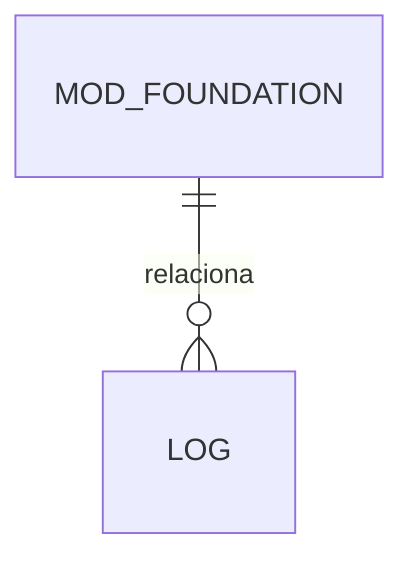

> ⚠️ ARQUIVO GERIDO POR AUTOMAÇÃO. NÃO EDITE DIRETAMENTE.
>
> | Versão | Data       | Responsável | Status/Integração |
> |--------|------------|-------------|-------------------|
> | 0.1.0  | 2026-03-08 | arquitetura | Baseline Inicial (scaffold-module) |

## DATA-000 — Base Entity

- Objetivo: ...
- Tipo de Tabela: Relacional
- Campos Obrigatórios Padrão: `id`, `created_at`, `updated_at`

### Diagrama ERD (Mermaid)

- **estado_item:** DRAFT
- **owner:** arquitetura
- **data_ultima_revisao:** 2026-03-08
- **rastreia_para:** MOD-000
- **referencias_exemplos:** [US-MOD-000](../../../user-stories/epics/US-MOD-000.md)
- **evidencias:** N/A
