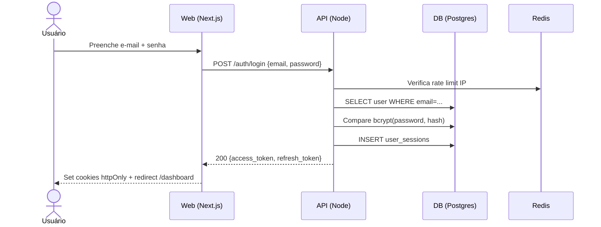

> ⚠️ **ARQUIVO GERIDO POR AUTOMAÇÃO. NÃO EDITE DIRETAMENTE.** Use a skill pertinente para versionar alterações.
>
> | Versão | Data       | Responsável | Status/Integração |
> |--------|------------|-------------|-------------------|
> | 0.2.0  | 2026-03-08 | arquitetura | Enriquecimento pós-aprovação do épico US-MOD-000 (scaffold-module) |
> | 0.1.0  | 2026-03-08 | arquitetura | Baseline Inicial (scaffold-module) |

## UX-000 — UX e Jornadas (Foundation)

O MOD-000 não possui telas próprias de interface — ele provê os **serviços de backend** consumidos pelas telas de outros módulos (ex: MOD-001). Esta seção documenta as jornadas críticas do backend que impactam diretamente a experiência do usuário.

---

### UX-000-01 — Jornada de Autenticação (F01)

- **Happy path:** Usuário preenche e-mail/senha → POST /auth/login → Cria UserSession → JWT em cookies httpOnly → Redirect para dashboard.
- **Alternativas/erros:**
  - Credenciais inválidas → 401 genérico (user enumeration prevention)
  - Conta BLOCKED → 403 com `type=/problems/account-blocked`
  - MFA configurado → `mfa_required: true` + `temp_token` (5min) → Redirect para tela MFA
  - Rate limit excedido → 429 RFC 9457 com `retry_after`
- **Estado de Carregamento (Loading):** Botão "Entrar" em `isLoading` durante POST /auth/login.
- **Tratamento de Erros e Mensagens:**
  - `401`: Toast/inline — "E-mail ou senha inválidos."
  - `403`: Toast warning — "Sua conta está bloqueada. Contate o administrador."
  - `429`: Toast warning — "Muitas tentativas. Tente novamente em {retry_after}s."
  - `5xx`: Toast error genérico com `correlationId`.

---

### UX-000-02 — Jornada de Recuperação de Senha (F04)

- **Happy path:** Usuário clica "Esqueci minha senha" → POST /auth/forgot-password (rate limit 3/15min) → E-mail enviado com link de reset → Usuário clica no link → POST /auth/reset-password com token UUID → Senha redefinida → Redirect para login.
- **Alternativas/erros:**
  - Token expirado (>1h) → 400 com `type=/problems/token-expired`
  - Token já usado → 400 com `type=/problems/token-already-used`
  - Rate limit → 429
- **Loading:** Botão de "Enviar" em `isLoading` durante POST.
- **Tratamento de Erros:**
  - `400/token-expired`: Toast info — "O link expirou. Solicite um novo."
  - `429`: Toast warning com `retry_after`.

---

### UX-000-03 — Jornada de SSO OAuth2 (F03)

- **Happy path:** Usuário clica em "Entrar com Google/Microsoft" → Redirect para provedor → Callback → Criação de sessão local → Redirect para dashboard.
- **Alternativas/erros:**
  - Provedor indisponível → 503 com Toast: "Autenticação via [Google/Microsoft] indisponível no momento."
  - E-mail do provedor não autorizado → 403 com Toast: "Seu domínio não está autorizado."
  - CSRF State inválido → 400 → Redirect para login.

---

### UX-000-04 — Jornada de Upload de Arquivo (F16)

- **Happy path:** Cliente solicita POST /storage/upload-url → Recebe `{ url, key, expires_at }` → Faz PUT diretamente no storage (S3) → Confirma com POST /storage/confirm → 200 com metadados do objeto.
- **Alternativas/erros:**
  - Storage indisponível → 503.
  - Arquivo não encontrado na confirmação → 404 com `type=/problems/upload-not-found`.
- **Acessibilidade:** ARIA `aria-busy=true` durante upload, `progress` acessível.

---

### Diagrama de Sequência — Autenticação Completa

---

- **estado_item:** READY
- **owner:** arquitetura
- **data_ultima_revisao:** 2026-03-08
- **rastreia_para:** FR-000, BR-000, SEC-000, DOC-UX-010, DOC-UX-011, DOC-UX-012, DOC-ARC-003, US-MOD-000, US-MOD-000-F01, US-MOD-000-F03, US-MOD-000-F04, US-MOD-000-F16
- **referencias_exemplos:** [US-MOD-000](../../../user-stories/epics/US-MOD-000.md)
- **evidencias:** N/A
