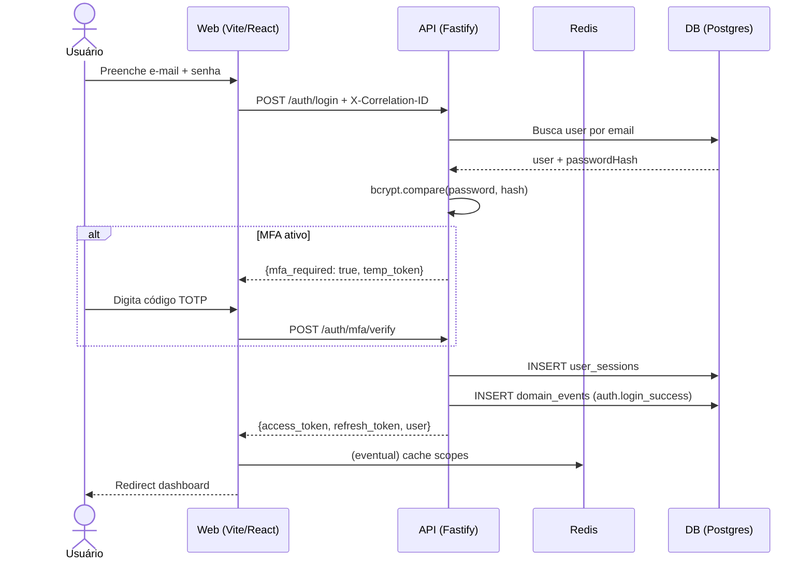

> ⚠️ **ARQUIVO GERIDO POR AUTOMAÇÃO.**
>
> - **Status DRAFT:** Enriqueça o conteúdo deste arquivo diretamente.
> - **Status READY:** NÃO EDITE DIRETAMENTE. Use a skill `create-amendment`.
>
> | Versão | Data       | Responsável | Status/Integração |
> |--------|------------|-------------|-------------------|
> | 0.1.0  | 2026-03-15 | arquitetura | Baseline Inicial (forge-module) |
> | 0.2.0  | 2026-03-15 | AGN-DEV-07  | Enriquecimento UX (enrich-agent) |
> | 0.5.0  | 2026-03-29 | merge-amendment | Merge UX-000-M02: Dashboard executivo (UX-009) — MetricCards, DonutChart, ActivityList. Substitui WelcomeWidget+ModuleShortcuts. Ref: 02-dashboard-spec, PEN-02-Dashboard. |
| 0.4.0  | 2026-03-29 | merge-amendment | Merge UX-000-M01: design visual 06-UserForm em UX-004 — FormCard 680px, campos Nome/Email/Perfil/Empresa, modo edição toggle status + resetar senha. Ref: 06-user-form-spec, PEN-06-UserForm. |
> | 0.3.2  | 2026-03-28 | merge-amendment | Merge UX-000-C02: referência visual spec v3 + Penpot PEN-01 (layout, cores, componentes SSO/PasswordStrength, branding gradiente). |
> | 0.3.1  | 2026-03-25 | merge-amendment | Merge UX-000-C01: tabela erros §401 detalhada (limpar tokens + cache + full reload). Nova jornada "Sessão Expirada por Timeout" em UX-001. |
> | 0.3.0  | 2026-03-22 | arquitetura | Unificação UX-001/UX-002 sob UX-AUTH-001; Screen IDs UX-USER→UX-USR; painel MFA adicionado |

# UX-000 — Jornadas e Fluxos do Foundation

---

## UX-001 — Autenticação (Login / Logout / MFA / Recuperação de Senha)

- **Screen ID:** UX-AUTH-001
- **Manifest:** `ux-auth-001.login.yaml`
- **Entidade(s):** `session`, `user`
- **Contexto:** Tela pública unificada — login, forgot-password, reset-password e MFA (SPA, rota única `/login`)

> **Nota:** UX-001 e UX-002 (recuperação de senha) foram unificados nesta jornada. O manifest `ux-auth-001` implementa 4 painéis na mesma rota: `login`, `forgot-password`, `reset-password` e `mfa`. Padrão comum em SPAs de mercado.

### Jornada (Happy Path)

1. Usuário acessa tela de login (painel `login`)
2. Preenche e-mail e senha → POST /auth/login
3. Se MFA ativo → transição para painel `mfa` → digita código TOTP → POST /auth/mfa/verify
4. Recebe tokens → redirect para dashboard
5. Logout → POST /auth/logout → redirect para login

### Jornada Alternativa — Recuperação de Senha

1. Usuário clica "Esqueci a senha" → transição para painel `forgot-password`
2. Informa e-mail → POST /auth/forgot-password
3. Recebe e-mail com link (token UUID, TTL 1h)
4. Clica no link → `/login?token=<uuid>` ativa painel `reset-password`
5. Define nova senha → POST /auth/reset-password
6. Redirect para painel `login` com mensagem de sucesso

### Jornada Alternativa — Sessão Expirada por Timeout

1. Token JWT expira no servidor (12h normal, 30d remember_me)
2. AppShell tenta GET /auth/me → recebe HTTP 401
3. Toast "Sua sessão expirou. Faça login novamente." (id fixo, sem duplicatas)
4. `forceLogout()`: limpa localStorage + cache React Query + full reload `/login`
5. Tela de login carrega normalmente — sem redirect automático de volta
6. Usuário faz login novamente → fluxo normal (UX-001 Happy Path)

### Alternativas e Erros

| Situação | Comportamento |
|---|---|
| Credenciais inválidas | Toast genérico "E-mail ou senha incorretos." (BR-001) |
| Conta BLOCKED | Toast "Conta suspensa. Contate o administrador." |
| Rate limit (429) | Toast "Muitas tentativas. Tente em X segundos." |
| MFA código errado | Inline error "Código inválido. Tente novamente." |
| E-mail não encontrado (forgot) | Mensagem genérica (User Enumeration Prevention — BR-001) |
| Token expirado (reset) | "Link expirado. Solicite novamente." |
| Senha fraca (reset) | Inline validation com regras de força |
| Sessão expirada (timeout 12h/30d) | Toast único "Sua sessão expirou. Faça login novamente." → forceLogout (limpa tokens + cache + full reload /login) |

### Estados

- **Loading:** Spinner bloqueante no botão "Entrar"
- **Empty:** N/A (formulário sempre visível)
- **Error:** Inline validation + toast RFC 9457

### Ações selecionadas (UX-010)

| action_id | label_pt | endpoint_hint | domain_event |
|---|---|---|---|
| `create` (login) | Entrar | `POST /auth/login` | `auth.login_success` / `session.created` |
| `create` (mfa) | Verificar código | `POST /auth/mfa/verify` | `auth.mfa_verified` |
| `delete` (logout) | Sair | `POST /auth/logout` | `auth.logout` / `session.revoked` |
| `create` (forgot) | Enviar link | `POST /auth/forgot-password` | `auth.forgot_password_requested` |
| `update` (reset) | Redefinir senha | `POST /auth/reset-password` | `auth.password_reset` |

### Copy

- **success:** "Login realizado com sucesso."
- **error:** "E-mail ou senha incorretos."
- **mfa_prompt:** "Digite o código do seu autenticador."
- **forgot_success:** "Se o e-mail estiver cadastrado, você receberá um link em breve."
- **reset_success:** "Senha redefinida com sucesso. Faça login."

### Referência Visual e Componentes (UX-000-C02)

- **Spec definitiva:** `docs/03_especificacoes/ux/01-login-spec-v3.md`
- **HTML referência:** `docs/03_especificacoes/ux/01-login-ref-v3.html`
- **Penpot validado:** PEN-01 (Sandbox `73c70309-a5e2-8120-8007-c7820d832ea2`, 3 páginas, 14/14 conformidades)

**Layout:** Split-screen 604px (branding) + 836px (formulário, fundo `#F5F5F3`). Card branco 420px centrado, radius 16px, border `#E8E8E6`.

**Elementos obrigatórios do LoginPanel (spec v3 §6):**

| Elemento | Detalhe |
|----------|---------|
| Subtítulo | "Acesse o portal do Grupo A1" (14px, `#888888`) |
| Labels | UPPER (11px, w700, ls:0.8, `#333333`) — "E-MAIL CORPORATIVO", "SENHA" |
| Link esqueci | "Esqueci minha senha" (12px, w600, `#F58C32`) |
| Botão Entrar | `#2E86C1` (azul info), h:50px, radius:10 |
| Divider SSO | "OU CONTINUE COM" (11px, w600, UPPER, `#AAAAAA`) |
| Botão Microsoft | 340×48, border `#E8E8E6`, ícone 4 quadrados MS + "Entrar com Microsoft" |
| Primeiro acesso | "Primeiro acesso?" (`#888888`) + "Solicite ao administrador" (w700, `#333333`) |
| Footer | Border-top `#E8E8E6` + "Conexão segura (TLS)" + "Suporte" |

**Branding Panel (spec v3 §6):** Gradiente 175° `#1a2318`→`#111111`, logo A1 gradiente `#F5A04E`→`#F58C32`, tagline 42px italic w800, 4 pills com border `rgba(255,255,255,0.12)`.

**Componentes a implementar (spec v3 §8):**

| Componente | Tipo |
|------------|------|
| `auth/BrandingPanel` | Refatorar — gradiente, opacidades, pills |
| `auth/MicrosoftSSOButton` | Criar — botão SSO com ícone MS |
| `auth/AuthDivider` | Criar — "OU CONTINUE COM" |
| `auth/PasswordStrength` | Criar — 4 barras (fraca/razoável/forte) + label |

**ForgotCard:** Título "Esqueceu a senha?", mensagem sucesso inline (`#E8F8EF` bg, `#B5E8C9` border, `#1E7A42` text).

**ResetCard:** PasswordStrength bars (fraca=`#E74C3C`, razoável=`#E67E22`, forte=`#27AE60`), label "Razoável", "← Voltar ao login".

---

## UX-003 — Gestão de Sessões (Kill-Switch)

- **Screen ID:** UX-AUTH-003
- **Manifest:** `ux-auth-003.sessions.yaml`
- **Entidade(s):** `session`
- **Contexto:** Lista de sessões ativas do usuário (self-service, sem scopes específicos)

### Jornada (Happy Path)

1. Usuário acessa "Sessões ativas" no perfil
2. Visualiza lista com device, data, IP
3. Pode revogar sessão individual → DELETE /auth/sessions/:id
4. Pode revogar todas → DELETE /auth/sessions

### Ações selecionadas (UX-010)

| action_id | label_pt | endpoint_hint | domain_event |
|---|---|---|---|
| `view` | Ver sessões | `GET /auth/sessions` | — |
| `delete` | Encerrar sessão | `DELETE /auth/sessions/:id` | `session.revoked` |
| `delete` (bulk) | Encerrar todas | `DELETE /auth/sessions` | `session.revoked_all` |

---

## UX-004 — Gestão de Usuários

- **Screen ID:** UX-USR-001
- **Manifests:** `ux-usr-001.users-list.yaml` (listagem), `ux-usr-002.user-form.yaml` (cadastro), `ux-usr-003.user-invite.yaml` (convite)
- **Entidade(s):** `user`
- **Contexto:** Lista + CRUD de usuários (MOD-002 — UX-first, consome endpoints MOD-000)

### Jornada (Happy Path)

1. Admin acessa "Usuários" no menu
2. Lista paginada (cursor-based) com filtros e busca
3. Criar: FormCard 680px (branco, r:12, border #E8E8E6, p:36px) com campos:
   - **NOME COMPLETO** — input text 608×48 r:10
   - **E-MAIL CORPORATIVO** — input email 608×48 com ícone envelope (pl:44)
   - **PERFIL** — select 296×48 (GET /api/v1/roles)
   - **EMPRESA** — select 296×48 (GET /api/v1/companies)
   - **InfoConvite** — box #F0F8FF r:8 com texto "Um convite será enviado por e-mail para ativação da conta." (#2E86C1)
   - Botões: "Cancelar" (secondary h:44) + "Salvar" (primary #2E86C1 h:44)
4. Editar: mesmo FormCard, diferenças:
   - Título "Editar Usuário", breadcrumb com nome do usuário
   - Campos preenchidos com valores reais
   - **STATUS** — toggle (track 40×22 r:11 #2E86C1, thumb 18×18 #FFF) + "Ativo"
   - SEM InfoConvite
   - **Resetar Senha** — botão secondary h:40 entre separador e ações
   - Botão primary: "Salvar Alterações"
5. Excluir: modal de confirmação → soft delete

> **Ref visual:** `06-user-form-spec.md`, `06-user-form-ref.html`, Penpot pages 06-UserForm / 06-UserForm-Edit

### Tokens visuais do formulário

```
INFO BG              #F0F8FF     Fundo da mensagem de convite
INFO TEXT            #2E86C1     Texto da mensagem de convite
TOGGLE ON            #2E86C1     Track do toggle ativo (modo edição)
TOGGLE OFF           #E8E8E6     Track do toggle inativo
```

### Tipografia do formulário

```
Título form           800  28px  lh:34px  ls:-1px  #111111
Subtítulo form        400  14px  #888888
Labels                700  11px  uppercase  ls:+0.8px  #333333
Input valor           400  14px  #111111
Input placeholder     400  14px  #CCCCCC
Info convite          400  13px  #2E86C1
Btn "Cancelar"        600  13px  #555555
Btn "Salvar"          700  13px  #FFFFFF
```

### Estados

- **Loading:** Skeleton na tabela (listagem), skeleton nos campos (formulário edit)
- **Empty:** "Nenhum usuário encontrado. Cadastre o primeiro."
- **Error:** Toast RFC 9457 com correlationId; inline por campo para 422/409

### Ações selecionadas (UX-010)

| action_id | label_pt | endpoint_hint | domain_event |
|---|---|---|---|
| `view` | Visualizar | `GET /api/v1/users`, `GET /api/v1/users/:id` | — |
| `filter` | Filtrar | `GET /api/v1/users?<filtros>` | — |
| `search` | Pesquisar | `GET /api/v1/users?q=<termo>` | — |
| `paginate` | Paginar | `GET /api/v1/users?cursor=...&limit=...` | — |
| `create` | Cadastrar | `POST /api/v1/users` | `user.created` |
| `update` | Editar | `PATCH /api/v1/users/:id` | `user.updated` |
| `delete` | Excluir | `DELETE /api/v1/users/:id` | `user.deleted` |
| `view_history` | Ver histórico | `GET /entities/user/:id/history` | — |
| `import` | Importar | `POST /api/v1/users/import` | `import.job_*` |
| `export` | Exportar | `POST /api/v1/users/export` | `export.job_*` |

---

## UX-005 — Perfil do Usuário (/auth/me)

- **Screen ID:** UX-USR-004
- **Entidade(s):** `user`
- **Contexto:** Tela de perfil do usuário autenticado

### Ações selecionadas (UX-010)

| action_id | label_pt | endpoint_hint | domain_event |
|---|---|---|---|
| `view` | Ver perfil | `GET /auth/me` | — |
| `update` | Editar perfil | `PATCH /auth/me` | `user.profile_updated` |
| `update` (senha) | Alterar senha | `POST /auth/change-password` | `auth.password_changed` |
| `attachment_add` (avatar) | Alterar foto | `POST /uploads/presign` | `storage.upload_completed` |

---

## UX-006 — Gestão de Roles/RBAC

- **Screen ID:** UX-ROLE-001
- **Manifest:** `ux-role-001.roles-list.yaml`
- **Entidade(s):** `role`
- **Contexto:** Lista + CRUD de papéis com escopos

### Ações selecionadas (UX-010)

| action_id | label_pt | endpoint_hint | domain_event |
|---|---|---|---|
| `view` | Visualizar | `GET /api/v1/roles`, `GET /api/v1/roles/:id` | — |
| `create` | Criar role | `POST /api/v1/roles` | `role.created` |
| `update` | Editar escopos | `PUT /api/v1/roles/:id` | `role.updated` |
| `delete` | Excluir role | `DELETE /api/v1/roles/:id` | `role.deleted` |
| `view_history` | Ver histórico | `GET /entities/role/:id/history` | — |

---

## UX-007 — Gestão de Filiais (Tenants)

- **Screen ID:** UX-TENANT-001
- **Manifest:** `ux-tenant-001.tenants-list.yaml`
- **Entidade(s):** `tenant`
- **Contexto:** Lista + CRUD de filiais

### Ações selecionadas (UX-010)

| action_id | label_pt | endpoint_hint | domain_event |
|---|---|---|---|
| `view` | Visualizar | `GET /api/v1/tenants` | — |
| `create` | Criar filial | `POST /api/v1/tenants` | `tenant.created` |
| `update` | Editar filial | `PATCH /api/v1/tenants/:id` | `tenant.updated` |
| `deactivate` | Bloquear | `PATCH /api/v1/tenants/:id {status: BLOCKED}` | `tenant.status_changed` |
| `activate` | Desbloquear | `PATCH /api/v1/tenants/:id {status: ACTIVE}` | `tenant.status_changed` |
| `delete` | Excluir | `DELETE /api/v1/tenants/:id` | `tenant.deleted` |
| `view_history` | Ver histórico | `GET /entities/tenant/:id/history` | — |

---

## UX-008 — Vinculação Usuário-Filial

- **Screen ID:** UX-TENANT-002
- **Manifest:** `ux-tenant-002.tenant-users.yaml`
- **Entidade(s):** `tenant_user`
- **Contexto:** Lista de usuários vinculados a uma filial

### Ações selecionadas (UX-010)

| action_id | label_pt | endpoint_hint | domain_event |
|---|---|---|---|
| `view` | Ver membros | `GET /api/v1/tenants/:id/users` | — |
| `create` | Vincular usuário | `POST /api/v1/tenants/:id/users` | `tenant_user.added` |
| `update` | Alterar role | `PUT /api/v1/tenants/:id/users/:userId` | `tenant_user.role_changed` |
| `deactivate` | Suspender | `PATCH /api/v1/tenants/:id/users/:userId {status: BLOCKED}` | `tenant_user.blocked` |
| `delete` | Desvincular | `DELETE /api/v1/tenants/:id/users/:userId` | `tenant_user.removed` |

---

## UX-009 — Dashboard Executivo

- **Screen ID:** UX-DASH-001
- **Manifest:** (pendente — dados mock nesta fase)
- **Entidade(s):** `user`, `process`, `agent`
- **Contexto:** Dashboard pos-login com metricas, distribuicao de status e atividades recentes

> **Ref visual:** `02-dashboard-spec.md`, `02-dashboard-ref.html`, Penpot page 02-Dashboard (97bf5432)

### Layout

```
ContentArea (1200x836, fill #F5F5F3, padding 32px)
  PageHeader: "Dashboard" (28px 800 #111111 ls:-1px) + descricao (14px 400 #888888)
  MetricGrid (mt:24px, 4 colunas, gap 20px)
    MetricCard x4
  SecondRow (mt:24px, 2 colunas 5fr+7fr, gap 20px)
    CardDonut (~42% largura)
    CardAtividades (~58% largura)
```

### Componentes a implementar (UX-000-M02)

| Componente | Tipo | Descricao |
|---|---|---|
| `dashboard/MetricCard` | Criar | Card com label uppercase, valor grande, dot indicator |
| `dashboard/DonutChart` | Criar | SVG donut 144x144 com 4 segmentos + centro "72 TOTAL" + legenda |
| `dashboard/ActivityList` | Criar | Lista vertical com header "Atividades Recentes" + "VER TUDO" |
| `dashboard/ActivityItem` | Criar | Item: dot colorido + ator bold + descricao + badge + timestamp |

### Metric Cards

| Card | Label | Valor | Cor Valor | Dot | Indicador |
|---|---|---|---|---|---|
| Processos Ativos | PROCESSOS ATIVOS | 12 | #111111 | #2E86C1 | Em execucao |
| Aprovacoes Pendentes | APROVACOES PENDENTES | 08 | #E67E22 | #E67E22 | Aguardando revisao |
| Usuarios Ativos | USUARIOS ATIVOS | 47 | #111111 | #27AE60 | Base cadastrada |
| Agentes MCP | AGENTES MCP | 05 | #27AE60 | #27AE60 | Online e operando |

> **Nota:** Valores sao mock estaticos nesta fase. Integracao com endpoints de contadores sera tratada em FR futuro.

### Tokens visuais do dashboard

```
CARD VALOR AMBER     #E67E22     Aprovacoes Pendentes
CARD VALOR GREEN     #27AE60     Agentes MCP
DONUT VERDE          #27AE60     Concluido 40%
DONUT AMBER          #E67E22     Andamento 25%
DONUT VERMELHO       #E74C3C     Atrasado 20%
DONUT AZUL           #2E86C1     Planejado 15%
DONUT BG             #F0F0EE     Trilha fundo
BADGE BG NORMAL      #F5F5F3     Badge codigo
BADGE BG DANGER      #FFEBEE     Badge falha
BADGE TEXT DANGER     #C0392B     Badge falha
LINK VER TUDO        #2E86C1     Uppercase
```

### Topbar variante Dashboard

Lado direito da topbar: "Administrador ECF" (12px 700 #111111) + "Acesso Nivel 5" (10px 400 #888888) + Avatar "AE" (40x40, r:50%, fill #F0F0EE, border 2px #E8E8E6). Nas demais telas: "Empresa: A1 Engenharia" (12px 500 #555555).

### Acoes selecionadas (UX-010)

| action_id | label_pt | endpoint_hint | domain_event |
|---|---|---|---|
| `view` | Ver dashboard | `GET /auth/me` (dados mock) | — |

---

## Tratamento de Erros e Mensagens (MUST UX)

| HTTP Status | Comportamento UX |
|---|---|
| **400/422** | Erros inline nos campos + toast com detail |
| **401** | (1) Toast único "Sua sessão expirou. Faça login novamente." com `id` fixo para deduplicação; (2) Limpar `localStorage['auth_tokens']`; (3) Limpar cache React Query (`queryClient.clear()`); (4) Full reload para `/login` via `window.location.href` (necessário para resetar router context estático). NÃO usar `navigate()` — causa redirect loop. |
| **403** | Empty state "Acesso negado" com botão voltar |
| **404** | Tela ilustrada "Não encontrado" + botão voltar |
| **409** | Modal de conflito com opção de resolver |
| **429** | Toast "Muitas tentativas. Tente em X segundos." |
| **5xx** | Toast "Erro interno. Tente novamente." (sem detalhes técnicos) |

Todos os erros DEVEM exibir `correlationId` de forma copiável para suporte.

---

### Diagrama Sequence (Mermaid) — Jornada Login



---

- **estado_item:** READY
- **owner:** arquitetura
- **data_ultima_revisao:** 2026-03-29
- **rastreia_para:** US-MOD-000, US-MOD-000-F01, US-MOD-000-F02, US-MOD-000-F03, US-MOD-000-F04, US-MOD-000-F05, US-MOD-000-F06, US-MOD-000-F07, US-MOD-000-F08, US-MOD-000-F09, FR-000, BR-000, SEC-000, DOC-FND-000, DOC-UX-010
- **referencias_exemplos:** DOC-UX-010 (action_ids: view, filter, search, create, update, delete, view_history, import, export, activate, deactivate, attachment_add)
- **evidencias:** Extraído de US-MOD-000-F01 a F17, mapeado contra catálogo UX-010
