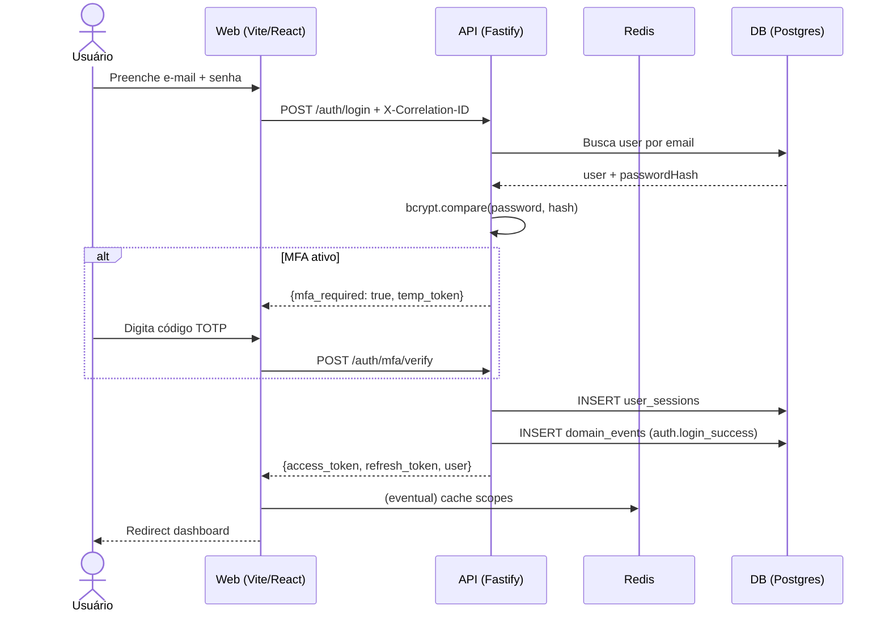

> ⚠️ **ARQUIVO GERIDO POR AUTOMAÇÃO.**
>
> - **Status DRAFT:** Enriqueça o conteúdo deste arquivo diretamente.
> - **Status READY:** NÃO EDITE DIRETAMENTE. Use a skill `create-amendment`.
>
> | Versão | Data       | Responsável | Status/Integração |
> |--------|------------|-------------|-------------------|
> | 0.1.0  | 2026-03-15 | arquitetura | Baseline Inicial (forge-module) |
> | 0.2.0  | 2026-03-15 | AGN-DEV-07  | Enriquecimento UX (enrich-agent) |
> | 0.3.0  | 2026-03-22 | arquitetura | Unificação UX-001/UX-002 sob UX-AUTH-001; Screen IDs UX-USER→UX-USR; painel MFA adicionado |

# UX-000 — Jornadas e Fluxos do Foundation

---

## UX-001 — Autenticação (Login / Logout / MFA / Recuperação de Senha)

- **Screen ID:** UX-AUTH-001
- **Manifest:** `ux-auth-001.login.yaml`
- **Entidade(s):** `session`, `user`
- **Contexto:** Tela pública unificada — login, forgot-password, reset-password e MFA (SPA, rota única `/login`)

> **Nota:** UX-001 e UX-002 (recuperação de senha) foram unificados nesta jornada. O manifest `ux-auth-001` implementa 4 painéis na mesma rota: `login`, `forgot-password`, `reset-password` e `mfa`. Padrão comum em SPAs de mercado.

### Jornada (Happy Path)

1. Usuário acessa tela de login (painel `login`)
2. Preenche e-mail e senha → POST /auth/login
3. Se MFA ativo → transição para painel `mfa` → digita código TOTP → POST /auth/mfa/verify
4. Recebe tokens → redirect para dashboard
5. Logout → POST /auth/logout → redirect para login

### Jornada Alternativa — Recuperação de Senha

1. Usuário clica "Esqueci a senha" → transição para painel `forgot-password`
2. Informa e-mail → POST /auth/forgot-password
3. Recebe e-mail com link (token UUID, TTL 1h)
4. Clica no link → `/login?token=<uuid>` ativa painel `reset-password`
5. Define nova senha → POST /auth/reset-password
6. Redirect para painel `login` com mensagem de sucesso

### Alternativas e Erros

| Situação | Comportamento |
|---|---|
| Credenciais inválidas | Toast genérico "E-mail ou senha incorretos." (BR-001) |
| Conta BLOCKED | Toast "Conta suspensa. Contate o administrador." |
| Rate limit (429) | Toast "Muitas tentativas. Tente em X segundos." |
| MFA código errado | Inline error "Código inválido. Tente novamente." |
| E-mail não encontrado (forgot) | Mensagem genérica (User Enumeration Prevention — BR-001) |
| Token expirado (reset) | "Link expirado. Solicite novamente." |
| Senha fraca (reset) | Inline validation com regras de força |

### Estados

- **Loading:** Spinner bloqueante no botão "Entrar"
- **Empty:** N/A (formulário sempre visível)
- **Error:** Inline validation + toast RFC 9457

### Ações selecionadas (UX-010)

| action_id | label_pt | endpoint_hint | domain_event |
|---|---|---|---|
| `create` (login) | Entrar | `POST /auth/login` | `auth.login_success` / `session.created` |
| `create` (mfa) | Verificar código | `POST /auth/mfa/verify` | `auth.mfa_verified` |
| `delete` (logout) | Sair | `POST /auth/logout` | `auth.logout` / `session.revoked` |
| `create` (forgot) | Enviar link | `POST /auth/forgot-password` | `auth.forgot_password_requested` |
| `update` (reset) | Redefinir senha | `POST /auth/reset-password` | `auth.password_reset` |

### Copy

- **success:** "Login realizado com sucesso."
- **error:** "E-mail ou senha incorretos."
- **mfa_prompt:** "Digite o código do seu autenticador."
- **forgot_success:** "Se o e-mail estiver cadastrado, você receberá um link em breve."
- **reset_success:** "Senha redefinida com sucesso. Faça login."

---

## UX-003 — Gestão de Sessões (Kill-Switch)

- **Screen ID:** UX-AUTH-003
- **Manifest:** `ux-auth-003.sessions.yaml`
- **Entidade(s):** `session`
- **Contexto:** Lista de sessões ativas do usuário (self-service, sem scopes específicos)

### Jornada (Happy Path)

1. Usuário acessa "Sessões ativas" no perfil
2. Visualiza lista com device, data, IP
3. Pode revogar sessão individual → DELETE /auth/sessions/:id
4. Pode revogar todas → DELETE /auth/sessions

### Ações selecionadas (UX-010)

| action_id | label_pt | endpoint_hint | domain_event |
|---|---|---|---|
| `view` | Ver sessões | `GET /auth/sessions` | — |
| `delete` | Encerrar sessão | `DELETE /auth/sessions/:id` | `session.revoked` |
| `delete` (bulk) | Encerrar todas | `DELETE /auth/sessions` | `session.revoked_all` |

---

## UX-004 — Gestão de Usuários

- **Screen ID:** UX-USR-001
- **Manifests:** `ux-usr-001.users-list.yaml` (listagem), `ux-usr-002.user-form.yaml` (cadastro), `ux-usr-003.user-invite.yaml` (convite)
- **Entidade(s):** `user`
- **Contexto:** Lista + CRUD de usuários (MOD-002 — UX-first, consome endpoints MOD-000)

### Jornada (Happy Path)

1. Admin acessa "Usuários" no menu
2. Lista paginada (cursor-based) com filtros e busca
3. Criar: formulário com e-mail, nome, CPF/CNPJ, senha
4. Editar: formulário pré-preenchido
5. Excluir: modal de confirmação → soft delete

### Estados

- **Loading:** Skeleton na tabela
- **Empty:** "Nenhum usuário encontrado. Cadastre o primeiro."
- **Error:** Toast RFC 9457 com correlationId

### Ações selecionadas (UX-010)

| action_id | label_pt | endpoint_hint | domain_event |
|---|---|---|---|
| `view` | Visualizar | `GET /api/v1/users`, `GET /api/v1/users/:id` | — |
| `filter` | Filtrar | `GET /api/v1/users?<filtros>` | — |
| `search` | Pesquisar | `GET /api/v1/users?q=<termo>` | — |
| `paginate` | Paginar | `GET /api/v1/users?cursor=...&limit=...` | — |
| `create` | Cadastrar | `POST /api/v1/users` | `user.created` |
| `update` | Editar | `PATCH /api/v1/users/:id` | `user.updated` |
| `delete` | Excluir | `DELETE /api/v1/users/:id` | `user.deleted` |
| `view_history` | Ver histórico | `GET /entities/user/:id/history` | — |
| `import` | Importar | `POST /api/v1/users/import` | `import.job_*` |
| `export` | Exportar | `POST /api/v1/users/export` | `export.job_*` |

---

## UX-005 — Perfil do Usuário (/auth/me)

- **Screen ID:** UX-USR-004
- **Entidade(s):** `user`
- **Contexto:** Tela de perfil do usuário autenticado

### Ações selecionadas (UX-010)

| action_id | label_pt | endpoint_hint | domain_event |
|---|---|---|---|
| `view` | Ver perfil | `GET /auth/me` | — |
| `update` | Editar perfil | `PATCH /auth/me` | `user.profile_updated` |
| `update` (senha) | Alterar senha | `POST /auth/change-password` | `auth.password_changed` |
| `attachment_add` (avatar) | Alterar foto | `POST /uploads/presign` | `storage.upload_completed` |

---

## UX-006 — Gestão de Roles/RBAC

- **Screen ID:** UX-ROLE-001
- **Manifest:** `ux-role-001.roles-list.yaml`
- **Entidade(s):** `role`
- **Contexto:** Lista + CRUD de papéis com escopos

### Ações selecionadas (UX-010)

| action_id | label_pt | endpoint_hint | domain_event |
|---|---|---|---|
| `view` | Visualizar | `GET /api/v1/roles`, `GET /api/v1/roles/:id` | — |
| `create` | Criar role | `POST /api/v1/roles` | `role.created` |
| `update` | Editar escopos | `PUT /api/v1/roles/:id` | `role.updated` |
| `delete` | Excluir role | `DELETE /api/v1/roles/:id` | `role.deleted` |
| `view_history` | Ver histórico | `GET /entities/role/:id/history` | — |

---

## UX-007 — Gestão de Filiais (Tenants)

- **Screen ID:** UX-TENANT-001
- **Manifest:** `ux-tenant-001.tenants-list.yaml`
- **Entidade(s):** `tenant`
- **Contexto:** Lista + CRUD de filiais

### Ações selecionadas (UX-010)

| action_id | label_pt | endpoint_hint | domain_event |
|---|---|---|---|
| `view` | Visualizar | `GET /api/v1/tenants` | — |
| `create` | Criar filial | `POST /api/v1/tenants` | `tenant.created` |
| `update` | Editar filial | `PATCH /api/v1/tenants/:id` | `tenant.updated` |
| `deactivate` | Bloquear | `PATCH /api/v1/tenants/:id {status: BLOCKED}` | `tenant.status_changed` |
| `activate` | Desbloquear | `PATCH /api/v1/tenants/:id {status: ACTIVE}` | `tenant.status_changed` |
| `delete` | Excluir | `DELETE /api/v1/tenants/:id` | `tenant.deleted` |
| `view_history` | Ver histórico | `GET /entities/tenant/:id/history` | — |

---

## UX-008 — Vinculação Usuário-Filial

- **Screen ID:** UX-TENANT-002
- **Manifest:** `ux-tenant-002.tenant-users.yaml`
- **Entidade(s):** `tenant_user`
- **Contexto:** Lista de usuários vinculados a uma filial

### Ações selecionadas (UX-010)

| action_id | label_pt | endpoint_hint | domain_event |
|---|---|---|---|
| `view` | Ver membros | `GET /api/v1/tenants/:id/users` | — |
| `create` | Vincular usuário | `POST /api/v1/tenants/:id/users` | `tenant_user.added` |
| `update` | Alterar role | `PUT /api/v1/tenants/:id/users/:userId` | `tenant_user.role_changed` |
| `deactivate` | Suspender | `PATCH /api/v1/tenants/:id/users/:userId {status: BLOCKED}` | `tenant_user.blocked` |
| `delete` | Desvincular | `DELETE /api/v1/tenants/:id/users/:userId` | `tenant_user.removed` |

---

## Tratamento de Erros e Mensagens (MUST UX)

| HTTP Status | Comportamento UX |
|---|---|
| **400/422** | Erros inline nos campos + toast com detail |
| **401** | Redirect para /login com mensagem "Sessão expirada" |
| **403** | Empty state "Acesso negado" com botão voltar |
| **404** | Tela ilustrada "Não encontrado" + botão voltar |
| **409** | Modal de conflito com opção de resolver |
| **429** | Toast "Muitas tentativas. Tente em X segundos." |
| **5xx** | Toast "Erro interno. Tente novamente." (sem detalhes técnicos) |

Todos os erros DEVEM exibir `correlationId` de forma copiável para suporte.

---

### Diagrama Sequence (Mermaid) — Jornada Login

---

- **estado_item:** READY
- **owner:** arquitetura
- **data_ultima_revisao:** 2026-03-23
- **rastreia_para:** US-MOD-000, US-MOD-000-F01, US-MOD-000-F02, US-MOD-000-F03, US-MOD-000-F04, US-MOD-000-F05, US-MOD-000-F06, US-MOD-000-F07, US-MOD-000-F08, US-MOD-000-F09, FR-000, BR-000, SEC-000, DOC-FND-000, DOC-UX-010
- **referencias_exemplos:** DOC-UX-010 (action_ids: view, filter, search, create, update, delete, view_history, import, export, activate, deactivate, attachment_add)
- **evidencias:** Extraído de US-MOD-000-F01 a F17, mapeado contra catálogo UX-010
