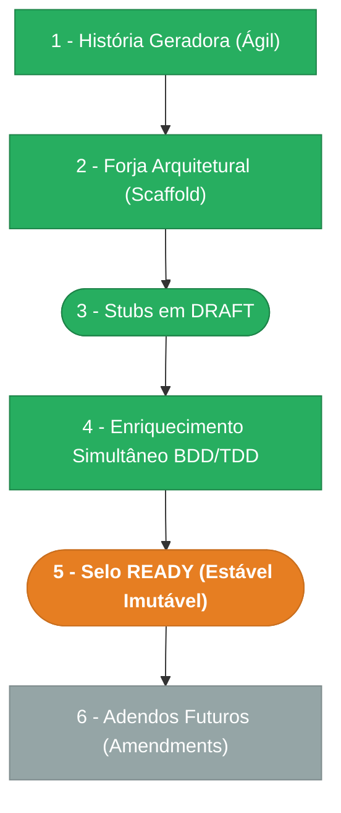

> ⚠️ **ARQUIVO GERIDO POR AUTOMAÇÃO.**
>
> - **Status DRAFT:** Enriqueça o conteúdo deste arquivo diretamente.
> - **Status READY:** NÃO EDITE DIRETAMENTE. Use a skill `create-amendment`.

# CHANGELOG - MOD-001

## Ciclo de Estabilidade do Módulo

> 🟢 Verde = Concluído | 🟠 Laranja = Em Andamento | 🔵 Azul = Estável Ancestral | ⬜ Cinza = Previsto

*O módulo está na **Etapa 5 — Selo READY (Estável Imutável). Alterações futuras via `create-amendment`.**

---

## Histórico de Versões

| Versão | Data | Responsável | Descrição |
|--------|------|-------------|-----------|
| 1.5.0 | 2026-03-25 | merge-amendment | Merge batch: UX-001-C01 (AppShell wiring), UX-001-C02 (DashboardPage wiring), UX-001-M01 (ComingSoonPage CA-09), AMD-SEC-001-001 (interceptor 401 global), AMD-INT-005-001 (timeout configurável). Todos já implementados — selo MERGED. UX-001 v0.8.0, SEC-001 v0.6.0, INT-001 v0.6.0. |
| 1.4.0 | 2026-03-25 | cascade-amendment | Cascade de UX-001-M02: 2 amendments derivados criados — FR-001-M01 (requisitos 20 rotas, 9 grupos sidebar, shortcuts, ProfileWidget, breadcrumbs), SEC-001-M01 (catálogo scopes consumidos 4→17). Alinha FR-001/SEC-001 com navegação implementada. |
| 1.3.0 | 2026-03-25 | codegen | Codegen UX-001-C01 + C02 + M01 + M02: _auth.tsx→AppShell+Outlet, _auth.dashboard.tsx→DashboardPage real, ComingSoonPage shared, 20 route files (12 módulos), sidebar 9 grupos, ICONS+ROUTE_LABELS expandidos, ProfileWidget links (perfil/sessões), shortcuts 8 itens, index redirect inteligente, routeTree 24 rotas. Fix: login.tsx validateSearch token tipado como opcional. Deps normativas: DOC-UX-011-M01 (CA-09), DOC-UX-011-M02 (CA-07/CA-08). |
| 1.2.0 | 2026-03-25 | create-amendment | Amendment UX-001-M02: navegação completa — sidebar 9 grupos (12 módulos), 20 route files, ICONS+ROUTE_LABELS expandidos, ProfileWidget com links perfil/sessões, shortcuts expandidos, index redirect inteligente. |
| 1.1.0 | 2026-03-25 | create-amendment | Amendment UX-001-M01: rotas Coming Soon para /usuarios, /perfis, /filiais, /auditoria + componente shared ComingSoonPage. Conforme DOC-UX-011-M01 CA-09 — toda rota do sidebar DEVE ter route file. |
| 1.0.2 | 2026-03-25 | create-amendment | Amendment UX-001-C02: _auth.dashboard.tsx deve importar DashboardPage real do módulo (viola CA-07). WelcomeWidget, ModuleShortcuts e skeleton loading ausentes por uso de componente inline. |
| 1.0.1 | 2026-03-25 | create-amendment | Amendment UX-001-C01: _auth.tsx deve importar AppShell real do módulo (viola CA-07). Sidebar, breadcrumbs e ProfileWidget não aparecem por uso de layout placeholder inline. |
| 1.0.0 | 2026-03-23 | promote-module | Promoção DRAFT→READY: manifesto v1.0.0, todos os requisitos e ADRs selados. Épico + features já READY. Ciclo de estabilidade avança para Etapa 5. |
| 0.9.1 | 2026-03-17 | AGN-DEV-01 | Re-enriquecimento MOD (enrich-agent) — Revertido estado_item READY→DRAFT (achado VAL: requirements ainda DRAFT), pipeline Mermaid corrigido para Etapa 4, dependentes atualizados |
| 0.2.0 | 2026-03-16 | AGN-DEV-01 | Enriquecimento MOD (enrich-agent) — Nível 1 (Clean Leve) confirmado com score 1/6 (DOC-ESC-001 §4.2), module_paths detalhados para frontend Nível 1, rastreabilidade expandida |
| 0.1.0 | 2026-03-16 | arquitetura | Baseline Inicial — scaffold gerado via `forge-module` a partir de US-MOD-001 (READY). Stubs obrigatórios criados: DATA-003, SEC-002. Todos os itens nascem em `estado_item: DRAFT`. |
