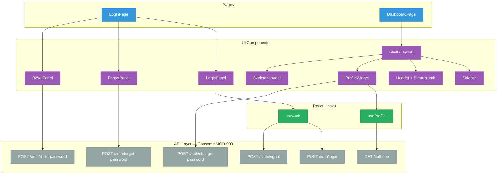

# MOD-001 — Arquitetura de Camadas (UX-First, Nível 1)

```mermaid
graph TD
    subgraph PAGES ["Pages"]
        P1["LoginPage"]
        P2["DashboardPage"]
    end

    subgraph COMPONENTS ["UI Components"]
        C1["LoginPanel"]
        C2["ForgotPanel"]
        C3["ResetPanel"]
        C4["Sidebar"]
        C5["Header + Breadcrumb"]
        C6["ProfileWidget"]
        C7["Shell (Layout)"]
        C8["SkeletonLoader"]
    end

    subgraph HOOKS ["React Hooks"]
        H1["useAuth"]
        H2["useProfile"]
    end

    subgraph API ["API Layer — Consome MOD-000"]
        A1["POST /auth/login"]
        A2["POST /auth/logout"]
        A3["GET /auth/me"]
        A4["POST /auth/forgot-password"]
        A5["POST /auth/reset-password"]
        A6["POST /auth/change-password"]
    end

    P1 --> C1
    P1 --> C2
    P1 --> C3
    P2 --> C7

    C7 --> C4
    C7 --> C5
    C7 --> C6
    C7 --> C8

    C1 --> H1
    C6 --> H2

    H1 --> A1
    H1 --> A2
    H2 --> A3
    C2 --> A4
    C3 --> A5
    C6 --> A6

    classDef pages fill:#3498DB,stroke:#2980B9,color:#fff
    classDef components fill:#9B59B6,stroke:#8E44AD,color:#fff
    classDef hooks fill:#27AE60,stroke:#1E8449,color:#fff
    classDef api fill:#95A5A6,stroke:#7F8C8D,color:#fff

    class P1,P2 pages
    class C1,C2,C3,C4,C5,C6,C7,C8 components
    class H1,H2 hooks
    class A1,A2,A3,A4,A5,A6 api
```
