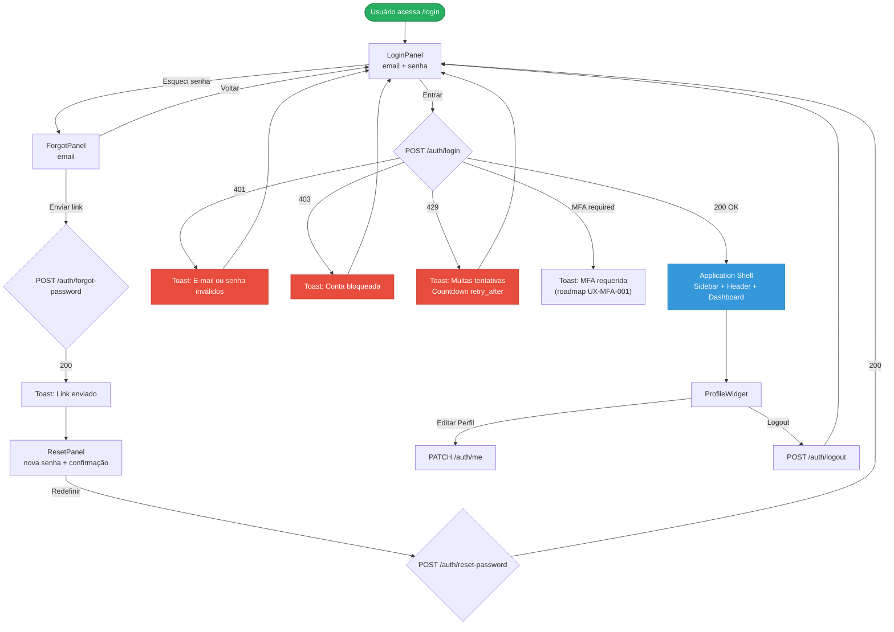

# MOD-001 — Fluxo UX de Autenticação

```mermaid
flowchart TD
    START(["Usuário acessa /login"]) --> LOGIN["LoginPanel<br/>email + senha"]
    LOGIN -->|Entrar| AUTH{"POST /auth/login"}

    AUTH -->|200 OK| SHELL["Application Shell<br/>Sidebar + Header + Dashboard"]
    AUTH -->|401| ERR1["Toast: E-mail ou senha inválidos"]
    AUTH -->|403| ERR2["Toast: Conta bloqueada"]
    AUTH -->|429| ERR3["Toast: Muitas tentativas<br/>Countdown retry_after"]
    AUTH -->|MFA required| MFA["Toast: MFA requerida<br/>(roadmap UX-MFA-001)"]

    ERR1 --> LOGIN
    ERR2 --> LOGIN
    ERR3 --> LOGIN

    LOGIN -->|Esqueci senha| FORGOT["ForgotPanel<br/>email"]
    FORGOT -->|Enviar link| FAPI{"POST /auth/forgot-password"}
    FAPI -->|200| TOAST1["Toast: Link enviado"]
    FORGOT -->|Voltar| LOGIN

    TOAST1 --> RESET["ResetPanel<br/>nova senha + confirmação"]
    RESET -->|Redefinir| RAPI{"POST /auth/reset-password"}
    RAPI -->|200| LOGIN

    SHELL --> PROFILE["ProfileWidget"]
    PROFILE -->|Editar Perfil| EDIT["PATCH /auth/me"]
    PROFILE -->|Logout| LOGOUT["POST /auth/logout"]
    LOGOUT --> LOGIN

    style START fill:#27AE60,color:#fff,stroke:#1E8449
    style SHELL fill:#3498DB,color:#fff,stroke:#2980B9
    style ERR1 fill:#E74C3C,color:#fff,stroke:#C0392B
    style ERR2 fill:#E74C3C,color:#fff,stroke:#C0392B
    style ERR3 fill:#E74C3C,color:#fff,stroke:#C0392B
```
