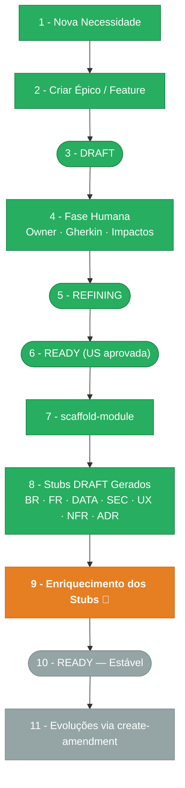

> ⚠️ **ARQUIVO GERIDO POR AUTOMAÇÃO. NÃO EDITE DIRETAMENTE.** Use a skill pertinente para versionar alterações.
>
> | Versão | Data       | Responsável | Status/Integração |
> |--------|------------|-------------|-------------------|
> | 0.1.0  | 2026-03-08 | arquitetura | Baseline Inicial (scaffold-module) |

# CHANGELOG - MOD-001 Backoffice

## Estágio Atual: **9 — Enriquecimento dos Stubs** 🔴 (Em andamento)

O scaffold foi executado e todos os stubs foram gerados em `DRAFT`. O próximo passo é o **enriquecimento direto** dos arquivos de requirements (BR, FR, DATA, INT, SEC, UX, NFR, ADR) a partir das User Stories aprovadas do MOD-001.

## Pipeline de Ciclo de Vida

> 🟢 Verde = Concluído | 🟠 Laranja = Etapa Atual | ⬜ Cinza = Pendente

## Histórico de Versões

| Versão | Data       | Responsável | Descrição                                                        |
|--------|------------|-------------|------------------------------------------------------------------|
| 0.1.0  | 2026-03-08 | arquitetura | Baseline Inicial (scaffold-module) a partir de US-MOD-001       |
