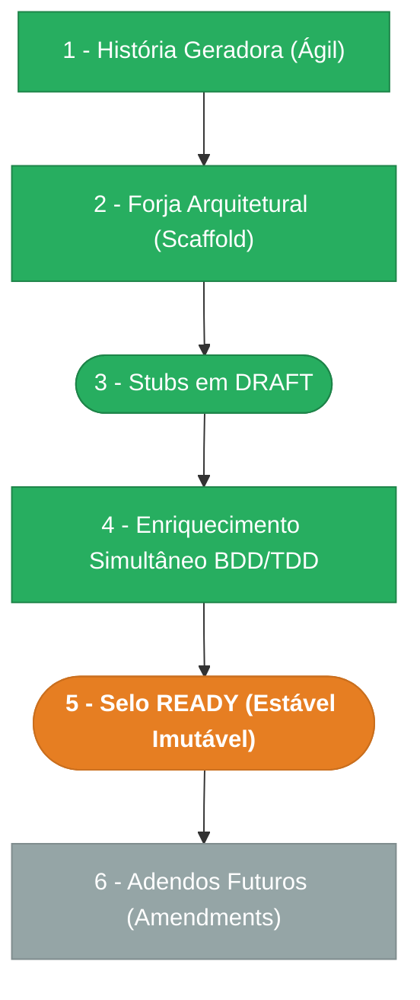

> ⚠️ **ARQUIVO GERIDO POR AUTOMAÇÃO.**
>
> - **Status DRAFT:** Enriqueça o conteúdo deste arquivo diretamente.
> - **Status READY:** NÃO EDITE DIRETAMENTE. Use a skill `create-amendment`.

# CHANGELOG - MOD-002

## Ciclo de Estabilidade do Módulo

> 🟢 Verde = Concluído | 🟠 Laranja = Em Andamento | 🔵 Azul = Estável Ancestral | ⬜ Cinza = Previsto

*O módulo está na **Etapa 5 — Selo READY (Estável Imutável). Alterações futuras via `create-amendment`.**

---

## Histórico de Versões

| Versão | Data | Responsável | Descrição |
|--------|------|-------------|-----------|
| 1.2.0 | 2026-03-25 | codegen | Codegen MOD-002: correção workarounds FR-000-M01 — mappers agora usam role_id/role_name/invite_token_expired da API real (eram hardcoded). 14 arquivos existentes, 2 corrigidos (users.api.ts mappers), 1 removido (user.types.ts duplicado). AGN-COD-WEB: done. AGN-COD-VAL: done (0 workarounds restantes). |
| 1.1.0 | 2026-03-24 | validate-all | Validação Fase 3 aprovada — Lint: PASS (0 errors). QA: PASS. Manifests: 3/3. OpenAPI: N/A. Drizzle: N/A. Endpoints: N/A. Arquitetura: PASS (Pattern A, React Query). Pronto para promoção. |
| 1.0.0 | 2026-03-23 | promote-module | Promoção DRAFT→READY: manifesto v1.0.0, todos os requisitos e ADRs selados. Épico + features já READY. Ciclo de estabilidade avança para Etapa 5. |
| 0.3.0 | 2026-03-17 | AGN-DEV-01/02/03 | Batch 1: AGN-DEV-01 re-validou MOD (sem lacunas). AGN-DEV-02 corrigiu rastreabilidade BR-003→FR-002 e BR-004→FR-003. AGN-DEV-03 adicionou campos idempotency/timeline explícitos em FR-001/002/003. |
| 0.2.0 | 2026-03-17 | AGN-DEV-01 | Enriquecimento MOD/Escala: score DOC-ESC-001 §4.2 (2 pts → N1), personas com scopes, OKRs do épico, premissas/restrições, matriz MUST/SHOULD N1, checklist PR N1 Web, estrutura de pastas DOC-ESC-001 §6.3. |
| 0.1.0 | 2026-03-17 | arquitetura | Baseline Inicial — scaffold gerado via `forge-module` a partir de US-MOD-002 (READY). Módulo UX-First: consome MOD-000-F05 (Users API) e F06 (Roles API). Stubs obrigatórios criados: DATA-003, SEC-002. Todos os itens nascem em `estado_item: DRAFT`. |
