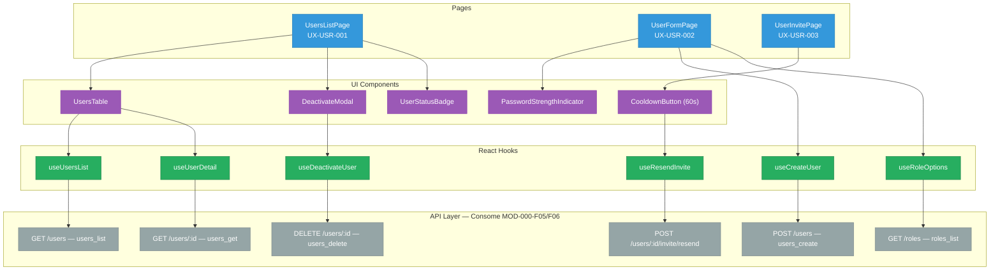

# MOD-002 — Arquitetura de Camadas (UX-First, Nível 1)

```mermaid
graph TD
    subgraph PAGES ["Pages"]
        P1["UsersListPage<br/>UX-USR-001"]
        P2["UserFormPage<br/>UX-USR-002"]
        P3["UserInvitePage<br/>UX-USR-003"]
    end

    subgraph COMPONENTS ["UI Components"]
        C1["UsersTable"]
        C2["DeactivateModal"]
        C3["UserStatusBadge"]
        C4["PasswordStrengthIndicator"]
        C5["CooldownButton (60s)"]
    end

    subgraph HOOKS ["React Hooks"]
        H1["useUsersList"]
        H2["useCreateUser"]
        H3["useUserDetail"]
        H4["useDeactivateUser"]
        H5["useResendInvite"]
        H6["useRoleOptions"]
    end

    subgraph API ["API Layer — Consome MOD-000-F05/F06"]
        A1["GET /users — users_list"]
        A2["POST /users — users_create"]
        A3["GET /users/:id — users_get"]
        A4["DELETE /users/:id — users_delete"]
        A5["POST /users/:id/invite/resend"]
        A6["GET /roles — roles_list"]
    end

    P1 --> C1
    P1 --> C2
    P1 --> C3
    P2 --> C4
    P3 --> C5

    C1 --> H1
    C1 --> H3
    C2 --> H4
    P2 --> H2
    P2 --> H6
    C5 --> H5

    H1 --> A1
    H2 --> A2
    H3 --> A3
    H4 --> A4
    H5 --> A5
    H6 --> A6

    classDef pages fill:#3498DB,stroke:#2980B9,color:#fff
    classDef components fill:#9B59B6,stroke:#8E44AD,color:#fff
    classDef hooks fill:#27AE60,stroke:#1E8449,color:#fff
    classDef api fill:#95A5A6,stroke:#7F8C8D,color:#fff

    class P1,P2,P3 pages
    class C1,C2,C3,C4,C5 components
    class H1,H2,H3,H4,H5,H6 hooks
    class A1,A2,A3,A4,A5,A6 api
```
