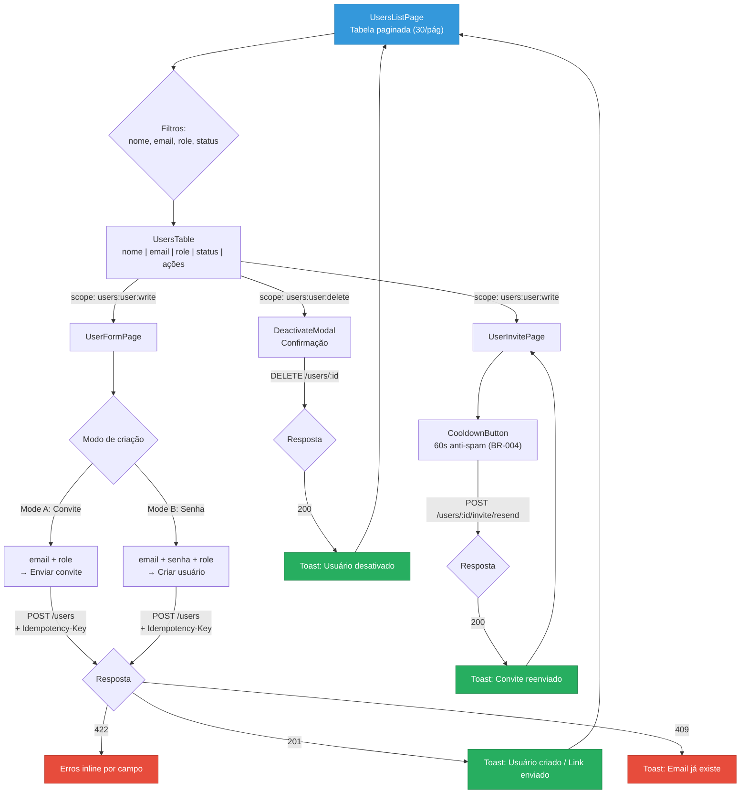

# MOD-002 — Fluxo UX de Gestão de Usuários

```mermaid
flowchart TD
    LIST["UsersListPage<br/>Tabela paginada (30/pág)"] --> FILTER{"Filtros:<br/>nome, email, role, status"}
    FILTER --> TABLE["UsersTable<br/>nome | email | role | status | ações"]

    TABLE -->|"scope: users:user:write"| CREATE["UserFormPage"]
    TABLE -->|"scope: users:user:delete"| DEACTIVATE["DeactivateModal<br/>Confirmação"]
    TABLE -->|"scope: users:user:write"| RESEND["UserInvitePage"]

    CREATE --> MODE{"Modo de criação"}
    MODE -->|"Mode A: Convite"| INVITE["email + role<br/>→ Enviar convite"]
    MODE -->|"Mode B: Senha"| NATIVE["email + senha + role<br/>→ Criar usuário"]

    INVITE -->|"POST /users<br/>+ Idempotency-Key"| R1{"Resposta"}
    NATIVE -->|"POST /users<br/>+ Idempotency-Key"| R1

    R1 -->|201| SUCCESS1["Toast: Usuário criado / Link enviado"]
    R1 -->|409| ERR1["Toast: Email já existe"]
    R1 -->|422| ERR2["Erros inline por campo"]

    DEACTIVATE -->|"DELETE /users/:id"| R2{"Resposta"}
    R2 -->|200| SUCCESS2["Toast: Usuário desativado"]

    RESEND --> COOLDOWN["CooldownButton<br/>60s anti-spam (BR-004)"]
    COOLDOWN -->|"POST /users/:id/invite/resend"| R3{"Resposta"}
    R3 -->|200| SUCCESS3["Toast: Convite reenviado"]

    SUCCESS1 --> LIST
    SUCCESS2 --> LIST
    SUCCESS3 --> RESEND

    classDef trigger fill:#3498DB,color:#fff,stroke:#2980B9
    classDef success fill:#27AE60,color:#fff,stroke:#1E8449
    classDef error fill:#E74C3C,color:#fff,stroke:#C0392B

    class LIST trigger
    class SUCCESS1,SUCCESS2,SUCCESS3 success
    class ERR1,ERR2 error
```
