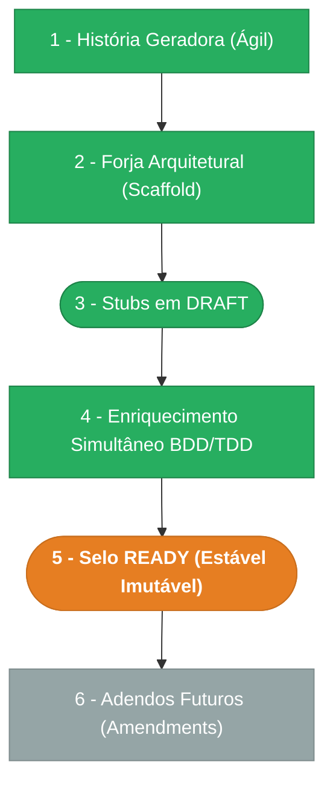

> ⚠️ **ARQUIVO GERIDO POR AUTOMAÇÃO.**
>
> - **Status DRAFT:** Enriqueça o conteúdo deste arquivo diretamente.
> - **Status READY:** NÃO EDITE DIRETAMENTE. Use a skill `create-amendment`.

# CHANGELOG - MOD-003

## Ciclo de Estabilidade do Módulo

> 🟢 Verde = Concluído | 🟠 Laranja = Em Andamento | 🔵 Azul = Estável Ancestral | ⬜ Cinza = Previsto

*O módulo está na **Etapa 5 — Selo READY (Estável Imutável). Alterações futuras via `create-amendment`.**

---

## Histórico de Versões

| Versão | Data | Responsável | Descrição |
|--------|------|-------------|-----------|
| 1.2.1 | 2026-03-25 | merge-amendment | Merge FR-001-C02: fix createOrgUnitEvent() tenantId — SYSTEM_TENANT_ID para CRUD events (cross-tenant ADR-003), tenantId explícito em link/unlink. Base FR-001 bumped para v0.3.1. Ref: spec-fix-domain-events-tenant-id v2.0. |
| 1.2.0 | 2026-03-25 | codegen | Codegen re-run: 6 agentes executados, 4 arquivos atualizados/criados. Correções: FKs cross-module em org-units.ts (createdBy→users.id, parentId self-ref), infrastructure/schema.ts criado, barrel export desambiguado, OpenAPI spec mod-003-org-units.yaml gerado (9 paths). VAL: 0 checks_failed. |
| 1.1.0 | 2026-03-24 | validate-all | Validação pós-codegen: lint PASS (0 erros), format PASS, arquitetura PASS (DomainError+type+statusHint, Pattern A web, @tanstack/react-query), Drizzle PASS (2 tabelas, checks, indexes), Endpoints PASS (9 routes, scopes, idempotency), Manifests PASS (2 screens). PENDENTE-007 → RESOLVIDA (lint agora passa). Veredicto: APROVADO. |
| 1.0.0 | 2026-03-23 | promote-module | Promoção DRAFT→READY: manifesto v1.0.0, todos os requisitos e ADRs selados. Épico + 4 features já READY. Ciclo de estabilidade avança para Etapa 5. |
| 0.2.1 | 2026-03-18 | Marcos Sulivan | Correção UX-001 passo 3 jornada Ver Histórico: `(filtrado por tenant_id)` → `(protegido por org:unit:read)`. Alinha com ADR-003/SEC-002 (org_units cross-tenant). Resolve PENDENTE-006. |
| 0.2.0 | 2026-03-17 | arquitetura | Amendments US-MOD-003-M01 e US-MOD-003-F01-M01: inclui F04 (Restore) no épico (tree §8, tabela §8, endpoints §10) e adiciona evento org.unit_restored à tabela de F01. Resolve PENDENTE-001. Corrige view_rule de F04 (remove tenantMatch — ADR-003). |
| 0.1.1 | 2026-03-17 | arquitetura | Amendment FR-001-C01: documenta estratégia de constraint catch (PostgreSQL 23505 → 409) para unicidade de codigo. Resolve PENDENTE-005. |
| 0.1.0 | 2026-03-16 | arquitetura | Baseline Inicial — scaffold gerado via `forge-module` a partir de US-MOD-003 (READY). Stubs obrigatórios criados: DATA-003, SEC-002. Todos os itens nascem em `estado_item: DRAFT`. |
