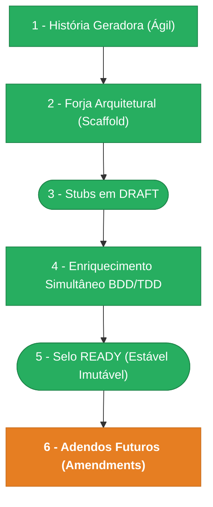

> ⚠️ **ARQUIVO GERIDO POR AUTOMAÇÃO.**
>
> - **Status DRAFT:** Enriqueça o conteúdo deste arquivo diretamente.
> - **Status READY:** NÃO EDITE DIRETAMENTE. Use a skill `create-amendment`.

# CHANGELOG - MOD-003

## Ciclo de Estabilidade do Módulo

> 🟢 Verde = Concluído | 🟠 Laranja = Em Andamento | 🔵 Azul = Estável Ancestral | ⬜ Cinza = Previsto

*O módulo está na **Etapa 6 — Adendos Futuros (Amendments). Amendments UX-001-M01, DATA-001-M01, FR-001-M01 em DRAFT.**

---

## Histórico de Versões

| Versão | Data | Responsável | Descrição |
|--------|------|-------------|-----------|
| 1.14.0 | 2026-03-31 | codegen | Codegen F05 (departamentos): 6 agentes, 28 arquivos. Camadas: DB (3), CORE (4), APP (8), API (4), WEB (9). Schema Drizzle, entity DDD, 6 use cases, 6 endpoints Fastify, React page + hooks + components. TS: 0 erros. |
| 1.13.0 | 2026-03-31 | arquitetura | User Story US-MOD-003-F05 (CRUD Departamentos) criada em READY. Épico US-MOD-003 atualizado v1.2.0 com F04 e F05. DoR completo — pronto para codegen. |
| 1.12.0 | 2026-03-31 | merge-amendment | Merge SEC-001-M01 + SEC-002-M01 + UX-001-C03: escopos org:dept:* no SEC-001 (v0.3.0), 4 events departamentos no SEC-002 (v0.3.0), toggle→badge+botão no UX-001 (v0.4.2). Todos os 3 amendments MERGED. |
| 1.11.0 | 2026-03-31 | promote | Promoção DRAFT → READY: FR-002 v1.0.0, DATA-002 v1.0.0, BR-002 v1.0.0, UX-002 v1.0.0. Validação cruzada 5 agentes — PASS (3 correções menores aplicadas em UX-002). Todos os documentos de departamentos selados. |
| 1.10.0 | 2026-03-31 | manage-pendentes | PENDENTE-010 → IMPLEMENTADA (Opção B): toggle status substituído por ReadOnlyBadge + BtnDesativar no InlineEditCard. Fluxo DELETE com DeactivateModal preservado. Amendment UX-001-C03 criado e merged. Base UX-001 bumped v0.4.2. |
| 1.9.0 | 2026-03-30 | arquitetura | Especificação CRUD de Departamentos (Fase 1): FR-002 (FR-007 — 6 endpoints, 12 cenários Gherkin), DATA-002 (tabela departments, por tenant), BR-002 (BR-013–BR-018), SEC-001-M01 (escopos org:dept:*), SEC-002-M01 (4 domain events), UX-002 (UX-ORG-003 — listagem + drawer + color picker), 12-departments-spec.md (spec visual). PENDENTE-008 → DECIDIDA. |
| 1.8.2 | 2026-03-30 | merge-amendment | Merge UX-001-C02: Guard de edição inline — diálogo de confirmação ao navegar com alterações não salvas. Elevação isEditing/isDirty para OrgTreePage, guardedAction, ConfirmationModal variant default. Base UX-001 bumped v0.4.1. Ref: spec-org-units-edit-guard.md. |
| 1.8.1 | 2026-03-30 | create-amendment | Amendment UX-001-C02: Guard de edição inline — diálogo de confirmação ao sair do modo edição com alterações não salvas. Elevação isEditing/isDirty para OrgTreePage, guardedAction intercepta handleSelect/handleOpenCreate/handleOpenEdit. Ref: spec-org-units-edit-guard.md. |
| 1.8.0 | 2026-03-30 | merge-amendment | Merge UX-001-M02: Inline Edit no DetailPanel substitui FormPanel para edição. InlineEditCard (novo), HierarchyCard (novo), FormPanel restrito a criação. Base UX-001 bumped v0.4.0. Ref: 10-org-detail-inline-edit-spec.md. |
| 1.7.0 | 2026-03-30 | create-amendment | Amendment UX-001-M02: Inline Edit no DetailPanel substitui FormPanel para edição de dados cadastrais. Novos componentes InlineEditCard e HierarchyCard. Árvore permanece visível durante edição. Ref: 10-org-detail-inline-edit-spec.md. |
| 1.6.0 | 2026-03-30 | merge-amendment | Merge UX-001-C01: fix error handling silencioso no OrgFormPage — erros 5xx/400/403/rede devem mostrar feedback, extractFieldErrors RFC 9457 obrigatório em 422, networkError no COPY, paridade CreateOrgUnitRequest com API. Base UX-001 bumped v0.3.1. Ref: spec-fix-org-unit-create-silent-failure v2.0. |
| 1.5.2 | 2026-03-30 | create-amendment | Amendment UX-001-C01: fix error handling silencioso no OrgFormPage — erros 5xx/400/403 não mostravam feedback, extractFieldErrors não chamada, campos faltando no CreateOrgUnitRequest. Ref: spec-fix-org-unit-create-silent-failure v2.0. |
| 1.5.1 | 2026-03-30 | merge-amendment | Merge INT-001-C01: handler GET /tree mapeamento camelCase→snake_case (tenantId→tenant_id). Seção §8 adicionada ao INT-001. Base bumped para v0.3.1. |
| 1.5.0 | 2026-03-29 | codegen | Codegen parcial: AGN-COD-WEB + AGN-COD-VAL (2 agentes, 13 arquivos). Camadas: web, validation. Split-panel layout, DetailPanel, FormPanel inline 480px, DeactivateModal customizado, OrgTreeNode com Lucide icons, ReadOnlyField, campos cadastrais FR-006. VAL: 10/10 checks PASS. |
| 1.4.0 | 2026-03-29 | merge-amendment | Merge UX-001-M01: split-panel layout, DetailPanel, FormPanel inline, modal desativacao, TreeNode visual, ReadOnlyField. Base UX-001 bumped v0.3.0. |
| 1.3.1 | 2026-03-29 | merge-amendment | Merge DATA-001-M01: 6 campos cadastrais (cnpj, razao_social, filial, responsavel, telefone, email_contato). Base DATA-001 bumped v0.3.0. |
| 1.3.0 | 2026-03-29 | merge-amendment | Merge FR-001-M01 + create-amendment batch: FR-006 campos cadastrais nos endpoints CRUD. Base FR-001 bumped v0.4.0. 3 pendencias criadas (PENDENTE-008/009/010). Ref: specs Penpot 10-OrgTree, 11-OrgForm. |
| 1.2.2 | 2026-03-25 | merge-amendment | Merge FR-001-C03: fix 500 schema mismatch em GET list, GET detail, PATCH update — handlers devem mapear camelCase→snake_case + Date→ISO string. Base FR-001 bumped para v0.3.2. Ref: spec-fix-org-units-response-schema-mismatch. |
| 1.2.1 | 2026-03-25 | merge-amendment | Merge FR-001-C02: fix createOrgUnitEvent() tenantId — SYSTEM_TENANT_ID para CRUD events (cross-tenant ADR-003), tenantId explícito em link/unlink. Base FR-001 bumped para v0.3.1. Ref: spec-fix-domain-events-tenant-id v2.0. |
| 1.2.0 | 2026-03-25 | codegen | Codegen re-run: 6 agentes executados, 4 arquivos atualizados/criados. Correções: FKs cross-module em org-units.ts (createdBy→users.id, parentId self-ref), infrastructure/schema.ts criado, barrel export desambiguado, OpenAPI spec mod-003-org-units.yaml gerado (9 paths). VAL: 0 checks_failed. |
| 1.1.0 | 2026-03-24 | validate-all | Validação pós-codegen: lint PASS (0 erros), format PASS, arquitetura PASS (DomainError+type+statusHint, Pattern A web, @tanstack/react-query), Drizzle PASS (2 tabelas, checks, indexes), Endpoints PASS (9 routes, scopes, idempotency), Manifests PASS (2 screens). PENDENTE-007 → RESOLVIDA (lint agora passa). Veredicto: APROVADO. |
| 1.0.0 | 2026-03-23 | promote-module | Promoção DRAFT→READY: manifesto v1.0.0, todos os requisitos e ADRs selados. Épico + 4 features já READY. Ciclo de estabilidade avança para Etapa 5. |
| 0.2.1 | 2026-03-18 | Marcos Sulivan | Correção UX-001 passo 3 jornada Ver Histórico: `(filtrado por tenant_id)` → `(protegido por org:unit:read)`. Alinha com ADR-003/SEC-002 (org_units cross-tenant). Resolve PENDENTE-006. |
| 0.2.0 | 2026-03-17 | arquitetura | Amendments US-MOD-003-M01 e US-MOD-003-F01-M01: inclui F04 (Restore) no épico (tree §8, tabela §8, endpoints §10) e adiciona evento org.unit_restored à tabela de F01. Resolve PENDENTE-001. Corrige view_rule de F04 (remove tenantMatch — ADR-003). |
| 0.1.1 | 2026-03-17 | arquitetura | Amendment FR-001-C01: documenta estratégia de constraint catch (PostgreSQL 23505 → 409) para unicidade de codigo. Resolve PENDENTE-005. |
| 0.1.0 | 2026-03-16 | arquitetura | Baseline Inicial — scaffold gerado via `forge-module` a partir de US-MOD-003 (READY). Stubs obrigatórios criados: DATA-003, SEC-002. Todos os itens nascem em `estado_item: DRAFT`. |
