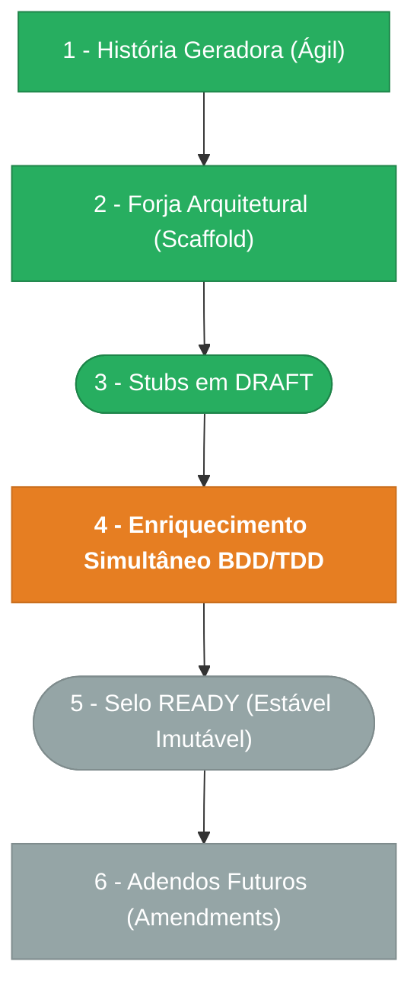

> ⚠️ **ARQUIVO GERIDO POR AUTOMAÇÃO.**
>
> - **Status DRAFT:** Enriqueça o conteúdo deste arquivo diretamente.
> - **Status READY:** NÃO EDITE DIRETAMENTE. Use a skill `create-amendment`.

# CHANGELOG - MOD-003

## Ciclo de Estabilidade do Módulo

> 🟢 Verde = Concluído | 🟠 Laranja = Em Andamento | 🔵 Azul = Estável Ancestral | ⬜ Cinza = Previsto

*O módulo está na **Etapa 4** — stubs gerados em DRAFT, desenvolvimento em ritmo acelerado.*

---

## Histórico de Versões

| Versão | Data | Responsável | Descrição |
|--------|------|-------------|-----------|
| 0.2.1 | 2026-03-18 | Marcos Sulivan | Correção UX-001 passo 3 jornada Ver Histórico: `(filtrado por tenant_id)` → `(protegido por org:unit:read)`. Alinha com ADR-003/SEC-002 (org_units cross-tenant). Resolve PENDENTE-006. |
| 0.2.0 | 2026-03-17 | arquitetura | Amendments US-MOD-003-M01 e US-MOD-003-F01-M01: inclui F04 (Restore) no épico (tree §8, tabela §8, endpoints §10) e adiciona evento org.unit_restored à tabela de F01. Resolve PENDENTE-001. Corrige view_rule de F04 (remove tenantMatch — ADR-003). |
| 0.1.1 | 2026-03-17 | arquitetura | Amendment FR-001-C01: documenta estratégia de constraint catch (PostgreSQL 23505 → 409) para unicidade de codigo. Resolve PENDENTE-005. |
| 0.1.0 | 2026-03-16 | arquitetura | Baseline Inicial — scaffold gerado via `forge-module` a partir de US-MOD-003 (READY). Stubs obrigatórios criados: DATA-003, SEC-002. Todos os itens nascem em `estado_item: DRAFT`. |
