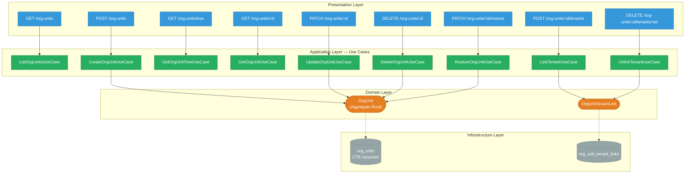

# MOD-003 — Arquitetura de Camadas (DDD-lite, Nível 2)

```mermaid
graph TD
    subgraph PRESENTATION ["Presentation Layer"]
        R1["GET /org-units"]
        R2["POST /org-units"]
        R3["GET /org-units/tree"]
        R4["GET /org-units/:id"]
        R5["PATCH /org-units/:id"]
        R6["DELETE /org-units/:id"]
        R7["PATCH /org-units/:id/restore"]
        R8["POST /org-units/:id/tenants"]
        R9["DELETE /org-units/:id/tenants/:tid"]
    end

    subgraph APPLICATION ["Application Layer — Use Cases"]
        UC1["ListOrgUnitsUseCase"]
        UC2["CreateOrgUnitUseCase"]
        UC3["GetOrgUnitTreeUseCase"]
        UC4["GetOrgUnitUseCase"]
        UC5["UpdateOrgUnitUseCase"]
        UC6["DeleteOrgUnitUseCase"]
        UC7["RestoreOrgUnitUseCase"]
        UC8["LinkTenantUseCase"]
        UC9["UnlinkTenantUseCase"]
    end

    subgraph DOMAIN ["Domain Layer"]
        E1(["OrgUnit<br/>(Aggregate Root)"])
        E2(["OrgUnitTenantLink"])
    end

    subgraph INFRA ["Infrastructure Layer"]
        DB1[("org_units<br/>CTE recursivo")]
        DB2[("org_unit_tenant_links")]
    end

    R1 --> UC1
    R2 --> UC2
    R3 --> UC3
    R4 --> UC4
    R5 --> UC5
    R6 --> UC6
    R7 --> UC7
    R8 --> UC8
    R9 --> UC9

    UC2 --> E1
    UC5 --> E1
    UC6 --> E1
    UC7 --> E1
    UC8 --> E2
    UC9 --> E2

    E1 -.-> DB1
    E2 -.-> DB2

    classDef presentation fill:#3498DB,stroke:#2980B9,color:#fff
    classDef application fill:#27AE60,stroke:#1E8449,color:#fff
    classDef domain fill:#E67E22,stroke:#CA6F1E,color:#fff
    classDef infra fill:#95A5A6,stroke:#7F8C8D,color:#fff

    class R1,R2,R3,R4,R5,R6,R7,R8,R9 presentation
    class UC1,UC2,UC3,UC4,UC5,UC6,UC7,UC8,UC9 application
    class E1,E2 domain
    class DB1,DB2 infra
```
