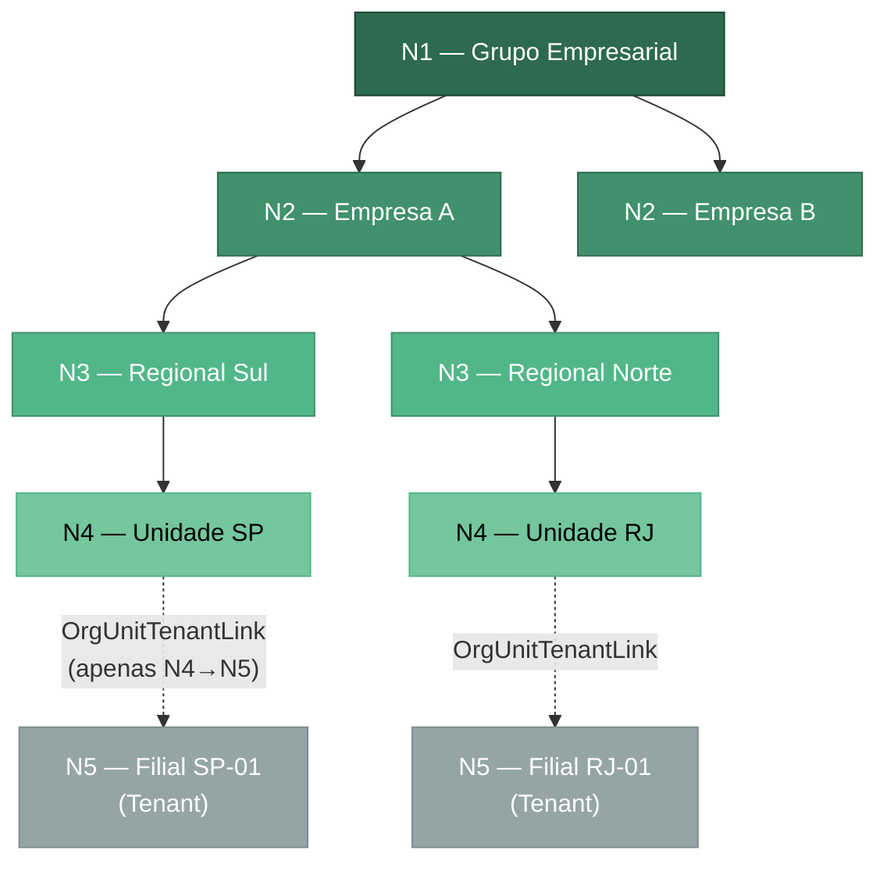

# MOD-003 — Modelo de Domínio

## Hierarquia Organizacional (5 Níveis)



## Entidades e Relacionamentos

```mermaid
erDiagram
    ORG_UNIT ||--o{ ORG_UNIT : "parent_id (N1→N2→N3→N4)"
    ORG_UNIT ||--o{ ORG_UNIT_TENANT_LINK : "apenas nivel=4"
    TENANT ||--o{ ORG_UNIT_TENANT_LINK : "N5 = tenant existente"

    ORG_UNIT {
        uuid id PK
        varchar codigo UK "imutável"
        varchar nome
        text descricao
        int nivel "CHECK 1-4, imutável"
        uuid parent_id FK "imutável"
        varchar status "ACTIVE|INACTIVE"
        timestamptz deleted_at "soft-delete"
    }

    ORG_UNIT_TENANT_LINK {
        uuid id PK
        uuid org_unit_id FK_UK "CHECK nivel=4"
        uuid tenant_id FK_UK
        uuid created_by FK
        timestamptz deleted_at "soft-unlink"
    }

    TENANT {
        uuid id PK
        varchar codigo UK
        varchar name
        varchar status
    }
```
