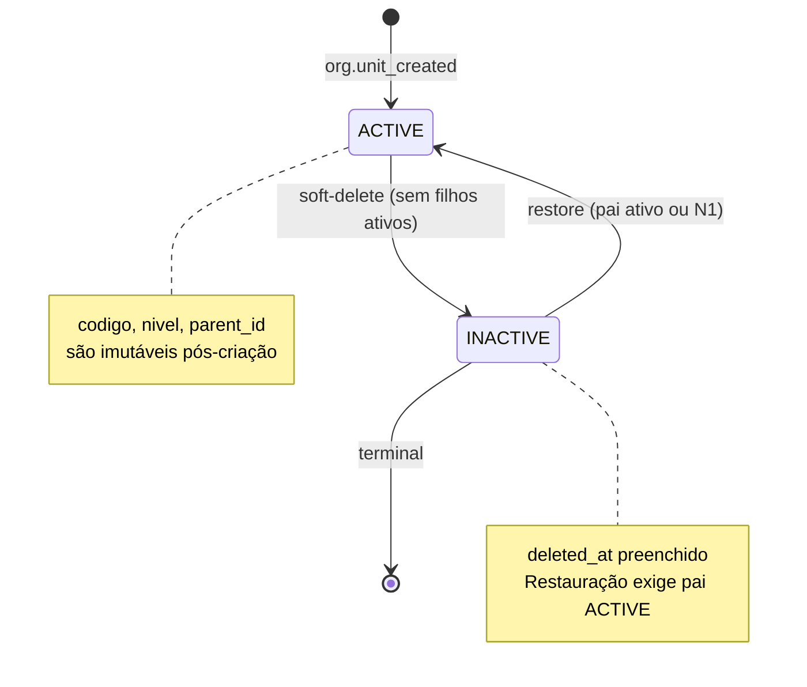

# MOD-003 — Máquinas de Estado

## OrgUnit Status

```mermaid
stateDiagram-v2
    [*] --> ACTIVE : org.unit_created
    ACTIVE --> INACTIVE : soft-delete (sem filhos ativos)
    INACTIVE --> ACTIVE : restore (pai ativo ou N1)
    INACTIVE --> [*] : terminal

    note right of ACTIVE
        codigo, nivel, parent_id
        são imutáveis pós-criação
    end note

    note right of INACTIVE
        deleted_at preenchido
        Restauração exige pai ACTIVE
    end note
```
