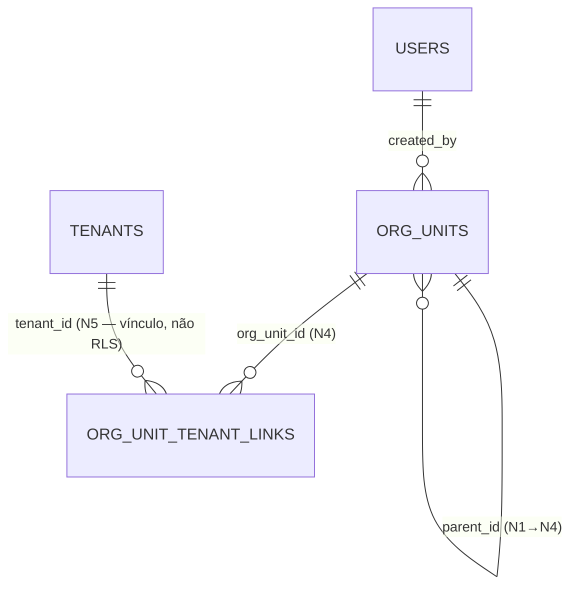

> ⚠️ **ARQUIVO GERIDO POR AUTOMAÇÃO.**
> - **Status DRAFT:** Enriqueça o conteúdo deste arquivo diretamente.
> - **Status READY:** NÃO EDITE DIRETAMENTE. Use a skill `create-amendment`.
>
> | Versão | Data       | Responsável | Status/Integração |
> |--------|------------|-------------|-------------------|
> | 0.2.0  | 2026-03-17 | AGN-DEV-04  | Enriquecimento: migração, validações BR-010/BR-011/BR-012, idempotência, Drizzle hints |
> | 0.1.0  | 2026-03-16 | arquitetura | Baseline Inicial (forge-module) |

# DATA-001 — Modelo de Dados da Estrutura Organizacional

> Permitir gerar **modelo**, **migração**, **queries** e **contratos** sem inferência arriscada.

- **Objetivo:** Documentar as entidades de banco do módulo MOD-003 — Estrutura Organizacional. Este módulo é **full-stack** e possui entidades próprias: `org_units` (N1–N4) e `org_unit_tenant_links` (vinculação N4→N5/tenant).
- **Tipo de Tabela/Armazenamento:** Relacional (SQL — PostgreSQL)

---

## Tabela: `org_units`

| Campo | Tipo DB | Nulidade | Default | Constraints | Descrição |
|---|---|---|---|---|---|
| `id` | uuid | NOT NULL | gen_random_uuid() | PK | Identificador técnico |
| `codigo` | varchar(50) | NOT NULL | — | UNIQUE | Identificador amigável (ex: GC-001, UN-SP). Imutável após criação. Único globalmente (tabela cross-tenant). |
| `nome` | varchar(200) | NOT NULL | — | — | Nome da unidade organizacional |
| `descricao` | text | NULL | — | — | Descrição opcional |
| `nivel` | integer | NOT NULL | — | CHECK (nivel BETWEEN 1 AND 4) | 1=Grupo Corp., 2=Unidade, 3=Macroárea, 4=Subunidade. Derivado do pai. |
| `parent_id` | uuid | NULL | — | FK → org_units(id) ON DELETE RESTRICT | Nulo apenas para N1 |
| `status` | varchar(20) | NOT NULL | 'ACTIVE' | CHECK (status IN ('ACTIVE','INACTIVE')) | Soft delete via status + deleted_at |
| `created_by` | uuid | NOT NULL | — | FK → users(id) | Quem criou |
| `created_at` | timestamptz | NOT NULL | now() | — | Data de criação |
| `updated_at` | timestamptz | NOT NULL | now() | — | Última atualização |
| `deleted_at` | timestamptz | NULL | — | — | Soft delete |

### Índices

| Nome | Colunas | Condição |
|---|---|---|
| `idx_org_units_codigo` | `codigo` | `WHERE deleted_at IS NULL` |
| `idx_org_units_parent` | `parent_id` | `WHERE deleted_at IS NULL` |
| `idx_org_units_nivel` | `nivel` | `WHERE deleted_at IS NULL` |
| `idx_org_units_status` | `status` | `WHERE deleted_at IS NULL` |

---

## Tabela: `org_unit_tenant_links`

| Campo | Tipo DB | Nulidade | Default | Constraints | Descrição |
|---|---|---|---|---|---|
| `id` | uuid | NOT NULL | gen_random_uuid() | PK | Identificador técnico |
| `org_unit_id` | uuid | NOT NULL | — | FK → org_units(id) ON DELETE RESTRICT | Deve ser nível N4 |
| `tenant_id` | uuid | NOT NULL | — | FK → tenants(id) ON DELETE RESTRICT | Tenant vinculado (N5). **NOTA: FK de vínculo N4→N5, NÃO é coluna RLS.** |
| `created_by` | uuid | NOT NULL | — | FK → users(id) | Quem criou o vínculo |
| `created_at` | timestamptz | NOT NULL | now() | — | Data de criação |
| `deleted_at` | timestamptz | NULL | — | — | Soft unlink |

### Constraints

- `UNIQUE (org_unit_id, tenant_id)` — mesmo par não pode aparecer duas vezes.

### Índices

| Nome | Colunas | Condição |
|---|---|---|
| `idx_outl_org_unit` | `org_unit_id` | `WHERE deleted_at IS NULL` |

---

## Restrições de Integridade da Árvore

1. N1 não tem `parent_id` (nullable)
2. N2 deve ter `parent_id` apontando para N1
3. N3 deve ter `parent_id` apontando para N2
4. N4 deve ter `parent_id` apontando para N3
5. `nivel` deve ser exatamente `parent.nivel + 1`
6. Prevenção de loop: um nó não pode ser ancestral de si mesmo (validado com CTE)
7. Toda FK tem `ON DELETE RESTRICT` — NUNCA `CASCADE`
8. **Nível máximo N4 (BR-011):** Filhos de nós N4 na tabela `org_units` são rejeitados (nivel > 4 bloqueado). N5 representado exclusivamente via `org_unit_tenant_links`
9. **parent_id imutável (BR-010):** O campo `parent_id` não pode ser alterado após criação. Movimentação de nós está fora do escopo (roadmap futuro — MOD-003 v2)
10. **codigo imutável (BR-003):** O campo `codigo` não pode ser alterado após criação. PATCH com `codigo` retorna 422

## Validações de Negócio no Backend (Application Layer)

| Validação | Regra de Negócio | Endpoint | Resposta de Erro |
|---|---|---|---|
| Nível derivado do pai | `nivel = parent.nivel + 1`; N1 se `parent_id=null` | POST /org-units | 422 se pai não existir |
| Nível máximo N4 | Rejeitar se `parent.nivel = 4` | POST /org-units | 422 "Nível máximo (N4) atingido" |
| Loop detection | CTE recursivo verifica ancestralidade | POST /org-units | 422 "Operação criaria loop" |
| Soft delete condicional | Nó sem filhos ativos (`status=ACTIVE AND deleted_at IS NULL`) | DELETE /org-units/:id | 422 + `active_children[]` |
| Restore condicional | Pai deve estar ativo (ou ser raiz/N1) | PATCH /org-units/:id/restore | 422 "Nó pai está inativo" |
| Vinculação N4 only | `org_unit.nivel = 4` | POST /org-units/:id/tenants | 422 "Só permitida em N4" |
| Código imutável | Rejeitar `codigo` em body de PATCH | PATCH /org-units/:id | 422 "Campo imutável" |
| Parent_id imutável | Rejeitar `parent_id` em body de PATCH | PATCH /org-units/:id | 422 "Campo imutável" |
| Unicidade de código | UNIQUE constraint; catch PostgreSQL 23505 → 409 | POST /org-units | 409 Conflict |
| Idempotência | `Idempotency-Key` header com TTL 60s | POST /org-units, POST /:id/tenants | 201 (resultado original) |

## Idempotência (BR-012)

- Endpoints `POST /org-units` e `POST /org-units/:id/tenants` DEVEM aceitar header `Idempotency-Key`
- Armazenamento: tabela `idempotency_keys` do MOD-000 (Foundation) — não criar tabela paralela
- TTL: 60 segundos — requisições com mesma chave dentro do TTL retornam resultado original
- Chave duplicada após TTL: operação executada normalmente (nova chave)

## Migração (Drizzle Schema Hints)

- **Schema file:** `src/modules/org-units/schema.ts`
- **Tabela `org_units`:** `pgTable('org_units', { ... })` com campos tipados via Drizzle ORM
- **Tabela `org_unit_tenant_links`:** `pgTable('org_unit_tenant_links', { ... })`
- **Índices parciais:** usar `.where(isNull(schema.deletedAt))` para filtro `WHERE deleted_at IS NULL`
- **FK self-referencing:** `parent_id` referencia `org_units.id` com `onDelete: 'restrict'`
- **CHECK constraint nivel:** `check('nivel_check', sql\`nivel BETWEEN 1 AND 4\`)`
- **Seed:** Não requerido para produção. Para dev/test: árvore mínima N1→N2→N3→N4 + 1 tenant vinculado

---

## Eventos do domínio

- `org.unit_created` | `org.unit_updated` | `org.unit_deleted` | `org.unit_restored` | `org.tenant_linked` | `org.tenant_unlinked`

## Auditoria / Event Sourcing

- Usa `domain_events` (tabela existente do MOD-000). Proibida criação 1-para-1 de tabelas de log.

### Diagrama ERD (Mermaid) — Entidades núcleo

> **Nota arquitetural:** A tabela `org_units` é **cross-tenant por design** — não possui coluna `tenant_id`. A hierarquia organizacional abrange múltiplos tenants por natureza. O isolamento de acesso é feito via RBAC (`@RequireScope`) e não via RLS por tenant. Ver ADR-003.

- **estado_item:** DRAFT
- **owner:** arquitetura
- **data_ultima_revisao:** 2026-03-17
- **rastreia_para:** US-MOD-003, US-MOD-003-F01, US-MOD-003-F04, FR-001, FR-004, FR-005, BR-001, BR-002, BR-003, BR-005, BR-006, BR-008, BR-009, BR-010, BR-011, BR-012, DATA-003, SEC-001, SEC-002, ADR-003, INT-001
- **referencias_exemplos:** EX-CI-005, EX-CI-007, EX-CI-006
- **evidencias:** N/A
