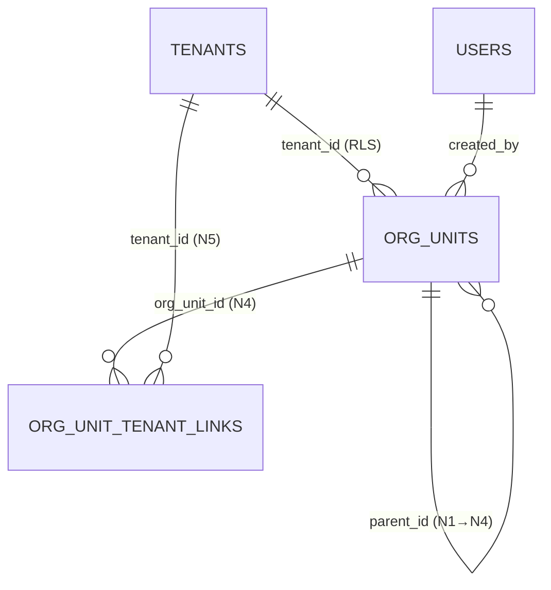

> ⚠️ **ARQUIVO GERIDO POR AUTOMAÇÃO.**
> - **Status DRAFT:** Enriqueça o conteúdo deste arquivo diretamente.
> - **Status READY:** NÃO EDITE DIRETAMENTE. Use a skill `create-amendment`.
>
> | Versão | Data       | Responsável | Status/Integração |
> |--------|------------|-------------|-------------------|
> | 0.1.0  | 2026-03-16 | arquitetura | Baseline Inicial (forge-module) |

# DATA-001 — Modelo de Dados da Estrutura Organizacional

> Permitir gerar **modelo**, **migração**, **queries** e **contratos** sem inferência arriscada.

- **Objetivo:** Documentar as entidades de banco do módulo MOD-003 — Estrutura Organizacional. Este módulo é **full-stack** e possui entidades próprias: `org_units` (N1–N4) e `org_unit_tenant_links` (vinculação N4→N5/tenant).
- **Tipo de Tabela/Armazenamento:** Relacional (SQL — PostgreSQL)

---

## Tabela: `org_units`

| Campo | Tipo DB | Nulidade | Default | Constraints | Descrição |
|---|---|---|---|---|---|
| `id` | uuid | NOT NULL | gen_random_uuid() | PK | Identificador técnico |
| `tenant_id` | uuid | NOT NULL | — | FK → tenants(id) ON DELETE RESTRICT | Tenant proprietário da árvore. Filtro obrigatório em todas as queries (RLS). |
| `codigo` | varchar(50) | NOT NULL | — | UNIQUE(tenant_id, codigo) | Identificador amigável (ex: GC-001, UN-SP). Imutável após criação. Único por tenant. |
| `nome` | varchar(200) | NOT NULL | — | — | Nome da unidade organizacional |
| `descricao` | text | NULL | — | — | Descrição opcional |
| `nivel` | integer | NOT NULL | — | CHECK (nivel BETWEEN 1 AND 4) | 1=Grupo Corp., 2=Unidade, 3=Macroárea, 4=Subunidade. Derivado do pai. |
| `parent_id` | uuid | NULL | — | FK → org_units(id) ON DELETE RESTRICT | Nulo apenas para N1 |
| `status` | varchar(20) | NOT NULL | 'ACTIVE' | CHECK (status IN ('ACTIVE','INACTIVE')) | Soft delete via status + deleted_at |
| `created_by` | uuid | NOT NULL | — | FK → users(id) | Quem criou |
| `created_at` | timestamptz | NOT NULL | now() | — | Data de criação |
| `updated_at` | timestamptz | NOT NULL | now() | — | Última atualização |
| `deleted_at` | timestamptz | NULL | — | — | Soft delete |

### Índices

| Nome | Colunas | Condição |
|---|---|---|
| `idx_org_units_tenant` | `tenant_id` | — |
| `idx_org_units_tenant_codigo` | `tenant_id, codigo` | `WHERE deleted_at IS NULL` (suporta UNIQUE constraint) |
| `idx_org_units_parent` | `parent_id` | `WHERE deleted_at IS NULL` |
| `idx_org_units_nivel` | `tenant_id, nivel` | `WHERE deleted_at IS NULL` |
| `idx_org_units_status` | `tenant_id, status` | `WHERE deleted_at IS NULL` |

---

## Tabela: `org_unit_tenant_links`

| Campo | Tipo DB | Nulidade | Default | Constraints | Descrição |
|---|---|---|---|---|---|
| `id` | uuid | NOT NULL | gen_random_uuid() | PK | Identificador técnico |
| `org_unit_id` | uuid | NOT NULL | — | FK → org_units(id) ON DELETE RESTRICT | Deve ser nível N4 |
| `tenant_id` | uuid | NOT NULL | — | FK → tenants(id) ON DELETE RESTRICT | Tenant existente (MOD-000-F07) |
| `created_by` | uuid | NOT NULL | — | FK → users(id) | Quem criou o vínculo |
| `created_at` | timestamptz | NOT NULL | now() | — | Data de criação |
| `deleted_at` | timestamptz | NULL | — | — | Soft unlink |

### Constraints

- `UNIQUE (org_unit_id, tenant_id)` — mesmo par não pode aparecer duas vezes.

### Índices

| Nome | Colunas | Condição |
|---|---|---|
| `idx_outl_org_unit` | `org_unit_id` | `WHERE deleted_at IS NULL` |

---

## Restrições de Integridade da Árvore

1. N1 não tem `parent_id` (nullable)
2. N2 deve ter `parent_id` apontando para N1
3. N3 deve ter `parent_id` apontando para N2
4. N4 deve ter `parent_id` apontando para N3
5. `nivel` deve ser exatamente `parent.nivel + 1`
6. Prevenção de loop: um nó não pode ser ancestral de si mesmo (validado com CTE)
7. Toda FK tem `ON DELETE RESTRICT` — NUNCA `CASCADE`

---

## Eventos do domínio

- `org.unit_created` | `org.unit_updated` | `org.unit_deleted` | `org.unit_restored` | `org.tenant_linked` | `org.tenant_unlinked`

## Auditoria / Event Sourcing

- Usa `domain_events` (tabela existente do MOD-000). Proibida criação 1-para-1 de tabelas de log.

### Diagrama ERD (Mermaid) — Entidades núcleo

- **estado_item:** DRAFT
- **owner:** arquitetura
- **data_ultima_revisao:** 2026-03-16
- **rastreia_para:** US-MOD-003, US-MOD-003-F01, FR-001, FR-004, BR-001, BR-008, DATA-003, SEC-001, SEC-EventMatrix
- **referencias_exemplos:** EX-CI-005, EX-CI-007
- **evidencias:** N/A
