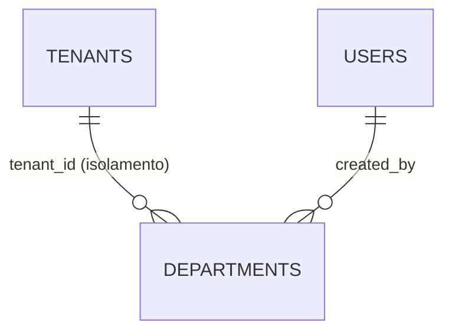

> ⚠️ **ARQUIVO GERIDO POR AUTOMAÇÃO.**
>
> - **Status DRAFT:** Enriqueça o conteúdo deste arquivo diretamente.
> - **Status READY:** NÃO EDITE DIRETAMENTE. Use a skill `create-amendment`.
>
> | Versão | Data       | Responsável | Status/Integração |
> |--------|------------|-------------|-------------------|
> | 1.0.0  | 2026-03-31 | promote | Promoção DRAFT → READY. Validação cruzada: FR-002, BR-002 — PASS. |
> | 0.1.0  | 2026-03-30 | arquitetura | Baseline — Modelo de dados de departamentos (CRUD independente, por tenant) |

# DATA-002 — Modelo de Dados de Departamentos

> Permitir gerar **modelo**, **migração**, **queries** e **contratos** sem inferência arriscada.

- **Objetivo:** Documentar a entidade de banco `departments` do módulo MOD-003 — Estrutura Organizacional. Departamentos são entidades flat (sem hierarquia) isoladas por tenant (`tenant_id`), servindo como tags categorizadoras para unidades organizacionais em fase posterior.
- **Tipo de Tabela/Armazenamento:** Relacional (SQL — PostgreSQL)

---

## Tabela: `departments`

| Campo | Tipo DB | Nulidade | Default | Constraints | Descrição |
|---|---|---|---|---|---|
| `id` | uuid | NOT NULL | gen_random_uuid() | PK | Identificador técnico |
| `tenant_id` | uuid | NOT NULL | — | FK → tenants(id) ON DELETE RESTRICT | Tenant proprietário. Isolamento via filtro por tenant_id (entidade por-tenant, diferente de org_units que é cross-tenant). |
| `codigo` | varchar(50) | NOT NULL | — | UNIQUE(tenant_id, codigo) | Identificador amigável (ex: DEPT-DIR, DEPT-ENG). Imutável após criação. Único por tenant. |
| `nome` | varchar(200) | NOT NULL | — | — | Nome do departamento (ex: "Diretoria", "Engenharia Civil") |
| `descricao` | text | NULL | — | — | Descrição opcional |
| `status` | varchar(20) | NOT NULL | 'ACTIVE' | CHECK (status IN ('ACTIVE','INACTIVE')) | Soft delete via status + deleted_at |
| `cor` | varchar(7) | NULL | — | CHECK (cor ~ '^#[0-9A-Fa-f]{6}$') | Cor hex para exibição como tag colorida (ex: #2E86C1). Validação: formato `#RRGGBB` ou null. |
| `created_by` | uuid | NOT NULL | — | FK → users(id) | Quem criou |
| `created_at` | timestamptz | NOT NULL | now() | — | Data de criação |
| `updated_at` | timestamptz | NOT NULL | now() | — | Última atualização |
| `deleted_at` | timestamptz | NULL | — | — | Soft delete |

### Índices

| Nome | Colunas | Condição |
|---|---|---|
| `idx_departments_tenant_codigo` | `tenant_id, codigo` | `WHERE deleted_at IS NULL` (UNIQUE parcial) |
| `idx_departments_tenant_status` | `tenant_id, status` | `WHERE deleted_at IS NULL` |

### Constraints compostas

| Nome | Tipo | Colunas | Descrição |
|---|---|---|---|
| `uq_departments_tenant_codigo` | UNIQUE | `(tenant_id, codigo)` | Código único por tenant — não global (diferente de org_units BR-008). Catch PostgreSQL 23505 → HTTP 409. |
| `chk_departments_status` | CHECK | `status` | `status IN ('ACTIVE','INACTIVE')` |
| `chk_departments_cor` | CHECK | `cor` | `cor ~ '^#[0-9A-Fa-f]{6}$'` — apenas quando cor IS NOT NULL |

---

## Integridade referencial



### Regras de integridade

1. **Isolamento por tenant:** Todas as queries DEVEM filtrar por `tenant_id` do usuário autenticado (extraído do JWT). Não é cross-tenant (diferente de org_units — ADR-003).
2. **Soft delete:** DELETE seta `status='INACTIVE'` + `deleted_at=now()`. Departamentos inativos são filtrados por padrão nas listagens.
3. **Restore:** PATCH /departments/:id/restore seta `status='ACTIVE'` + `deleted_at=NULL`. Sem restrições adicionais (entidade flat, sem dependências hierárquicas).
4. **Unicidade de codigo:** UNIQUE(tenant_id, codigo) garante unicidade por tenant. Catch de constraint violation 23505 → HTTP 409 RFC 9457.
5. **Codigo imutável:** PATCH com `codigo` no body → 422 "O campo 'codigo' é imutável após criação."
6. **Cor validada pelo banco:** CHECK constraint com regex hex. NULL é aceito (cor opcional).

### Validações

| # | Validação | Quando | Tratamento de erro |
|---|---|---|---|
| V1 | `codigo` unicidade por tenant | INSERT | Catch 23505 → 409 RFC 9457 |
| V2 | `codigo` imutável | UPDATE | Rejeitar campo no handler → 422 |
| V3 | `cor` formato hex válido | INSERT/UPDATE | CHECK constraint → 422 |
| V4 | `tenant_id` existe em tenants | INSERT | FK violation → 400 |
| V5 | Soft limit 100 departamentos por tenant | INSERT | Warning via header X-Limit-Warning (não bloqueia) |
| V6 | `nome` obrigatório (NOT NULL, min 1 char) | INSERT/UPDATE | Zod validation → 422 |
| V7 | Idempotency-Key | INSERT | Via MOD-000 (ADR-004) |

---

## Migração SQL (referência)

```sql
CREATE TABLE departments (
  id            uuid         NOT NULL DEFAULT gen_random_uuid() PRIMARY KEY,
  tenant_id     uuid         NOT NULL REFERENCES tenants(id) ON DELETE RESTRICT,
  codigo        varchar(50)  NOT NULL,
  nome          varchar(200) NOT NULL,
  descricao     text,
  status        varchar(20)  NOT NULL DEFAULT 'ACTIVE'
                             CHECK (status IN ('ACTIVE','INACTIVE')),
  cor           varchar(7)   CHECK (cor ~ '^#[0-9A-Fa-f]{6}$'),
  created_by    uuid         NOT NULL REFERENCES users(id),
  created_at    timestamptz  NOT NULL DEFAULT now(),
  updated_at    timestamptz  NOT NULL DEFAULT now(),
  deleted_at    timestamptz,

  CONSTRAINT uq_departments_tenant_codigo UNIQUE (tenant_id, codigo)
);

CREATE UNIQUE INDEX idx_departments_tenant_codigo
  ON departments (tenant_id, codigo)
  WHERE deleted_at IS NULL;

CREATE INDEX idx_departments_tenant_status
  ON departments (tenant_id, status)
  WHERE deleted_at IS NULL;
```

---

## Drizzle Schema Hints (codegen)

```typescript
// apps/api/src/modules/departments/schema.ts
export const departments = pgTable('departments', {
  id:          uuid('id').primaryKey().defaultRandom(),
  tenantId:    uuid('tenant_id').notNull().references(() => tenants.id),
  codigo:      varchar('codigo', { length: 50 }).notNull(),
  nome:        varchar('nome', { length: 200 }).notNull(),
  descricao:   text('descricao'),
  status:      varchar('status', { length: 20 }).notNull().default('ACTIVE'),
  cor:         varchar('cor', { length: 7 }),
  createdBy:   uuid('created_by').notNull().references(() => users.id),
  createdAt:   timestamp('created_at', { withTimezone: true }).notNull().defaultNow(),
  updatedAt:   timestamp('updated_at', { withTimezone: true }).notNull().defaultNow(),
  deletedAt:   timestamp('deleted_at', { withTimezone: true }),
}, (table) => ({
  uqTenantCodigo: uniqueIndex('uq_departments_tenant_codigo').on(table.tenantId, table.codigo),
  idxTenantStatus: index('idx_departments_tenant_status').on(table.tenantId, table.status),
}));
```

> **Nota:** Departamentos são isolados por `tenant_id` (diferente de `org_units` que é cross-tenant — ADR-003). A vinculação departamentos↔org_units será tratada em fase posterior via tabela associativa `org_unit_departments`.

- **estado_item:** READY
- **owner:** arquitetura
- **data_ultima_revisao:** 2026-03-31
- **rastreia_para:** US-MOD-003, FR-002, BR-002, SEC-001-M01, SEC-002-M01, PEN-003/PENDENTE-008
- **referencias_exemplos:** EX-CI-005, EX-CI-007
- **evidencias:** N/A
