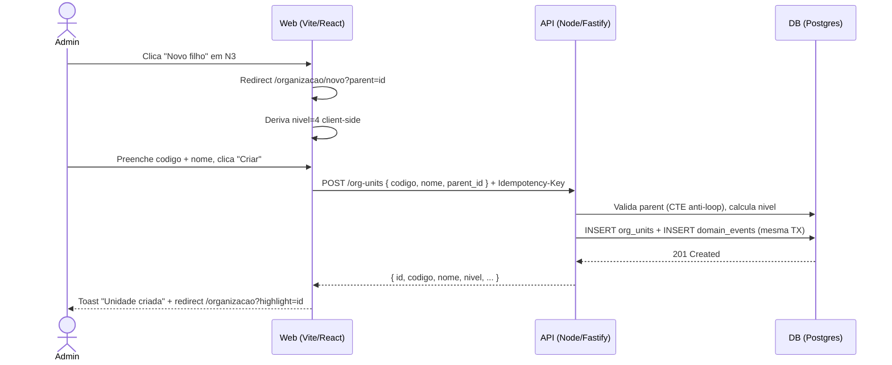

> ⚠️ **ARQUIVO GERIDO POR AUTOMAÇÃO.**
>
> - **Status DRAFT:** Enriqueça o conteúdo deste arquivo diretamente.
> - **Status READY:** NÃO EDITE DIRETAMENTE. Use a skill `create-amendment`.
>
> | Versão | Data       | Responsável | Status/Integração |
> |--------|------------|-------------|-------------------|
> | 0.2.0  | 2026-03-17 | AGN-DEV-07  | Enriquecimento: copy catalog, estados detalhados, acessibilidade expandida, telemetria UX-010, FR-005 integração |
> | 0.2.1  | 2026-03-18 | Marcos Sulivan | Correção: passo 3 jornada Ver Histórico — (filtrado por tenant_id) → (protegido por org:unit:read) — alinha com ADR-003/SEC-002 (PEN-003 PENDENTE-006) |
> | 0.1.0  | 2026-03-16 | arquitetura | Baseline Inicial (forge-module) |

# UX-001 — Jornadas e Fluxos da Estrutura Organizacional

---

## UX-001 — Árvore Organizacional (UX-ORG-001)

- **Screen ID:** UX-ORG-001
- **Manifest:** `docs/05_manifests/screens/ux-org-001.*.yaml`
- **Entidade(s):** `org_unit`, `tenant`
- **Contexto:** Tela de visualização hierárquica da estrutura organizacional N1–N5 com árvore expansível, busca client-side, ícones por nível, vinculação/desvinculação de tenants (N5) em nós N4, e modal de desativação.
- **Ações disponíveis (UX-010):** `[view, search, create, update, delete, restore, expand_node, collapse_node, link_tenant, unlink_tenant, view_history]`

### Mapeamento Ações → Endpoints → Domain Events (UX-010)

| action_id | kind | scope | Endpoint | operation_id | Domain Event | Scope requerido |
|---|---|---|---|---|---|---|
| `view` | query | collection | `GET /api/v1/org-units/tree` | `org_units_tree` | — | `org:unit:read` |
| `search` | query | collection | client-side filter na árvore | — | — | `org:unit:read` |
| `create` | command | single | `POST /api/v1/org-units` | `org_units_create` | `org.unit_created` | `org:unit:write` |
| `update` | command | single | `PATCH /api/v1/org-units/:id` | `org_units_update` | `org.unit_updated` | `org:unit:write` |
| `delete` | command | single | `DELETE /api/v1/org-units/:id` | `org_units_delete` | `org.unit_deleted` | `org:unit:delete` |
| `restore` | command | single | `PATCH /api/v1/org-units/:id/restore` | `org_units_restore` | `org.unit_restored` | `org:unit:write` |
| `expand_node` | view | single | — (client-only) | — | — | `org:unit:read` |
| `collapse_node` | view | single | — (client-only) | — | — | `org:unit:read` |
| `link_tenant` | command | single | `POST /api/v1/org-units/:id/tenants` | `org_units_link_tenant` | `org.tenant_linked` | `org:unit:write` |
| `unlink_tenant` | command | single | `DELETE /api/v1/org-units/:id/tenants/:tid` | `org_units_unlink_tenant` | `org.tenant_unlinked` | `org:unit:delete` |
| `view_history` | query | single | `GET /api/v1/domain-events?entity_type=org_unit&entity_id=:id` | `domain_events_list` | — | `org:unit:read` |

#### Telemetria (UI Action Envelope — DOC-ARC-003)

Todas as ações acima DEVEM emitir telemetria via `UIActionEnvelope` com:

- `screen_id`: `UX-ORG-001`
- `entity_type`: `org_unit`
- `action`: action_id da tabela acima
- `operation_id`: conforme coluna operation_id
- `correlation_id`: propagado via `X-Correlation-ID`
- `status`: `requested | succeeded | failed`
- `meta`: filtros usados (search term), node level, expand/collapse state (sem PII)

### Jornada (Happy Path) — Visualizar Árvore

1. Admin acessa `/organizacao` com scope `org:unit:read`
2. GET /api/v1/org-units/tree é chamado → skeleton enquanto carrega
3. Árvore renderiza com N1 expandido, demais colapsados
4. Ícones diferenciados por nível (building, briefcase, layers, folder, map-pin)
5. Nós N4 exibem chips de tenants vinculados (N5)
6. Admin expande/colapsa nós — client-only, sem chamada de API

### Jornada — Restaurar Nó Desativado

1. Nós soft-deleted são exibidos com opacidade reduzida e badge "Inativo" (se filtro "mostrar inativos" ativo)
2. Admin clica menu contextual → "Restaurar"
3. Modal de confirmação: "Restaurar unidade 'XX — Nome'?"
4. PATCH /api/v1/org-units/:id/restore
5. 200 → Toast "Unidade 'XX — Nome' restaurada." + nó volta a exibição normal
6. 422 (pai inativo) → Inline no modal: "Não é possível restaurar: o nó pai está inativo."

### Jornada — Ver Histórico do Nó

1. Admin clica menu contextual → "Ver histórico"
2. Drawer lateral abre com timeline de domain_events do nó
3. GET /api/v1/domain-events?entity_type=org_unit&entity_id=:id (protegido por org:unit:read)
4. Timeline exibe: data, ação, actor (nome), detalhes resumidos
5. Scroll infinito / load more para eventos antigos

### Alternativas/Erros

- **Estado vazio:** "Nenhuma estrutura organizacional cadastrada." + botao "Criar primeiro nivel" (se scope write)
- **403:** Redireciona para /dashboard com Toast "Sem permissao para acessar esta secao."
- **5xx:** Toast "Erro ao carregar estrutura. Tente novamente."
- **Soft-deleted nodes:** Exibidos com opacidade reduzida e badge "Inativo" apenas quando toggle "Mostrar inativos" esta ativo (default: desativado)
- **Arvore vazia apos filtro:** "Nenhuma unidade encontrada para o termo buscado."

### Estados da Tela (MUST)

| Estado | Comportamento | Componente |
|---|---|---|
| **loading** | Skeleton lines animadas na area da arvore (3-5 linhas) | Skeleton |
| **empty** | Ilustracao + "Nenhuma estrutura organizacional cadastrada." + CTA "Criar primeiro nivel" (se `org:unit:write`) | EmptyState |
| **empty_search** | "Nenhuma unidade encontrada para o termo buscado." | EmptyState (sem CTA) |
| **error** | Toast "Erro ao carregar estrutura. Tente novamente." + botao retry | ErrorState |
| **loaded** | Arvore renderizada com N1 expandido, demais colapsados | TreeView |
| **partial_error** | Operacao de escrita falhou — Toast com mensagem RFC 9457 `detail` | Toast |

### Tratamento de Erros e Mensagens (MUST UX)

| HTTP Status | Contexto | Tipo | Mensagem (pt-BR) |
|---|---|---|---|
| 400/422 | Desativacao com filhos ativos | Inline (modal) | "Nao e possivel desativar um no com subunidades ativas." |
| 400/422 | Vinculacao em nivel errado | Inline (modal) | "Vinculacao de tenant so e permitida em nos de nivel N4." |
| 400/422 | Restore com pai inativo | Inline (modal) | "Nao e possivel restaurar: o no pai esta inativo." |
| 400/422 | Nivel maximo atingido | Inline (form) | "Nivel maximo (N4) atingido. Use vinculacao de tenant para N5." |
| 401 | Sessao expirada | Redirect | Redirecionar para /login |
| 403 | Sem scope | EmptyState | "Sem permissao para acessar esta secao." |
| 404 | Recurso nao encontrado | Toast | "Recurso nao encontrado." |
| 409 | Vinculo duplicado | Toast | "Este vinculo ja existe." |
| 409 | Codigo duplicado | Inline (form) | "Este codigo ja esta em uso." |
| 5xx | Erro servidor | Toast | "Erro inesperado. Tente novamente." (sem detalhes tecnicos) |

### Copy Catalog (Mensagens de Sucesso)

| Acao | Mensagem de Sucesso (Toast) |
|---|---|
| create | "Unidade '{codigo} — {nome}' criada com sucesso." |
| update | "Unidade '{codigo} — {nome}' atualizada." |
| delete | "Unidade '{codigo} — {nome}' desativada." |
| restore | "Unidade '{codigo} — {nome}' restaurada." |
| link_tenant | "Tenant '{tenant_codigo}' vinculado a '{org_unit_nome}'." |
| unlink_tenant | "Tenant '{tenant_codigo}' desvinculado de '{org_unit_nome}'." |

### Acessibilidade (MUST WCAG 2.1 AA)

- **Teclado:** Navegacao na arvore via arrow keys (Up/Down entre siblings, Left/Right para collapse/expand), Enter para selecionar, Tab para mover entre areas
- **Foco:** Foco visivel em nos, botoes, chips e menu contextual. Focus trap em modais
- **ARIA:** `role="tree"`, `role="treeitem"`, `aria-expanded`, `aria-level`, `aria-setsize`, `aria-posinset`
- **Contraste:** WCAG 2.1 AA (ratio minimo 4.5:1 para texto, 3:1 para componentes)
- **Screen reader:** Nos anunciam nivel + nome + status (ativo/inativo) + contagem de filhos
- **Motion:** Respeitar `prefers-reduced-motion` para animacoes de expand/collapse

---

## UX-002 — Formulário de Nó Organizacional (UX-ORG-002)

- **Screen ID:** UX-ORG-002
- **Manifest:** `docs/05_manifests/screens/ux-org-002.*.yaml`
- **Entidade(s):** `org_unit`
- **Contexto:** Formulário dual-mode (criar/editar) para nós organizacionais N1–N4. Modo criar: código editável, nó pai selecionável, nível derivado automaticamente. Modo editar: código e nó pai readonly, apenas nome/descrição/status editáveis.
- **Ações disponíveis (UX-010):** `[create, update]`

### Mapeamento Ações → Endpoints → Domain Events (UX-010)

| action_id | kind | scope | Endpoint | operation_id | Domain Event | Scope requerido |
|---|---|---|---|---|---|---|
| `create` | command | single | `POST /api/v1/org-units` | `org_units_create` | `org.unit_created` | `org:unit:write` |
| `update` | command | single | `PATCH /api/v1/org-units/:id` | `org_units_update` | `org.unit_updated` | `org:unit:write` |

#### Telemetria (UI Action Envelope — DOC-ARC-003)

- `screen_id`: `UX-ORG-002`
- `entity_type`: `org_unit`
- `action`: `create` ou `update`
- `operation_id`: `org_units_create` ou `org_units_update`
- `correlation_id`: propagado via `X-Correlation-ID`
- `meta`: mode (create/edit), parent_level (sem PII)

### Jornada (Happy Path) — Criar Nó Filho

1. Admin clica "Novo filho" em nó N3 → redirect para `/organizacao/novo?parent=:id`
2. Nó pai pré-selecionado, nível exibe "N4 — Subunidade Organizacional"
3. Preenche código (uppercase automático) + nome
4. Aviso: "O código não pode ser alterado após a criação."
5. Clica "Criar unidade" → isLoading + Idempotency-Key enviado
6. POST /org-units com { codigo, nome, parent_id }
7. 201 → Toast "Unidade 'XX — Nome' criada." + redirect `/organizacao?highlight=:id`

### Alternativas/Erros

| HTTP Status | Contexto | Tipo | Mensagem (pt-BR) |
|---|---|---|---|
| 409 | Codigo duplicado | Inline (campo codigo) | "Este codigo ja esta em uso." (nunca toast) |
| 422 | Nivel maximo | Inline (form) | "Nivel maximo N4 atingido. Use vinculacao de tenant para N5." |
| 422 | Codigo imutavel (modo editar) | Inline (campo codigo) | "O campo 'codigo' e imutavel apos criacao." |
| 422 | Parent_id imutavel (modo editar) | Inline (campo pai) | "O campo 'no pai' e imutavel apos criacao." |
| 401 | Sessao expirada | Redirect | Redirecionar para /login |
| 403 | Sem scope | EmptyState | "Sem permissao para esta operacao." |
| 5xx | Erro servidor | Toast | "Erro inesperado. Tente novamente." |

### Copy Catalog — Formulário

| Acao | Mensagem de Sucesso (Toast) |
|---|---|
| create | "Unidade '{codigo} — {nome}' criada com sucesso." |
| update | "Unidade '{codigo} — {nome}' atualizada." |

### Estados da Tela (MUST)

| Estado | Comportamento | Componente |
|---|---|---|
| **loading** | Botao submit em isLoading + spinner durante requisicao | Button (loading) |
| **idle** | Formulario pronto para preenchimento | Form |
| **error** | Erros inline sob campos afetados (RFC 9457 `detail`) | FieldError |
| **success** | Toast de sucesso + redirect para arvore com highlight | Toast + Navigate |

### Campos do Formulário

| Campo | Tipo | Modo Criar | Modo Editar | Validação |
|---|---|---|---|---|
| `codigo` | text (uppercase auto) | Editavel (required) | Readonly (BR-003) | Max 50 chars, unique |
| `nome` | text | Editavel (required) | Editavel (required) | Max 200 chars |
| `descricao` | textarea | Editavel (optional) | Editavel (optional) | — |
| `parent_id` | select (tree picker) | Pre-selecionado ou editavel | Readonly (BR-010) | Pai deve existir |
| `nivel` | display only | Derivado automaticamente | Readonly | 1..4 (BR-002) |
| `status` | select | N/A (default ACTIVE) | Editavel (ACTIVE/INACTIVE) | — |

### Acessibilidade (MUST WCAG 2.1 AA)

- **Labels:** Todos os campos com `<label>` associado e `aria-describedby` para hints
- **Erros:** `aria-invalid="true"` + `aria-errormessage` para campos com erro
- **Focus:** Auto-focus no primeiro campo com erro apos submit falho
- **Contraste:** WCAG 2.1 AA

---

### Diagrama Sequence (Mermaid) — Jornada: Criar Nó

- **estado_item:** READY
- **owner:** arquitetura
- **data_ultima_revisao:** 2026-03-23
- **rastreia_para:** US-MOD-003, US-MOD-003-F02, US-MOD-003-F03, US-MOD-003-F04, FR-001, FR-002, FR-003, FR-004, FR-005, BR-001, BR-002, BR-003, BR-008, BR-009, BR-010, BR-011, DATA-001, DATA-003, SEC-001, SEC-002, INT-002, NFR-001, DOC-UX-010, DOC-ARC-003, DOC-FND-000, ADR-003, PEN-003
- **referencias_exemplos:** EX-CI-007, EX-CI-006
- **evidencias:** N/A
