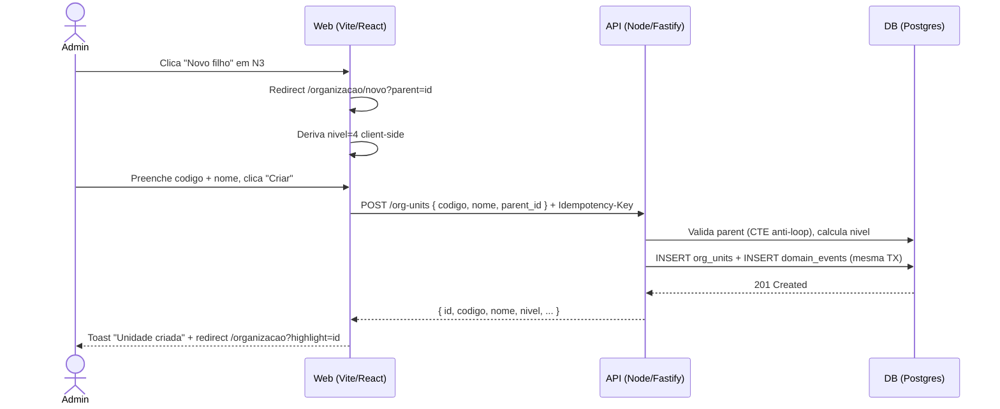

> ⚠️ **ARQUIVO GERIDO POR AUTOMAÇÃO.**
>
> - **Status DRAFT:** Enriqueça o conteúdo deste arquivo diretamente.
> - **Status READY:** NÃO EDITE DIRETAMENTE. Use a skill `create-amendment`.
>
> | Versão | Data       | Responsável | Status/Integração |
> |--------|------------|-------------|-------------------|
> | 0.4.2  | 2026-03-31 | merge-amendment | Merge UX-001-C03: Toggle status → ReadOnlyBadge + BtnDesativar (fluxo DELETE com modal). Resolve PENDENTE-010 Opção B. |
> | 0.4.1  | 2026-03-30 | merge-amendment | Merge UX-001-C02: Guard de edição inline — diálogo de confirmação ao sair do modo edição com alterações não salvas. Elevação isEditing/isDirty para OrgTreePage, guardedAction intercepta handlers. Ref: spec-org-units-edit-guard.md. |
> | 0.4.0  | 2026-03-30 | merge-amendment | Merge UX-001-M02: Inline Edit no DetailPanel substitui FormPanel para edição. InlineEditCard (novo), HierarchyCard (novo), OrgNodeForm/FormPanel removido para edição. Árvore visível durante edição. Ref: 10-org-detail-inline-edit-spec.md. |
> | 0.3.1  | 2026-03-30 | merge-amendment | Merge UX-001-C01: fix error handling silencioso no OrgFormPage — erros 5xx/400/403/rede devem mostrar feedback, extractFieldErrors RFC 9457 obrigatório em 422, networkError no COPY, campos paridade API no CreateOrgUnitRequest. |
> | 0.3.0  | 2026-03-29 | merge-amendment | Merge UX-001-M01: split-panel layout, DetailPanel completo, FormPanel inline, modal desativação, TreeNode visual, ReadOnlyField. Ref: specs Penpot 10-OrgTree/11-OrgForm. |
> | 0.2.1  | 2026-03-18 | Marcos Sulivan | Correção: passo 3 jornada Ver Histórico — (filtrado por tenant_id) → (protegido por org:unit:read) — alinha com ADR-003/SEC-002 (PEN-003 PENDENTE-006) |
> | 0.2.0  | 2026-03-17 | AGN-DEV-07  | Enriquecimento: copy catalog, estados detalhados, acessibilidade expandida, telemetria UX-010, FR-005 integração |
> | 0.1.0  | 2026-03-16 | arquitetura | Baseline Inicial (forge-module) |

# UX-001 — Jornadas e Fluxos da Estrutura Organizacional

---

## UX-001 — Árvore Organizacional (UX-ORG-001)

- **Screen ID:** UX-ORG-001
- **Manifest:** `docs/05_manifests/screens/ux-org-001.*.yaml`
- **Entidade(s):** `org_unit`, `tenant`
- **Contexto:** Tela de visualização hierárquica da estrutura organizacional N1–N5 com **layout split-panel** (árvore 380px + detalhe flex), busca client-side, ícones por nível, vinculação/desvinculação de tenants (N5) em nós N4, modal de desativação customizado, e **inline edit** no DetailPanel (edição in-place dos dados cadastrais sem ocultar a árvore — UX-001-M02).
- **Layout:** Split-panel — PainelÁrvore (380px, fill #FFF, border-right 1px #E8E8E6) + PainelDetalhe (flex, fill #F5F5F3, padding 24px). Search bar dentro do tree panel (340×40).
- **Ações disponíveis (UX-010):** `[view, search, create, update, delete, restore, expand_node, collapse_node, link_tenant, unlink_tenant, view_history]`

### Mapeamento Ações → Endpoints → Domain Events (UX-010)

| action_id | kind | scope | Endpoint | operation_id | Domain Event | Scope requerido |
|---|---|---|---|---|---|---|
| `view` | query | collection | `GET /api/v1/org-units/tree` | `org_units_tree` | — | `org:unit:read` |
| `search` | query | collection | client-side filter na árvore | — | — | `org:unit:read` |
| `create` | command | single | `POST /api/v1/org-units` | `org_units_create` | `org.unit_created` | `org:unit:write` |
| `update` | command | single | `PATCH /api/v1/org-units/:id` | `org_units_update` | `org.unit_updated` | `org:unit:write` |
| `delete` | command | single | `DELETE /api/v1/org-units/:id` | `org_units_delete` | `org.unit_deleted` | `org:unit:delete` |
| `restore` | command | single | `PATCH /api/v1/org-units/:id/restore` | `org_units_restore` | `org.unit_restored` | `org:unit:write` |
| `expand_node` | view | single | — (client-only) | — | — | `org:unit:read` |
| `collapse_node` | view | single | — (client-only) | — | — | `org:unit:read` |
| `link_tenant` | command | single | `POST /api/v1/org-units/:id/tenants` | `org_units_link_tenant` | `org.tenant_linked` | `org:unit:write` |
| `unlink_tenant` | command | single | `DELETE /api/v1/org-units/:id/tenants/:tid` | `org_units_unlink_tenant` | `org.tenant_unlinked` | `org:unit:delete` |
| `view_history` | query | single | `GET /api/v1/domain-events?entity_type=org_unit&entity_id=:id` | `domain_events_list` | — | `org:unit:read` |

#### Telemetria (UI Action Envelope — DOC-ARC-003)

Todas as ações acima DEVEM emitir telemetria via `UIActionEnvelope` com:

- `screen_id`: `UX-ORG-001`
- `entity_type`: `org_unit`
- `action`: action_id da tabela acima
- `operation_id`: conforme coluna operation_id
- `correlation_id`: propagado via `X-Correlation-ID`
- `status`: `requested | succeeded | failed`
- `meta`: filtros usados (search term), node level, expand/collapse state (sem PII)

### Jornada (Happy Path) — Visualizar Árvore

1. Admin acessa `/organizacao` com scope `org:unit:read`
2. GET /api/v1/org-units/tree é chamado → skeleton enquanto carrega
3. Árvore renderiza com N1 expandido, demais colapsados
4. Ícones diferenciados por nível (building, briefcase, layers, folder, map-pin)
5. Nós N4 exibem chips de tenants vinculados (N5)
6. Admin expande/colapsa nós — client-only, sem chamada de API

### Jornada — Restaurar Nó Desativado

1. Nós soft-deleted são exibidos com opacidade reduzida e badge "Inativo" (se filtro "mostrar inativos" ativo)
2. Admin clica menu contextual → "Restaurar"
3. Modal de confirmação: "Restaurar unidade 'XX — Nome'?"
4. PATCH /api/v1/org-units/:id/restore
5. 200 → Toast "Unidade 'XX — Nome' restaurada." + nó volta a exibição normal
6. 422 (pai inativo) → Inline no modal: "Não é possível restaurar: o nó pai está inativo."

### Jornada — Ver Histórico do Nó

1. Admin clica menu contextual → "Ver histórico"
2. Drawer lateral abre com timeline de domain_events do nó
3. GET /api/v1/domain-events?entity_type=org_unit&entity_id=:id (protegido por org:unit:read)
4. Timeline exibe: data, ação, actor (nome), detalhes resumidos
5. Scroll infinito / load more para eventos antigos

### Alternativas/Erros

- **Estado vazio:** "Nenhuma estrutura organizacional cadastrada." + botao "Criar primeiro nivel" (se scope write)
- **403:** Redireciona para /dashboard com Toast "Sem permissao para acessar esta secao."
- **5xx:** Toast "Erro ao carregar estrutura. Tente novamente."
- **Soft-deleted nodes:** Exibidos com opacidade reduzida e badge "Inativo" apenas quando toggle "Mostrar inativos" esta ativo (default: desativado)
- **Arvore vazia apos filtro:** "Nenhuma unidade encontrada para o termo buscado."

### Estados da Tela (MUST)

| Estado | Comportamento | Componente |
|---|---|---|
| **loading** | Skeleton lines animadas na area da arvore (3-5 linhas) | Skeleton |
| **empty** | Ilustracao + "Nenhuma estrutura organizacional cadastrada." + CTA "Criar primeiro nivel" (se `org:unit:write`) | EmptyState |
| **empty_search** | "Nenhuma unidade encontrada para o termo buscado." | EmptyState (sem CTA) |
| **error** | Toast "Erro ao carregar estrutura. Tente novamente." + botao retry | ErrorState |
| **loaded** | Arvore renderizada com N1 expandido, demais colapsados | TreeView |
| **partial_error** | Operacao de escrita falhou — Toast com mensagem RFC 9457 `detail` | Toast |

### Tratamento de Erros e Mensagens (MUST UX)

| HTTP Status | Contexto | Tipo | Mensagem (pt-BR) |
|---|---|---|---|
| 400/422 | Desativacao com filhos ativos | Inline (modal) | "Nao e possivel desativar um no com subunidades ativas." |
| 400/422 | Vinculacao em nivel errado | Inline (modal) | "Vinculacao de tenant so e permitida em nos de nivel N4." |
| 400/422 | Restore com pai inativo | Inline (modal) | "Nao e possivel restaurar: o no pai esta inativo." |
| 400/422 | Nivel maximo atingido | Inline (form) | "Nivel maximo (N4) atingido. Use vinculacao de tenant para N5." |
| 401 | Sessao expirada | Redirect | Redirecionar para /login |
| 403 | Sem scope | EmptyState | "Sem permissao para acessar esta secao." |
| 404 | Recurso nao encontrado | Toast | "Recurso nao encontrado." |
| 409 | Vinculo duplicado | Toast | "Este vinculo ja existe." |
| 409 | Codigo duplicado | Inline (form) | "Este codigo ja esta em uso." |
| 5xx | Erro servidor | Toast | "Erro inesperado. Tente novamente." (sem detalhes tecnicos) |

### Copy Catalog (Mensagens de Sucesso)

| Acao | Mensagem de Sucesso (Toast) |
|---|---|
| create | "Unidade '{codigo} — {nome}' criada com sucesso." |
| update | "Unidade '{codigo} — {nome}' atualizada." |
| delete | "Unidade '{codigo} — {nome}' desativada." |
| restore | "Unidade '{codigo} — {nome}' restaurada." |
| link_tenant | "Tenant '{tenant_codigo}' vinculado a '{org_unit_nome}'." |
| unlink_tenant | "Tenant '{tenant_codigo}' desvinculado de '{org_unit_nome}'." |

### Layout Split-Panel (UX-001-M01)

```
ContentArea (1200×836, fill #F5F5F3)
├── PainelÁrvore (380px, fill #FFFFFF, border-right 1px #E8E8E6, padding 20px)
│   ├── "Estrutura de Unidades" (16px 800 #111)
│   ├── "Navegue pela hierarquia do grupo" (12px 400 #888)
│   ├── SearchBar (340×40, r:8, border #E8E8E6, placeholder 13px #CCC)
│   └── Árvore hierárquica com TreeNodes
└── PainelDetalhe (flex, fill #F5F5F3, padding 24px, overflow-y auto)
    ├── HeaderDetalhe (card branco r:12, border #E8E8E6, p:20px)
    │   ├── Ícone Building (40×40, r:10, fill #F5F5F3)
    │   ├── Nome (24px 800 #111) + Badge ATIVO (#1E7A42/#E8F8EF/#B5E8C9) + Código (12px #888)
    │   ├── Botão "Editar Dados" (secondary: border #E8E8E6, text #555)
    │   └── Botão "+ Nova Subdivisão" (primary: fill #2E86C1, text #FFF)
    ├── CardDadosCadastrais (card r:12, p:24px, mt:20px)
    │   ├── "DADOS CADASTRAIS" (10px 700 #888 uppercase ls:1px)
    │   └── 6 ReadOnlyFields: CNPJ, Razão Social, Filial, Responsável, Telefone, E-mail
    ├── CardDepartamentos (card r:12, p:24px, mt:20px) — PENDENTE-008
    │   ├── "DEPARTAMENTOS VINCULADOS" + "Ver todos (N)" link azul
    │   └── Tags wrap (r:6, border #E8E8E6) + "+ Novo Departamento" (dashed #CCC)
    └── MetricCards (2 colunas, gap:20px, mt:20px) — PENDENTE-009
        ├── Card azul (fill #2E86C1, r:16, h:140): colaboradores totais
        └── Card branco (fill #FFF, r:16, border #E8E8E6): projetos + progress bar
```

### Componente ReadOnlyField (UX-001-M01)

Campo somente-leitura compartilhado (`ui/ReadOnlyField`):

| Propriedade | Valor |
|---|---|
| Label | 10px 700 #888 uppercase ls:0.8px, mb:6px |
| Valor container | h:42, r:8, fill:#F8F8F6, border:1px #F0F0EE, p:10px 14px |
| Valor texto | 14px 500 #111 |
| Lock icon (opcional) | 14×14, stroke #AAA, alinhado à direita |

Diferenças do Input editável: fill #F8F8F6 (não branco), border #F0F0EE (mais sutil), h:42 (não 48), r:8 (não 10).

### Inline Edit no DetailPanel (UX-001-M02)

Ao clicar "Editar Dados", o DetailPanel entra em modo **Edit in-place** — os ReadOnlyFields do card "Dados Cadastrais" viram inputs editáveis. A árvore permanece visível durante edição.

> **NOTA:** O FormPanel (UX-001-M01 §D3) **NÃO** é mais usado para edição de dados cadastrais. O FormPanel **continua válido** apenas para criação de novos nós ("+ Nova Subdivisão").

#### Estado View (padrão)

```
DetailHeader
  Actions: [Editar Dados (secondary, ícone pencil)] [+ Nova Subdivisão (primary, ícone plus)]
Card "DADOS CADASTRAIS"
  Header: bg #F8F8F6, label #888888, texto "DADOS CADASTRAIS"
  Body: ReadOnlyFields em grid
```

#### Estado Edit (inline edit)

```
DetailPanel (mesmo layout, árvore continua visível)
  DetailHeader
    Actions MUDAM: [Cancelar (secondary)] [Salvar Alterações (primary, ícone check)]
  Card "DADOS CADASTRAIS — EDITANDO"
    Header: bg #E3F2FD, label #2E86C1, ícone pencil
    Body: Inputs editáveis em grid (mesma grid do view)
      Row: Nome da Subdivisão * (input, full width, required)
      Row: CNPJ (input) | Razão Social (input, 2fr)
      Row: Filial (input) | Responsável (input)
      Row: Telefone (input) | E-mail (input)
  Card "HIERARQUIA" (sempre read-only, só aparece em modo edit)
    Body: ReadOnlyField[lock] Unidade Pai | ReadOnlyField[lock] Nível
  Card "DEPARTAMENTOS VINCULADOS" (inalterado)
  MetricRow (inalterado)
```

#### Mudanças visuais entre estados

| Elemento | View | Edit |
|----------|------|------|
| Botão header esquerdo | "Editar Dados" (secondary) | "Cancelar" (secondary) |
| Botão header direito | "+ Nova Subdivisão" (primary) | "Salvar Alterações" (primary, ícone check) |
| Card header bg | `#F8F8F6` | `#E3F2FD` |
| Card header label cor | `#888888` | `#2E86C1` |
| Card header label texto | "DADOS CADASTRAIS" | "DADOS CADASTRAIS — EDITANDO" |
| Campos | ReadOnlyField (bg `#F8F8F6`, border `#F0F0EE`) | Input (bg `#FFFFFF`, border 2px `#2E86C1`) |
| Card "Hierarquia" | não exibido | exibido (Pai + Nível com lock) |
| Árvore (TreePanel) | visível | **visível** (principal vantagem) |

#### Transição de Estado

1. Clique "Editar Dados" → `setIsEditing(true)` → campos viram inputs, botões mudam
2. Clique "Salvar Alterações" → `PATCH /api/v1/org-units/:id` com campos editáveis
   - Sucesso (200) → Toast "Unidade '{codigo} — {nome}' atualizada." + `setIsEditing(false)`
   - Erro → tratamento conforme §Alternativas/Erros + UX-001-C01
3. Clique "Cancelar" → `setIsEditing(false)` + reverter campos ao estado original (sem chamada API)

**Campos editáveis (PATCH):** nome, cnpj, razao_social, filial, responsavel, telefone, email_contato
**Campos imutáveis (HierarchyCard):** codigo, nivel, parent_id

#### Guard de Edição Inline (UX-001-C02)

Ao navegar para outra entidade ou acionar ação que descartaria o formulário de edição, o sistema DEVE verificar se existem alterações não salvas (dirty state) e, se sim, exibir diálogo de confirmação.

**Elevação de estado:** O estado `isEditing` e `isDirty` DEVEM ser elevados do `DetailPanel` para o `OrgTreePage` para que o guard intercepte ações antes de alterar `selectedId`.

**Props do DetailPanel (atualizadas):**

```typescript
export interface DetailPanelProps {
  detail: OrgUnitDetailVM | null;
  isLoading: boolean;
  userScopes: readonly string[];
  requestEdit?: boolean;
  onEditHandled?: () => void;
  onCreateChild: (parentId: string) => void;
  isEditing: boolean;
  onEditingChange: (editing: boolean) => void;
  onDirtyChange: (dirty: boolean) => void;
}
```

**Dirty state:** Calculado via comparação campo-a-campo entre `form` e `detailToForm(detail)`. Se nenhum campo mudou, `isDirty = false`. Sem bibliotecas extras — deep equality simples.

**Ações interceptadas pelo guard:**

| Handler | Comportamento com guard |
|---------|------------------------|
| `handleSelect(id)` | Se `isEditing && isDirty` → diálogo; senão → executa |
| `handleOpenCreate(parentId?)` | Se `isEditing && isDirty` → diálogo; senão → executa |
| `handleOpenEdit(id)` | Se `isEditing && isDirty` → diálogo; senão → executa |

**Ações NÃO interceptadas:** scroll na árvore, toggle "Mostrar inativos", busca na SearchBar, botões "Cancelar" e "Salvar Alterações" do próprio DetailPanel.

**Diálogo de confirmação (ConfirmationModal shared):**

| Propriedade | Valor |
|-------------|-------|
| variant | `default` (NÃO `destructive`) |
| title | "Edição em andamento" |
| description | "Você possui alterações não salvas. Deseja cancelar a edição?" |
| confirmLabel | "Cancelar Edição" |
| cancelLabel | "Continuar Editando" |

- **"Cancelar Edição"** → descarta alterações, sai do modo edição, executa ação pendente
- **"Continuar Editando"** → fecha diálogo, mantém edição ativa na entidade atual

**Comportamento quando NOT dirty:** Se `isEditing && !isDirty`, a ação é executada diretamente sem diálogo — o modo edição é desativado automaticamente.

**Copy Catalog (guard):**

| Chave | Mensagem |
|-------|----------|
| `editGuardTitle` | "Edição em andamento" |
| `editGuardBody` | "Você possui alterações não salvas. Deseja cancelar a edição?" |
| `editGuardCancel` | "Continuar Editando" |
| `editGuardConfirm` | "Cancelar Edição" |

### Componente InlineEditCard (UX-001-M02)

Card reutilizável com dois modos (view / edit):

**Props:** `title: string`, `isEditing: boolean`, `children: ReactNode`

| Propriedade | View | Edit |
|---|---|---|
| Header bg | `#F8F8F6` | `#E3F2FD` |
| Header label | 10px 700 `#888888` uppercase ls:1px | 10px 700 `#2E86C1` uppercase ls:1px + ícone pencil 14×14 |
| Header texto | `{title}` | `{title} — EDITANDO` |
| Body padding | 20px 24px | 20px 24px |

**Inputs editáveis (dentro do card em modo edit):**

| Propriedade | Valor |
|---|---|
| Height | min 42px |
| Border | 2px solid `#2E86C1` |
| Border-radius | 8px |
| Background | `#FFFFFF` |
| Font | inherit, 14px, weight 500 |
| Placeholder | 14px 400 `#CCCCCC` |

Placeholders específicos: CNPJ "00.000.000/0000-00", Telefone "(00) 00000-0000", E-mail "contato@empresa.com"

### Componente HierarchyCard (UX-001-M02)

Card exibido **somente em modo edit** com campos imutáveis:

```
Card "HIERARQUIA" (r:12, border #E8E8E6, mt:20px)
  Header: bg #F8F8F6, label "HIERARQUIA" uppercase
  Body: grid 2 colunas
    ReadOnlyField[lock] "UNIDADE PAI" — valor do parent_name
    ReadOnlyField[lock] "NÍVEL" — valor formatado (ex: "N2 — Diretoria")
```

Usa o componente `ReadOnlyField` existente com ícone de cadeado.

### TreeNode Visual (UX-001-M01)

| Tipo de Nó | Estilo |
|---|---|
| Raiz | Ícone Building 16×16 + nome 14px 700 #111 + botão voltar ‹ |
| Selecionado | Fundo #E3F2FD r:6, chevron + building icon + nome 13px 700 #2E86C1 |
| Colapsado | Chevron › 12×12 #888 + building 16×16 #888 + nome 13px 500 #555 |
| Folha (filho) | Dot 8×8 #888 + nome 13px 400 #555, ml:32px |

### Modal de Desativação Customizado (UX-001-M01)

Substitui o ConfirmationModal genérico:

```
Overlay rgba(0,0,0,0.4) sobre content area
Modal centrado (480px, r:16, p:32px, text-center)
├── Ícone alerta (48×48 r:50% fill:#FFEBEE) + TriangleAlert (24×24 #E74C3C)
├── "Desativar unidade?" (20px 700 #111)
├── Descrição impacto (14px 400 #555, max-w:380px)
├── WarningBox (fill:#FFF3E0, r:8, p:12px 16px) — contagem de subdivisões/colaboradores
└── Botões: "Cancelar" (secondary w:180 h:44) + "Desativar" (danger w:180 fill:#E74C3C)
```

### Acessibilidade (MUST WCAG 2.1 AA)

- **Teclado:** Navegacao na arvore via arrow keys (Up/Down entre siblings, Left/Right para collapse/expand), Enter para selecionar, Tab para mover entre areas
- **Foco:** Foco visivel em nos, botoes, chips e menu contextual. Focus trap em modais
- **ARIA:** `role="tree"`, `role="treeitem"`, `aria-expanded`, `aria-level`, `aria-setsize`, `aria-posinset`
- **Contraste:** WCAG 2.1 AA (ratio minimo 4.5:1 para texto, 3:1 para componentes)
- **Screen reader:** Nos anunciam nivel + nome + status (ativo/inativo) + contagem de filhos
- **Motion:** Respeitar `prefers-reduced-motion` para animacoes de expand/collapse

---

## UX-002 — Formulário de Nó Organizacional (UX-ORG-002)

- **Screen ID:** UX-ORG-002
- **Manifest:** `docs/05_manifests/screens/ux-org-002.*.yaml`
- **Entidade(s):** `org_unit`
- **Contexto:** Formulário **somente modo criar** como **FormPanel inline 480px** que substitui o PainelÁrvore no split-panel — NÃO é página separada. O PainelDetalhe permanece visível ao lado sem overlay. Campos cadastrais opcionais, nó pai readonly. ~~Modo editar~~ **removido (UX-001-M02):** edição de dados cadastrais agora usa Inline Edit no DetailPanel (ver UX-ORG-001 §Inline Edit).
- **Layout:** FormPanel (480px, fill #FFF, border-right 1px #E8E8E6) com FormHeader (64px: ←/título/×), FormBody (flex:1, p:24px, scrollável), FormFooter (72px: Cancelar + primary). Rota NÃO muda — estado local controla abertura/fechamento.
- **Ações disponíveis (UX-010):** `[create, update]`

### Mapeamento Ações → Endpoints → Domain Events (UX-010)

| action_id | kind | scope | Endpoint | operation_id | Domain Event | Scope requerido |
|---|---|---|---|---|---|---|
| `create` | command | single | `POST /api/v1/org-units` | `org_units_create` | `org.unit_created` | `org:unit:write` |
| `update` | command | single | `PATCH /api/v1/org-units/:id` | `org_units_update` | `org.unit_updated` | `org:unit:write` |

#### Telemetria (UI Action Envelope — DOC-ARC-003)

- `screen_id`: `UX-ORG-002`
- `entity_type`: `org_unit`
- `action`: `create` ou `update`
- `operation_id`: `org_units_create` ou `org_units_update`
- `correlation_id`: propagado via `X-Correlation-ID`
- `meta`: mode (create/edit), parent_level (sem PII)

### Jornada (Happy Path) — Criar Nó Filho

1. Admin clica "Novo filho" em nó N3 → redirect para `/organizacao/novo?parent=:id`
2. Nó pai pré-selecionado, nível exibe "N4 — Subunidade Organizacional"
3. Preenche código (uppercase automático) + nome
4. Aviso: "O código não pode ser alterado após a criação."
5. Clica "Criar unidade" → isLoading + Idempotency-Key enviado
6. POST /org-units com { codigo, nome, parent_id }
7. 201 → Toast "Unidade 'XX — Nome' criada." + redirect `/organizacao?highlight=:id`

### Alternativas/Erros

| HTTP Status | Contexto | Tipo | Mensagem (pt-BR) |
|---|---|---|---|
| 409 | Codigo duplicado | Inline (campo codigo) | "Este codigo ja esta em uso." (nunca toast) |
| 422 | Nivel maximo | Inline (form) | "Nivel maximo N4 atingido. Use vinculacao de tenant para N5." |
| 422 | Codigo imutavel (modo editar) | Inline (campo codigo) | "O campo 'codigo' e imutavel apos criacao." |
| 422 | Parent_id imutavel (modo editar) | Inline (campo pai) | "O campo 'no pai' e imutavel apos criacao." |
| 401 | Sessao expirada | Redirect | Redirecionar para /login |
| 403 | Sem scope | EmptyState | "Sem permissao para esta operacao." |
| 5xx | Erro servidor | Toast | "Erro inesperado. Tente novamente." |
| Network error | Falha de rede (timeout, DNS, offline) | Toast + Inline (_form) | "Não foi possível conectar ao servidor. Verifique sua conexão." |

> **MUST (UX-001-C01):** Todo submit DEVE produzir feedback visível — toast de sucesso + navegação, OU toast de erro + permanência no formulário. Erros silenciosos (sem feedback) são proibidos.

> **MUST (UX-001-C01):** Erros 422 DEVEM usar `extractFieldErrors(problem.extensions)` (RFC 9457) para extrair `invalid_fields` e mapear inline nos campos específicos. Se `invalid_fields` estiver ausente, usar `problem.detail` como mensagem genérica de formulário.

> **MUST (UX-001-C01):** O callback `onError` do mutation (create e edit) DEVE chamar `toast.error(message)` para garantir feedback em qualquer cenário de erro.

### Copy Catalog — Formulário

| Acao | Mensagem de Sucesso (Toast) |
|---|---|
| create | "Unidade '{codigo} — {nome}' criada com sucesso." |
| update | "Unidade '{codigo} — {nome}' atualizada." |

| Chave | Mensagem de Erro | Contexto |
|---|---|---|
| `networkError` | "Não foi possível conectar ao servidor. Verifique sua conexão." | Falha de rede, timeout, DNS |

### Estados da Tela (MUST)

| Estado | Comportamento | Componente |
|---|---|---|
| **loading** | Botao submit em isLoading + spinner durante requisicao | Button (loading) |
| **idle** | Formulario pronto para preenchimento | Form |
| **error** | Erros inline sob campos afetados (RFC 9457 `extractFieldErrors`) + toast.error para erros 5xx/rede. TODOS os status HTTP devem produzir feedback (UX-001-C01). | FieldError + Toast |
| **success** | Toast de sucesso + redirect para arvore com highlight | Toast + Navigate |

### Campos do Formulário (UX-001-M01 — atualizado)

#### Modo Editar (11-OrgForm-Edit)

| Campo | Tipo | Componente | Validação |
|---|---|---|---|
| `codigo` | Readonly | ReadOnlyField + 🔒 | Imutável (BR-003) |
| `nome` | Editável | FormField + Input h:48 r:10 | Max 200 chars, required |
| `nivel` | Readonly | ReadOnlyField + 🔒 | Imutável |
| `unidade_pai` | Readonly | ReadOnlyField + 🔒 | Imutável (BR-010) |
| — Separador + "DADOS CADASTRAIS" — | | | |
| `cnpj` | Editável | FormField + Input | Max 18 chars |
| `razao_social` | Editável | FormField + Input | Max 300 chars |
| `filial` | Editável | FormField + Input (row) | Max 100 chars |
| `responsavel` | Editável | FormField + Input (row) | Max 200 chars |
| `telefone` | Editável | FormField + Input | Max 20 chars |
| `email_contato` | Editável | FormField + Input | Max 254 chars |
| — Separador + "STATUS" — | | | |
| `status` | ReadOnlyBadge + BtnDesativar | Badge "ATIVO"/"INATIVO" (read-only) + botão "Desativar" (danger secondary) que abre DeactivateModal. NÃO é toggle editável — usa fluxo DELETE existente (BR-005). Se inativo: botão "Restaurar" (PATCH /restore). Resolve PENDENTE-010 (UX-001-C03). | — |

Footer: "Cancelar" + "Salvar Alterações"

#### Modo Criar (11-OrgForm-Create)

| Campo | Tipo | Componente | Validação |
|---|---|---|---|
| — InfoBox azul: "A nova subdivisão será criada como filha de {parent} ({nivel})." — | | | |
| `unidade_pai` | Readonly | ReadOnlyField + 🔒 | Pré-selecionado |
| `nivel` | Readonly | ReadOnlyField + 🔒 | Auto-calculado |
| `nome` | Editável (required) | FormField + Input | Max 200 chars |
| — Separador + "DADOS CADASTRAIS (opcional)" — | | | |
| `cnpj` | Editável | FormField + Input | Max 18 chars |
| `razao_social` | Editável | FormField + Input | Max 300 chars |
| `responsavel` | Editável | FormField + Input | Max 200 chars |

Footer: "Cancelar" + "Criar Subdivisão"

> **Nota (UX-001-C01):** O TypeScript interface `CreateOrgUnitRequest` DEVE incluir todos os campos cadastrais aceitos pela API (`filial`, `telefone`, `email_contato`) mesmo que não renderizados no formulário de criação. O `handleSubmit` DEVE enviar esses campos quando preenchidos (spread condicional). Isso garante paridade com a API e permite futura extensão do formulário sem alterar o interface.

### Acessibilidade (MUST WCAG 2.1 AA)

- **Labels:** Todos os campos com `<label>` associado e `aria-describedby` para hints
- **Erros:** `aria-invalid="true"` + `aria-errormessage` para campos com erro
- **Focus:** Auto-focus no primeiro campo com erro apos submit falho
- **Contraste:** WCAG 2.1 AA

---

### Diagrama Sequence (Mermaid) — Jornada: Criar Nó



- **estado_item:** READY
- **owner:** arquitetura
- **data_ultima_revisao:** 2026-03-30
- **rastreia_para:** US-MOD-003, US-MOD-003-F02, US-MOD-003-F03, US-MOD-003-F04, FR-001, FR-002, FR-003, FR-004, FR-005, BR-001, BR-002, BR-003, BR-008, BR-009, BR-010, BR-011, DATA-001, DATA-001-M01, DATA-003, SEC-001, SEC-002, INT-002, NFR-001, DOC-UX-010, DOC-ARC-003, DOC-FND-000, ADR-003, PEN-003, UX-001-M01, UX-001-M02, UX-001-C02, 10-org-tree-spec, 11-org-form-spec, 10-org-detail-inline-edit-spec, spec-org-units-edit-guard
- **referencias_exemplos:** EX-CI-007, EX-CI-006
- **evidencias:** N/A
