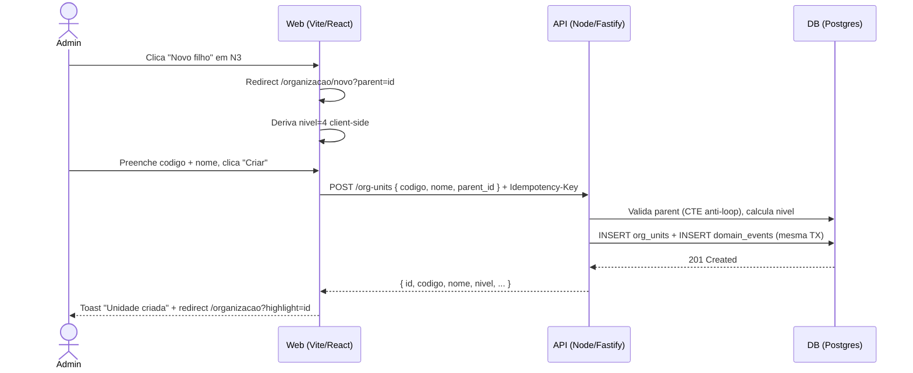

> ⚠️ **ARQUIVO GERIDO POR AUTOMAÇÃO.**
> - **Status DRAFT:** Enriqueça o conteúdo deste arquivo diretamente.
> - **Status READY:** NÃO EDITE DIRETAMENTE. Use a skill `create-amendment`.
>
> | Versão | Data       | Responsável | Status/Integração |
> |--------|------------|-------------|-------------------|
> | 0.1.0  | 2026-03-16 | arquitetura | Baseline Inicial (forge-module) |

# UX-001 — Jornadas e Fluxos da Estrutura Organizacional

---

## UX-001 — Árvore Organizacional (UX-ORG-001)

- **Screen ID:** UX-ORG-001
- **Manifest:** `docs/05_manifests/screens/ux-org-001.*.yaml`
- **Entidade(s):** `org_unit`, `tenant`
- **Contexto:** Tela de visualização hierárquica da estrutura organizacional N1–N5 com árvore expansível, busca client-side, ícones por nível, vinculação/desvinculação de tenants (N5) em nós N4, e modal de desativação.
- **Ações disponíveis (UX-010):** `[view, search, create, update, delete, restore, expand_node, collapse_node, link_tenant, unlink_tenant, view_history]`

### Mapeamento Ações → Endpoints → Domain Events

| action_id | kind | scope | Endpoint | Domain Event | Scope requerido |
|---|---|---|---|---|---|
| `view` | query | collection | `GET /api/v1/org-units/tree` | — | `org:unit:read` |
| `search` | query | collection | client-side filter na árvore | — | `org:unit:read` |
| `create` | command | single | `POST /api/v1/org-units` | `org.unit_created` | `org:unit:write` |
| `update` | command | single | `PATCH /api/v1/org-units/:id` | `org.unit_updated` | `org:unit:write` |
| `delete` | command | single | `DELETE /api/v1/org-units/:id` | `org.unit_deleted` | `org:unit:delete` |
| `restore` | command | single | `PATCH /api/v1/org-units/:id/restore` | `org.unit_restored` | `org:unit:write` |
| `expand_node` | view | single | — (client-only) | — | `org:unit:read` |
| `collapse_node` | view | single | — (client-only) | — | `org:unit:read` |
| `link_tenant` | command | single | `POST /api/v1/org-units/:id/tenants` | `org.tenant_linked` | `org:unit:write` |
| `unlink_tenant` | command | single | `DELETE /api/v1/org-units/:id/tenants/:tid` | `org.tenant_unlinked` | `org:unit:delete` |
| `view_history` | query | single | `GET /api/v1/domain-events?entity_type=org_unit&entity_id=:id` | — | `org:unit:read` |

### Jornada (Happy Path) — Visualizar Árvore

1. Admin acessa `/organizacao` com scope `org:unit:read`
2. GET /api/v1/org-units/tree é chamado → skeleton enquanto carrega
3. Árvore renderiza com N1 expandido, demais colapsados
4. Ícones diferenciados por nível (building, briefcase, layers, folder, map-pin)
5. Nós N4 exibem chips de tenants vinculados (N5)
6. Admin expande/colapsa nós — client-only, sem chamada de API

### Jornada — Restaurar Nó Desativado

1. Nós soft-deleted são exibidos com opacidade reduzida e badge "Inativo" (se filtro "mostrar inativos" ativo)
2. Admin clica menu contextual → "Restaurar"
3. Modal de confirmação: "Restaurar unidade 'XX — Nome'?"
4. PATCH /api/v1/org-units/:id/restore
5. 200 → Toast "Unidade 'XX — Nome' restaurada." + nó volta a exibição normal
6. 422 (pai inativo) → Inline no modal: "Não é possível restaurar: o nó pai está inativo."

### Jornada — Ver Histórico do Nó

1. Admin clica menu contextual → "Ver histórico"
2. Drawer lateral abre com timeline de domain_events do nó
3. GET /api/v1/domain-events?entity_type=org_unit&entity_id=:id (filtrado por tenant_id)
4. Timeline exibe: data, ação, actor (nome), detalhes resumidos
5. Scroll infinito / load more para eventos antigos

### Alternativas/Erros

- **Estado vazio:** "Nenhuma estrutura organizacional cadastrada." + botão "Criar primeiro nível" (se scope write)
- **403:** Redireciona para /dashboard com Toast "Sem permissão para acessar esta seção."
- **5xx:** Toast "Erro ao carregar estrutura. Tente novamente."

### Estado de Carregamento (Loading)

- **Skeleton:** Linhas skeleton animadas na área da árvore

### Tratamento de Erros e Mensagens (MUST UX)

- **400/422:** erros inline (desativação com filhos ativos, vinculação em nível errado)
- **401:** redirecionar login
- **403:** empty state acesso negado
- **404:** Toast "Recurso não encontrado"
- **409:** Toast "Vínculo já existente"
- **5xx:** toast "tente novamente", sem detalhes técnicos

### Acessibilidade

- Teclado: navegação na árvore via arrow keys, Enter para expandir/colapsar
- Foco: foco visível em nós, botões e chips
- ARIA: `role="tree"`, `role="treeitem"`, `aria-expanded`
- Contraste: WCAG 2.1 AA

---

## UX-002 — Formulário de Nó Organizacional (UX-ORG-002)

- **Screen ID:** UX-ORG-002
- **Manifest:** `docs/05_manifests/screens/ux-org-002.*.yaml`
- **Entidade(s):** `org_unit`
- **Contexto:** Formulário dual-mode (criar/editar) para nós organizacionais N1–N4. Modo criar: código editável, nó pai selecionável, nível derivado automaticamente. Modo editar: código e nó pai readonly, apenas nome/descrição/status editáveis.
- **Ações disponíveis (UX-010):** `[create, update]`

### Mapeamento Ações → Endpoints → Domain Events

| action_id | kind | scope | Endpoint | Domain Event | Scope requerido |
|---|---|---|---|---|---|
| `create` | command | single | `POST /api/v1/org-units` | `org.unit_created` | `org:unit:write` |
| `update` | command | single | `PATCH /api/v1/org-units/:id` | `org.unit_updated` | `org:unit:write` |

### Jornada (Happy Path) — Criar Nó Filho

1. Admin clica "Novo filho" em nó N3 → redirect para `/organizacao/novo?parent=:id`
2. Nó pai pré-selecionado, nível exibe "N4 — Subunidade Organizacional"
3. Preenche código (uppercase automático) + nome
4. Aviso: "O código não pode ser alterado após a criação."
5. Clica "Criar unidade" → isLoading + Idempotency-Key enviado
6. POST /org-units com { codigo, nome, parent_id }
7. 201 → Toast "Unidade 'XX — Nome' criada." + redirect `/organizacao?highlight=:id`

### Alternativas/Erros

- **409:** Erro inline sob campo código: "Este código já está em uso." (nunca toast)
- **422 (nivel máximo):** Inline: "Nível máximo N4 atingido. Use vinculação de tenant para N5."
- **422 (codigo imutável):** Inline: "O campo 'codigo' é imutável após criação."

### Estado de Carregamento (Loading)

- **Spinner:** Botão submit em isLoading durante requisição

---

### Diagrama Sequence (Mermaid) — Jornada: Criar Nó

- **estado_item:** DRAFT
- **owner:** arquitetura
- **data_ultima_revisao:** 2026-03-16
- **rastreia_para:** US-MOD-003, US-MOD-003-F02, US-MOD-003-F03, FR-001, FR-002, FR-003, FR-004, BR-001, BR-009, DATA-003, SEC-001, SEC-EventMatrix, DOC-UX-010, DOC-ARC-003
- **referencias_exemplos:** EX-CI-007
- **evidencias:** N/A
