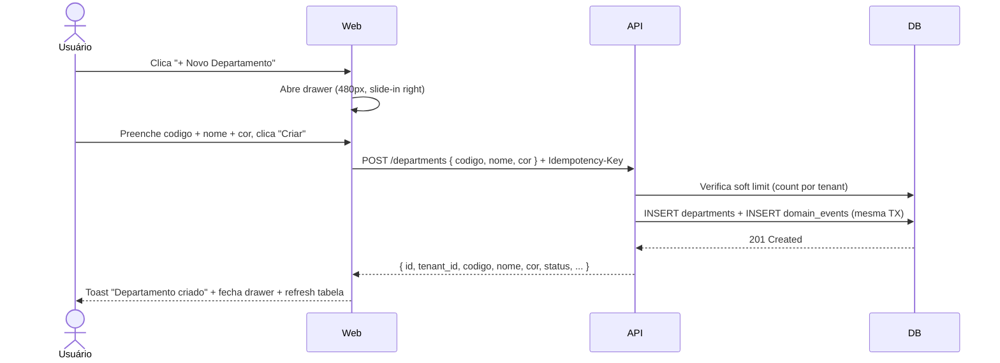

> ⚠️ **ARQUIVO GERIDO POR AUTOMAÇÃO.**
>
> - **Status DRAFT:** Enriqueça o conteúdo deste arquivo diretamente.
> - **Status READY:** NÃO EDITE DIRETAMENTE. Use a skill `create-amendment`.
>
> | Versão | Data       | Responsável | Status/Integração |
> |--------|------------|-------------|-------------------|
> | 1.0.0  | 2026-03-31 | promote | Promoção DRAFT → READY. Validação cruzada: FR-002, BR-002, 12-departments-spec — PASS. Correções pós-validação: mensagem 409 com placeholder, feedback cor inválida, erro restore race condition. |
> | 0.1.0  | 2026-03-30 | arquitetura | Baseline — Jornadas e fluxos de gestão de departamentos (UX-ORG-003) |

# UX-002 — Jornadas e Fluxos de Departamentos

---

## UX-002 — Gestão de Departamentos (UX-ORG-003)

- **Screen ID:** UX-ORG-003
- **Manifest:** `docs/05_manifests/screens/ux-org-003.*.yaml`
- **Entidade(s):** `department`
- **Contexto:** Tela de gestão de departamentos do tenant, acessível pela sidebar na categoria ORGANIZAÇÃO. Layout de listagem com tabela, busca, filtros, e drawer lateral para criação/edição. Color picker para campo `cor`. Departamentos exibidos como tags coloridas no DetailPanel de org_units (UX-ORG-001).
- **Layout:** Página de listagem (tabela full-width) + Drawer lateral (480px, slide-in da direita) para create/edit.
- **Ações disponíveis (UX-010):** `[list, search, filter, create, update, delete, restore]`

### Mapeamento Ações → Endpoints → Domain Events (UX-010)

| Ação UX | Endpoint | Método | Domain Event | Scope |
|---|---|---|---|---|
| list | /api/v1/departments | GET | — | `org:dept:read` |
| search | /api/v1/departments?search=X | GET | — | `org:dept:read` |
| filter | /api/v1/departments?status=X | GET | — | `org:dept:read` |
| create | /api/v1/departments | POST | `org.dept_created` | `org:dept:write` |
| update | /api/v1/departments/:id | PATCH | `org.dept_updated` | `org:dept:write` |
| delete | /api/v1/departments/:id | DELETE | `org.dept_deleted` | `org:dept:delete` |
| restore | /api/v1/departments/:id/restore | PATCH | `org.dept_restored` | `org:dept:write` |

---

### Jornada 1 — Listar Departamentos (Happy Path)

1. Usuário acessa "Departamentos" na sidebar (categoria ORGANIZAÇÃO)
2. Sistema carrega `GET /api/v1/departments?status=ACTIVE&limit=20` com token JWT
3. Tabela exibe colunas: Código, Nome, Cor (badge colorido), Status, Criado em
4. Paginação cursor-based: botão "Carregar mais" no rodapé (se `has_more=true`)
5. Toggle "Mostrar inativos" no header da tabela alterna `status=ALL`

### Jornada 2 — Criar Departamento

1. Usuário clica "+ Novo Departamento" (botão primário no header da página)
2. Drawer lateral abre (480px, slide-in da direita, overlay com backdrop)
3. Formulário exibe campos:
   - **Código** (obrigatório, text input, max 50 chars)
   - **Nome** (obrigatório, text input, max 200 chars)
   - **Descrição** (opcional, textarea, max 2000 chars)
   - **Cor** (opcional, color picker hex livre + preview de badge colorido)
4. Usuário preenche e clica "Criar"
5. `POST /api/v1/departments` com `Idempotency-Key`
6. 201 → Toast "Departamento criado com sucesso." + drawer fecha + tabela atualiza
7. Erro 409 → Inline error no campo código: "Já existe um departamento com o código '{codigo}' neste tenant."
8. Erro 422 → Inline errors nos campos inválidos

### Jornada 3 — Editar Departamento

1. Usuário clica no ícone de edição (lápis) na linha da tabela
2. Drawer lateral abre com dados preenchidos
3. Campo **Código** exibido como ReadOnlyField (imutável — BR-014)
4. Campos editáveis: Nome, Descrição, Cor
5. Usuário altera e clica "Salvar"
6. `PATCH /api/v1/departments/:id` com campos alterados
7. 200 → Toast "Departamento atualizado com sucesso." + drawer fecha + tabela atualiza

### Jornada 4 — Desativar Departamento

1. Usuário clica no ícone de desativação (lixeira) na linha da tabela
2. Modal de confirmação: "Deseja desativar o departamento **{nome}**? Ele poderá ser restaurado posteriormente."
3. Botão "Desativar" (vermelho) + "Cancelar"
4. Usuário confirma → `DELETE /api/v1/departments/:id`
5. 204 → Toast "Departamento desativado com sucesso." + linha removida da tabela (ou marcada como inativa se toggle ativo)

### Jornada 5 — Restaurar Departamento

1. Usuário ativa toggle "Mostrar inativos" no header
2. Departamentos inativos aparecem com badge "INATIVO" (cinza) e texto esmaecido
3. Usuário clica no ícone de restauração (↩) na linha do departamento inativo
4. `PATCH /api/v1/departments/:id/restore`
5. 200 → Toast "Departamento restaurado com sucesso." + badge muda para "ATIVO" (verde)
6. Erro 422 (já ativo — race condition) → Toast "Departamento já está ativo." + refresh tabela

---

### Estados da Tela

| Estado | Trigger | Comportamento Visual |
|---|---|---|
| **loading** | Primeira carga / mudança de filtro | Skeleton na tabela (6 linhas × 5 colunas) |
| **empty** | GET retorna `data: []` sem filtro | Ilustração + "Nenhum departamento cadastrado." + botão "Criar primeiro departamento" |
| **empty_search** | GET retorna `data: []` com search/filter | "Nenhum resultado para '{search}'." + link "Limpar filtros" |
| **error** | GET retorna 5xx ou network error | Card de erro: "Não foi possível carregar os departamentos." + botão "Tentar novamente" |
| **loaded** | GET retorna `data: [...]` | Tabela com dados |

---

### Error Handling

| Código | Contexto | Ação UX |
|---|---|---|
| 401 | Token expirado | Redirect para login (MOD-000) |
| 403 | Sem scope | Toast "Você não tem permissão para esta ação." |
| 404 | Departamento não encontrado (PATCH/DELETE) | Toast "Departamento não encontrado." + refresh tabela |
| 409 | Codigo duplicado (POST) | Inline error no campo código |
| 422 | Validação (POST/PATCH) | Inline errors nos campos + toast genérico |
| 5xx | Erro interno | Toast "Erro interno. Tente novamente." |
| network | Sem conexão | Toast "Erro de conexão. Verifique sua internet." |

---

### Copy Catalog

| Evento | Mensagem (pt-BR) |
|---|---|
| create_success | "Departamento criado com sucesso." |
| update_success | "Departamento atualizado com sucesso." |
| delete_success | "Departamento desativado com sucesso." |
| restore_success | "Departamento restaurado com sucesso." |
| conflict_codigo | "Já existe um departamento com o código '{codigo}' neste tenant." |
| immutable_codigo | "O campo 'código' não pode ser alterado." |
| cor_invalida | "Formato de cor inválido. Use o formato #RRGGBB." |
| empty_state | "Nenhum departamento cadastrado." |
| empty_search | "Nenhum resultado para '{search}'." |
| error_generic | "Erro interno. Tente novamente." |
| error_network | "Erro de conexão. Verifique sua internet." |
| error_forbidden | "Você não tem permissão para esta ação." |

---

### Layout da Tabela

```
Tabela de Departamentos
├── Header Row
│   ├── "CÓDIGO" (w:120, text 10px 700 uppercase #888)
│   ├── "NOME" (w:flex, text 10px 700 uppercase #888)
│   ├── "COR" (w:80, text 10px 700 uppercase #888)
│   ├── "STATUS" (w:100, text 10px 700 uppercase #888)
│   ├── "CRIADO EM" (w:140, text 10px 700 uppercase #888)
│   └── "AÇÕES" (w:80, text 10px 700 uppercase #888)
│
├── Data Row (h:52, hover bg #F8F8F6)
│   ├── Código (text 13px 600 #333)
│   ├── Nome (text 13px 500 #111)
│   ├── Cor Badge (circle 16×16 filled with cor value + hex text 11px #888)
│   ├── Status Badge ("ATIVO" verde / "INATIVO" cinza)
│   ├── Data (text 12px 400 #888, formato "30 mar 2026")
│   └── Ações (ícones: edit pencil + delete trash, 16×16, stroke #888)
│
└── Footer
    └── "Carregar mais" (link, 13px 600 #2E86C1) — se has_more
```

### Layout do Drawer (Create/Edit)

```
Drawer (480px, slide-in right, bg #FFF, shadow -4px 0 24px rgba(0,0,0,0.08))
├── Header (h:64, border-bottom 1px #E8E8E6, p:20px 24px)
│   ├── Título "Novo Departamento" ou "Editar Departamento" (18px 700 #111)
│   └── BtnFechar (X, 20×20, stroke #888, hover #333)
│
├── Body (p:24px, overflow-y auto, flex-1)
│   ├── Campo "Código" (obrigatório)
│   │   ├── Label "CÓDIGO" (10px 700 uppercase #888)
│   │   └── Input (w:100%, h:42, r:8, border #E8E8E6, p:10px 14px)
│   │       └── [ReadOnlyField no modo edição — BR-014]
│   │
│   ├── Campo "Nome" (obrigatório, mt:16px)
│   │   ├── Label "NOME" (10px 700 uppercase #888)
│   │   └── Input (w:100%, h:42, r:8, border #E8E8E6)
│   │
│   ├── Campo "Descrição" (opcional, mt:16px)
│   │   ├── Label "DESCRIÇÃO" (10px 700 uppercase #888)
│   │   └── Textarea (w:100%, h:100, r:8, border #E8E8E6, resize vertical)
│   │
│   └── Campo "Cor" (opcional, mt:16px)
│       ├── Label "COR" (10px 700 uppercase #888)
│       ├── ColorPicker Row (gap:12px)
│       │   ├── Input hex (w:120, h:42, r:8, border #E8E8E6, placeholder "#000000")
│       │   ├── Preview circle (24×24, r:50%, fill com valor hex, border 1px #E8E8E6)
│       │   └── Color swatch palette (8 cores pré-definidas, 24×24 cada, r:4)
│       └── Badge preview: "Preview" (tag com cor selecionada, mt:8px)
│
└── Footer (h:72, border-top 1px #E8E8E6, p:16px 24px, flex justify-end gap:12px)
    ├── BtnCancelar (secondary: h:40, r:8, border #E8E8E6, text 13px 600 #555)
    └── BtnSalvar (primary: h:40, r:8, fill #2E86C1, text 13px 700 #FFF)
```

### Color Picker — Especificação

- **Tipo:** Hex livre (input text com máscara `#RRGGBB`)
- **Swatch palette:** 8 cores sugeridas (não obrigatórias): `#2E86C1`, `#27AE60`, `#E74C3C`, `#F39C12`, `#8E44AD`, `#1ABC9C`, `#E67E22`, `#34495E`
- **Preview:** Circle 24×24 com a cor selecionada + badge de texto abaixo
- **Validação visual:** Borda vermelha no input se formato inválido (não-hex)
- **Validação inline:** Ao perder foco (blur) com valor inválido (ex: `#FFF`, `vermelho`, `#GGGGGG`), input recebe borda `#E74C3C` + mensagem "Formato de cor inválido. Use #RRGGBB." (11px 500 #E74C3C, mt:4px). Preview circle fica cinza `#E8E8E6`.
- **Null:** Se vazio, badge sem cor (borda cinza, texto #888)

---

### Acessibilidade (WCAG 2.1 AA)

- **Labels:** Todos os campos com `<label>` vinculado via `htmlFor`
- **Erros:** `aria-invalid="true"` + `aria-describedby` apontando para mensagem
- **Focus:** Auto-focus no primeiro campo ao abrir drawer
- **Keyboard:** ESC fecha drawer, Tab navega campos, Enter submete
- **Contraste:** Textos sobre badges coloridos DEVEM ter ratio ≥ 4.5:1 (usar texto preto ou branco conforme luminosidade)
- **Screen reader:** Badges de cor anunciados como "Cor: #2E86C1" (não apenas visual)
- **Modal:** `role="dialog"`, `aria-modal="true"`, focus trap dentro do drawer

---

### Sequence Diagram — Criar Departamento



---

### Responsividade e Breakpoints

| Breakpoint | Comportamento |
|---|---|
| ≥ 1280px | Tabela full-width, drawer 480px overlay |
| 1024–1279px | Tabela full-width, drawer 420px overlay |
| 768–1023px | Tabela com scroll horizontal, drawer 100% (full-screen) |
| < 768px | Tabela em card-list vertical, drawer 100% (full-screen) |

---

- **estado_item:** READY
- **owner:** arquitetura
- **data_ultima_revisao:** 2026-03-31
- **rastreia_para:** US-MOD-003, FR-002, BR-013, BR-014, BR-015, BR-016, BR-017, BR-018, DATA-002, SEC-001-M01, 12-departments-spec, DOC-UX-010, DOC-ARC-003
- **referencias_exemplos:** EX-CI-007, EX-CI-006
- **evidencias:** N/A
