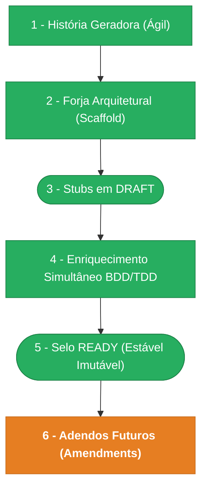

> ⚠️ **ARQUIVO GERIDO POR AUTOMAÇÃO.**
>
> - **Status DRAFT:** Enriqueça o conteúdo deste arquivo diretamente.
> - **Status READY:** NÃO EDITE DIRETAMENTE. Use a skill `create-amendment`.

# CHANGELOG - MOD-004

## Ciclo de Estabilidade do Módulo

> 🟢 Verde = Concluído | 🟠 Laranja = Em Andamento | 🔵 Azul = Estável Ancestral | ⬜ Cinza = Previsto

*O módulo está na **Etapa 6 — Adendos Futuros (Amendments). Amendment UX-001-M01 em DRAFT.**

---

## Histórico de Versões

| Versão | Data | Responsável | Descrição |
|--------|------|-------------|-----------|
| 1.7.0 | 2026-04-01 | codegen | Codegen v2 concluído: 6 agentes (DB no-op, CORE no-op, APP 4 arq, API 2 arq, WEB 8 arq, VAL 0). 14 arquivos gerados/atualizados. Backend: novo endpoint admin_org_scopes_list, respostas expandidas. Frontend: OrgScopeTable, ScopePill, RevokeModal, TabBar underline, seções separadas. VAL: 1 finding (OpenAPI falta admin_org_scopes_list). |
| 1.6.0 | 2026-03-31 | merge-amendment | Merge UX-001-M01 → UX-001 v0.4.0: layout Penpot 40-Identity aplicado. OrgScopePage (tabela, ScopePill, TreeSelector, Drawer 480px, Modal warning), SharesDelegationsPage (TabBar underline, seções, Banner, RevokeModal). 4 componentes reutilizáveis, rotas /organizacao/identidade/*. |
| 1.5.0 | 2026-03-31 | merge-amendment | Merge FR-001-M01 → FR-001 v0.4.0: novo endpoint admin_org_scopes_list, respostas expandidas com name+email em access-shares e access-delegations, 7 cenários Gherkin, 12 endpoints no resumo. |
| 1.4.0 | 2026-03-31 | cascade-amendment | Cascade UX-001-M01: FR-001-M01 criado (expandir respostas com nomes, novo endpoint admin_org_scopes_list, autocomplete usuarios). Manifests ux-idn-001 e ux-idn-002 atualizados (rotas, componentes, changelogs). |
| 1.3.0 | 2026-03-31 | create-amendment | Amendment UX-001-M01: alinhamento layout Penpot (40-Identity). Reestruturacao OrgScopePage (cards→tabela full-width), ScopePill, TreeSelector, TabBar underline, Banner, Drawers 480px slide-in, Modais com icone warning, estados skeleton/empty/error refinados. Rastreia 40-identity-spec.md. |
| 1.2.0 | 2026-03-24 | validate-all | validate-all pos-codegen: lint/format PASS, 6 validadores semanticos PASS, 1 violacao arquitetural (PENDENTE-005: IdentityDomainError nao estende DomainError). PENDENTE-004 (lint codegen) pre-existente mantida. |
| 1.1.0 | 2026-03-23 | codegen | Codegen concluído: 6 agentes executados, 37 arquivos gerados. Camadas: DB, CORE, APP, API, WEB, VAL. Validação cruzada aprovada com ressalvas menores (OpenAPI 401 responses, x-permissions self-service). |
| 1.0.0 | 2026-03-23 | promote-module | Promoção DRAFT→READY: manifesto v1.0.0, todos os requisitos e ADRs selados. Épico + features já READY. Ciclo de estabilidade avança para Etapa 5. |
| 0.9.0 | 2026-03-17 | AGN-DEV-08 | Enriquecimento NFR (enrich-agent) — SLOs detalhados (latência p95, cache), topologia sync+async, degradação por componente (4 cenários), health checks (4), idempotência por endpoint (5), métricas Prometheus (7), logs estruturados, traces OTel, DR (RPO=0/RTO≤15min), estratégia de testes Nível 2 com testes derivados de BRs (8 testes específicos), checklist PR DOC-ESC-001 §7.4, OKRs com teste de validação. Fixes: mod.md data_ultima_revisao→2026-03-17 (W2), BR-001 referencias_exemplos→EX-TRACE-001 (N1) |
| 0.8.0 | 2026-03-17 | AGN-DEV-09 | Enriquecimento ADR (enrich-agent) — ADR-001: validação auto-autorização no service (não CHECK constraint), com alternativas avaliadas e mitigações. ADR-002: tenant_id direto para RLS, justificativa de performance vs duplicação. Índice adr-index atualizado no mod.md |
| 0.7.0 | 2026-03-17 | AGN-DEV-07 | Enriquecimento UX (enrich-agent) — UX-001: tabelas de ações DOC-UX-010 (4 ações UX-IDN-001 + 11 ações UX-IDN-002) mapeadas para endpoints/event_types, telemetria UIActionEnvelope por screen (3+7 envelopes), acessibilidade (foco, teclado, ARIA), estados por painel (loading/empty/error/expired), tratamento de erros HTTP (5 status), estrutura 3 abas UX-IDN-002, segundo sequence diagram (delegação), pontos de auditoria |
| 0.6.0 | 2026-03-17 | AGN-DEV-06 | Enriquecimento SEC (enrich-agent) — SEC-001: mapeamento endpoint→scope→operationId (11 endpoints), autorização de linha (RLS + self-service), mascaramento por sensitivity_level, retenção por entidade, LGPD (direito ao esquecimento + ON DELETE RESTRICT), proteções (6 controles), Gherkin segurança (5 cenários). SEC-002: colunas maskable_fields + payload_policy na matriz, regras de mascaramento em notificações (3 regras), retenção de eventos, view rules por entity_type, Gherkin (4 cenários) |
| 0.5.0 | 2026-03-17 | AGN-DEV-05 | Enriquecimento INT (enrich-agent) — failure_behavior detalhado por integração (timeout, retries, backoff, DLQ), contratos de dependência MOD-000/MOD-003 com tabelas de entidades consumidas, clarificação banco compartilhado vs API HTTP, observabilidade (métricas + logs estruturados), resumo consolidado, refs EX-RES/IDEMP/OBS |
| 0.4.0 | 2026-03-17 | AGN-DEV-04 | Enriquecimento DATA (enrich-agent) — DATA-001: tenant_id (RLS), updated_at, índices explícitos (12 índices), constraints ON DELETE RESTRICT, CHECK com valores, ERD expandido com tenants, seções Auditoria e Migrações. DATA-003: maskable_fields por evento, outbox com dedupe_key por evento, UI Actions DOC-ARC-003, payload policy detalhado, regra Performance anti-N+1, campos domain_events e índices padrão |
| 0.3.0 | 2026-03-16 | AGN-DEV-02, AGN-DEV-03 | Enriquecimento BR+FR (enrich-agent) — BR-001: exemplos concretos, exceções, impactos categorizados (DATA/FLOW/PERMISSIONS/STATE/COMPLIANCE), Gherkin expandido de 4→14 cenários cobrindo todas as 9 regras. FR-001: campos idempotency/timeline_or_notifications, Gherkin detalhado por FR (6+7+6+5=24 cenários), tabela consolidada de 11 endpoints, deps expandidas (INT-001, DATA-003, SEC-002) |
| 0.2.0 | 2026-03-16 | AGN-DEV-01 | Enriquecimento MOD (enrich-agent) — Nível 2 (DDD-lite + Clean Completo) confirmado com score 5/6 (DOC-ESC-001 §4.2), module_paths detalhados para Nível 2 (API + Web), premissas/restrições, OKRs, rastreabilidade expandida |
| 0.1.0 | 2026-03-16 | arquitetura | Baseline Inicial — scaffold gerado via `forge-module` a partir de US-MOD-004 (READY). Stubs obrigatórios criados: BR-001, FR-001, DATA-001, DATA-003, INT-001, SEC-001, SEC-002, UX-001, NFR-001. Todos os itens nascem em `estado_item: DRAFT`. |
