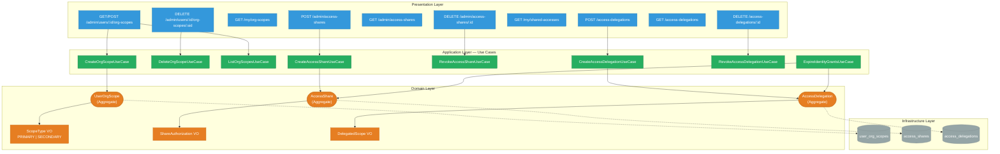

# MOD-004 — Arquitetura de Camadas (DDD-lite, Nível 2)

```mermaid
graph TD
    subgraph PRESENTATION ["Presentation Layer"]
        R1["GET/POST /admin/users/:id/org-scopes"]
        R2["DELETE /admin/users/:id/org-scopes/:sid"]
        R3["GET /my/org-scopes"]
        R4["POST /admin/access-shares"]
        R5["GET /admin/access-shares"]
        R6["DELETE /admin/access-shares/:id"]
        R7["GET /my/shared-accesses"]
        R8["POST /access-delegations"]
        R9["GET /access-delegations"]
        R10["DELETE /access-delegations/:id"]
    end

    subgraph APPLICATION ["Application Layer — Use Cases"]
        UC1["CreateOrgScopeUseCase"]
        UC2["DeleteOrgScopeUseCase"]
        UC3["ListOrgScopesUseCase"]
        UC4["CreateAccessShareUseCase"]
        UC5["RevokeAccessShareUseCase"]
        UC6["CreateAccessDelegationUseCase"]
        UC7["RevokeAccessDelegationUseCase"]
        UC8["ExpireIdentityGrantsUseCase"]
    end

    subgraph DOMAIN ["Domain Layer"]
        A1(["UserOrgScope<br/>(Aggregate)"])
        A2(["AccessShare<br/>(Aggregate)"])
        A3(["AccessDelegation<br/>(Aggregate)"])
        VO1["ScopeType VO<br/>PRIMARY | SECONDARY"]
        VO2["ShareAuthorization VO"]
        VO3["DelegatedScope VO"]
    end

    subgraph INFRA ["Infrastructure Layer"]
        DB1[("user_org_scopes")]
        DB2[("access_shares")]
        DB3[("access_delegations")]
    end

    R1 --> UC1
    R1 --> UC3
    R2 --> UC2
    R4 --> UC4
    R6 --> UC5
    R8 --> UC6
    R10 --> UC7

    UC1 --> A1
    UC4 --> A2
    UC6 --> A3
    UC8 --> A2
    UC8 --> A3

    A1 --> VO1
    A2 --> VO2
    A3 --> VO3

    A1 -.-> DB1
    A2 -.-> DB2
    A3 -.-> DB3

    classDef presentation fill:#3498DB,stroke:#2980B9,color:#fff
    classDef application fill:#27AE60,stroke:#1E8449,color:#fff
    classDef domain fill:#E67E22,stroke:#CA6F1E,color:#fff
    classDef infra fill:#95A5A6,stroke:#7F8C8D,color:#fff

    class R1,R2,R3,R4,R5,R6,R7,R8,R9,R10 presentation
    class UC1,UC2,UC3,UC4,UC5,UC6,UC7,UC8 application
    class A1,A2,A3,VO1,VO2,VO3 domain
    class DB1,DB2,DB3 infra
```
