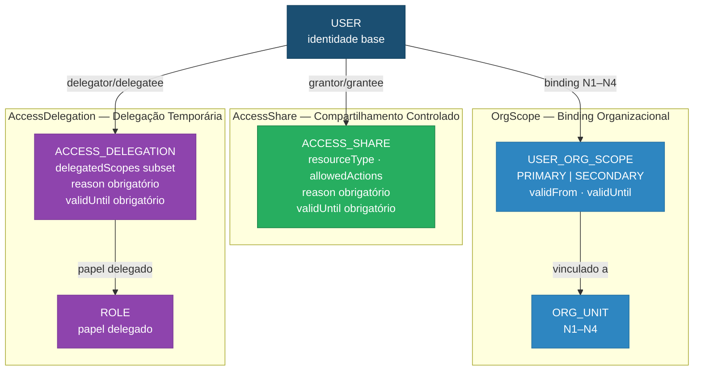
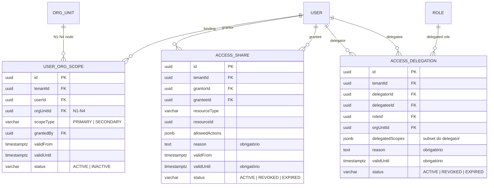

# MOD-004 — Modelo de Domínio

## 3 Mecanismos de Controle de Acesso

```mermaid
graph TD
    U["USER<br/>identidade base"]

    subgraph BINDING ["OrgScope — Binding Organizacional"]
        UOS["USER_ORG_SCOPE<br/>PRIMARY | SECONDARY<br/>validFrom · validUntil"]
        OU["ORG_UNIT<br/>N1–N4"]
    end

    subgraph SHARING ["AccessShare — Compartilhamento Controlado"]
        AS["ACCESS_SHARE<br/>resourceType · allowedActions<br/>reason obrigatório<br/>validUntil obrigatório"]
    end

    subgraph DELEGATION ["AccessDelegation — Delegação Temporária"]
        AD["ACCESS_DELEGATION<br/>delegatedScopes subset<br/>reason obrigatório<br/>validUntil obrigatório"]
        RO["ROLE<br/>papel delegado"]
    end

    U -->|"binding N1–N4"| UOS
    UOS -->|"vinculado a"| OU
    U -->|"grantor/grantee"| AS
    U -->|"delegator/delegatee"| AD
    AD -->|"papel delegado"| RO

    classDef user fill:#1B4F72,stroke:#154360,color:#fff
    classDef binding fill:#2E86C1,stroke:#2471A3,color:#fff
    classDef sharing fill:#27AE60,stroke:#1E8449,color:#fff
    classDef deleg fill:#8E44AD,stroke:#7D3C98,color:#fff

    class U user
    class UOS,OU binding
    class AS sharing
    class AD,RO deleg
```

## Entidades e Relacionamentos

```mermaid
erDiagram
    USER ||--o{ USER_ORG_SCOPE : "binding"
    ORG_UNIT ||--o{ USER_ORG_SCOPE : "N1-N4 node"
    USER ||--o{ ACCESS_SHARE : "grantor"
    USER ||--o{ ACCESS_SHARE : "grantee"
    USER ||--o{ ACCESS_DELEGATION : "delegator"
    USER ||--o{ ACCESS_DELEGATION : "delegatee"
    ROLE ||--o{ ACCESS_DELEGATION : "delegated role"

    USER_ORG_SCOPE {
        uuid id PK
        uuid tenantId FK
        uuid userId FK
        uuid orgUnitId FK "N1-N4"
        varchar scopeType "PRIMARY | SECONDARY"
        uuid grantedBy FK
        timestamptz validFrom
        timestamptz validUntil
        varchar status "ACTIVE | INACTIVE"
    }

    ACCESS_SHARE {
        uuid id PK
        uuid tenantId FK
        uuid grantorId FK
        uuid granteeId FK
        varchar resourceType
        uuid resourceId
        jsonb allowedActions
        text reason "obrigatório"
        timestamptz validFrom
        timestamptz validUntil "obrigatório"
        varchar status "ACTIVE | REVOKED | EXPIRED"
    }

    ACCESS_DELEGATION {
        uuid id PK
        uuid tenantId FK
        uuid delegatorId FK
        uuid delegateeId FK
        uuid roleId FK
        uuid orgUnitId FK
        jsonb delegatedScopes "subset do delegator"
        text reason "obrigatório"
        timestamptz validUntil "obrigatório"
        varchar status "ACTIVE | REVOKED | EXPIRED"
    }
```
