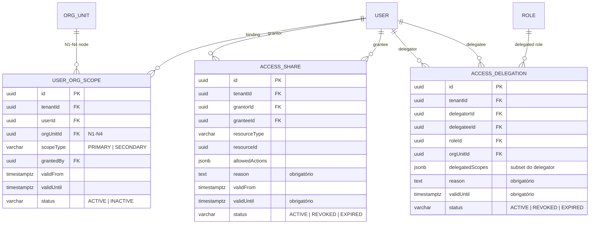

# MOD-004 — Modelo de Domínio

```mermaid
erDiagram
    USER ||--o{ USER_ORG_SCOPE : "binding"
    ORG_UNIT ||--o{ USER_ORG_SCOPE : "N1-N4 node"
    USER ||--o{ ACCESS_SHARE : "grantor"
    USER ||--o{ ACCESS_SHARE : "grantee"
    USER ||--o{ ACCESS_DELEGATION : "delegator"
    USER ||--o{ ACCESS_DELEGATION : "delegatee"
    ROLE ||--o{ ACCESS_DELEGATION : "delegated role"

    USER_ORG_SCOPE {
        uuid id PK
        uuid tenantId FK
        uuid userId FK
        uuid orgUnitId FK "N1-N4"
        varchar scopeType "PRIMARY | SECONDARY"
        uuid grantedBy FK
        timestamptz validFrom
        timestamptz validUntil
        varchar status "ACTIVE | INACTIVE"
    }

    ACCESS_SHARE {
        uuid id PK
        uuid tenantId FK
        uuid grantorId FK
        uuid granteeId FK
        varchar resourceType
        uuid resourceId
        jsonb allowedActions
        text reason "obrigatório"
        timestamptz validFrom
        timestamptz validUntil "obrigatório"
        varchar status "ACTIVE | REVOKED | EXPIRED"
    }

    ACCESS_DELEGATION {
        uuid id PK
        uuid tenantId FK
        uuid delegatorId FK
        uuid delegateeId FK
        uuid roleId FK
        uuid orgUnitId FK
        jsonb delegatedScopes "subset do delegator"
        text reason "obrigatório"
        timestamptz validUntil "obrigatório"
        varchar status "ACTIVE | REVOKED | EXPIRED"
    }
```
