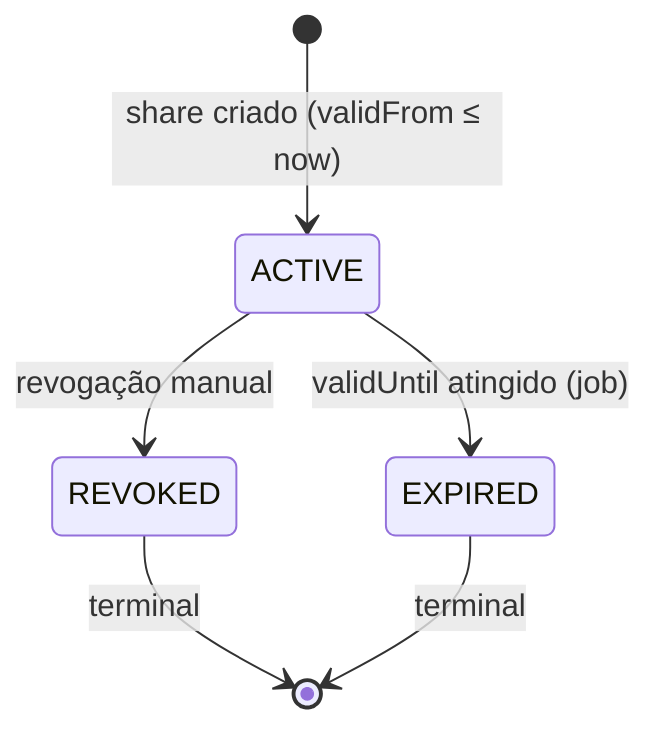
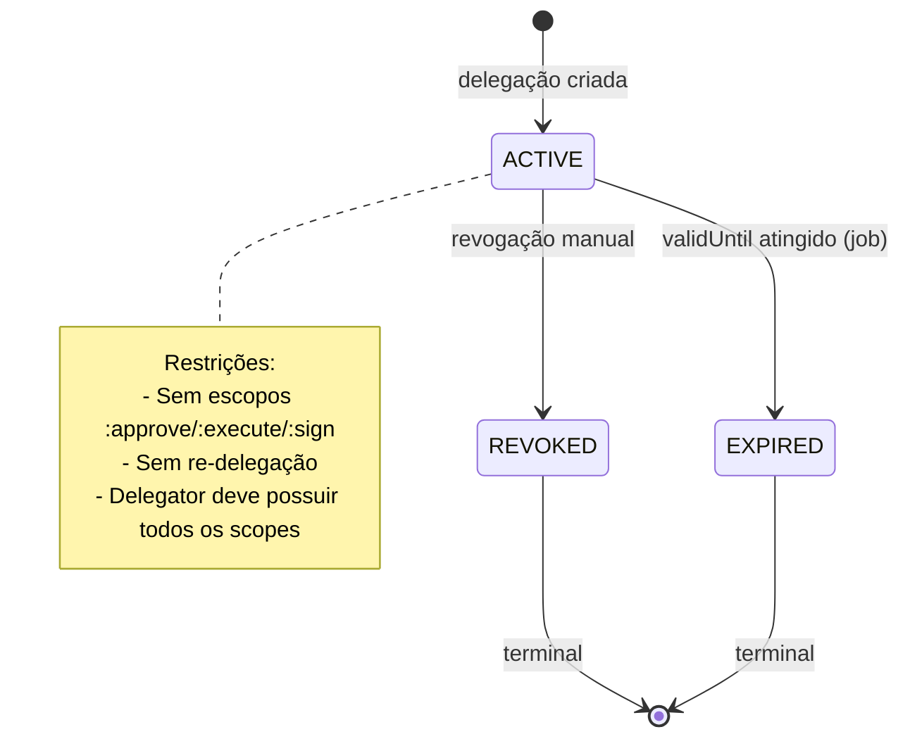
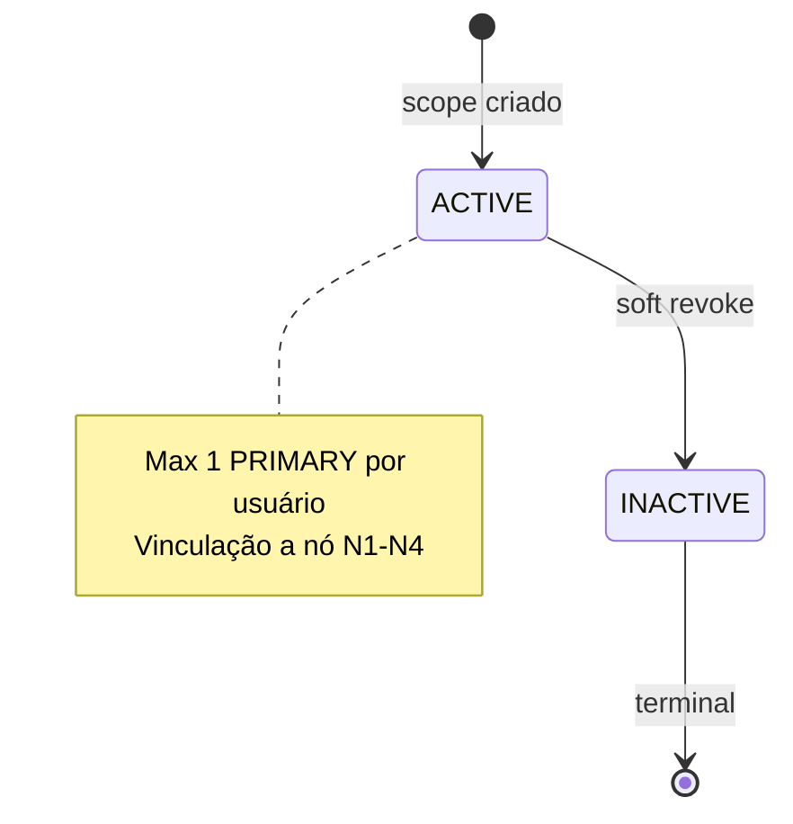

# MOD-004 — Máquinas de Estado

## AccessShare Status

```mermaid
stateDiagram-v2
    [*] --> ACTIVE : share criado (validFrom ≤ now)
    ACTIVE --> REVOKED : revogação manual
    ACTIVE --> EXPIRED : validUntil atingido (job)
    REVOKED --> [*] : terminal
    EXPIRED --> [*] : terminal
```

## AccessDelegation Status

```mermaid
stateDiagram-v2
    [*] --> ACTIVE : delegação criada
    ACTIVE --> REVOKED : revogação manual
    ACTIVE --> EXPIRED : validUntil atingido (job)
    REVOKED --> [*] : terminal
    EXPIRED --> [*] : terminal

    note right of ACTIVE
        Restrições:
        - Sem escopos :approve/:execute/:sign
        - Sem re-delegação
        - Delegator deve possuir todos os scopes
    end note
```

## UserOrgScope Status

```mermaid
stateDiagram-v2
    [*] --> ACTIVE : scope criado
    ACTIVE --> INACTIVE : soft revoke
    INACTIVE --> [*] : terminal

    note right of ACTIVE
        Max 1 PRIMARY por usuário
        Vinculação a nó N1-N4
    end note
```
