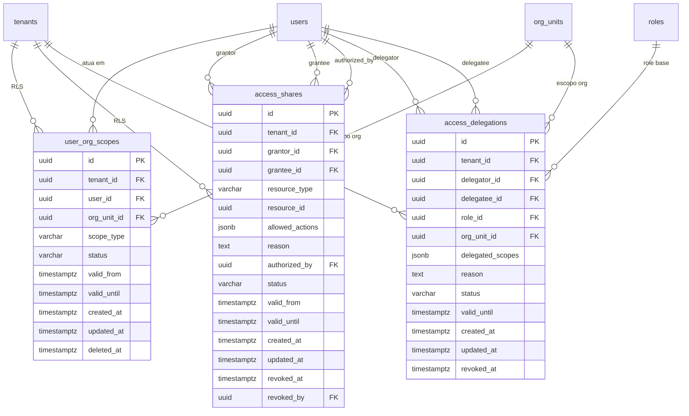

> ⚠️ **ARQUIVO GERIDO POR AUTOMAÇÃO.**
> - **Status DRAFT:** Enriqueça o conteúdo deste arquivo diretamente.
> - **Status READY:** NÃO EDITE DIRETAMENTE. Use a skill `create-amendment`.
>
> | Versão | Data       | Responsável | Status/Integração |
> |--------|------------|-------------|-------------------|
> | 0.1.0  | 2026-03-16 | arquitetura | Baseline Inicial (forge-module) |
> | 0.2.0  | 2026-03-17 | AGN-DEV-04  | Enriquecimento DATA (enrich-agent) |
> | 0.3.0  | 2026-03-17 | AGN-DEV-04  | Enriquecimento Batch 2 — rastreia_para expandido, validações BR-001.10-12, constraint valid_until access_delegations |

# DATA-001 — Modelo de Dados da Identidade Avançada

- **Objetivo:** Persistir vínculos organizacionais, compartilhamentos controlados e delegações temporárias com isolamento multi-tenant, soft delete e auditoria via domain events.
- **Tipo de Tabela/Armazenamento:** Relacional (SQL — PostgreSQL)

---

## Campos Obrigatórios Padrão (DOC-DEV-001 DATA-010)

Todas as tabelas deste módulo incluem os campos padrão:
- `id` (uuid, PK, NOT NULL)
- `tenant_id` (uuid, FK → tenants.id, NOT NULL — Row-Level Security)
- `created_at` (timestamptz, NOT NULL, default now())
- `updated_at` (timestamptz, NOT NULL, default now())
- `deleted_at` (timestamptz, NULL — Soft Delete)

> **Nota RLS:** `tenant_id` é incluído diretamente em cada tabela para permitir Row-Level Security eficiente sem JOINs. O valor é derivado do contexto de autenticação (`auth_me.tenant_id`) no momento da criação.

## Relacionamentos e Constraints (MUST — DOC-DEV-001)

- Toda FK tem `ON DELETE RESTRICT` — NUNCA `CASCADE`
- Soft delete via `deleted_at` (hard deletes via purging cron sob Política de Retenção)
- `updated_at` atualizado automaticamente em toda mutação (trigger ou application-level)

---

## Tabela: `user_org_scopes`

| Campo | tipo_negocio | tipo_db | nulidade | constraints | Descrição |
|---|---|---|---|---|---|
| `id` | UUID | uuid | NOT NULL | PK | Identificador único |
| `tenant_id` | UUID | uuid | NOT NULL | FK → tenants.id, ON DELETE RESTRICT | Isolamento multi-tenant (RLS) |
| `user_id` | UUID | uuid | NOT NULL | FK → users.id, ON DELETE RESTRICT | Usuário vinculado |
| `org_unit_id` | UUID | uuid | NOT NULL | FK → org_units.id, ON DELETE RESTRICT | Nó organizacional N1–N4 |
| `scope_type` | String(enum) | varchar(16) | NOT NULL | CHECK (`scope_type` IN ('PRIMARY', 'SECONDARY')) | PRIMARY = área principal; SECONDARY = área adicional |
| `granted_by` | UUID | uuid | NULL | FK → users.id, ON DELETE RESTRICT | Admin que concedeu |
| `valid_from` | DateTime | timestamptz | NOT NULL | default now() | Início da vigência |
| `valid_until` | DateTime | timestamptz | NULL | | null = permanente |
| `status` | String(enum) | varchar(16) | NOT NULL | CHECK (`status` IN ('ACTIVE', 'INACTIVE')), default 'ACTIVE' | Estado atual |
| `created_at` | DateTime | timestamptz | NOT NULL | default now() | |
| `updated_at` | DateTime | timestamptz | NOT NULL | default now() | |
| `deleted_at` | DateTime | timestamptz | NULL | | Soft delete |

### Constraints

- `UNIQUE(user_id, org_unit_id)` — um usuário só pode ter um vínculo por nó organizacional
- Business rule: máximo 1 PRIMARY ativo por `user_id` — validado no service (não via constraint, pois `UNIQUE(user_id, scope_type)` bloquearia SECONDARY múltiplo) (BR-001.2)
- **Somente N1-N4:** `org_unit_id` deve referenciar nó organizacional ativo de nível N1-N4 — validado no service via consulta a MOD-003 (BR-001.3, BR-001.11)
- **Vigência futura:** `valid_until`, quando presente, deve ser estritamente no futuro — validado no service (BR-001.10)

### Índices

| Nome | Campos | Tipo | Observação |
|---|---|---|---|
| `idx_user_org_scopes_tenant_user` | `(tenant_id, user_id, status)` | B-Tree | Hot path: listagem por usuário |
| `idx_user_org_scopes_org_unit` | `(tenant_id, org_unit_id, status)` | B-Tree | Busca: quem atua nesta área? |
| `idx_user_org_scopes_expiration` | `(valid_until, status)` WHERE `valid_until IS NOT NULL AND status = 'ACTIVE'` | Parcial | Background job de expiração |
| `uq_user_org_scopes_user_org` | `(user_id, org_unit_id)` | Unique | Constraint de unicidade |

### Eventos do domínio

`identity.org_scope_granted` | `identity.org_scope_revoked` | `identity.org_scope_expired` (ver DATA-003)

---

## Tabela: `access_shares`

| Campo | tipo_negocio | tipo_db | nulidade | constraints | Descrição |
|---|---|---|---|---|---|
| `id` | UUID | uuid | NOT NULL | PK | Identificador único |
| `tenant_id` | UUID | uuid | NOT NULL | FK → tenants.id, ON DELETE RESTRICT | Isolamento multi-tenant (RLS) |
| `grantor_id` | UUID | uuid | NOT NULL | FK → users.id, ON DELETE RESTRICT | Quem compartilha |
| `grantee_id` | UUID | uuid | NOT NULL | FK → users.id, ON DELETE RESTRICT | Quem recebe |
| `resource_type` | String | varchar(32) | NOT NULL | CHECK (`resource_type` IN ('org_unit', 'tenant', 'process')) | Tipo do recurso compartilhado |
| `resource_id` | UUID | uuid | NOT NULL | | ID do recurso compartilhado |
| `allowed_actions` | JSON Array | jsonb | NOT NULL | | Array de escopos concedidos (ex: `["finance:report:read"]`) |
| `reason` | String | text | NOT NULL | | Motivo — obrigatório para rastreabilidade |
| `authorized_by` | UUID | uuid | NOT NULL | FK → users.id, ON DELETE RESTRICT | Aprovador (pode = grantor com scope `identity:share:authorize`) |
| `valid_from` | DateTime | timestamptz | NOT NULL | default now() | Início da vigência |
| `valid_until` | DateTime | timestamptz | NOT NULL | | Expiração obrigatória |
| `status` | String(enum) | varchar(16) | NOT NULL | CHECK (`status` IN ('ACTIVE', 'REVOKED', 'EXPIRED')), default 'ACTIVE' | Estado atual |
| `created_at` | DateTime | timestamptz | NOT NULL | default now() | |
| `updated_at` | DateTime | timestamptz | NOT NULL | default now() | |
| `revoked_at` | DateTime | timestamptz | NULL | | Timestamp de revogação |
| `revoked_by` | UUID | uuid | NULL | FK → users.id, ON DELETE RESTRICT | Quem revogou |

### Constraints

- **Validação `authorized_by != grantor_id`** — feita no **service** (não via CHECK constraint no banco). Usuários com scope `identity:share:authorize` podem ser simultaneamente grantor e authorized_by (BR-001.7)
- `CHECK (valid_until > valid_from)` — expiração deve ser posterior ao início (BR-001.10)
- **Vigência obrigatória:** `valid_until` é NOT NULL — compartilhamento permanente proibido (BR-001.8)
- **Motivo obrigatório:** `reason` é NOT NULL e não pode ser vazio — validado no service (BR-001.9)
- **Validação de usuário alvo:** `grantee_id` deve existir em `users` do mesmo tenant — validado no service (BR-001.12)

### Índices

| Nome | Campos | Tipo | Observação |
|---|---|---|---|
| `idx_access_shares_tenant_status` | `(tenant_id, status, created_at DESC)` | B-Tree | Hot path: listagem admin |
| `idx_access_shares_grantee` | `(tenant_id, grantee_id, status)` | B-Tree | Hot path: /my/shared-accesses |
| `idx_access_shares_grantor` | `(tenant_id, grantor_id, status)` | B-Tree | Filtro por solicitante |
| `idx_access_shares_resource` | `(tenant_id, resource_type, resource_id, status)` | B-Tree | Busca: quem tem acesso a este recurso? |
| `idx_access_shares_expiration` | `(valid_until, status)` WHERE `status = 'ACTIVE'` | Parcial | Background job de expiração |

### Eventos do domínio

`identity.share_created` | `identity.share_revoked` | `identity.share_expired` (ver DATA-003)

---

## Tabela: `access_delegations`

| Campo | tipo_negocio | tipo_db | nulidade | constraints | Descrição |
|---|---|---|---|---|---|
| `id` | UUID | uuid | NOT NULL | PK | Identificador único |
| `tenant_id` | UUID | uuid | NOT NULL | FK → tenants.id, ON DELETE RESTRICT | Isolamento multi-tenant (RLS) |
| `delegator_id` | UUID | uuid | NOT NULL | FK → users.id, ON DELETE RESTRICT | Quem delega |
| `delegatee_id` | UUID | uuid | NOT NULL | FK → users.id, ON DELETE RESTRICT | Quem recebe |
| `role_id` | UUID | uuid | NULL | FK → roles.id, ON DELETE RESTRICT | Role base da delegação (opcional) |
| `org_unit_id` | UUID | uuid | NULL | FK → org_units.id, ON DELETE RESTRICT | Escopo org da delegação (opcional) |
| `delegated_scopes` | JSON Array | jsonb | NOT NULL | | Subconjunto dos escopos do delegador |
| `reason` | String | text | NOT NULL | | Motivo — obrigatório |
| `valid_until` | DateTime | timestamptz | NOT NULL | | TTL obrigatório |
| `status` | String(enum) | varchar(16) | NOT NULL | CHECK (`status` IN ('ACTIVE', 'REVOKED', 'EXPIRED')), default 'ACTIVE' | Estado atual |
| `created_at` | DateTime | timestamptz | NOT NULL | default now() | |
| `updated_at` | DateTime | timestamptz | NOT NULL | default now() | |
| `revoked_at` | DateTime | timestamptz | NULL | | Timestamp de revogação |

### Constraints

- `CHECK (valid_until > created_at)` — expiração deve ser posterior à criação (BR-001.10)
- **Escopos proibidos:** `delegated_scopes` NÃO pode conter `*:approve`, `*:execute`, `*:sign` — validado no service via regex (BR-001.4)
- **Escopos próprios:** delegator MUST possuir todos os escopos listados — validado no service contra token JWT (BR-001.5)
- **Sem re-delegação:** escopos obtidos por delegação não podem ser sub-delegados — validado no service (BR-001.6)
- **Validação de usuário alvo:** `delegatee_id` deve existir em `users` do mesmo tenant — validado no service (BR-001.12)

### Índices

| Nome | Campos | Tipo | Observação |
|---|---|---|---|
| `idx_access_delegations_tenant_status` | `(tenant_id, status, created_at DESC)` | B-Tree | Hot path: listagem |
| `idx_access_delegations_delegator` | `(tenant_id, delegator_id, status)` | B-Tree | Filtro: "delegações que dei" |
| `idx_access_delegations_delegatee` | `(tenant_id, delegatee_id, status)` | B-Tree | Hot path: "delegações que recebi" |
| `idx_access_delegations_expiration` | `(valid_until, status)` WHERE `status = 'ACTIVE'` | Parcial | Background job de expiração |

### Eventos do domínio

`identity.delegation_created` | `identity.delegation_revoked` | `identity.delegation_expired` (ver DATA-003)

---

## Diagrama ERD (Mermaid) — Entidades núcleo

---

## Auditoria / Event Sourcing

- Todas as mutações emitem domain events via Outbox Pattern (ver DATA-003)
- Proibida criação 1-para-1 de tabelas de log — usar `domain_events` como fonte única
- Retenção: 5 anos para registros soft-deleted (compliance)

---

## Migrações

- **Naming convention:** `YYYYMMDDHHMMSS_create_user_org_scopes.ts`, `_create_access_shares.ts`, `_create_access_delegations.ts`
- **Ordem:** user_org_scopes → access_shares → access_delegations (independentes, sem FKs entre si)
- **RLS:** Cada tabela DEVE ter policy `tenant_id = current_setting('app.tenant_id')::uuid`
- **Rollback:** Todas as migrações DEVEM ter `down()` que reverte sem perda de dados em outras tabelas

- **estado_item:** DRAFT
- **owner:** arquitetura
- **data_ultima_revisao:** 2026-03-17
- **rastreia_para:** US-MOD-004, US-MOD-004-F01, US-MOD-004-F02, FR-001, BR-001, BR-001.2, BR-001.3, BR-001.4, BR-001.5, BR-001.6, BR-001.7, BR-001.8, BR-001.9, BR-001.10, BR-001.11, BR-001.12, SEC-001, SEC-002, INT-001
- **referencias_exemplos:** EX-DB-001 (padrão de campos obrigatórios), EX-NAME-001 (naming convention)
- **evidencias:** N/A
