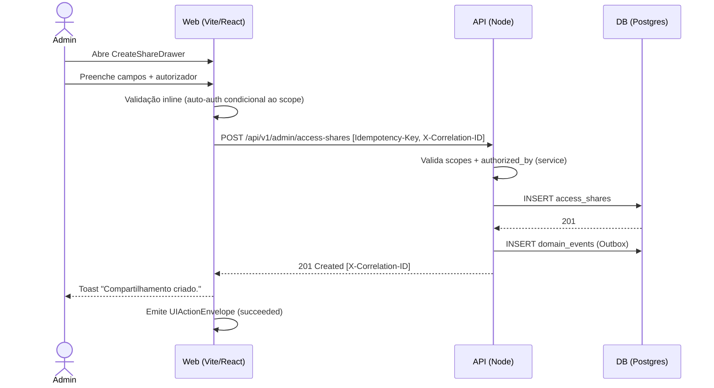
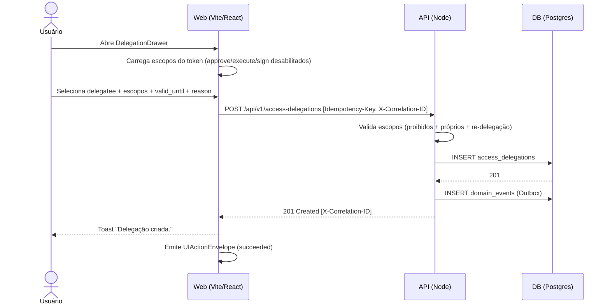

> ⚠️ **ARQUIVO GERIDO POR AUTOMAÇÃO.**
>
> - **Status DRAFT:** Enriqueça o conteúdo deste arquivo diretamente.
> - **Status READY:** NÃO EDITE DIRETAMENTE. Use a skill `create-amendment`.
>
> | Versão | Data       | Responsável | Status/Integração |
> |--------|------------|-------------|-------------------|
> | 0.1.0  | 2026-03-16 | arquitetura | Baseline Inicial (forge-module) |
> | 0.2.0  | 2026-03-17 | AGN-DEV-07  | Enriquecimento UX (enrich-agent) |
> | 0.3.0  | 2026-03-17 | AGN-DEV-07  | Enriquecimento Batch 3 — erros BR-001.10-12, inline validation, empty states refinados |

# UX-001 — Jornadas e Fluxos da Identidade Avançada

---

## UX-001.1 — Gestão de Escopo Organizacional (UX-IDN-001)

- **Manifest:** `docs/05_manifests/screens/ux-idn-001.org-scope.yaml`
- **Feature:** US-MOD-004-F03
- **screen_id:** UX-IDN-001
- **operationIds consumidos:** `admin_user_org_scopes_list`, `admin_user_org_scopes_create`, `admin_user_org_scopes_delete`, `org_units_list`

### Happy path

1. Admin acessa `/usuarios/:id/escopo-organizacional`
2. Skeleton exibido durante GET `/admin/users/:id/org-scopes`
3. Lista de vínculos exibida com badges PRIMARY (azul) / SECONDARY (cinza) + breadcrumb do nó org
4. Cada card exibe data de concessão e validade (se houver) + badge de expiração iminente
5. Admin clica "Adicionar" → drawer abre com autocomplete de nós org (apenas N1–N4)
6. Admin seleciona nó e tipo (PRIMARY/SECONDARY) → clica "Vincular"
7. POST cria vínculo → card aparece na lista + Toast: "Área organizacional vinculada com sucesso."

### Alternativas/erros

- **Segundo PRIMARY:** drawer exibe aviso: "Remova a área principal atual antes de adicionar uma nova." Botão "Vincular" disabled para tipo PRIMARY
- **Nó N5 (tenant):** não aparece no autocomplete (filtro backend `nivel <= 4`)
- **Sem scope `identity:org_scope:read`:** redirecionado para `/usuarios/:id` com Toast "Sem permissão."
- **Remover PRIMARY:** modal com aviso especial: "Ao remover a área principal, processos vinculados a este usuário podem perder contexto organizacional." Botão "Remover mesmo assim" visualmente diferenciado
- **Remover SECONDARY:** modal padrão: "Deseja remover este vínculo organizacional?"
- **Nó inativo (BR-001.11):** autocomplete NÃO exibe nós com status INACTIVE; se o backend retornar 422 (race condition), inline error: "O nó organizacional informado não existe ou está inativo."
- **Data expiração no passado (BR-001.10):** campo `valid_until` com validação client-side (date-picker bloqueia datas passadas); se backend retornar 422, inline error: "A data de expiração deve ser no futuro."

### Estados

| Estado | Comportamento |
|---|---|
| **Loading** | Skeleton durante GET (cards placeholder) |
| **Empty** | Ilustração + "Nenhuma área vinculada. Clique em Adicionar para vincular." |
| **Error 5xx** | Toast: "Erro ao carregar vínculos. Tente novamente." (sem detalhes técnicos) |

### Tratamento de Erros e Mensagens (MUST UX — DOC-DEV-001 §4.5)

| HTTP Status | Comportamento UX | Mensagem |
|---|---|---|
| 403 | Toast Warning + redirect | "Sem permissão." |
| 404 | Toast Info | "Nó organizacional não encontrado." |
| 409 | Toast Warning | "Usuário já possui área principal (PRIMARY)." |
| 422 | Inline validation no drawer | `extensions.invalid_fields[]` mapeado para campos |
| 5xx | Toast Error genérico | "Erro inesperado. Tente novamente." |

### Ações Disponíveis (DOC-UX-010)

| action_id | label_pt | kind | scope | endpoint | event_type | idempotência |
|---|---|---|---|---|---|---|
| `view` | Visualizar vínculos | query | collection | GET /admin/users/:id/org-scopes | — | N/A |
| `create` | Vincular área | command | single | POST /admin/users/:id/org-scopes | `identity.org_scope_granted` | Idempotency-Key |
| `delete` | Remover vínculo | command | single | DELETE /admin/users/:id/org-scopes/:scopeId | `identity.org_scope_revoked` | Inerente |
| `filter` | Filtrar por tipo/status | query | collection | GET /admin/users/:id/org-scopes?scope_type=... | — | N/A |

### Acessibilidade

- Drawer de criação: foco automático no campo autocomplete ao abrir
- Navegação por teclado: Tab entre cards, Enter para ações
- Badges PRIMARY/SECONDARY com `aria-label` descritivo
- Modal de remoção: foco no botão "Cancelar" por padrão (prevenção de exclusão acidental)

### Telemetria (UIActionEnvelope — DOC-ARC-003 §2)

| action_id | screen_id | operation_id | tenant_id | Ciclo de vida |
|---|---|---|---|---|
| `view` | UX-IDN-001 | `admin_user_org_scopes_list` | ✅ presente | requested → succeeded/failed |
| `create` | UX-IDN-001 | `admin_user_org_scopes_create` | ✅ presente | requested → succeeded/failed |
| `delete` | UX-IDN-001 | `admin_user_org_scopes_delete` | ✅ presente | requested → succeeded/failed |

---

## UX-001.2 — Painel de Compartilhamentos e Delegações (UX-IDN-002)

- **Manifest:** `docs/05_manifests/screens/ux-idn-002.shares-delegations.yaml`
- **Feature:** US-MOD-004-F04
- **screen_id:** UX-IDN-002
- **operationIds consumidos:** `admin_access_shares_list`, `admin_access_shares_create`, `admin_access_shares_revoke`, `access_delegations_list`, `access_delegations_create`, `access_delegations_revoke`, `my_shared_accesses`

### Estrutura do Painel (3 abas)

| Aba | Visível para | Scope requerido |
|---|---|---|
| Compartilhamentos (admin) | Admin | `identity:share:read` |
| Delegações | Todos autenticados | — |
| Recebidos por Mim | Todos autenticados | — |

---

### Aba 1: Compartilhamentos (Admin)

#### Happy path

1. Admin acessa painel "Compartilhamentos"
2. GET `/admin/access-shares` com filtro `status=ACTIVE` → tabela com shares ativos
3. Tabela exibe: recurso, solicitante, beneficiário, motivo, autorizador, válido até (com badges), status
4. Admin clica "Novo Compartilhamento" → CreateShareDrawer abre
5. Preenche: grantee, resource_type, resource_id, allowed_actions, reason, authorized_by, valid_until
6. Validação inline no drawer (auto-autorização condicional ao scope)
7. POST cria → item na tabela + Toast: "Compartilhamento criado."

#### Alternativas/erros

- **Auto-autorização com scope `identity:share:authorize`:** badge informativo: "Você possui permissão para auto-autorizar."
- **Auto-autorização sem scope:** aviso inline: "Sem permissão para auto-autorizar. Selecione outro aprovador." Botão "Criar" disabled
- **Badge de expiração:** âmbar (≤7 dias), vermelho ("Expira amanhã"), cinza+strikethrough (EXPIRED)
- **Revogação:** modal de confirmação: "Confirma revogação deste compartilhamento?" → DELETE → Toast: "Compartilhamento revogado."
- **Sem `identity:share:read`:** aba "Compartilhamentos" NÃO renderiza (sem redirect, simplesmente oculta)
- **Grantee inexistente (BR-001.12):** autocomplete de grantee filtra apenas usuários ativos do tenant; se backend retornar 422, inline error: "O usuário destinatario nao foi encontrado ou nao pertence ao tenant."
- **Data expiração no passado (BR-001.10):** date-picker bloqueia datas passadas client-side; se backend retornar 422, inline error: "A data de expiração deve ser no futuro."

### Aba 2: Delegações

#### Happy path

1. Usuário acessa painel "Delegações"
2. GET `/access-delegations` → seção "Delegações Dadas" (caller=delegator) + seção "Delegações Recebidas" (caller=delegatee)
3. Seções filtram `status=ACTIVE`
4. Usuário clica "Nova Delegação" → DelegationDrawer abre
5. Multi-select de escopos do token (approve/execute/sign: visíveis mas **desabilitados** com tooltip)
6. Banner no drawer: "Os escopos delegados não podem ser re-delegados pelo beneficiário."
7. POST cria → item na seção "Dadas" + Toast: "Delegação criada."

#### Alternativas/erros

- **Escopos de aprovação:** visíveis mas desabilitados no multi-select com tooltip: "Escopos de aprovação não podem ser delegados."
- **Revogar delegação:** apenas o delegator pode revogar → DELETE → Toast: "Delegação revogada."
- **Delegatee inexistente (BR-001.12):** autocomplete de delegatee filtra apenas usuários ativos do tenant; se backend retornar 422, inline error: "O usuário destinatário não foi encontrado ou não pertence ao tenant."
- **Data expiração no passado (BR-001.10):** date-picker bloqueia datas passadas client-side; se backend retornar 422, inline error: "A data de expiração deve ser no futuro."

### Aba 3: Recebidos por Mim

#### Happy path

1. Usuário acessa painel "Recebidos por Mim"
2. GET `/my/shared-accesses` → tabela de shares recebidos
3. GET `/access-delegations` (filtra received) → seção de delegações recebidas
4. Tabela exibe: recurso/escopo, concedente/delegador, ações permitidas, válido até
5. Banner informativo: "Estes acessos são temporários e expiram automaticamente."
6. Banner em delegações: "Escopos obtidos por delegação não podem ser re-delegados."

### Estados (todos os painéis)

| Estado | Comportamento |
|---|---|
| **Loading** | Skeleton por painel/aba durante carregamento |
| **Empty (shares)** | "Nenhum compartilhamento ativo." |
| **Empty (delegações)** | "Nenhuma delegação ativa." |
| **Empty (recebidos)** | "Você não possui acessos compartilhados ou delegados no momento." |
| **Error 5xx** | Toast: "Erro ao carregar dados. Tente novamente." |
| **EXPIRED items** | Permanecem na lista por 30 dias em cinza (histórico auditável) |

### Tratamento de Erros e Mensagens (MUST UX)

| HTTP Status | Comportamento UX | Mensagem |
|---|---|---|
| 403 | Toast Warning | "Sem permissão para esta operação." |
| 422 | Inline validation no drawer | `extensions.invalid_fields[]` + mensagens de regra (auto-auth, escopos proibidos, vigência passada, usuário inexistente) |
| 5xx | Toast Error genérico | "Erro inesperado. Tente novamente." |

#### Mensagens de validação inline detalhadas (422 — BR refs)

| Regra | Campo | Mensagem inline |
|---|---|---|
| BR-001.10 | `valid_until` | "A data de expiração deve ser no futuro." |
| BR-001.12 | `grantee_id` / `delegatee_id` | "O usuário destinatário não foi encontrado ou não pertence ao tenant." |
| BR-001.4 | `delegated_scopes` | "Delegações não podem incluir escopos de aprovação, execução ou assinatura." |
| BR-001.7 | `authorized_by` | "Sem scope 'identity:share:authorize', o autorizador deve ser diferente do solicitante." |
| BR-001.8 | `valid_until` | "A data de expiração é obrigatória para compartilhamentos/delegações." |
| BR-001.9 | `reason` | "O motivo do compartilhamento é obrigatório." |

### Ações Disponíveis (DOC-UX-010)

| action_id | label_pt | kind | scope | endpoint | event_type | painel |
|---|---|---|---|---|---|---|
| `view` | Listar shares | query | collection | GET /admin/access-shares | — | Shares |
| `filter` | Filtrar por status/grantee | query | collection | GET /admin/access-shares?status=...&grantee_id=... | — | Shares |
| `paginate` | Paginar | query | collection | GET /admin/access-shares?cursor=...&limit=... | — | Shares |
| `create` | Novo compartilhamento | command | single | POST /admin/access-shares | `identity.share_created` | Shares |
| `delete` | Revogar compartilhamento | command | single | DELETE /admin/access-shares/:id | `identity.share_revoked` | Shares |
| `view` | Listar delegações | query | collection | GET /access-delegations | — | Delegações |
| `create` | Nova delegação | command | single | POST /access-delegations | `identity.delegation_created` | Delegações |
| `delete` | Revogar delegação | command | single | DELETE /access-delegations/:id | `identity.delegation_revoked` | Delegações |
| `view` | Acessos recebidos | query | collection | GET /my/shared-accesses | — | Recebidos |
| `search` | Buscar por recurso | query | collection | GET /admin/access-shares?q=... | — | Shares |
| `sort` | Ordenar por validade | query | collection | GET /admin/access-shares?sort=valid_until | — | Shares |
| `view_history` | Ver histórico de alterações | query | single | GET /admin/access-shares/:id/history | — | Shares |
| `view_history` | Ver histórico de delegações | query | single | GET /access-delegations/:id/history | — | Delegações |

### Acessibilidade

- Abas: navegação por teclado (Arrow keys entre abas, Enter para selecionar)
- Drawers: foco automático no primeiro campo ao abrir; Escape para fechar
- Multi-select de escopos: escopos desabilitados com `aria-disabled="true"` + tooltip via `aria-describedby`
- Banners informativos: `role="alert"` para leitores de tela
- Badges de expiração: `aria-label` com data completa (ex: "Expira em 17 de março de 2026")

### Telemetria (UIActionEnvelope — DOC-ARC-003 §2)

| action_id | screen_id | operation_id | tenant_id | Ciclo de vida |
|---|---|---|---|---|
| `view` (shares) | UX-IDN-002 | `admin_access_shares_list` | ✅ presente | requested → succeeded/failed |
| `create` (share) | UX-IDN-002 | `admin_access_shares_create` | ✅ presente | requested → succeeded/failed |
| `delete` (share) | UX-IDN-002 | `admin_access_shares_revoke` | ✅ presente | requested → succeeded/failed |
| `view` (delegations) | UX-IDN-002 | `access_delegations_list` | ✅ presente | requested → succeeded/failed |
| `create` (delegation) | UX-IDN-002 | `access_delegations_create` | ✅ presente | requested → succeeded/failed |
| `delete` (delegation) | UX-IDN-002 | `access_delegations_revoke` | ✅ presente | requested → succeeded/failed |
| `view` (received) | UX-IDN-002 | `my_shared_accesses` | ✅ presente | requested → succeeded/failed |

---

## Pontos de auditoria/log

- Toda ação `command` emite UIActionEnvelope com `correlation_id` → propagado no header HTTP → armazenado no domain_event backend
- Ações `query` emitem UIActionEnvelope apenas para telemetria (sem domain event)
- Nenhum dado sensível (PII) trafega nos envelopes de telemetria

---

## Diagramas Sequence (Mermaid) — Jornadas críticas

### Criar compartilhamento (UX-IDN-002)

### Criar delegação (UX-IDN-002)

- **estado_item:** READY
- **owner:** arquitetura
- **data_ultima_revisao:** 2026-03-23
- **rastreia_para:** US-MOD-004, US-MOD-004-F03, US-MOD-004-F04, FR-001, BR-001, BR-001.4, BR-001.7, BR-001.8, BR-001.9, BR-001.10, BR-001.11, BR-001.12, SEC-001, SEC-002, DATA-003, DOC-UX-010, DOC-ARC-003
- **referencias_exemplos:** EX-API-001 (endpoints), EX-OBS-001 (telemetria), EX-UX-010 (action catalog view_history)
- **evidencias:** N/A
