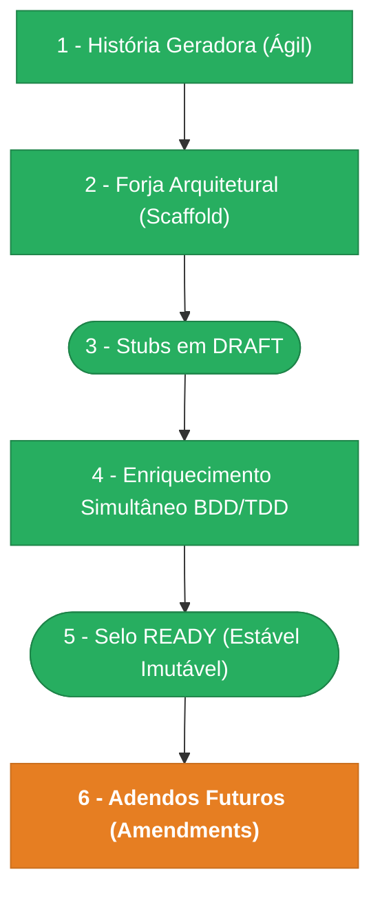

> ⚠️ **ARQUIVO GERIDO POR AUTOMAÇÃO.**
>
> - **Status DRAFT:** Enriqueça o conteúdo deste arquivo diretamente.
> - **Status READY:** NÃO EDITE DIRETAMENTE. Use a skill `create-amendment`.

# CHANGELOG - MOD-005

## Ciclo de Estabilidade do Módulo

> 🟢 Verde = Concluído | 🟠 Laranja = Em Andamento | 🔵 Azul = Estável Ancestral | ⬜ Cinza = Previsto

*O módulo está na **Etapa 6 — Adendos Futuros (Amendments). Alterações via `create-amendment`.**

---

## Histórico de Versões

| Versão | Data | Responsável | Descrição |
|--------|------|-------------|-----------|
| 1.3.5 | 2026-03-30 | merge-amendment | Merge INT-005-C01 em INT-005.md (v0.4.1): nota de implementação POST macro-stages — param :cid deve usar Zod schema (cidParam) |
| 1.3.4 | 2026-03-30 | create-amendment | Correção: INT-005-C01 — POST /cycles/:cid/macro-stages retorna 400 por params schema JSON literal em vez de Zod. Ref: spec-fix-macro-stages-params-schema-mismatch |
| 1.3.3 | 2026-03-30 | merge-amendment | Merge UX-005-C01 em UX-005.md (v0.4.1): 3 variantes empty no §2.2, 3 cenários de erro no §2.4, 4 COPY no §2.6, canCreate/blockReason/error + onError + await invalidate no §2.7 |
| 1.3.2 | 2026-03-30 | create-amendment | Correção: UX-005-C01 — falha silenciosa no double-click do canvas vazio. Guards sem feedback visual, mutation sem onError. Adiciona canCreate/blockReason/error ao hook, 3 variantes de canvas vazio, toast de erro. Ref: spec-fix-cycle-editor-empty-canvas-feedback |
| 1.3.1 | 2026-03-30 | codegen | Codegen AGN-COD-WEB: edição de papéis de processo (4 arquivos). Type UpdateProcessRoleRequest, API updateProcessRole(), hook useUpdateProcessRole, dialog de edição na ProcessRolesPage. Ref: spec-process-roles-edit |
| 1.3.0 | 2026-03-30 | codegen | Codegen parcial: AGN-COD-WEB (1 agente, 2 arquivos). Hook use-create-stage-from-canvas.ts + FlowEditorPage.tsx atualizado. Ref: spec-cycle-editor-empty-canvas-first-stage |
| 1.2.1 | 2026-03-30 | merge-amendment | Merge FR-008-C01 em FR-005.md (v0.3.2): 3 cenários Gherkin de edição (PATCH) de papéis de processo adicionados ao FR-008 |
| 1.2.0 | 2026-03-30 | merge-amendment | Merge UX-005-M01 em UX-005.md (v0.4.0): jornada alternativa primeiro estágio, estado empty com affordance, ação auto-criar macroetapa, 6 cenários erros, GhostNode, §2.7 Hooks Frontend |
| 1.1.1 | 2026-03-30 | create-amendment | Correção: FR-008-C01 — frontend da ProcessRolesPage omitiu edição (PATCH). Adiciona cenários Gherkin de update + contrato de implementação (type, API client, hook, dialog UI). Ref: spec-process-roles-edit |
| 1.1.0 | 2026-03-30 | create-amendment | Melhoria: UX-005-M01 — duplo clique no canvas vazio cria macroetapa padrão + primeiro estágio. Hook useCreateStageFromCanvas, GhostNode, abertura automática do painel. Ref: spec-cycle-editor-empty-canvas-first-stage |
| 1.0.5 | 2026-03-28 | merge-amendment | Merge FR-011-C01 + FR-001-C01 em FR-005.md (v0.3.1): notas de implementação para handler /flow (mapeamento camelCase→snake_case) e handlers CRUD (dados reais no response) |
| 1.0.4 | 2026-03-28 | create-amendment | Correção: FR-011-C01 (flow handler sem mapeamento camelCase→snake_case, HTTP 500) + FR-001-C01 (deprecate envia nome:null, handlers usam timestamps fake). Ref: spec-fix-cycle-response-schema-mismatch |
| 1.0.3 | 2026-03-24 | validate-all | Validação Fase 3 aprovada — pronto para merge. Lint: PASS. QA: WARN (infra-level). Manifests: PASS (2/2, V-M01 resolvido). OpenAPI: WARN (deprecate falta no OAS). Drizzle: PASS (7/7). Endpoints: PASS (todas 5 violações anteriores resolvidas). Arquitetural: PASS (DomainError OK, Pattern A OK). 0 bloqueadores, 0 críticas, 5 avisos. |
| 1.0.2 | 2026-03-24 | validate-all | Re-validação completa. Lint: PASS. Format: PASS. QA: WARN (5 TS — reactflow deps). Drizzle: PASS (7/7). Endpoints: FAIL (1 bloqueador + 3 críticas persistem: V-E01 DomainError, V-E02 deprecate sem rota, V-E03 status codes, V-E06 web deprecate broken). Manifests: WARN (V-M01 update action). Nova pendência: nenhuma (todas pré-existentes). |
| 1.0.1 | 2026-03-23 | validate-all | Validação Fase 3 com 1 bloqueador + 4 violações críticas — ver pen file. QA: WARN (infra-level). Manifests: 1/2. OpenAPI: PASS. Drizzle: PASS. Endpoints: FAIL. |
| 1.0.0 | 2026-03-23 | promote-module | Promoção DRAFT→READY: manifesto v1.0.0, todos os requisitos e ADRs selados. Épico + features já READY. Ciclo de estabilidade avança para Etapa 5. |
| 0.17.0 | 2026-03-17 | AGN-DEV-10 | Re-enriquecimento PENDENTE (enrich-agent) — 3 novas questoes abertas: Q7 (domain events update/delete), Q8 (DELETE process_roles), Q9 (ADR-002 status proposed). Total: 6 resolvidas + 3 abertas |
| 0.16.0 | 2026-03-17 | AGN-DEV-09 | Re-enriquecimento ADR (enrich-agent) — ADR-003: Fork atomico via transacao unica com remapeamento de UUIDs (accepted). ADR-004: Optimistic locking via updated_at para edicao concorrente (accepted). Total: 4 ADRs |
| 0.15.0 | 2026-03-17 | AGN-DEV-03 | Re-enriquecimento FR (enrich-agent) — Gherkin adicionado a FR-001..FR-011, dependências BR-011/BR-012 incorporadas em FR-004/FR-005/FR-006/FR-007, done funcional expandido com detalhes de codigo imutável, reordenação e query /flow |
| 0.14.0 | 2026-03-17 | AGN-DEV-02 | Re-enriquecimento BR (enrich-agent) — BR-011 (depreciação bloqueia instâncias), BR-012 (reordenação automática contígua) adicionados. Total: 12 regras de negócio |
| 0.13.0 | 2026-03-17 | AGN-DEV-01 | Re-enriquecimento MOD (enrich-agent) — Nível 2 reconfirmado (score 5/6), rastreia_para inclui DOC-ESC-001, summary atualizado com contadores de artefatos (13 FR, 10 BR, 2 ADR, 2 UX) |
| 0.12.0 | 2026-03-17 | Marcos Sulivan | ADR-001 aceita (Opção B: cycle_id denormalizado), DATA-005 §2.3 atualizado com novo campo + partial unique index + trigger, Q4 e Q5 resolvidas em PENDENTE-005, DOC-FND-000 v1.1.0 com 4 scopes process:cycle:* |
| 0.11.0 | 2026-03-17 | AGN-DEV-10 | Enriquecimento PENDENTE (enrich-agent) — 3 questões resolvidas (Q1-Q3), 3 questões residuais abertas (Q4: amendment scopes, Q5: ADR-001 decisão, Q6: contagem endpoints). Corrige mod.md version drift (0.2.0→0.11.0) |
| 0.10.0 | 2026-03-17 | AGN-DEV-08 | Enriquecimento NFR (enrich-agent) — 7 seções: SLOs (/flow <200ms, fork <2s), topologia sync, 2 healthchecks, DR (RPO=0, RTO<30min), 9 limites de capacidade, 5 pilares de observabilidade, 6 métricas de performance frontend |
| 0.9.0 | 2026-03-17 | AGN-DEV-03 | Enriquecimento FR (enrich-agent) — 13 requisitos funcionais formalizados (FR-001 a FR-013) com done funcional, dependências, idempotency e timeline. Cobre: CRUD ciclos, publicação, fork, depreciação, macroetapas, estágios, gates, papéis, stage-role links, transições, /flow, editor visual, configurador |
| 0.8.0 | 2026-03-17 | AGN-DEV-09 | Enriquecimento ADR (enrich-agent) — ADR-001: is_initial unique (trigger vs denormalização), ADR-002: fail-safe integração MOD-006 (503 quando indisponível) |
| 0.7.0 | 2026-03-17 | AGN-DEV-07 | Enriquecimento UX (enrich-agent) — UX-PROC-001: jornada editor visual, 8 ações mapeadas UX-010, 5 estados, 7 componentes, 5 cenários de erro, copy. UX-PROC-002: jornada painel lateral, 4 abas (Info/Gates/Papéis/Transições), 10 ações mapeadas UX-010, sincronização bidirecional canvas↔painel |
| 0.6.0 | 2026-03-17 | AGN-DEV-06 | Enriquecimento SEC (enrich-agent) — SEC-005: 11 seções (authn, authz, classificação, retenção, mascaramento, soft delete, imutabilidade, tenant isolation, auditoria, proteção deleção, LGPD). SEC-002: +colunas maskable_fields/retenção, regras de notificação para publish/deprecated |
| 0.5.0 | 2026-03-17 | AGN-DEV-05 | Enriquecimento INT (enrich-agent) — 25 endpoints documentados com contratos, RFC 9457 extensions por BR, contrato /flow response, integração MOD-006 (instâncias ativas), 4 escopos RBAC, padrões DOC-ARC-001 |
| 0.4.0 | 2026-03-17 | AGN-DEV-04 | Enriquecimento DATA (enrich-agent) — DATA-005: 7 tabelas completas com campos, constraints, indexes, seed data, migração e queries críticas (/flow SLA <200ms). DATA-003: catálogo expandido com entity_type, payload_policy, outbox config, causation_id para fork |
| 0.3.0 | 2026-03-17 | AGN-DEV-02 | Enriquecimento BR (enrich-agent) — 10 regras de negócio formalizadas (BR-001 a BR-010) com Gherkin, exemplos e exceções. Cobre: imutabilidade PUBLISHED, estágio inicial único, gate publicação, fork atômico, deleção protegida, codigo imutável, gate INFORMATIVE, transição intra-ciclo, Papel≠Role, máquina de estados |
| 0.2.0 | 2026-03-17 | AGN-DEV-01 | Enriquecimento MOD (enrich-agent) — Nível 2 (DDD-lite + Full Clean) confirmado com score 5/6 (DOC-ESC-001 §4.2), estrutura de diretórios API (aggregates, use-cases, ports) e Web (canvas, state-machine) detalhada, justificativa por gatilhos documentada |
| 0.1.0 | 2026-03-16 | arquitetura | Baseline Inicial — scaffold gerado via `forge-module` a partir de US-MOD-005 (READY). 7 tabelas, 25 endpoints, 4 features (F01–F04). Stubs obrigatórios criados: DATA-003, SEC-002. Todos os itens nascem em `estado_item: DRAFT`. |
