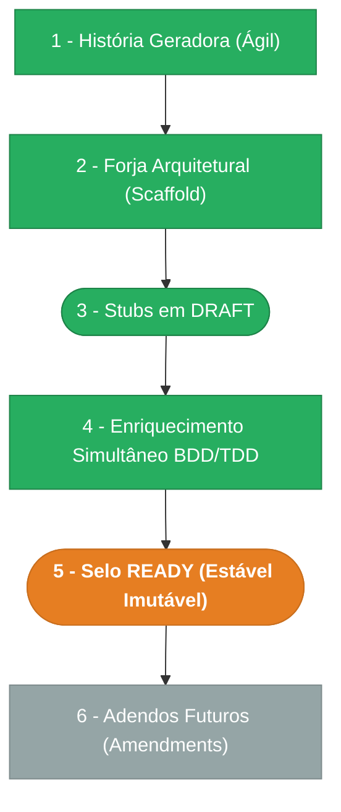

> ⚠️ **ARQUIVO GERIDO POR AUTOMAÇÃO.**
> - **Status DRAFT:** Enriqueça o conteúdo deste arquivo diretamente.
> - **Status READY:** NÃO EDITE DIRETAMENTE. Use a skill `create-amendment`.

# CHANGELOG - MOD-005

## Ciclo de Estabilidade do Módulo

> 🟢 Verde = Concluído | 🟠 Laranja = Em Andamento | 🔵 Azul = Estável Ancestral | ⬜ Cinza = Previsto

*O módulo está na **Etapa 5** — enriquecimento completo (11 agentes), aguardando selo READY (promoção).*

---

## Histórico de Versões

| Versão | Data | Responsável | Descrição |
|--------|------|-------------|-----------|
| 0.12.0 | 2026-03-17 | Marcos Sulivan | ADR-001 aceita (Opção B: cycle_id denormalizado), DATA-005 §2.3 atualizado com novo campo + partial unique index + trigger, Q4 e Q5 resolvidas em PENDENTE-005, DOC-FND-000 v1.1.0 com 4 scopes process:cycle:* |
| 0.11.0 | 2026-03-17 | AGN-DEV-10 | Enriquecimento PENDENTE (enrich-agent) — 3 questões resolvidas (Q1-Q3), 3 questões residuais abertas (Q4: amendment scopes, Q5: ADR-001 decisão, Q6: contagem endpoints). Corrige mod.md version drift (0.2.0→0.11.0) |
| 0.10.0 | 2026-03-17 | AGN-DEV-08 | Enriquecimento NFR (enrich-agent) — 7 seções: SLOs (/flow <200ms, fork <2s), topologia sync, 2 healthchecks, DR (RPO=0, RTO<30min), 9 limites de capacidade, 5 pilares de observabilidade, 6 métricas de performance frontend |
| 0.9.0 | 2026-03-17 | AGN-DEV-03 | Enriquecimento FR (enrich-agent) — 13 requisitos funcionais formalizados (FR-001 a FR-013) com done funcional, dependências, idempotency e timeline. Cobre: CRUD ciclos, publicação, fork, depreciação, macroetapas, estágios, gates, papéis, stage-role links, transições, /flow, editor visual, configurador |
| 0.8.0 | 2026-03-17 | AGN-DEV-09 | Enriquecimento ADR (enrich-agent) — ADR-001: is_initial unique (trigger vs denormalização), ADR-002: fail-safe integração MOD-006 (503 quando indisponível) |
| 0.7.0 | 2026-03-17 | AGN-DEV-07 | Enriquecimento UX (enrich-agent) — UX-PROC-001: jornada editor visual, 8 ações mapeadas UX-010, 5 estados, 7 componentes, 5 cenários de erro, copy. UX-PROC-002: jornada painel lateral, 4 abas (Info/Gates/Papéis/Transições), 10 ações mapeadas UX-010, sincronização bidirecional canvas↔painel |
| 0.6.0 | 2026-03-17 | AGN-DEV-06 | Enriquecimento SEC (enrich-agent) — SEC-005: 11 seções (authn, authz, classificação, retenção, mascaramento, soft delete, imutabilidade, tenant isolation, auditoria, proteção deleção, LGPD). SEC-EventMatrix: +colunas maskable_fields/retenção, regras de notificação para publish/deprecated |
| 0.5.0 | 2026-03-17 | AGN-DEV-05 | Enriquecimento INT (enrich-agent) — 25 endpoints documentados com contratos, RFC 9457 extensions por BR, contrato /flow response, integração MOD-006 (instâncias ativas), 4 escopos RBAC, padrões DOC-ARC-001 |
| 0.4.0 | 2026-03-17 | AGN-DEV-04 | Enriquecimento DATA (enrich-agent) — DATA-005: 7 tabelas completas com campos, constraints, indexes, seed data, migração e queries críticas (/flow SLA <200ms). DATA-003: catálogo expandido com entity_type, payload_policy, outbox config, causation_id para fork |
| 0.3.0 | 2026-03-17 | AGN-DEV-02 | Enriquecimento BR (enrich-agent) — 10 regras de negócio formalizadas (BR-001 a BR-010) com Gherkin, exemplos e exceções. Cobre: imutabilidade PUBLISHED, estágio inicial único, gate publicação, fork atômico, deleção protegida, codigo imutável, gate INFORMATIVE, transição intra-ciclo, Papel≠Role, máquina de estados |
| 0.2.0 | 2026-03-17 | AGN-DEV-01 | Enriquecimento MOD (enrich-agent) — Nível 2 (DDD-lite + Full Clean) confirmado com score 5/6 (DOC-ESC-001 §4.2), estrutura de diretórios API (aggregates, use-cases, ports) e Web (canvas, state-machine) detalhada, justificativa por gatilhos documentada |
| 0.1.0 | 2026-03-16 | arquitetura | Baseline Inicial — scaffold gerado via `forge-module` a partir de US-MOD-005 (READY). 7 tabelas, 25 endpoints, 4 features (F01–F04). Stubs obrigatórios criados: DATA-003, SEC-EventMatrix. Todos os itens nascem em `estado_item: DRAFT`. |
