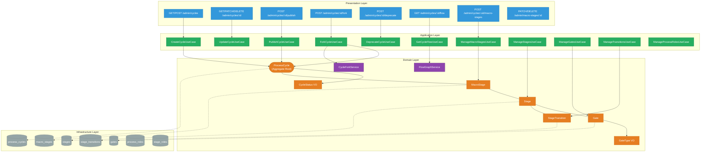

# MOD-005 — Arquitetura de Camadas (DDD-lite, Nível 2)

```mermaid
graph TD
    subgraph PRESENTATION ["Presentation Layer"]
        R1["GET/POST /admin/cycles"]
        R2["GET/PATCH/DELETE /admin/cycles/:id"]
        R3["POST /admin/cycles/:id/publish"]
        R4["POST /admin/cycles/:id/fork"]
        R5["POST /admin/cycles/:id/deprecate"]
        R6["GET /admin/cycles/:id/flow"]
        R7["POST /admin/cycles/:cid/macro-stages"]
        R8["PATCH/DELETE /admin/macro-stages/:id"]
    end

    subgraph APPLICATION ["Application Layer"]
        UC1["CreateCycleUseCase"]
        UC2["UpdateCycleUseCase"]
        UC3["PublishCycleUseCase"]
        UC4["ForkCycleUseCase"]
        UC5["DeprecateCycleUseCase"]
        UC6["GetCycleFlowUseCase"]
        UC7["ManageMacroStagesUseCase"]
        UC8["ManageStagesUseCase"]
        UC9["ManageGatesUseCase"]
        UC10["ManageTransitionsUseCase"]
        UC11["ManageProcessRolesUseCase"]
    end

    subgraph DOMAIN ["Domain Layer"]
        AG(["ProcessCycle<br/>(Aggregate Root)"])
        E1["MacroStage"]
        E2["Stage"]
        E3["Gate"]
        E4["StageTransition"]
        VO1["CycleStatus VO"]
        VO2["GateType VO"]
        DS1["FlowGraphService"]
        DS2["CycleForkService"]
    end

    subgraph INFRA ["Infrastructure Layer"]
        DB1[("process_cycles")]
        DB2[("macro_stages")]
        DB3[("stages")]
        DB4[("gates")]
        DB5[("stage_transitions")]
        DB6[("process_roles")]
        DB7[("stage_roles")]
    end

    R1 --> UC1
    R2 --> UC2
    R3 --> UC3
    R4 --> UC4
    R5 --> UC5
    R6 --> UC6
    R7 --> UC7

    UC1 --> AG
    UC3 --> AG
    UC4 --> AG
    UC4 --> DS2
    UC6 --> DS1
    UC7 --> E1
    UC8 --> E2
    UC9 --> E3
    UC10 --> E4

    AG --> VO1
    E3 --> VO2
    AG --- E1
    E1 --- E2
    E2 --- E3
    E2 --- E4

    AG -.-> DB1
    E1 -.-> DB2
    E2 -.-> DB3
    E3 -.-> DB4
    E4 -.-> DB5

    classDef presentation fill:#3498DB,stroke:#2980B9,color:#fff
    classDef application fill:#27AE60,stroke:#1E8449,color:#fff
    classDef domain fill:#E67E22,stroke:#CA6F1E,color:#fff
    classDef infra fill:#95A5A6,stroke:#7F8C8D,color:#fff
    classDef service fill:#8E44AD,stroke:#6C3483,color:#fff

    class R1,R2,R3,R4,R5,R6,R7,R8 presentation
    class UC1,UC2,UC3,UC4,UC5,UC6,UC7,UC8,UC9,UC10,UC11 application
    class AG,E1,E2,E3,E4,VO1,VO2 domain
    class DS1,DS2 service
    class DB1,DB2,DB3,DB4,DB5,DB6,DB7 infra
```
