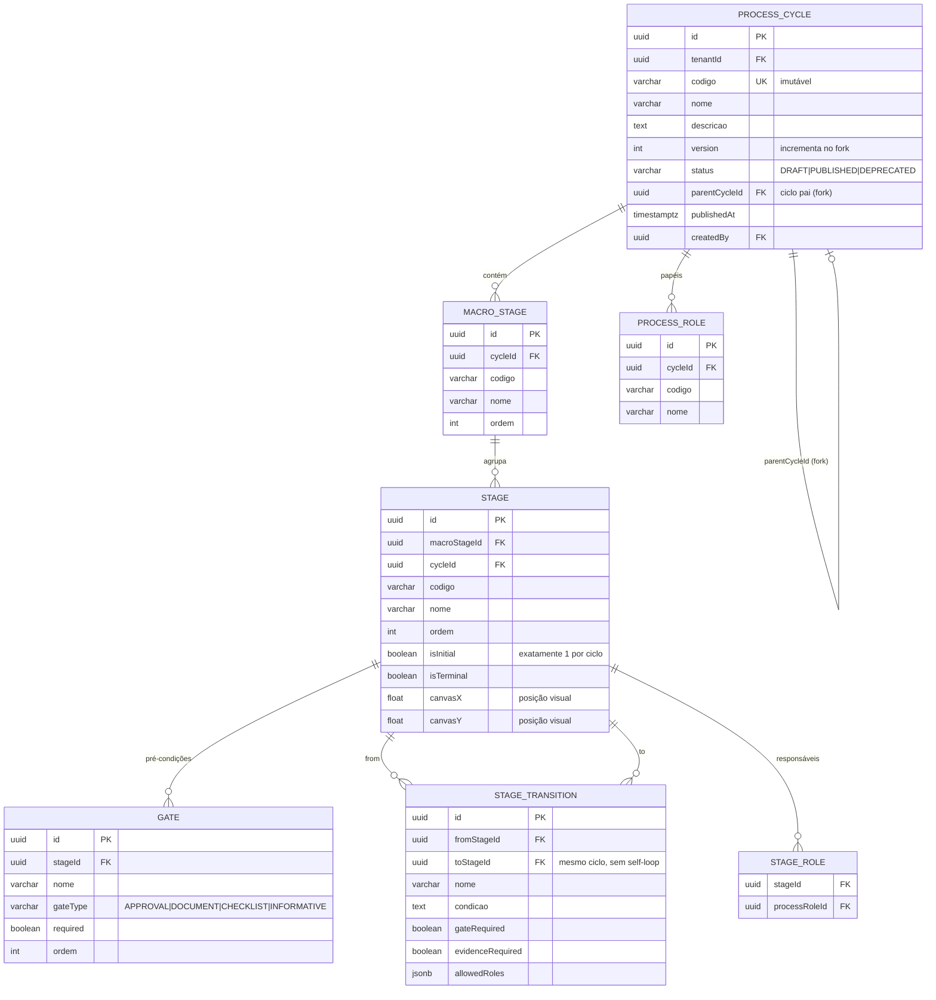

# MOD-005 — Modelo de Domínio

```mermaid
erDiagram
    PROCESS_CYCLE ||--o{ MACRO_STAGE : "contém"
    MACRO_STAGE ||--o{ STAGE : "agrupa"
    STAGE ||--o{ GATE : "pré-condições"
    STAGE ||--o{ STAGE_TRANSITION : "from"
    STAGE ||--o{ STAGE_TRANSITION : "to"
    STAGE ||--o{ STAGE_ROLE : "responsáveis"
    PROCESS_CYCLE ||--o{ PROCESS_ROLE : "papéis"
    PROCESS_CYCLE ||--o| PROCESS_CYCLE : "parentCycleId (fork)"

    PROCESS_CYCLE {
        uuid id PK
        uuid tenantId FK
        varchar codigo UK "imutável"
        varchar nome
        text descricao
        int version "incrementa no fork"
        varchar status "DRAFT|PUBLISHED|DEPRECATED"
        uuid parentCycleId FK "ciclo pai (fork)"
        timestamptz publishedAt
        uuid createdBy FK
    }

    MACRO_STAGE {
        uuid id PK
        uuid cycleId FK
        varchar codigo
        varchar nome
        int ordem
    }

    STAGE {
        uuid id PK
        uuid macroStageId FK
        uuid cycleId FK
        varchar codigo
        varchar nome
        int ordem
        boolean isInitial "exatamente 1 por ciclo"
        boolean isTerminal
        float canvasX "posição visual"
        float canvasY "posição visual"
    }

    GATE {
        uuid id PK
        uuid stageId FK
        varchar nome
        varchar gateType "APPROVAL|DOCUMENT|CHECKLIST|INFORMATIVE"
        boolean required
        int ordem
    }

    STAGE_TRANSITION {
        uuid id PK
        uuid fromStageId FK
        uuid toStageId FK "mesmo ciclo, sem self-loop"
        varchar nome
        text condicao
        boolean gateRequired
        boolean evidenceRequired
        jsonb allowedRoles
    }

    PROCESS_ROLE {
        uuid id PK
        uuid cycleId FK
        varchar codigo
        varchar nome
    }

    STAGE_ROLE {
        uuid stageId FK
        uuid processRoleId FK
    }
```
